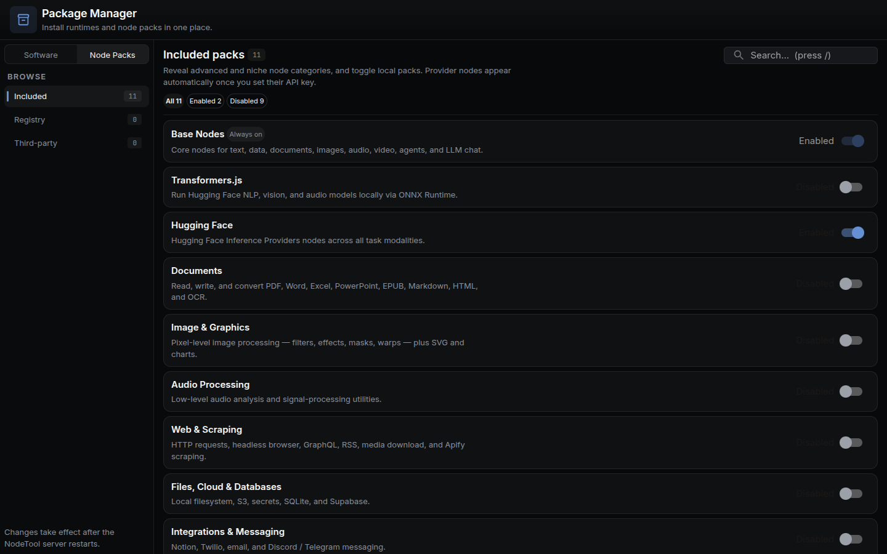

NodeTool packages bundle reusable nodes, assets, and example workflows. The package registry discovers and registers node classes so workflows can reference them at runtime.

## Manage packs in the app

The **Package Manager** (**Tools > Package Manager** in the desktop app, or `/packages` in the web UI) has four lists:

- **Included** shows the packs that ship with NodeTool. Each has an Enabled/Disabled switch, except the core pack, which is always on. Provider packs that need an API key are not listed here. Their nodes appear once you set the matching key.
- **Python packs** lists the Python node packs that NodeTool offers, with Install, Update, and Uninstall buttons. They install from PyPI.
- **Third-party** installs an npm package by name and lists the packs the app has installed. See [Node Packs](node-packs.md).
- **Software** manages runtimes such as Python and FFmpeg.

Installing and removing run only in the desktop app. The web UI shows status.



Toggling a pack takes effect after the NodeTool server restarts. The choices are saved in `~/.config/nodetool/packs.json` (`enabledBuiltins` and `disabledBuiltins`).

## Package Anatomy

A first-party package is an npm workspace package under `packages/` that exports node classes and a registration function:

- `package.json` -- declares the package name, dependencies, and build scripts.
- `src/nodes/` -- node implementations, one file per domain (e.g. `list.ts`, `audio.ts`).
- `src/index.ts` -- exports all node classes and a `register*Nodes()` function.
- `tsconfig.json` -- extends the workspace base config.
- `examples/` -- optional workflow examples.
- `assets/` -- optional static assets used by nodes.

A third-party pack has the same layout plus a `nodetool` field in `package.json`. See the [Custom Nodes Guide](developer/custom-nodes-guide.md).

### Example `package.json`

This is the shape of `packages/text-nodes/package.json`, trimmed:

```json
{
  "name": "@nodetool-ai/text-nodes",
  "type": "module",
  "version": "0.8.1",
  "main": "dist/index.js",
  "types": "dist/index.d.ts",
  "scripts": {
    "build": "node ../../scripts/build-typescript-workspace.mjs",
    "test": "node ../../scripts/run-vitest.mjs run",
    "lint": "node ../../scripts/run-tsc.mjs --noEmit"
  },
  "dependencies": {
    "@nodetool-ai/node-sdk": "*",
    "@nodetool-ai/protocol": "*",
    "@nodetool-ai/runtime": "*"
  }
}
```

Every node package depends on **`@nodetool-ai/node-sdk`**, which provides `BaseNode`, the `@prop` decorator, and the `NodeRegistry` type. The `lint` script is a type check, not ESLint.

### Example `tsconfig.json`

```json
{
  "extends": "../../tsconfig.base.json",
  "compilerOptions": {
    "outDir": "dist",
    "rootDir": "src"
  },
  "include": ["src"],
  "references": [{ "path": "../node-sdk" }]
}
```

## Node Registration

The packages the runtime registers directly export a constant array of node classes and a registration function. `@nodetool-ai/base-nodes` is one of them; it aggregates node groups from sibling packages:

```ts
import type { NodeClass, NodeRegistry } from "@nodetool-ai/node-sdk";
import { CONTROL_NODES } from "@nodetool-ai/core-nodes/nodes/control";
import { TEXT_EXTRA_NODES } from "@nodetool-ai/text-nodes/nodes/text-extra";

export const ALL_BASE_NODES: readonly NodeClass[] = [
  ...CONTROL_NODES,
  ...TEXT_EXTRA_NODES,
  // ... additional node groups
];

export function registerBaseNodes(registry: NodeRegistry): void {
  for (const nodeClass of ALL_BASE_NODES) {
    registry.register(nodeClass);
  }
}
```

At startup the server (`packages/websocket/src/node-registry-setup.ts`) creates one `NodeRegistry` and fills it in three steps:

1. `registerBuiltinPacks` calls the registration function of each first-party pack that is enabled. The catalog is `BUILTIN_NODE_PACKS` in `packages/protocol/src/builtin-packs.ts`: `base` (always on), `elevenlabs`, `minimax`, `transformers-js`, `fal`, `kie`, `topaz`, `reve`, `atlascloud`, `higgsfield`, `together`, `replicate`, and `huggingface`. Only packs marked `defaultEnabled` load on a fresh install.
2. `loadInstalledPacks` scans `node_modules` directories for packages with a `nodetool` field and calls the export it names (`register` by default). Trust rules apply. See [Custom Nodes Guide](developer/custom-nodes-guide.md#4-trust-model-and-governance).
3. Metadata from a running Python worker fills any node type the registry does not know yet.

Workflows referencing `nodetool.text.Concat` or `mypack.math.AddOffset` resolve through the registry without manual imports.

## Managing Packages via CLI

### List Packages

```bash
nodetool package list
nodetool package list --available    # Python packs the app offers
```

Without `--available`, it lists packages whose metadata it finds under a `nodetool/package_metadata/` directory in the current workspace. With `--available`, it prints the name, `repo_id`, and description of each Python pack in `PYTHON_NODE_PACKS` (`packages/protocol/src/python-packs.ts`). Add `--json` for machine-readable output.

### Initialize a Package

```bash
nodetool package init
```

Prompts for a name, description, and author, then writes `package.json`, `tsconfig.json`, `src/index.ts`, and empty `nodetool/package_metadata/`, `examples/`, and `assets/` directories. It asks before overwriting an existing `package.json`.

The scaffold's `package.json` carries the `nodetool` field (`"apiVersion": 1, "register": "register"`) and `src/index.ts` exports an empty `register` function for you to fill in.

### Generate Documentation

```bash
nodetool package docs                     # single index.md in ./docs
nodetool package docs --output-dir docs   # custom directory (default: docs)
nodetool package docs --compact           # shorter summaries for LLM prompts
```

`package docs` reads `nodetool/package_metadata/` in the current directory and writes a single `index.md` overview. It fails when that directory is missing. For per-node Markdown pages, use `node-docs`:

```bash
nodetool package node-docs                          # one page per node (default: docs/nodes)
nodetool package node-docs --package-name mypack    # only nodes whose namespace starts with mypack
nodetool package workflow-docs --examples-dir examples   # docs for workflow JSON files (default output: docs/workflows)
```

`workflow-docs` requires `--examples-dir` and accepts `--package-name` to filter on the `package_name` field of each workflow.

The full set of `package` subcommands is: `list`, `init`, `docs`, `node-docs`, and `workflow-docs`. (Note: `nodetool mcp install` / `nodetool mcp uninstall` configure the MCP server, not node packages.)

## Building Packages

Run these from the repository root against one workspace, or from inside the package directory:

```bash
npm run build --workspace=packages/<name>   # compile
npm run lint --workspace=packages/<name>    # type check, no emit
npm run test --workspace=packages/<name>    # Vitest
```

`npm run build:packages` builds every backend package in dependency order.

## Publishing Packages

1. Implement nodes under `src/nodes/` extending `BaseNode` with `@prop` decorators.
2. Export all node classes and a registration function from `src/index.ts`.
3. Run `npm run build` to compile.
4. Add example workflows in `examples/` and assets in `assets/` if relevant.
5. Publish to npm or provide a Git URL.

To offer a Python pack in the Package Manager, publish it to PyPI and add it to `PYTHON_NODE_PACKS` in `packages/protocol/src/python-packs.ts`.

## Workflow Integration

Enabled and trusted packs register nodes with the runtime at startup:

- Node metadata is merged during startup so workflows referencing `package.namespace.Node` resolve without manual imports.
- Run `npm run codegen --workspace=packages/dsl` to regenerate typed factory functions from node metadata.

## Related Documentation

- [CLI Reference](cli.md) -- package subcommands.
- [Configuration Guide](configuration.md) -- where package metadata is cached.
- [Custom Nodes Guide](developer/custom-nodes-guide.md) -- step-by-step node implementation.
- [TypeScript DSL Guide](developer/ts-dsl-guide.md) -- type-safe workflow definitions with `@nodetool-ai/dsl`.
