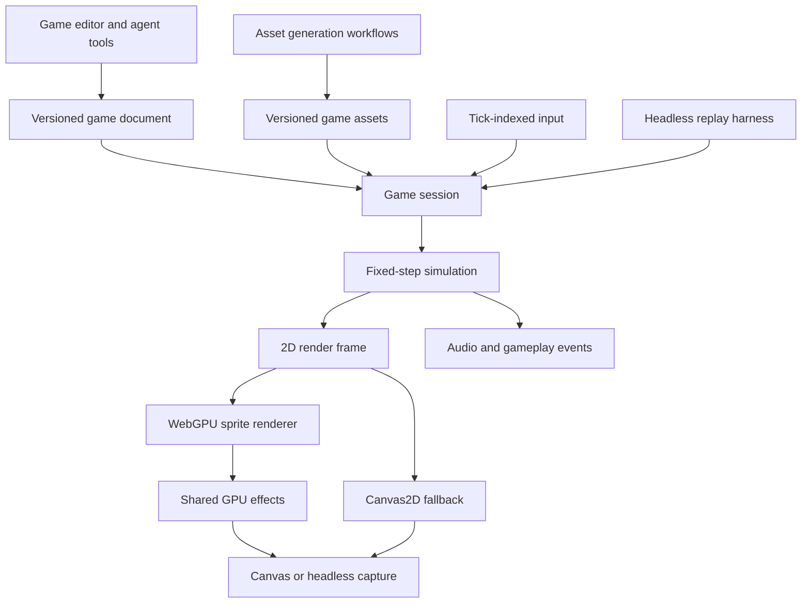

# Built-in game engine: GPU assessment and extensible 2D design

## Recommendation

Build a small TypeScript game runtime with a native 2D renderer on NodeTool's
existing WebGPU infrastructure. Start with sprites, tilemaps, input, collision,
animation, audio, and a reproducible playtest loop. Keep the simulation independent
of rendering and of workflow execution. Add 3D through explicit 3D scene and
physics types later.

The built-in engine replaces Godot entirely. The target product has one game
runtime, native game templates, and its own player/export path. Godot execution,
project generation, packages, bundled templates, and agent tools are removed.
Preserve useful generated media and asset-validation logic when replacing them.

The initial native 2D vertical slice, in-app player, and standalone web export
are implemented. Hardware profiling, atlas packing, tile chunking, an isolated
script/render worker, native mobile packaging, multiplayer, and 3D remain later
work in this design.

The recommendation favors shared NodeTool effects and headless rendering. If the
priority becomes the shortest path to a broadly compatible browser game editor,
choose PixiJS for rendering instead. The project model and simulation design below
can remain the same.

## Existing capabilities

| Finding | Evidence | Design implication |
|---|---|---|
| F1. NodeTool has a portable GPU foundation. | [GPU context](https://github.com/nodetool-ai/nodetool/blob/main/packages/gpu/src/context.ts), [browser entry](https://github.com/nodetool-ai/nodetool/blob/main/packages/gpu/src/webgpu/index.ts), and [Node/Dawn adapter](https://github.com/nodetool-ai/nodetool/blob/main/packages/gpu/src/node.ts). | Reuse device integration, shader definitions, texture metadata, scratch textures, pipeline caching, and uniform buffers. |
| F2. It supports fragment effects and compute. | [Executor](https://github.com/nodetool-ai/nodetool/blob/main/packages/gpu/src/executor.ts) encodes full-screen fragment passes or compute dispatches. [Shader pool](https://github.com/nodetool-ai/nodetool/blob/main/packages/gpu/src/pool.ts) exposes filters, transforms, masks, color operations, sources, and multipass recipes. | Game post-processing can use this catalog on the same device. The executor is image-oriented, so sprite geometry needs a separate rendering path. |
| F3. The layer compositor is not a sprite batcher. | [renderBlendPass](https://github.com/nodetool-ai/nodetool/blob/main/packages/gpu/src/compositor/compositor.ts) samples a layer and an accumulation texture, then draws a full-screen quad into another texture. | Using one such pass per sprite scales with layer count and screen area. Build instanced quad batches and reserve compositing passes for effects and groups. This is a structural inference, not a measured game benchmark. |
| F4. Browser fallback and device-loss handling exist in individual surfaces. | [Sketch initialization](https://github.com/nodetool-ai/nodetool/blob/main/web/src/components/sketch/rendering/initWebGPU.ts), [sketch runtime](https://github.com/nodetool-ai/nodetool/blob/main/web/src/components/sketch/rendering/WebGPURuntime.ts), [timeline initialization](https://github.com/nodetool-ai/nodetool/blob/main/web/src/components/timeline/preview/gpu/createCompositor.ts), and [timeline compositor](https://github.com/nodetool-ai/nodetool/blob/main/web/src/components/timeline/preview/gpu/compositor.ts). | Follow their lifecycle patterns. A game still needs its own capability report and recovery behavior. These surfaces do not establish one application-wide device owner. |
| F5. The former games were Godot asset-production projects. | [Game nodes](https://github.com/nodetool-ai/nodetool/blob/main/packages/game-nodes/src/nodes/game.ts) and [games router](https://github.com/nodetool-ai/nodetool/blob/main/packages/websocket/src/trpc/routers/games.ts). | Reuse asset generation and validation in the native game model. |
| F6. NodeTool already edits and renders 3D assets. | [glTF scene operations](https://github.com/nodetool-ai/nodetool/blob/main/packages/model3d/src/scene.ts) and [Three.js rendering](https://github.com/nodetool-ai/nodetool/blob/main/packages/video-nodes/src/nodes/model3d/render3d-core.ts). | Reuse glTF assets and import/edit operations later. The inspected render session creates a WebGLRenderer, so it is not already a shared WebGPU game renderer. |

### Local GPU evidence

The read-only device probe found an NVIDIA GeForce RTX 3060 through `lspci`.
`nvidia-smi` could not communicate with its driver. A direct Dawn adapter request
succeeded using Mesa llvmpipe, reporting `architecture: software` and
`isFallbackAdapter: true`. This establishes the adapter available to this process,
not the adapter used by the user's browser or Electron renderer.

The default requested device exposed an 8192-pixel maximum 2D texture dimension,
a 256 MiB maximum buffer, a 128 MiB maximum storage-buffer binding, and 256 maximum
compute invocations per workgroup. These are exposed device limits, not VRAM
capacity or recommended allocation sizes. The adapter advertised optional
features including timestamp queries and shader f16, but the default device did
not enable those optional features.

The existing checks below passed, with nine tests executed and none skipped:

```bash
npm run test --workspace=packages/gpu -- \
  tests/computeSmoke.test.ts \
  tests/headlessComposite.test.ts \
  tests/uniformRing.test.ts
```

They verify compute output, compositing, and uniform-buffer behavior on the
available software adapter. They do not measure hardware FPS. The shell used
Node 22.23.2, while [.nvmrc](https://github.com/nodetool-ai/nodetool/blob/main/.nvmrc) specifies the repository runtime.
No browser capability probe or device-driver change was performed.

### GPU work required before an engine ships

The current [GPUCapabilities](https://github.com/nodetool-ai/nodetool/blob/main/packages/gpu/src/context.ts) is too narrow for
game admission. It hardcodes external-texture support and derives `f16Storage`
from `shader-f16`. The latter feature enables the WGSL `f16` type, so it must not
stand in for a format-and-usage capability table. This is a design concern to
reproduce in focused tests before changing existing behavior.
[WGSL extension definition](https://gpuweb.github.io/gpuweb/wgsl/#enable-extension).

Use a game capability report that records the selected backend, hardware versus
software versus unknown adapter status, requested and enabled features, relevant
limits, and a successful minimal render. Request optional features only when
supported and used. A GPU visible to CUDA or a cloud generation provider says
nothing about the browser's available graphics device. Probe each execution host.

Track device loss, release resources on scene replacement, and rebuild textures
and pipelines from retained asset data after recovery. The Node adapter caches a
device acquisition promise but does not invalidate it on later device loss. Its
Dawn instance retention also keeps one-shot processes alive, as documented in
the implementation. Headless game commands should run in a managed subprocess
with an explicit completion and teardown policy.

The [texture pool](https://github.com/nodetool-ai/nodetool/blob/main/packages/gpu/src/context.ts) retains released allocations
until disposal. Add game-session accounting and bounded eviction before loading
many scenes. Use exact-size screen targets: its existing bucket policy would
round a 1920×1080 request to 2048×2048 unless `exact` is set. One exact RGBA8 target
is about 7.91 MiB, while that bucket is 16 MiB. Two RGBA16F targets at exact
1080p require about 31.64 MiB, before textures and other allocations.

The [executor](https://github.com/nodetool-ai/nodetool/blob/main/packages/gpu/src/executor.ts) currently defers strict
color-space checking. Reuse of its labels does not establish color correctness.
Define sprite import, working-space, effect, and presentation conversions and
test them against reference images before enabling shared effects in games.

## Technology choices

| Option | Benefit | Cost or constraint | Recommendation |
|---|---|---|---|
| O1. Native WebGPU/TypeGPU renderer | Direct reuse of NodeTool's GPU effects, same-device textures, and Dawn rendering. | NodeTool owns sprite batching, atlases, clipping, text, resource lifetime, and fallback behavior. | Use for the proposed bounded engine, subject to the first rendering milestone. |
| O2. PixiJS renderer with NodeTool simulation | Existing sprite renderer and WebGL compatibility reduce renderer work. | Shared NodeTool WGSL effects need separate integration. Its current guide recommends WebGL for production and labels WebGPU experimental. | Preferred alternative if compatibility or delivery time dominates. |
| O3. Phaser framework | Supplies more game behavior and an established 2D programming model. | Adopting its scene/runtime model makes a NodeTool-owned simulation and later 3D a larger integration task. | Choose if shipping conventional 2D games becomes the entire scope. |
| O4. Embed Godot web builds | Reuses a complete engine and existing NodeTool Godot assets. | Retains the external engine and its build/export pipeline. | Rejected by the product direction to remove Godot entirely. |

These tradeoffs are architectural judgments. Primary platform references are
[PixiJS renderers](https://pixijs.com/8.x/guides/components/renderers),
[Phaser's renderer selection](https://phaser.io/tutorials/making-your-first-phaser-3-game/part1),
and [Godot web export](https://docs.godotengine.org/en/stable/tutorials/export/exporting_for_web.html).
Godot's current stable documentation specifies WebGL 2 Compatibility rendering
for web export. Single-threaded export avoids the cross-origin isolation required
by its threaded export.

Do not assume TypeGPU automatically provides a WebGL fallback for the existing
shader pool. The current [experimental WebGL module](https://docs.swmansion.com/TypeGPU/ecosystem/typegpu-gl/)
supports a subset of rendering operations and excludes compute, storage buffers,
and bind groups. Compatibility with the repository's installed TypeGPU version
would need separate validation.

## Proposed architecture



### D1. Give games their own persistent identity

Add `game` to the project document model. The current
[document union](https://github.com/nodetool-ai/nodetool/blob/main/packages/protocol/src/api-schemas/projects.ts) has no game
entry. A proposed game record holds `id`, `project_id`, `workspace_id`,
`source_root`, and the current immutable revision reference. There is no engine
selector. The engine version identifies a version of the built-in runtime.

Store authoritative source under `games/<full-game-id>/` in the project workspace:
`game.json`, `scenes/`, `prefabs/`, `behaviors/`, and an asset manifest. Store builds
under a separate `game-builds/<full-game-id>/<revision>/` path. All reads and writes
use the existing workspace interface, including virtual workspaces.

The manifest declares schema version, engine version, entry scene, input actions,
simulation frequency, scene references, and asset dependencies. Asset bindings
include source asset ID, immutable content digest, sprite frame metadata, pivot,
sampling mode, and generation provenance. Store full resource IDs internally.

Use one immutable source revision plus compare-and-swap of the current revision
reference to publish an edit atomically. Validate references before publication.
This avoids relying on filesystem rename semantics in object storage. Reject stale
edits with a conflict result. Undo and restore select a prior revision.

Templates seed source once. Attached workflows produce candidate assets, then an
explicit installation operation updates selected bindings. Re-running generation
must preserve scenes and behavior edits. A play session pins a revision and
applies accepted updates only at a tick boundary. Art can update live when its
layout is compatible, while behavior or schema changes restart the session first.

This retains the project-ownership requirements from the earlier
[Godot project design question](../godot-agent-owned-project-design-question.md)
and supersedes its choice of runtime. Existing Godot source can remain as ordinary
workspace files or a downloadable archive, without NodeTool execution or export
support. Generated images and audio can be installed into new native games.
GDScript and scene behavior require explicit reconstruction. Do not present an
asset import as a converted, playable game.

### D2. Keep the simulation independent of the GPU and workflow scheduler

Use a scene graph for hierarchy and entity IDs with typed component data for
behavior. A compact entity store is sufficient initially. Add dense arrays for
hot transforms only when measurement justifies them.

The initial component vocabulary is `Transform2D`, `Sprite`, `Tilemap`,
`Camera2D`, `Body2D`, `Collider2D`, `Animator`, `AudioSource`, and `Behavior`.
These are game data components, not React components or workflow nodes.

Use world units with +X right, +Y up, radians, and an explicit pixels-per-unit
setting. Convert to downward canvas coordinates only in rendering and picking.
Convert authored pixel hitboxes once during import. Validate parent graphs for
cycles. Physics bodies own world transforms, so initially prohibit scaled or
rotating physics parents instead of silently producing incorrect collisions.

The simulation advances at a fixed 60 Hz using tick-indexed input and seeded
randomness. Each tick consumes input and prior events, updates behavior, advances
physics, produces contacts, and commits spawn/despawn commands. Collision handlers
enqueue changes instead of mutating collections during iteration. Rendering
interpolates between completed ticks using requestAnimationFrame.

Clamp interactive catch-up after a stall and report dropped wall time. Pause on
document invisibility and reset the accumulator on resume. A replay executes
every requested tick without consulting wall time. Keep simulation state out of
React and Zustand's frame-by-frame update path. Inspector snapshots can update
at a lower rate.

Use CPU/WASM physics initially. Prototype Rapier 2D for bodies, sensors, collision
queries, and a kinematic character controller. Keep its handles private to the
simulation module. Pin the version and creation order for replay. Rapier documents
determinism for its JS/WASM version under matching initial conditions and version,
but application math can still invalidate that guarantee.
[Rapier determinism](https://rapier.rs/docs/user_guides/javascript/determinism/).

GPU compute is suitable later for cosmetic particles or lighting. Authoritative
gameplay remains on the CPU so readback and GPU scheduling do not enter the tick
loop. Workflow generation jobs also stay asynchronous and outside that loop.

### D3. Build a batched 2D renderer and reuse effects selectively

Upload sprite assets once, pack texture atlases, and render a unit quad with
per-instance transform, UV rectangle, tint, and opacity. Cull against the camera.
Preserve painter order and batch consecutive compatible instances. Do not sort
transparent sprites globally by texture merely to reduce draw calls.

Render visible tilemap chunks through the same quad path. Keep animation as UV
frame selection. Use nearest sampling and integer scaling for pixel art, with
atlas padding to prevent adjacent frames bleeding under filtering. Start HUD text
with a baked glyph atlas, leaving general vector text and text shaping outside the
first rendering milestone.

Use premultiplied alpha consistently. Start with normal alpha blending through
fixed-function GPU blending. Effects that require reading the destination render
an isolated group through a compositing pass. Apply shared blur, color grading,
outline, or glow to selected groups or the final frame, not a full-screen pass
for every sprite. Introduce a game-approved effect subset after color validation.

The renderer owns its game-session device and resources. Its sprite pass and
shared effect executor receive the same device. Do not depend on sharing textures
with a separate sketch device, the server's Dawn device, or a WebGL context.
Prepare pipelines before play and retain CPU asset bytes for re-upload. Avoid
per-frame decoding, pipeline compilation, GPU readback, and synchronization waits.

Offer two explicit capability levels:

| Level | Supported behavior |
|---|---|
| Core 2D | Sprites, tilemaps, cameras, basic HUD, normal alpha blending, and identical simulation. Implement with WebGPU and Canvas2D. |
| GPU effects | Approved shared effects and later visual compute. Requires successful WebGPU initialization and the relevant capabilities. |

Each game declares required and optional capabilities. Omit optional effects with
a visible notice. Reject play with an explanation if a required effect is missing.
Canvas2D is a functional compatibility path with a lower performance target, not
a promise of identical shading. Headless simulation needs no renderer at all.
Replace the canvas element when recovery switches its rendering-context type.

### D4. Use a small runtime interface across editor and tests

Proposed modules and entry points:

| Location | Responsibility |
|---|---|
| `packages/protocol` | Versioned game/scene schemas, commands, inputs, reports, resource references. |
| New `packages/game-runtime` | `validateGame`, `createGameSession`, fixed ticks, behavior, physics, snapshots, replay. No DOM, React, GPU, or workflow-runner dependency. |
| New `packages/game-renderer` | `createGameRenderer`, WebGPU drawing and effects, Canvas2D drawing, texture ownership. Browser and Node entries keep platform imports separate. |
| Existing models and websocket packages | Authorized persistence, revision publication, build jobs, asset installation. |
| Existing CLI and agents packages | Drive validation, simulation, screenshots, and exports through the shared modules. |
| Web game surface | Scene tree, viewport, inspector, asset palette, play/pause/step, errors, and measured performance. |

The session interface should expose `step(input)`, `inspect(query)`, `snapshot()`,
and `dispose()`. `step` advances exactly one tick and returns events plus a render
frame. `createGameSession` accepts a validated document, seed, and optional saved
snapshot. The render frame contains visible instances and camera data, with no
GPU objects. The renderer exposes `render(frame, interpolation)`, `resize`, and
`dispose`, and owns the previous frame needed for interpolation.

Use an event sink for audio and host integration. Browser playback consumes audio
events through Web Audio after a user gesture. Headless tests record those same
events without requiring an audio device. Save files include game revision,
simulation version, tick, RNG state, entity state, and physics snapshot.

Browser and headless rendering are real adapters. WebGPU and Canvas2D are another
real seam. Do not add a generic plug-in architecture or a universal physics
interface before a second implementation is needed.

### D5. Make game authoring and execution separately controlled

Start with declarative behavior built from reviewed modules: movement, patrol,
triggers, health, collectible, spawn, and scene transitions. An agent edits data
and tests before generating arbitrary runtime code.

For authored JavaScript, extend the existing QuickJS approach with a persistent
game behavior session and bounded tick calls. The current
[sandbox](https://github.com/nodetool-ai/nodetool/blob/main/packages/agents/src/js-sandbox.ts) is an action/run abstraction,
not an established low-latency game scripting interface. Measure its bridge cost
before selecting per-entity callbacks. Prefer one bulk tick call returning a
bounded command buffer. Extract only the shared low-level sandbox implementation
needed by games, without making game-runtime depend on the agents package.

Game scripts receive state, tick input, seeded random functions, and allowed game
commands. They receive no secrets, filesystem, network, toolbelt, DOM, or raw GPU
device. Enforce CPU and command-volume limits, validate returned commands, and use
a terminable worker for runaway behavior. A worker alone is not the security
mechanism. QuickJS isolation and the restricted host interface are both required.
The existing [sandbox limits](../javascript-sandbox.md#limits) also warn that
typed-array and string payloads need accounting beyond the guest heap limit.

Start with reviewed shaders. Arbitrary generated WGSL adds GPU resource and
execution risks that JavaScript instruction limits do not contain. Treat custom
shader admission as separate future work.

Agent tools should provide document operations and a bounded playtest request
that specifies revision, seed, tick count, input recording, assertions, and capture
ticks. Return failed assertions, entity state, script errors, and screenshot asset
IDs. The UI uses the same operations. Asset inspection uses the existing media
resolution path, while the game texture loader resolves authorized media bytes
before upload. No `asset://` identifier is passed directly to a DOM `src`.

### D6. Extend into 3D without changing game ownership or time

Keep scene identity, parent relationships, input actions, events, behaviors,
asset references, save/version rules, and fixed-step execution dimension-neutral.
Keep spatial types explicit: `Transform2D` and `Body2D` remain 2D. Introduce
`Transform3D`, `Camera3D`, `Mesh`, `Material`, `Light`, and `Body3D` when needed.
Reject invalid mixtures in a physics world. A 2D HUD can overlay a 3D viewport.

The first extension can be 2.5D: parallax layers, orthographic cameras, normal-map
lighting, and cosmetic particles. Full 3D then imports existing glTF/GLB assets
through the model3d module and adds a 3D renderer. Evaluate Three.js at that point
instead of implementing a PBR engine from scratch. Its WebGPURenderer supports a
WebGL2 fallback, but using it would still require explicit texture/device and
effect integration. [Three.js renderer documentation](https://threejs.org/docs/pages/WebGPURenderer.html).

Add Rapier 3D beside 2D when 3D physics is required. Reuse behavioral concepts such
as health and triggers while adapting movement and collision data explicitly.
A 2D project remains valid without acquiring depth, quaternion, or 3D material
fields. Extensibility preserves useful contracts, not automatic 2D-to-3D conversion.

### D7. Remove Godot throughout the product

Retain the game creation experience, but make it create a native game document
and attach asset-generation workflows. Templates become native scene, behavior,
input, and asset-manifest data. The first template is the top-down vertical slice.
Platformer and shooter templates follow when their native behaviors are verified.

The inspected removal and replacement surfaces are:

| Surface | Required change |
|---|---|
| Former `packages/godot` and `packages/godot-templates` packages | Remove both packages, their dependencies and TypeScript references, shipped Godot files, runner, and package-specific tests. |
| [Game nodes](https://github.com/nodetool-ai/nodetool/blob/main/packages/game-nodes/src/nodes/game.ts) and former `packages/game-nodes/src/project.ts` | Replace Godot export/project assembly with native game creation, asset installation, and build operations. Retain only nodes that have a defined native purpose. |
| [Asset contract](https://github.com/nodetool-ai/nodetool/blob/main/packages/protocol/src/game-assets.ts), [graph construction](https://github.com/nodetool-ai/nodetool/blob/main/packages/protocol/src/game-graph.ts), and [designer](https://github.com/nodetool-ai/nodetool/blob/main/packages/protocol/src/game-design.ts) | Replace Godot-version and script-hook assumptions with native template/schema versions and behavior configuration. Keep useful sprite, tile, image, and audio layout metadata. |
| [Image validators](https://github.com/nodetool-ai/nodetool/blob/main/packages/image-nodes/src/nodes/game.ts) and [audio validators](https://github.com/nodetool-ai/nodetool/blob/main/packages/audio-nodes/src/nodes/game.ts) | Preserve byte validation and generation outputs. Remove Godot-specific wording and dependencies in their contracts. |
| Former `packages/agents/src/capabilities/godot.ts` and `packages/system-skills/godot-game/SKILL.md` | Remove the Godot tools and skill. Register native game authoring, bounded playtesting, and build tools, and update product knowledge and skill discovery. |
| [Games router](https://github.com/nodetool-ai/nodetool/blob/main/packages/websocket/src/trpc/routers/games.ts) and former `web/src/components/setup/game/useGameSetupFlow.ts` | Serve native templates and open the native editor/player after creation. Replace instructions to download or open a Godot project. |
| [Packaged assets](https://github.com/nodetool-ai/nodetool/blob/main/packages/config/src/package-asset-registry.ts), [harness registry](https://github.com/nodetool-ai/nodetool/blob/main/packages/cli/src/harness/registry.ts), examples, and generated DSL bindings | Remove Godot packaging and checks, register native equivalents, rebuild examples, and regenerate bindings from the node registry. |

Search manifests, lockfiles, build configuration, documentation, prompts, fixtures,
and agent instructions again during implementation. This table identifies the
inspected integration points, not a claim that every reference has been enumerated.

Cut over after native creation, playtesting, and web export pass their acceptance
checks. Remove the old execution path in the same release that switches the
creation flow. Temporary development overlap does not become a supported
dual-engine product or a runtime fallback.

Preserve existing workspace files and source assets. Old workflows containing
removed nodes must fail validation with an explicit migration diagnostic. Never
silently map `ExportGodotProject` to a different operation. A one-time migration
can detach the old export stage and attach the surviving generation stages to a
new game, but it must report behaviors that still need rebuilding.

Removal is complete when a fresh installation can create, playtest, save, reopen,
and export the native sample with no Godot executable, package, bundled project,
registered tool, or template dependency. Audit the shipped artifact as well as
source imports. Historical documentation and preserved user files do not keep a
Godot runtime installed.

## Delivery sequence and acceptance

| Action | Deliverable | Evidence required before advancing |
|---|---|---|
| A1. Prove the renderer choice | Instanced sprites, one atlas, animated frames, tile chunks, and one shared effect on the same device. Compare a PixiJS scene using the same assets. | Measure submission cost, draw calls, upload bytes, frame times, and texture memory on hardware. Check alpha, UVs, ordering, and effect color. Reconsider O1 if maintaining it is disproportionate. |
| A2. Build a playable vertical slice | One small top-down room with movement, wall collisions, collectibles, a win state, camera, HUD, and sound. Use built-in behaviors. | Browser and headless replay reach the same asserted state. Core rendering works with WebGPU unavailable. Pause, single-step, reset, and save/load work. |
| A3. Persist and edit the game | Game document, revision operations, scene editor, asset installation, and agent playtest tools. | Reopen the game, regenerate only its player art, preserve scene changes, reject stale edits, and restore a previous revision. |
| A4. Add scripted behavior and web export | Persistent restricted QuickJS session and a version-pinned standalone player. | Infinite loops terminate, invalid commands fail, script budgets are measured, and an exported build runs from an HTTP server without NodeTool credentials or backend access. |
| A6. Cut over and remove Godot | Switch game creation to the native runtime and perform D7's removal and migration. This precedes A5 despite retaining the existing action codes. | A clean installation and packaged artifact complete the native game lifecycle without Godot. Legacy source assets survive and workflows with removed nodes report migration errors. |
| A5. Add complexity after profiling | Platformer controller, additional scenes, approved effects, then 2.5D or 3D. | Replay regressions, renderer capability checks, and measured performance remain within the selected target profile. |

The standalone export copies authorized assets into a content-addressed bundle,
rewrites asset bindings to relative URLs, and includes schemas, behavior runtime,
physics WASM, and a pinned player. It contains no project tokens, provider keys,
or expiring media URLs. Unknown component versions fail validation with a migration
message. Cloud build jobs stage through workspace materialization and absorb only
declared build outputs. GPU rendering runs on a worker that reports its own
capabilities, independently of the browser playing the game.

The `nodetool game validate|simulate|capture|build` CLI family and corresponding
agent tools provide headless access. The game surface is registered in the
[harness registry](https://github.com/nodetool-ai/nodetool/blob/main/packages/cli/src/harness/registry.ts) following
[Harness-First Engineering](../HARNESS_FIRST.md).

### Performance targets and verification limits

Begin with a 60 FPS target at 1280×720 on a named integrated-GPU reference machine.
Measure a normal scene with 1,000 visible sprites, then a 10,000-sprite stress
scene, with atlas count, transparency, and effects fixed. These are proposed test
loads, not supported-capacity claims. Reserve 16.67 ms per frame overall, including
simulation, command encoding, GPU work, and presentation. CPU submission timing
alone does not measure GPU completion.

Record p50/p95 frame times, simulation time, draw calls, upload bytes, texture
allocation estimates, and GPU time when timestamp queries are enabled. Run a
long-lived scene-switching test for retained resources. Test hidden tabs, focus
loss and stuck keys, resizing, device loss, missing assets, cancellation, and
software adapters. GPU-required tests must report unavailable separately rather
than silently passing by skipping.

Use exact assertions for simulation and bounded pixel tolerances for visual
regressions. Do not promise identical screenshots across GPUs. Add resource-ID
tests at tool, persistence, and media-resolution interfaces, including the exact
short IDs returned to agents. Once implementation changes code, run the
[mandatory repository checks](https://github.com/nodetool-ai/nodetool/blob/main/AGENTS.md#mandatory-post-change-verification).

## Remaining risks

| Risk | Consequence | Resolution |
|---|---|---|
| R1. No hardware performance measurement yet | Software-adapter correctness can conceal unacceptable frame times. | Run A1 on working integrated and discrete GPUs, and probe the actual browser/Electron device. |
| R2. Owning the renderer grows the scope | Text, clipping, batching, and recovery can consume more work than expected. | Keep the first feature set bounded and compare against O2 before building the editor. |
| R3. Persistent game scripting is unproven | QuickJS bridge work or payloads may exceed the tick budget. | Start with built-in behaviors, benchmark bulk calls, and enforce termination and output limits. |
| R4. GPU compatibility differs by host | Browser play, cloud capture, and Electron can select different devices and capabilities. | Pin required capabilities in the game, expose fallback decisions, and test each supported host. |
| R5. Removing Godot leaves legacy gameplay to rebuild | Existing GDScript and scenes cannot be made playable by importing their artwork. | Preserve source files and assets, report migration gaps, and remove runtime support without pretending conversion is automatic. |
