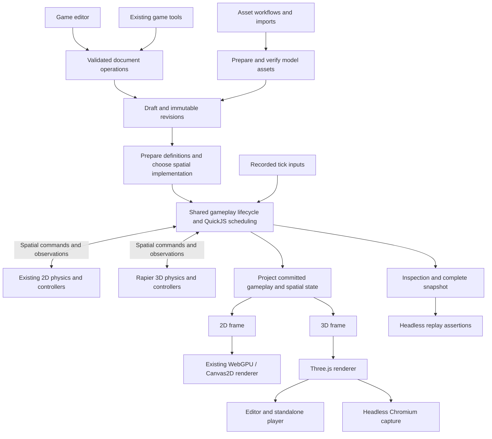

# Native game engine: 3D upgrade

This design defines the explicit schema version 3 native game implementation.
The [runtime contract](../../packages/game-runtime/README.md) and
[renderer contract](../../packages/game-renderer/README.md) describe its public
entry points and verification fixtures. Hardware performance targets below
remain unmeasured.

Extends the [built-in engine design](builtin-game-engine-design.md) and
[game editor design](native-game-editor.md).

## Recommendation and release scope

Add a 3D game mode to the existing native game product. Keep its document
identity, draft editing, immutable revisions, agent tools, and standalone export.
Use one gameplay lifecycle for both dimensions, with existing 2D collision code
and Rapier WASM as spatial implementations. Render 3D with Three.js. Extract
shared mechanics from the current runtime under compatibility tests, preserving
2D documents, script contracts, event ordering, and renderer behavior.

The first release targets a small third-person exploration game on desktop web
and Electron. A creator can block out a level, import or generate GLB assets,
configure a player and camera, add scripted interactions, playtest a completion
route, and export a self-contained web directory. A fixed-camera game uses the
same implementation. This is the assumed first use case, not a user requirement.

The acceptance game contains a capsule player, ramps and steps, a moving
platform, a pushable crate, a collectible, a trigger-operated door, a checkpoint,
and a win condition. Its character has idle/run/jump animation. It must work
with placeholder geometry before any generation runs. Checkpoint and respawn
logic lives in the template's explicit script state and teleport commands.
It does not require a new engine-wide checkpoint or damage system.

Defer terrain streaming, navmesh authoring, multiplayer, vehicles, ragdolls,
animation retargeting, root motion, runtime mesh editing, XR, and native mobile
packaging. Also defer general inventory/combat systems, nested prefab variants,
and new built-in damage/death mechanics. Mixed 2D/3D worlds are outside this
release. Screen-space HUD and billboards do not require a second physics world.

## Baseline source findings

| Finding | Evidence | Consequence |
| --- | --- | --- |
| F1. Spatial data is explicitly 2D. | [Game schemas](../../packages/protocol/src/game.ts) require `transform2d`, expose static/kinematic `body2d`, box colliders, sprite frames, and a planar camera. Documents accept schema versions 1 and 2 with engine version `1`. | Introduce a discriminated 3D document. Adding optional `z` fields would leave physics, scripts, and rendering with incompatible meanings. |
| F2. The session is already the useful simulation seam. | [Session](../../packages/game-runtime/src/session.ts) exposes `step`, `frame`, `inspect`, `snapshot`, and `dispose`, with separate asynchronous script preparation. [Physics](../../packages/game-runtime/src/physics.ts) implements swept boxes and tile queries. | Retain the public lifecycle and extract its common gameplay implementation. Keep 2D collision behavior behind the spatial seam. |
| F3. Scripts already exchange data and commands. | [QuickJS runner](../../packages/game-runtime/src/scripts.ts) constrains execution and seeds randomness. [Script declarations](../../packages/game-runtime/src/script-types.ts) expose 2D positions, velocities, contacts, and commands. | Preserve isolation and JSON state. Add a versioned 3D script contract rather than exposing Three.js or Rapier objects. |
| F4. Rendering is separate, but its interface is 2D. | [Renderer interface](../../packages/game-renderer/src/index.ts), [frame projection](../../packages/game-renderer/src/frame.ts), and [capture](../../packages/game-renderer/src/node.ts) consume sprites, tiles, and pixels-per-unit. | A mesh renderer needs its own frame and capability report. Canvas2D is not a fallback for a 3D scene. |
| F5. Asset editing and browser 3D rendering already exist. | [model3d](../../packages/model3d/README.md) edits glTF and preserves skins and animations. [Render core](../../packages/video-nodes/src/nodes/model3d/render3d-core.ts) uses `GLTFLoader`, `AnimationMixer`, and `WebGLRenderer`. [Headless driver](../../packages/video-nodes/src/nodes/model3d/render3d-headless.ts) runs a bundled renderer in Chromium. | Reuse document operations and loading patterns. The video render session is not a game scene or physics runtime. |
| F6. Persistence and authoring already have revision semantics. | [Game model](../../packages/models/src/game.ts), [games router](../../packages/websocket/src/trpc/routers/games.ts), and [document operations](../../packages/game-runtime/src/document-ops.ts) implement drafts, validation, and conflict checks. | Extend existing records and operations. A separate 3D project type or database table is unnecessary. |
| F7. Verification and export need spatial extensions. | [Agent tools](../../packages/agents/src/capabilities/game.ts), [autoplay](../../packages/game-runtime/src/autoplay.ts), and [web build](../../packages/game-renderer/src/build.ts) assume 2D state or image/audio/font assets. | Preserve tool names while adding 3D inputs, assertions, capture, and model packaging. Existing autoplay cannot establish 3D reachability. |
| F8. Gameplay rules are embedded in the 2D session. | [Session](../../packages/game-runtime/src/session.ts) handles collection, score, win, lifetime, spawn, transitions, HUD, audio events, and script state alongside movement. | Copying this session for 3D would duplicate mechanics. Extract these rules once, with spatial observations as inputs. |
| F9. Some apparent mechanics are narrower than their names suggest. | The same session initializes/restores `health` but defines no general damage/death operation. `winWhenCollected.count` compares against score. [Script commands](../../packages/game-runtime/src/scripts.ts) contain no inventory or damage command. | Preserve actual semantics. Treat inventory, damage, and death as future additions rather than existing shared capabilities. |
| F10. Existing order is observable. | [Collision regressions](../../packages/game-runtime/tests/collision-regressions.test.ts) check swept impact order, sensor pickup eligibility, scene-entry age, and event isolation. [Session tests](../../packages/game-runtime/tests/session.test.ts) cover replay and pending-event restore. | Freeze these contracts before extraction. Stable ordering does not mean globally sorting existing events or entities. |

The earlier engine design proposed Rapier 2D. The current implementation uses
custom 2D collision code. This proposal does not treat the earlier plan as
evidence of an installed physics dependency.

## Lessons adopted from Godot and Unity

These are NodeTool design decisions informed by the engine documentation.
Their implementation details and determinism guarantees are not inherited.

| Decision | Evidence and application |
| --- | --- |
| D9. Share concepts with explicit spatial types. | [Godot physics](https://docs.godotengine.org/en/stable/tutorials/physics/physics_introduction.html) describes corresponding 2D/3D body roles. [Unity components](https://docs.unity.com/en-us/engine/6000.6/manual/working-with-gameobjects/unity-components/using-components) attach capabilities to objects. Keep common gameplay definitions alongside typed spatial data. See D1 and D2. |
| D10. Compose reusable gameplay objects. | [Godot scene organization](https://docs.godotengine.org/en/stable/tutorials/best_practices/scene_organization.html) recommends independently reusable scenes. [Unity prefabs](https://docs.unity3d.com/6000.0/Documentation/Manual/Prefabs.html) package object hierarchies and properties. Give a NodeTool actor a gameplay root and replaceable visual children, with bounded subtree instantiation. See D6. |
| D11. Separate definitions from instance state. | [Unity ScriptableObjects](https://docs.unity3d.com/6000.0/Documentation/Manual/class-ScriptableObject.html) hold shared data independently of scene instances. Keep definitions in revisions, mutable instance state in snapshots, and renderer caches outside both. See D2 and D4. |
| D12. Deliver gameplay events through an explicit queue. | [Godot signals](https://docs.godotengine.org/en/stable/getting_started/step_by_step/signals.html) reduce direct object references. Translate contact observations into shared gameplay events, with NodeTool's own fixed delivery phases. See D3. |
| D13. Define lifecycle and transform ownership. | [Unity execution order](https://docs.unity.com/en-us/engine/6000.6/manual/scripting/managing-update-order/execution-order) documents update and physics phases. Godot's physics guide distinguishes simulated bodies and controlled characters. Give each pose one authority and record the resulting commands and state. See D3 and D4. |

Godot explicitly warns that its physics is not guaranteed deterministic. Fixed
ticks and familiar engine abstractions are insufficient evidence for NodeTool's
replay guarantee. D4 defines the stronger verification requirement.
[Godot physics](https://docs.godotengine.org/en/stable/tutorials/physics/physics_introduction.html).

## Architecture



### D1. Preserve 2D documents and give 3D an explicit schema

Keep legacy `GameDocument` parsing and session exports working. Add
`GameDocument3D` with `schemaVersion: 3`, `engineVersion: "2"`, and
`dimension: "3d"`. Introduce `AnyGameDocument` at shared persistence, authoring,
and player entry points. A single parser dispatches legacy schemas to 2D and
schema 3 to 3D. Do not rewrite old revisions or reinterpret their coordinates.

Each game has one dimension in this release. Schema 3 describes 3D games only.
2D documents can continue to be edited and published in their existing format.
Future changes to 2D must allocate a deliberate schema version, not reuse 3.
Unsupported versions return a structured error before partially loading.

Keep common identity fields, `revision`, `entrySceneId`, 60 Hz ticking, scenes,
asset slots, and JSON behavior state. In 3D, replace `pixelsPerUnit` with a
presentation profile containing an aspect ratio and logical HUD size. Canvas
resolution is a host setting and cannot change simulation state.

Share schemas for nonspatial behavior definitions and commands. Compose them
with explicit 2D/3D unions for spatial behavior and command payloads. A 3D
document must not accept planar `movement` or `patrol` definitions by silently
mapping their axes. A script that uses `x`, `y`, or `touching.down` remains a
2D script. Shared execution does not imply automatic script conversion.

| 3D data | Contract |
| --- | --- |
| `transform3d` | Local position in meters, normalized quaternion `[x,y,z,w]`, positive scale. Right-handed, +Y up, -Z forward. Inspector rotation is Euler degrees converted at the editing seam. |
| `model` | Logical model slot and optional stable node selector. Each instance has its own transform and animation state. |
| `primitive` | Box, sphere, capsule, or plane with explicit dimensions and a bounded material description. Useful for blockouts without assets. |
| `body3d` | Static, position-driven kinematic, or dynamic. Dynamic bodies specify mass properties, damping, gravity, and optional CCD. |
| `collider3d` | Box, sphere, capsule, prepared convex hull, or static triangle mesh. Explicit sensor flag and collision filtering. |
| `character3d` | Upright capsule controller with speed, acceleration, jump speed, slope limit, step height, ground snap, coyote ticks, and jump-buffer ticks. |
| `interactionActor` | Explicit `collects` and `activatesTriggers` flags for 3D actors. Dynamic props have neither by default. The player template declares both. |
| `camera3d` | Perspective or orthographic projection, valid near/far planes, and fixed or follow behavior. Scene names one active camera. |
| `light3d` | Directional, point, or spot light. Scene environment and shadow settings are explicit. |
| `animator3d` | Asset clip selectors, playback rate, looping, and transition durations in ticks. |
| `audioSource` / `behaviors` | Reuse nonspatial semantics, adding versioned spatial commands where required. Initial audio remains nonspatial. |

Entity identity is `(sceneId, entityId)`, matching current scene-local IDs.
Stable glTF selectors are prepared IDs, not mutable array indexes or ambiguous
names. Full persistent resource IDs remain intact through storage and transport.

Use strict schemas and semantic validation for cycles, missing references,
camera selection, invalid quaternions, unsupported components, and collider/body
combinations. Physics bodies must be scene roots at unit scale in the first
release. Visual children may rotate and scale. Collider offsets are expressed
relative to their root body. Bake model import scale into prepared geometry and
colliders. Reject sheared or scaled physics hierarchies instead of approximating.

### D2. Implement one gameplay lifecycle with a private spatial seam

The session module owns initialization, instance lifetime, gameplay state,
QuickJS scheduling, event reduction, snapshots, and teardown. Its external seam
remains asynchronous preparation followed by synchronous fixed steps. The typed
2D and 3D session facades use the same gameplay implementation:

```ts
// Proposed public shape. The facades preserve dimension-specific payloads.
type OpenedGameSession =
  | { readonly dimension: "2d"; readonly session: GameSession }
  | { readonly dimension: "3d"; readonly session: GameSession3D };

interface GameSession3D {
  step(input: GameInputFrame3D): GameStepResult3D;
  frame(): GameRenderFrame3D;
  inspect(query?: GameInspectionQuery3D): GameInspection3D;
  snapshot(): GameSnapshot3D;
  dispose(): void;
}

type OpenGameResult =
  | { readonly ok: true; readonly opened: OpenedGameSession }
  | { readonly ok: false; readonly diagnostics: readonly GameDiagnostic[] };

declare function openGameSession(
  document: AnyGameDocument,
  options: OpenGameSessionOptions
): Promise<OpenGameResult>;
```

`OpenGameSessionOptions` supplies seed, optional compatible snapshot, prepared
asset resolver, and `AbortSignal`. Preparation returns a discriminated result
with a ready session or diagnostics carrying codes and document paths. Expected
validation, asset, and version failures return `ok: false`. Cancellation releases
prepared resources and propagates `AbortError`. Load collision data for the
bounded game before stepping. No network, filesystem access, GPU work, or model
generation occurs inside `step`. Dimension mismatches are rejected at opening.

Keep the existing synchronous 2D factory and asynchronous scripted factory as
compatible entry points into the extracted implementation.

| Shared gameplay implementation | Spatial implementation | Presentation implementation |
| --- | --- | --- |
| Entity activation, instance IDs, lifetime expiry, spawn/despawn and scene transitions | 2D world transforms and swept boxes, or 3D world transforms and Rapier bodies | Sprites/tiles or meshes/materials |
| Collection eligibility policy, scoring, trigger reactions and win conditions | Contact geometry, collision filtering, ground/support queries | Camera projection, lights, cosmetic animation sampling |
| Health initialization, JSON script state, command scheduling and seeded RNG | 2D movement/patrol or 3D controller intent and rigid-body commands | HUD painting and audio playback from committed state/events |
| Tick/event queues, logical HUD/audio state and snapshot orchestration | Dimension-specific physics/controller state and snapshots | GPU resources, decoded assets and interpolated poses |

Gameplay camera orientation and follow state belong to the spatial simulation
when they affect input or replay. Only interpolation and editor navigation are
presentation concerns. Lifetime expiry is shared, while its fade/scale effect
is projected separately by each renderer.

The private spatial seam accepts dimension-typed movement commands and exposes
one physics step, bounded observations, instance lifecycle operations, and
snapshot/restore. It hides physics handles, collision algorithms, and controller
state. Contact observations identify actors and targets with scene-qualified
IDs and spatial detail. The gameplay reducer reads interaction roles and contact
phase without accessing `body2d`, Rapier, or mesh objects. Frame projection may
read spatial state but cannot mutate the gameplay state.

The two spatial adapters are the existing 2D implementation and the new 3D
implementation. Avoid a public plugin registry or a generic vector abstraction.
Use discriminated types at dispatch and keep concrete vector types inside each
spatial implementation. A future damage rule should change one gameplay module
and its contract tests, without touching both physics implementations.

Separate data ownership explicitly:

| Data | Owner and lifetime |
| --- | --- |
| Definitions | Immutable compiled revision: behavior settings, prefab definitions, prepared asset references, maximum health. Shared by instances. |
| Instance state | Session: current health, active flags, spawn age, score, script state, contacts, and spatial state. Serialized by snapshot. |
| Presentation caches | Renderer/audio host: GPU handles, decoded media, skeleton instances, playback voices. Rebuilt from definitions and committed state. |

Extract `gameplay/` and `spatial2d/` inside `game-runtime`, then add `spatial3d/`.
Keep dimension-specific frame projection beside these implementations and add
`renderer3d/` inside `game-renderer`. Use lazy entry points so 2D players do not
load Rapier or Three.js. Protocol imports neither dependency.

First characterize and extract the existing 2D implementation without changing
its semantics. A3 below is the spatial step in a shared loop, not a second copy
of that loop. Any later intentional change in gameplay ordering or rules needs
an engine-version decision and fixtures for the previous version.

Browser and standalone players share host scheduling for tick accumulation,
input recording, pause, visibility, and disposal. React owns controls and
sampled inspection, not per-tick entity state. Physical input mapping and
render-frame projection retain their dimension-specific types.

### D3. Use Rapier for 3D physics and own the gameplay rules

Pin the chosen Rapier JS/WASM package and its artifact digest. Prototype its
kinematic controller before committing to movement defaults. Rapier supplies
shape casts, slopes, stairs, and moving-platform interaction, but application
code still applies the computed movement. Its controller supports translation,
not rotational character movement.
[Rapier character controller](https://rapier.rs/docs/user_guides/javascript/character_controller/).

Keep the player's collider upright. Rotate the visual character independently.
The 3D controller implements jump buffering, coyote time, grounding policy,
and moving-platform carry with explicit state. The acceptance template implements
respawn through script state and a teleport command. Test both independently
of visual animation. Existing 2D movement and scripted jumps keep their behavior.
Use simple colliders for characters and movable props. Triangle meshes are
restricted to prepared static geometry.

Extract the following shared phases from the existing session. For legacy
2D, preserve authored entity/behavior traversal, script batching, and command
order. Do not replace them with alphabetical ID sorting. 3D uses the same
scheduling rules, with a specified order for its new spatial observations.

1. A1. Validate input at tick T and expose the previous completed tick's events,
   query results, and contact state. Save previous poses for interpolation.
2. A2. Visit active entities in authored order, followed by spawned instances in
   spawn order. Run native pre-physics behaviors and gather script calls, then
   execute and validate the script batch in that order. Queue lifecycle changes.
3. A3. Apply spatial commands and advance the selected physics implementation
   once at 1/60 second. 3D character and camera controllers use the defined
   pre/post-physics stages below.
4. A4. Reduce contact phases into gameplay outcomes. Apply collection and trigger
   rules, then pending deactivation, win checks, and audio-event matching in the
   existing order. Scripts consume these events on the next tick.
5. A5. Commit removal of spawned instances, creation of new instances, and the
   selected scene transition. Finalize RNG, pending events, and logical camera/
   animation state at T+1, then project the render frame. New instances first run
   behaviors on the next tick. Scene transitions initialize the new camera and
   animation state instead of retaining the previous scene's follow target.

The shared gameplay rules preserve the following behavior:

| Mechanic | Compatibility contract |
| --- | --- |
| Collection | On contact enter, an eligible actor claims an unclaimed collectible once, queues its deactivation, adds the configured score, and emits `collected` with that score delta. Contact stay does not award again. |
| Actor eligibility | Compile 2D eligibility from existing rules: kinematic actors activate triggers, and nonsensor kinematic actors can collect. A sensor pickup can still be collected. Compile 3D eligibility from explicit `interactionActor` flags. Crate dynamics alone grant neither role. |
| Win | `winWhenCollected.count` remains a score threshold. Crossing it emits `win` once. Do not rename its wire field or reinterpret it as the number of pickups during extraction. |
| Triggers and reactions | Built-in contact triggers fire on enter. Script `emit` produces the existing named trigger event. Declarative spawn/transition reactions inspect prior-tick triggers, while script lifecycle commands commit in the issuing tick. |
| Lifetime | Preserve the `tick - spawnTick >= ticks` expiry rule and deferred deactivation phase. Age starts at spawn or scene entry. Cosmetic fade does not determine expiry. |
| Despawn | Authored entities remain inactive in state. Spawned entities and their script state are removed. A removal queued early in the tick does not silently change the current phase order. |
| Scene transition | Preserve score and win state. Reset scene-local instances, contacts, scripts, HUD, spawn sequence, and music state according to the existing contract. The last request in the established native/script command order wins. Pin competing requests in compatibility fixtures. |
| Health | Preserve initialization from `maximum` and snapshot restoration. Damage, death, and inventory remain outside this release's shared built-ins. |
| Audio and HUD | Preserve existing event matching, logical voice identity, and HUD command behavior. A collected object's audio can fire in the collection tick. Playback is a host side effect. |

Use a typed internal contact observation with scene-qualified entity IDs,
enter/stay/exit phase, sensor status, and dimension-specific contact details.
The shared reducer translates it into gameplay events. Keep legacy public event
shapes and observation order unchanged, including swept time-of-impact order.
For 3D, aggregate collider contacts into entity pairs and order observations
explicitly, using impact time when available and stable entity/collider order
for ties. The first eligible claim in that order wins a contested pickup.
Test multiple colliders, simultaneous collectors, and removal during contact.

Treat externally visible lifecycle phases as engine semantics. There is no
recursive signal dispatch: events raised by scripts or contact processing reach
other scripts on the next tick. Built-in same-tick collection, win, and audio
processing remain explicit phases. Future `damaged` or `died` events would be
shared gameplay additions with their own versioned semantics, not physics
callbacks. The current event names remain the initial vocabulary.

Each world pose has one authority:

| Entity role | Pose authority | Permitted requests |
| --- | --- | --- |
| Static geometry | Authored/prepared pose | Edit while stopped or rebuild the scene. |
| Dynamic body | Physics after each step | Validated force, impulse, velocity, or explicit teleport. No simultaneous transform animation. |
| Kinematic platform | Its movement behavior through the spatial adapter | Set the next kinematic pose in the fixed step. |
| Character | Character controller through the spatial adapter | Movement/jump intent or explicit teleport. The visual child may turn independently. |
| Nonphysical visual | Authored transform or visual animation | Local visual changes that cannot move an ancestor's collider. |
| Gameplay camera | Fixed camera or follow controller | Recorded look input and post-physics follow/obstruction resolution. |

The stricter 3D ownership checks apply to schema 3. Preserve the accepted legacy
2D command behavior rather than retroactively rejecting existing games. In 3D,
reject competing pose drivers during validation. Merge multiple commands from
the declared driver in command order. Teleport resets interpolation, updates
physics query state, and defines contact changes at the next contact fold.

Commands cannot mutate entity collections during iteration. Bound entities,
queries, events, and commands, and stop the session with a diagnostic on failure.
Do not expose a failed tick as a valid snapshot or render frame. Hosts keep the
last successful snapshot or replay to that tick for recovery. Legacy event-sink
callbacks may have observed notifications before a failure, so tools must treat
a successful step result as the authoritative record.

Use a 3D collision-layer limit of 16 in the initial schema to match the chosen
Rapier filter representation, verified in A6. Keep the 2D 32-layer contract.

### D4. Replay includes input, camera, controller, and physics state

Add tick-indexed action values: buttons, clamped movement axes, and accumulated
look deltas. The host samples physical devices once per tick. Record the
normalized input actually consumed, including mouse sensitivity and dead-zone
effects. Focus loss releases held buttons and discards unconsumed look deltas.
At A2, apply look deltas to the previous committed camera orientation, then
use that orientation for camera-relative movement in A3. After physics, resolve
camera follow and obstruction before publishing T+1. Presentation interpolation
cannot feed back into movement. Record orientation and follow state in snapshots.

The 3D snapshot contains the game revision and content digest, engine and physics
build identifiers, tick, RNG, entity/spawn state, JSON script state, pending
commands/events, active contacts, controller state, camera follow state,
animation clocks/transitions, and audio state. Compose this from the shared
gameplay snapshot and the dimension-specific spatial snapshot. Include definition
and prefab instance mappings so restore never clones or mutates source definitions.
Include Rapier's serialized world and entity-to-body/collider mapping. Encode
physics bytes explicitly at JSON storage boundaries. Recreate event queues and controller objects on restore.
Rapier provides whole-world snapshot and restore operations.
[Rapier serialization](https://rapier.rs/docs/user_guides/javascript/serialization/).

The legacy 2D snapshot retains its existing serialized shape through a codec
around the shared state. The 3D snapshot includes its dimension and version.
Physics pose and velocity alone are insufficient for a restore contract. Verify
that restoring at tick N and replaying to M matches an uninterrupted run. Reject
snapshots from a different source digest or simulation build. Draft playtests pin
a captured draft digest so subsequent edits cannot change an in-progress run.

Rapier documents cross-platform determinism for its WASM build under matching
initial conditions and version, with caveats for application computations.
NodeTool must verify its own Node/browser replay equality before making that
claim. Hash canonical simulation data and the pinned physics snapshot, excluding
wall-time diagnostics, renderer caches, and pixels. Compare raw physics bytes
only for the same physics build. Equivalent 2D/3D gameplay fixtures compare
semantic event/state projections, not whole-world hashes across dimensions.
[Rapier determinism](https://rapier.rs/docs/user_guides/javascript/determinism/).

Budget timeouts remain a possible host-dependent failure in QuickJS. A timed-out
run is a failed replay, never a successful run with a skipped behavior. Use the
same prepared collision bytes, stable creation order, and seeded randomness on
each host. Do not regenerate convex hulls inside replay.

### D5. Start with Three.js WebGL2, retain a path to WebGPU

Use an imperative Three.js renderer shared by the editor, player, and capture
page. Begin with `WebGLRenderer`, which matches the existing model renderer and
uses WebGL2. This reduces the first release's new rendering integration work.
[Three.js WebGLRenderer](https://threejs.org/docs/pages/WebGLRenderer.html).

Three.js also provides `WebGPURenderer` with WebGL2 fallback, but its documented
material and postprocessing contracts differ and its manual still describes
experimental status. Evaluate it after the acceptance game works. Avoid custom
shader hooks in the initial material contract to reduce migration work.
[Three.js WebGPU guide](https://threejs.org/manual/pages/webgpurenderer).

Do not extend the current TypeGPU sprite pass into a mesh engine. That would
require NodeTool to implement glTF rendering, skinning, materials, shadow maps,
and geometry resource management. Do not adopt a second full game framework
that replaces NodeTool's session and revision model.

`GameRenderFrame3D` contains tick, previous/current world transforms, resolved
camera state, mesh-instance descriptors, light state, animation sampling state,
and HUD data. It contains no Three.js objects or physics handles. Retain meshes
and GPU resources across frames. Interpolate positions and quaternions only for
presentation. Evaluate animation at the frame's explicit time, so capture never
depends on wall-clock `AnimationMixer.update` calls. Cosmetic skeleton motion
does not drive colliders or emit authoritative gameplay events.

Support glTF metallic-roughness materials, opaque/masked surfaces, bounded
transparent materials, skinned animation, ambient/environment lighting, fog,
and one shadow-casting directional light. Define linear working color,
sRGB color textures/output, and linear normal/roughness/metalness textures.
Expose a small material override vocabulary rather than arbitrary shaders.

Keep 3D effects separate from the existing 2D effect chain. A WebGL texture
cannot be passed directly into NodeTool's WebGPU executor. Shared effect names
do not prove equivalent rendering. Add optional bloom later within the 3D
renderer and test its output. Avoid per-frame CPU readback between renderers.

Report the actual backend, successful probe, limits, missing required features,
draw calls, triangles, texture/geometry estimates, and load timings. On context
loss, pause, rebuild from verified assets, and resume the last simulation state
only after a successful render. If WebGL2 is unavailable, editing and headless
simulation remain usable and play reports a capability error.

### D6. Prepare models once and keep gameplay separate from glTF

Extend the asset manifest with discriminated model and collider bindings.
A model does not have sprite width, height, pivot, or sampling defaults. Its
binding records source provenance, prepared content digest, bounds, stable node
and clip IDs, supported extensions, material summary, and geometry/texture
budgets. Collider artifacts have their own digest and preparation version.

The preparation module accepts owned assets or workspace inputs and produces a
verified runtime bundle plus diagnostics. It uses `model3d` parsing and scene
operations where applicable, then performs game-specific checks and compilation.
Preserving a glTF extension in `model3d` does not prove game runtime support.

Accept GLB and glTF inputs, but normalize installed runtime models to
self-contained GLB with supported embedded data. Resolve authorized dependencies
during preparation. Reject unresolved external buffers/images, unknown required
extensions, oversized decoded resources, and malformed geometry. A GLB container
alone does not guarantee that all resources are embedded. Backend URL imports
use the repository's safe-fetch policy and owned asset resolver.

Normalize units, forward direction, and ground origin through explicit import
settings. Preserve source media and record the transform. Generate simplified
colliders from prepared geometry or accept authored primitives. Static meshes
may use triangle colliders. Dynamic props use convex geometry. Validate the
prepared result before installation.

Geometry, materials, skins, and clips stay in glTF. Player controllers, triggers,
health, checkpoints, and scripts stay in the game document. Two game entities
can reference one model while owning independent animation state. Missing or
duplicate clip names require stable selectors, not first-match selection.

For the first 3D release, add a `prefabs` record of rooted entity subtrees to
schema 3. A prefab has one root, local entity IDs, and explicit external asset
or scene references. Internal references are validated and remapped together on
instantiation. Restrict physical actors to a root body with visual/nonphysical
children, consistent with D1. Nested prefab instances and inheritance are deferred.

Compile a legacy `templateOnly` entity as a singleton spawn definition, preserving
its existing ID format and spawn behavior. Compile 3D subtrees into the same
shared instance-lifecycle operations. Use deterministic instance IDs and a stored
local-to-runtime ID mapping. Root despawn removes its complete instance subtree.
Reject cycles, unresolved references, invalid physics parents, and over-budget
expansion before play. Render instances share immutable mesh/material data but
own animation and skeleton state.

A character's health, behavior, and collision belong to its actor root. A model
binding belongs to its visual child. Replacing the visual must not overwrite
root gameplay definitions or IDs. Compatible instance state remains independent
of the asset binding, though this release restarts active play on model install.

Asset regeneration stages a candidate. Installing it updates the draft with
conflict checks and validates clip/node references. Model, collider, rig, script,
or hierarchy changes restart play. Live model replacement is deferred.
No model download or generation runs in the gameplay tick.

### D7. Extend the existing editor and agent tools

Reuse the [game draft store](../../web/src/stores/game/GameDraftStore.ts), change
history, scene tree, scripts, inspector shell, and publish controls. Dispatch the
[viewport](../../web/src/components/game/GameViewport.tsx) and
[play-session host](../../web/src/components/game/useGamePlaySession.ts) by
dimension. Implement a 3D viewport with orbit/fly editing, ray picking, transform
gizmos, snapping, frame-selection, and collider/camera/light overlays.

Editor camera state stays outside the game document. Playing uses the authored
camera. A gizmo drag previews locally, then commits one validated operation on
release for undo. Stop restores the authored draft rather than writing simulated
positions. Follow the [design system](../DESIGN.md) and
[primitives strategy](../../web/src/components/ui_primitives/STRATEGY.md).

Add a 3D choice at creation, initially with one playable template. Imported
models can open in the existing model editor for asset-level edits. That editor
does not become the owner of game physics or gameplay state.

| Existing tool | 3D extension |
| --- | --- |
| `create_native_game` | Optional dimension and template selection. Omitted dimension preserves 2D behavior. |
| `get_native_game` | Compact spatial outline with bounds, model slots, cameras, controllers, and physics roles. Full/entity views remain available. |
| `edit_native_game` | Typed 3D entity/prefab patches, scene settings, and model bindings with existing atomic draft semantics. Subtree edits validate and remap references together. |
| `generate_game_asset` / `install_native_game_asset` | Model import/generation, preparation report, and explicit installation. Reuse existing provider nodes. |
| `playtest_native_game` | Analog input, 3D distance/region assertions, grounding/contact events, and snapshot replay. |
| `capture_native_game_frame` | Authored or inspection camera, depth-aware overlays, projected entity bounds, and backend diagnostics. |
| `build_native_game` | Package prepared GLB/collider assets and pinned runtime files with the existing revision selection. |
| `autoplay_native_game` | Return structured `unsupported` for 3D initially. Recorded routes remain fully supported by playtest. |

Both script contracts keep the `state`/`commands` envelope, seeded `random`,
explicit tick, previous events, and the existing sandbox limits. Share schemas
and implementation for nonspatial commands. The 3D spatial input supplies
`position`, `velocity`, `grounded`, named axes, camera orientation, and bounded
observations. Keep legacy 2D payloads and declarations valid. Commands include
character intent, body velocity/impulse, teleport, animation selection, spawn,
despawn, and the existing game/HUD events. Command validity depends on the
pose owner in D3. Generate declarations from the dimension-specific command
schemas. A command valid in one dimension cannot silently enter the other.

For general ray/shape queries, use bounded query commands whose results appear
in the next tick's observations under a caller-supplied query ID. Document the
one-tick latency. The built-in character and camera controllers can query physics
internally during their defined tick phases. Scripts never hold physics handles.

### D8. Make capture and export use the real 3D renderer

Simulation tests run in Node without a GPU. Captures replay the same pinned
revision and input sequence in a managed Chromium page using the browser 3D
renderer. The host advances to explicit ticks, waits for assets and compilation,
sets interpolation, and captures only after rendering completes. Include the
state hash and backend report with each frame.

Reuse the existing headless Chromium packaging pattern, not its orbit-only
model scene contract. Give captures cancellation, wall-time/resource limits,
cleanup, and a closed asset resolver. Do not blindly inherit existing browser
launch flags as a security policy. Block network requests beyond the staged
bundle and enforce tenant asset ownership before staging.

Extend the web builder's media validation and digest checks to model/collider
bindings. Bundle Three.js, Rapier WASM, QuickJS WASM, fonts, and required decoder
files locally. The initial prepared GLB profile can reject compression extensions
instead of silently requiring a CDN decoder. Emit a manifest of source revision,
runtime builds, and file hashes. Preserve atomic staging and the refusal to
overwrite nonempty destinations. Stage local tooling through the workspace
interface for virtual workspaces.

The exported game runs from a static HTTP server with no NodeTool connection,
credentials, remote assets, or provider calls. Do not promise `file://` support.
Register new bundled runtime assets for Electron in the
[package asset registry](../../packages/config/src/package-asset-registry.ts).

## Delivery sequence and proof

| Action | Deliverable | Required evidence |
| --- | --- | --- |
| A6. Prove the dependency choice. | A small Node/browser Rapier spike and Three.js scene using the intended pinned dependencies. | Same recorded controller route and restore result in Node and browser. GLB, skinning, shadow, and capture fixtures render in Chromium and Electron. Measure bundle and initialization cost. |
| A12. Extract shared gameplay with unchanged 2D behavior. | Characterization fixtures, shared gameplay state and lifecycle, and a 2D spatial adapter behind the existing public factories. Runs after A6 and before A7. | Existing inputs produce the same ordered events, snapshots, and render-frame data before and after extraction. Cover every behavior and command in the ownership matrix below, including failure paths and old snapshot restore. |
| A7. Add schema and dispatch. | Shared nonspatial schemas, typed 3D spatial data, prefab definitions, validation, operations, persistence unions, and version diagnostics. | Reject dimension mismatches, implicit 2D script conversion, cycles, competing pose owners, invalid cameras, stale edits, and unauthorized/ambiguous short IDs. Legacy fixtures remain unchanged. |
| A8. Deliver the playable blockout. | Rapier spatial adapter in the shared lifecycle, 3D input/scripts, follow camera, placeholder geometry, replay and restore. | The acceptance route wins headlessly. Shared mechanics pass equivalent 2D/3D scenarios. Spatial tests cover slope/step limits, platform carry, dynamic props, contact ordering, respawn, camera-relative input, and restore with active contacts. |
| A9. Deliver assets and browser rendering. | Model preparation, prefab instances, skinning, lighting, HUD, and deterministic animation sampling. | Render reference fixtures, reject missing dependencies, test independent prefab/skeleton state, replace visual bindings without changing gameplay definitions, remap internal references, cancel loads, dispose/reopen, and recover context loss. |
| A10. Integrate authoring and agent capture. | 3D editor mode, the existing tool extensions, template, and Chromium capture. | Create/edit/play/capture the same revision through tools and UI. Gizmo undo and script errors identify the correct entity. Capture hashes match headless replay. |
| A11. Ship standalone export. | Offline asset bundle, packaged runtime assets, documentation and shipped skill updates. | Serve the export with external network access denied, complete the recorded route, compare state hashes, and exercise the packaged Electron path. |

The sequence is A6 → A12 → A7 → A8 → A9 → A10 → A11. A12 is deliberately
before 3D gameplay work so there is one implementation to extend. Keep the old
implementation temporarily as a differential test reference during extraction,
then remove the duplicate after fixtures pass. Do not ship two gameplay loops.

The dependency spike is a release gate. If Rapier or the renderer fails it,
revisit that dependency before expanding editor work. Extraction may reorganize
2D code but cannot change its documented or characterized behavior.

### Contract coverage for the shared lifecycle

Run acceptance tests through the public session interface. Use a bounded
scripted spatial adapter only in reducer tests to reproduce difficult contact
orders, and test both real spatial adapters through sessions. Tests for shared
mechanics must not rely exclusively on mocked physics.

| Existing behavior or command | Owner after extraction | Evidence to preserve |
| --- | --- | --- |
| `movement`, `patrol` | 2D spatial implementation | Normalized movement, gravity interaction, ledge turning, wall/step contacts, and unchanged timing. |
| `collectible`, `trigger`, `winWhenCollected` | Shared gameplay | One award on enter, sensor eligibility, contested pickup order, score threshold, same-tick win/audio, and next-tick script delivery. |
| `health`, `lifetime` | Shared state and lifecycle | Health initialization/restore, scene-entry age, exact expiry tick, and deferred deactivation. Render tests cover lifetime fade/scale. |
| `spawn`, `sceneTransition` behaviors | Shared gameplay | Prior-event reactions, competing requests, preserved score/win, scene-local reset, and restored pending events. |
| `script` behavior | Shared QuickJS scheduling with typed payload adapters | Native/script ordering, RNG sequence, JSON state, budgets, invalid commands, and failure termination. |
| `setVelocity`, `setPosition` | Spatial command implementation | Legacy write behavior and interpolation reset. 3D ownership validation and explicit teleport semantics. |
| `setVisual`, `playAnimation` | Typed presentation-state commands in the session | Repeated play requests keep clip time. Cosmetic changes do not move physics. |
| `hud`, `emit` | Shared gameplay | Label update/removal, named trigger timing, and immutable event outputs. |
| `spawn`, `despawn`, `sceneTransition` commands | Shared lifecycle with typed spawn poses | Same-tick commit, deterministic IDs, authored inactivity versus spawned removal, script-state cleanup, and subtree restore. |

The extraction fixture list is checked against the unions in
[game schemas](../../packages/protocol/src/game.ts) and
[script commands](../../packages/game-runtime/src/scripts.ts) so new cases cannot
quietly bypass coverage. Preserve old snapshot wire output, not just final score.

For paired 2D/3D tests, arrange equivalent contacts and compare gameplay events,
score, activation, script state, and lifecycle timing after removing spatial
payloads. Do not require identical trajectories from different physics engines.
Run replay/restore separately for each dimension and across Node/browser for 3D.
Regeneration and prefab tests verify that shared definitions never acquire
per-instance health, script state, or animation state.

Register the 3D checks in the [harness registry](../../packages/cli/src/harness/registry.ts)
with affected paths for schemas, runtime, renderer, preparation, tools, packaging,
and UI. A missing GPU skips neither rendering verification nor failure reporting.
Report unavailable render capability separately from a simulation pass.

For code implementation, build packages and run the repository's mandatory
checks: `npm run test:affected`, `npm run typecheck`, `npm run lint`, and
`npm run dev:nodetool -- harness gate --base origin/main`. Add focused tests only
for behavior the selected checks do not exercise. Update native-game authoring
guidance with the implementation, not before the capability exists.

## Performance targets and remaining risks

Targets for the acceptance game are 60 Hz simulation and 60 fps at 1280×720 on
a documented desktop GPU, with p95 simulation below 4 ms and p95 frame time below
16.7 ms after warm-up. Record browser, GPU, backend, resolution, scene fixture,
draw calls, triangles, decoded asset memory estimates, and cold-load timings.
These are proposed acceptance targets, not measurements. Software-rendered CI
proves correctness and capture availability, not hardware performance.

| Risk | Resolution |
| --- | --- |
| R1. Generated models are visually usable but too expensive or poorly rigged. | Enforce preparation budgets, provide primitive fallback, and surface missing clips/rig incompatibility before installation. Begin with authored collider shapes. |
| R2. Replay diverges despite deterministic physics. | Pin physics/collision artifacts and test application math, controller state, script order, camera input, and snapshot restoration across hosts. Stop release claims at the evidence obtained. |
| R3. GPU effects and render backends produce different images. | Start with one 3D render implementation. Keep gameplay hashes backend-independent and compare captures with bounded visual tolerances. |
| R4. 3D imports and headless capture increase resource exposure. | Bound decoded geometry/textures and capture lifetime, resolve owned inputs before launch, and prevent loader-initiated external requests. |
| R5. Shared extraction changes 2D semantics or leaves duplicate rules. | Make A12 a prerequisite, compare ordered events and snapshots against the current implementation, retain legacy codecs/factories, and run paired mechanics tests against both spatial adapters. |

If the intended first game is an FPS, a large terrain game, or a mobile game,
revise the acceptance fixture and input/performance targets before A6. The
document/session/asset separation still applies, but those products need
different controllers and release evidence.
