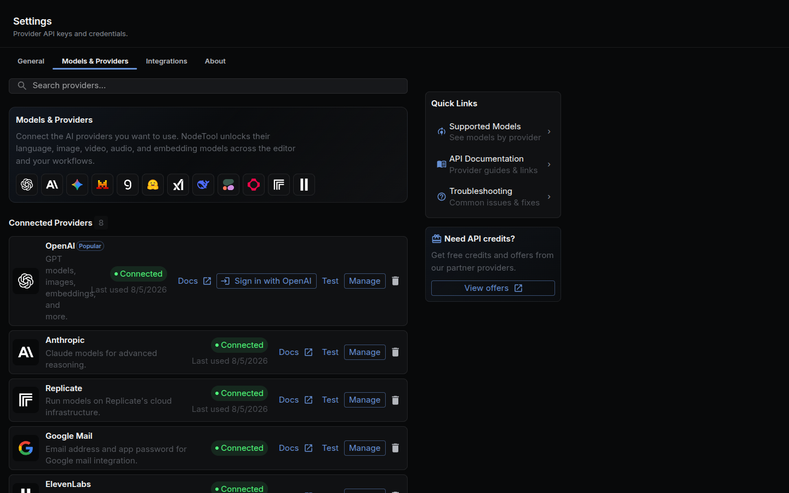
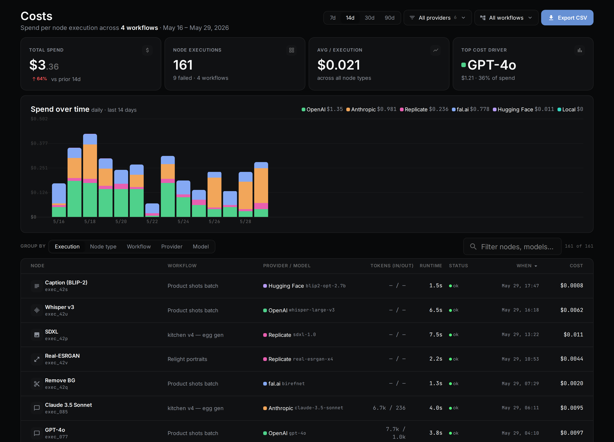

A provider is the adapter between a NodeTool node and an AI service: OpenAI, Anthropic, Gemini, a local Ollama daemon, or one of the 40+ others below. Every node that calls an LLM or a media model exposes a `model` property backed by a provider id. Pick a different provider from that same dropdown and the rest of the graph stays the same.

This is bring-your-own-key (BYOK). NodeTool does not mark up a provider's price, and cloud usage is billed directly by the provider. The one exception is the `nodetool` provider, which exists only in NodeTool's hosted cloud (see [NodeTool managed models](#nodetool-managed-models)). Add a key in **Settings → Models & Providers**, or skip keys and run everything through local models (Ollama, vLLM, LM Studio, llama.cpp).

New to models and providers generally? Start with [Models & Providers](models-and-providers.md) for the local-vs-cloud overview, or [Supported Models](models.md) for the full model catalog. This page is the provider reference: what each one does, which key it needs, and where to read more.

## Capability matrix

Checked against each provider's implementation in `packages/runtime/src/providers/`. A blank cell means that provider doesn't expose the modality through NodeTool's generic nodes, even where the underlying service might.

| Provider | Text | Image | Video | TTS | ASR | Embeddings | 3D |
|---|:---:|:---:|:---:|:---:|:---:|:---:|:---:|
| OpenAI | ✅ | ✅ | ✅ | ✅ | ✅ | ✅ | |
| Anthropic | ✅ | | | | | | |
| Google Gemini | ✅ | ✅ | ✅ | ✅ | ✅ | ✅ | |
| xAI (Grok) | ✅ | ✅ | ✅ | | | | |
| DeepSeek | ✅ | | | | | | |
| Groq | ✅ | | | | | | |
| Mistral | ✅ | | | | | ✅ | |
| Cerebras | ✅ | | | | | | |
| Alibaba Cloud | ✅ | | | | | | |
| GMI Cloud | ✅ | | | | | | |
| OpenRouter | ✅ | ✅ | ✅ | ✅ | ✅ | ✅ | |
| Requesty | ✅ | | | | | | |
| Opper | ✅ | | | | | | |
| Together AI | ✅ | ✅ | ✅ | ✅ | ✅ | ✅ | |
| Moonshot (Kimi) | ✅ | | | | | | |
| Meta AI | ✅ | | | | | | |
| MiniMax | ✅ | ✅ | ✅ | ✅ | | | |
| Codex (OpenAI OAuth) | ✅ | ✅ | | | | | |
| Claude Agent SDK | ✅ | | | | | | |
| Evolink | ✅ | ✅ | ✅ | | | | |
| kie.ai | ✅¹ | ✅ | ✅ | ✅ | | | |
| AKI | ✅ | ✅ | | | | | |
| Higgsfield | | ✅ | ✅ | | | | |
| UseAPI | | ✅ | ✅ | | | | |
| Replicate | ✅ | ✅ | ✅ | ✅ | ✅ | ✅ | |
| FAL | ✅ | ✅ | ✅ | ✅ | | | |
| Comfy Cloud | | ⁵ | ⁵ | | | | |
| HuggingFace | ✅ | ✅ | ✅² | ✅ | ✅ | ✅ | |
| Ollama | ✅ | | | | | ✅ | |
| vLLM | ✅ | | | | ✅ | ✅ | |
| LM Studio | ✅ | | | | | | |
| llama.cpp | ✅ | | | | | | |
| llama.cpp local | ✅ | | | | | ✅ | |
| Transformers.js | ✅ | | | ✅ | ✅ | ✅ | |
| ElevenLabs | | | | ✅ | ✅³ | | |
| Topaz | | ✅⁴ | | | | | |
| Reve | | ✅ | | | | | |
| AtlasCloud | | ✅ | ✅ | ✅ | ✅ | | ✅ |
| Cohere | | | | | | ✅ | |
| Voyage AI | | | | | | ✅ | |
| Jina AI | | | | | | ✅ | |
| Meshy AI | | | | | | | ✅ |
| Rodin AI | | | | | | | ✅ |

¹ Chat only for a fixed gateway list of GPT, Claude, Grok, Kimi, DeepSeek, and Gemini models (`KIE_CHAT_MODELS` in `kie-provider.ts`). Most kie.ai models are image, video, or audio.
² Text-to-video only; no image-to-video.
³ Via a dedicated Speech-to-Text node, not the generic ASR picker.
⁴ Upscale and enhancement, not text-to-image generation.
⁵ No models in the generic pickers — the Comfy API enumerates none. What comes out is whatever the ComfyUI graph you submit produces, through the `lib.comfy.RunWorkflowOnCloud` node.

### Provider capabilities

Each provider lists the operations it implements by overriding `BaseProvider.declaredCapabilities()` (`packages/runtime/src/providers/base-provider.ts`). `getCapabilities()` always adds the two chat methods, so providers with no chat models (Meshy, Rodin, Higgsfield) throw when asked to chat. Some providers declare more than the matrix shows. Video-to-video, lip sync, upscaling, and music are examples, and they surface through agent tools and dedicated nodes, not the generic pickers. To make a model usable outside the node graph (an agent, the `generate` CLI command, the generation API), implement the matching method on the provider and declare its capability. The contract test `packages/runtime/tests/providers/provider-capabilities-contract.test.ts` fails when a declared capability has no implementation or a model in the provider's catalog offers an undeclared task.

## OpenAI

OpenAI covers chat (GPT), image generation (GPT-Image), Sora 2 Pro video, TTS, Whisper transcription, and embeddings — six of the seven modalities in the matrix above. Cloud only, keyed by `OPENAI_API_KEY`. Chat models are fetched live from the OpenAI API; image models are a maintained static list. See the [OpenAI provider guide](developer/providers/openai.md).

## Anthropic

Anthropic runs Claude chat models with tool calling and image input for vision tasks. It doesn't generate images, video, or audio. Cloud only, keyed by `ANTHROPIC_API_KEY`; models are fetched live from the Anthropic API. See the [Anthropic provider guide](developer/providers/anthropic.md).

## Google Gemini

Gemini handles chat with native multimodal input (images, audio, video as Blobs), Nano Banana image generation (the `gemini-*-image` models), Veo video, Gemini TTS, Lyria music, audio transcription, and text embeddings. Cloud only, keyed by `GEMINI_API_KEY`. Text models auto-fetch. The image, video, TTS, and music models are static lists. Imagen is not available because Google shut it down in the Gemini API. See the [Gemini provider guide](developer/providers/gemini.md).

## xAI (Grok)

xAI runs Grok chat models plus Grok Imagine for text-to-video, image-to-video, and text-to-image, all classified from the same `/v1/models` response. Cloud only, keyed by `XAI_API_KEY`. See the [xAI provider guide](developer/providers/xai.md).

## DeepSeek

DeepSeek is chat only — DeepSeek-V3 and the R1 reasoning line — reached through an OpenAI-compatible endpoint. Cloud only, keyed by `DEEPSEEK_API_KEY`. See the [OpenAI-compatible providers guide](developer/providers/openai-compatible.md) for how its models are fetched.

## Groq

Groq runs chat models on its LPU inference hardware for low-latency responses. Text only — no image, video, or audio generation. Cloud only, keyed by `GROQ_API_KEY`. See the [OpenAI-compatible providers guide](developer/providers/openai-compatible.md).

## Mistral

Mistral runs chat models (Mistral, Mixtral) plus one embedding model, `mistral-embed`. Cloud only, keyed by `MISTRAL_API_KEY`. See the [OpenAI-compatible providers guide](developer/providers/openai-compatible.md).

## Cerebras

Cerebras runs chat models on its high-throughput inference hardware. Text only. Cloud only, keyed by `CEREBRAS_API_KEY`. See the [OpenAI-compatible providers guide](developer/providers/openai-compatible.md).

## Alibaba Cloud

Alibaba Cloud Model Studio serves the Qwen chat models — qwen3-max, qwen-plus, qwen-flash, qwen-turbo, and the qwen3-vl vision line — with streaming and tool calling. Text only. Cloud only, keyed by `DASHSCOPE_API_KEY`, over the DashScope OpenAI-compatible endpoint (default `https://dashscope-intl.aliyuncs.com/compatible-mode/v1`, the international/Singapore region); models are fetched live from its `/models` endpoint. Model Studio keys are region-scoped — set `DASHSCOPE_BASE_URL` to your region's `/compatible-mode/v1` endpoint when the key was created outside Singapore. Tool calling is gated per model family: Qwen-Math, QVQ, OCR, translation, and audio models are outside Alibaba's function-calling list and are not sent tools. Get a key at [Model Studio](https://modelstudio.console.alibabacloud.com/). See the [OpenAI-compatible providers guide](developer/providers/openai-compatible.md).

## GMI Cloud

GMI Cloud is an OpenAI-compatible chat endpoint for open-weight models — Llama, DeepSeek, and Qwen variants. Text only. Cloud only, keyed by `GMI_API_KEY`.

## OpenRouter

OpenRouter proxies 300+ chat models, image generation, Gemini image editing, and text-to-video and image-to-video models (Veo, Seedance, Kling, Wan) through a single key. Reference-to-video is not supported because OpenRouter accepts reference media only as public HTTPS URLs. Cloud only, keyed by `OPENROUTER_API_KEY`. See the [OpenAI-compatible providers guide](developer/providers/openai-compatible.md).

## Requesty

Requesty routes chat models from OpenAI, Anthropic, Google, DeepSeek, xAI and others through one OpenAI-compatible endpoint, `https://router.requesty.ai/v1`. Text only. Cloud only, keyed by `REQUESTY_API_KEY`. The model picker lists the managed models from `/v1/models/managed` (short ids such as `gpt-5.4-mini`) followed by the full `vendor/model` catalog from `/v1/models` (for example `openai/gpt-4o-mini`). Get a key at [Requesty](https://app.requesty.ai/api-keys). See the [OpenAI-compatible providers guide](developer/providers/openai-compatible.md).

## Opper

Opper is an EU-hosted AI gateway that routes chat models from 50+ providers, including OpenAI, Anthropic, Google, DeepSeek and Moonshot, through one OpenAI-compatible endpoint, `https://api.opper.ai/v3/compat`. Text only. Cloud only, keyed by `OPPER_API_KEY`. The model picker lists Opper's pools from `/v3/compat/models?type=pool` (bare ids such as `claude-sonnet-4-6`, routed across providers) followed by the full catalog from `/v3/compat/models`, which adds `provider/model` ids that pin one route. Get a key at [Opper](https://platform.opper.ai). See the [OpenAI-compatible providers guide](developer/providers/openai-compatible.md).

## Together AI

Together AI is one of the broadest providers in NodeTool: chat, manifest-driven image and video generation, TTS (Orpheus, Kokoro, Cartesia Sonic), ASR (Whisper Large v3, Voxtral, Parakeet), and one embedding model. Cloud only, keyed by `TOGETHER_API_KEY`. See the [Together provider guide](developer/providers/together.md).

## Moonshot (Kimi)

Moonshot runs Kimi chat models over its OpenAI-compatible endpoint (`https://api.moonshot.ai/v1`). Text only. Cloud only, keyed by `KIMI_API_KEY`. See the [OpenAI-compatible providers guide](developer/providers/openai-compatible.md).

## MiniMax

MiniMax covers chat, image (Image-01), video (Hailuo 2.3), TTS, and music generation in one provider. ASR and embeddings exist in MiniMax's API but are disabled in NodeTool's provider (embeddings need a GroupId NodeTool doesn't manage) — use another provider for those. Cloud only, keyed by `MINIMAX_API_KEY`. See the [MiniMax provider guide](developer/providers/minimax.md).

## Meta AI

Meta AI serves the Muse Spark chat models through an OpenAI-compatible endpoint (`https://api.meta.ai/v1`) with tool calling. If the model list cannot be fetched, the picker falls back to three built-in Muse Spark ids. Text only. Cloud only, keyed by `META_API_KEY`.

## Codex (OpenAI OAuth)

Codex reaches GPT chat models and GPT Image generation (GPT Image 2 and 1.5) through your ChatGPT/Codex OAuth session instead of an API key, and usage bills against that subscription. Sign in with the **Codex** card in Settings → Models & Providers. The provider reads the stored `CODEX_ACCESS_TOKEN`, so no `OPENAI_API_KEY` is needed.

## Claude Agent SDK

Claude Agent SDK reaches Claude by spawning your local, logged-in `claude` CLI instead of calling the Anthropic API directly, billing against your Claude subscription rather than per-token API spend. It supports tool calls through an in-process MCP bridge. Images in the prompt are forwarded when they are inline PNG, JPEG, GIF, or WebP data. A remote image URL is rejected, so resolve media references before the call. There is no API key. Sign in with the **Claude Code** card in Settings → Models & Providers or run `nodetool auth claude login` (add `--manual` on a headless host). The provider is not available in NodeTool's hosted cloud because it needs a local executable. See the [Anthropic provider guide](developer/providers/anthropic.md).

## Evolink

Evolink is an OpenAI/Anthropic-compatible gateway: one key for GPT, Claude, Gemini, and DeepSeek chat, plus image (GPT Image 2, Nano Banana 2, Seedream) and video (Seedance, Wan, Veo, Sora, Grok) generation. Cloud only, keyed by `EVOLINK_API_KEY`.

## kie.ai

kie.ai is a multi-model aggregator: manifest-driven image, video, TTS, and music models (Seedance, Runway, Wan, Kling, FLUX.2, Suno, and more), plus chat for a fixed list of gateway models (GPT, Claude, Grok, Kimi, DeepSeek, and Gemini families). One key covers all of it. kie.ai often lists lower prices than the upstream provider, so compare before you commit. Cloud only, keyed by `KIE_API_KEY`. See the [KIE provider guide](developer/providers/kie.md).

## AKI

AKI is an OpenAI-compatible gateway for chat plus text-to-image and image-to-image generation. Cloud only, keyed by `AKI_API_KEY`.

## Higgsfield

Higgsfield generates image and video from a manifest of models (text-to-image, image-to-image, text-to-video, image-to-video, reference-to-video, video-to-video, extend). No chat. Cloud only. It needs two secrets, `HIGGSFIELD_API_KEY_ID` and `HIGGSFIELD_API_KEY_SECRET`. The Higgsfield card in Settings accepts them as one pasted `key-id:secret` value.

## UseAPI

UseAPI generates image and video through your own Google Flow and Dreamina accounts on useapi.net: Nano Banana and Veo models through Google Flow, Seedream, Seedance, and Sora 2 through Dreamina. No chat. Cloud only, keyed by `USEAPI_API_TOKEN`. Set `USEAPI_GOOGLE_FLOW_EMAIL` (Google Flow account email) and `USEAPI_DREAMINA_ACCOUNT` (`region:email`) so reference image uploads use the right account.

## Replicate

Replicate runs chat, image, video, and music, plus curated TTS, ASR, and embedding models. Chat calls `replicate.run()`/`.stream()` on whatever model id you pass, so it isn't limited to a fixed model list the way most other providers are; image, video, and music nodes are generated from Replicate's schemas. Cloud only, keyed by `REPLICATE_API_TOKEN`. See the [Replicate provider guide](developer/providers/replicate.md).

## FAL

FAL generates image, video, TTS, and music from models whose nodes are generated straight from FAL's OpenAPI schemas. Chat goes through fal's OpenAI-compatible route, which is OpenRouter's router, so chat model ids are OpenRouter's catalog. Cloud only, keyed by `FAL_API_KEY` (`FAL_KEY` also works). See the [FAL provider guide](developer/providers/fal.md).

## Comfy Cloud

Comfy Cloud runs a ComfyUI workflow graph on cloud.comfy.org — no local ComfyUI install, no GPU of your own. It is reached through the `lib.comfy.RunWorkflowOnCloud` node rather than a model dropdown: the graph you paste in names its own checkpoints and LoRAs, so the provider lists no models and doesn't appear in the generic image or video pickers. Cloud only, keyed by `COMFY_API_KEY` from https://platform.comfy.org. The same key also authenticates partner API nodes inside the submitted graph. See [ComfyUI](comfyui.md).

## HuggingFace

HuggingFace routes chat, image, text-to-video, TTS, ASR, and embeddings to Hugging Face Inference Providers. The model lists are the most-liked warm inference models for each task, fetched from the Hub and cached for 10 minutes. Tool calling is off for this provider. A `HF_TOKEN` is required: paste a token with the Inference Providers permission into the HuggingFace card, or set `HF_TOKEN` in the environment. The 19 `huggingface.*` task nodes use the same token. See [HuggingFace Integration](huggingface.md).

## Ollama

Ollama runs chat and embedding models locally, with no API key and no per-token cost. It is a separate program: install it from [ollama.com](https://ollama.com) and keep it running, because NodeTool does not ship or start it. Pull a model with `ollama pull <model>` and it appears in NodeTool. The server URL comes from `OLLAMA_API_URL` (default `http://127.0.0.1:11434`), set in **Settings → Integrations → Local Model Servers** or the environment. `OLLAMA_CONTEXT_LENGTH` and `OLLAMA_KEEP_ALIVE` are in [Configuration](configuration.md#environment-variables-index). See the [Ollama provider guide](developer/providers/ollama.md).

## vLLM

vLLM points NodeTool at a self-hosted, OpenAI-compatible vLLM server for chat, embeddings (`/v1/embeddings`), and transcription (`/v1/audio/transcriptions`). Models appear from its `/v1/models` endpoint once the URL is set. `/v1/models` does not report a model's task, so every served model is offered for each task and the server rejects an unsupported call. Set `VLLM_BASE_URL` (no default) and `VLLM_API_KEY` if your deployment requires one. See [Local Inference](developer/providers/local-inference.md).

## LM Studio

LM Studio connects to the local server that LM Studio's desktop app exposes. Enable it in LM Studio → Local Server and NodeTool picks up loaded models automatically. The default URL is `http://127.0.0.1:1234`, overridden with `LMSTUDIO_API_URL`. `LMSTUDIO_API_KEY` is optional. See [Local Inference](developer/providers/local-inference.md).

## llama.cpp

llama.cpp points NodeTool at a local `llama-server` instance for chat. `llama-server` constrains generation with a grammar built from the tool schemas, so tool calling works for any model it serves. Set `LLAMA_CPP_URL` (required, no default). See [Local Inference](developer/providers/local-inference.md).

## llama.cpp local

llama.cpp local (provider id `node_llama_cpp`) runs GGUF models inside the NodeTool backend through the `node-llama-cpp` binding, with no separate server. It serves chat and embeddings. Models are GGUF files in `NODE_LLAMA_CPP_MODELS_DIR`, which defaults to the shared llama.cpp cache. `NODE_LLAMA_CPP_GPU_BACKEND` selects `auto`, `metal`, `cuda`, `vulkan`, or `cpu`. No key. Local only.

whisper.cpp (`whisper_cpp`) transcribes audio inside the backend through the
optional `@fugood/whisper.node@1.1.3` package. Install it from Package Manager.
GGML models use the Hugging Face hub cache. `WHISPER_CPP_MODELS_DIR` adds a
directory, and `WHISPER_CPP_GPU_BACKEND` selects `auto`, `metal`, `cuda`,
`vulkan`, or `cpu`. Restart the backend after changing the GPU backend.
`whisper_cpp.LiveTranscription` transcribes streaming PCM16 audio, with Silero
VAD or fixed windows when no VAD model is installed. Local only.

whisper.cpp server (`whisper_cpp_server`) posts audio to a user-run
`whisper-server` at `WHISPER_CPP_SERVER_URL`. Its model id is `default`.
It requires no native package. Local only.

## Transformers.js

Transformers.js (provider id `transformers_js`) runs small ONNX models in-process: chat, TTS, ASR, and embeddings. Models download from the Hugging Face Hub on first use into `<data-dir>/transformers-js-cache`, or the directory in `TRANSFORMERS_JS_CACHE_DIR`. Tool calling is off. No key. Local only. The matching workflow nodes are the `transformers.*` nodes in [HuggingFace Integration](huggingface.md#transformersjs-nodes-local-onnx).

## Local Python providers

When the Python worker runs with the matching pack installed, it registers its own providers over the stdio bridge, such as MLX on Apple Silicon and local Hugging Face execution. Install the packs from **Package Manager → Python packs**, or see [Python nodes without the desktop app](installation.md#python-nodes-without-the-desktop-app). With `NODETOOL_PYTHON_ON_DEMAND=true`, these providers appear only after a workflow has started the worker. The worker's `huggingface` provider appears as `huggingface-local` because the TypeScript runtime already owns the `huggingface` id for the hosted API. These providers offer image, video, TTS, music, ASR, and embedding models from the worker's pack.

## NodeTool managed models

The `nodetool` provider runs a curated model catalog on NodeTool's own platform keys and meters usage against a credit balance. It exists only in NodeTool's hosted cloud. Desktop and self-hosted installs do not register it, and they use your own keys for every provider here.

## Custom OpenAI-compatible endpoints

Any endpoint that speaks the OpenAI API can be a provider. In **Settings → Models & Providers**, use **Add endpoint** and enter a name, a slug, a base URL, and an optional API key. Chat models come from `GET <base_url>/models` unless you list ids yourself. Image models (`/images/generations`) and video models (`/videos`) are detected from the list, and you can add ids the detection misses. The provider id is `custom_<slug>`. On a server you can skip the UI and set `CUSTOM_<SLUG>_BASE_URL` and `CUSTOM_<SLUG>_API_KEY` as environment variables. See [Custom Providers](custom-providers.md) for the fields, model discovery, and editing.

## ElevenLabs

ElevenLabs covers text-to-speech, with a large static voice and model catalog, and speech-to-text, plus realtime WebSocket variants of both. Cloud only, keyed by `ELEVENLABS_API_KEY`. See the [ElevenLabs provider guide](developer/providers/elevenlabs.md).

## Topaz

Topaz enhances existing images and video — upscale, sharpen, denoise, restore — rather than generating from a prompt. Only the enhance and enhance-gen endpoints appear in the generic image-model picker; the rest (sharpen, denoise, lighting, matting, restore) are dedicated nodes. Cloud only, keyed by `TOPAZ_API_KEY`. See the [Topaz provider guide](developer/providers/topaz.md).

## Reve

Reve creates, edits, and remixes images through three dedicated nodes (`CreateImage`, `EditImage`, `RemixImage`); the runtime provider also exposes create and edit to the generic image picker. Cloud only, keyed by `REVE_API_KEY`. See the [Reve provider guide](developer/providers/reve.md).

## AtlasCloud

AtlasCloud generates image, video, speech, music, and 3D assets from a hand-maintained manifest (Seedance, GPT Image 2, Nano Banana, and more), transcribes audio, and lists chat models from its API. Cloud only, keyed by `ATLASCLOUD_API_KEY`. See the [AtlasCloud provider guide](developer/providers/atlascloud.md).

## Cohere

Cohere provides text embeddings — `embed-v4.0` and the English/multilingual v3 line. No chat and no reranking in NodeTool's current provider. Cloud only, keyed by `COHERE_API_KEY`.

## Voyage AI

Voyage AI provides text embeddings only. Cloud only, keyed by `VOYAGE_API_KEY`.

## Jina AI

Jina AI provides text embeddings only. Cloud only, keyed by `JINA_API_KEY`.

## Meshy AI

Meshy generates textured 3D meshes from text or a reference image, through the generic `nodetool.model3d.TextTo3D` / `ImageTo3D` nodes. Cloud only, keyed by `MESHY_API_KEY`.

## Rodin AI

Rodin generates 3D assets from text or a reference image, through the generic `nodetool.model3d.TextTo3D` / `ImageTo3D` nodes. Cloud only, keyed by `RODIN_API_KEY`.

## Generic nodes: provider-agnostic workflows

Nodes in the `nodetool.*` namespace take a `model` property and route to whichever provider owns that model — this is what makes switching providers a dropdown change, not a rewiring job.

| Node | Switches between |
|---|---|
| `nodetool.agents.Agent` | OpenAI, Anthropic, Gemini, xAI, DeepSeek, Ollama, any chat provider |
| `nodetool.image.TextToImage` | FLUX.2, Nano Banana 2.0, GPT Image 2, Ideogram V3, Z-Image, HuggingFace, MLX |
| `nodetool.image.ImageToImage` | HuggingFace, local servers, cloud services |
| `nodetool.video.TextToVideo` | Sora 2 Pro, Veo 3.1, Seedance 2.0, Runway, Grok Imagine, Wan 2.6, Hailuo 2.3, Kling 3.0, HuggingFace |
| `nodetool.video.ImageToVideo` | Sora 2 Pro, Veo 3.1, Seedance 2.0, Runway, Luma, Grok Imagine, Wan 2.6, Hailuo 2.3, Kling 3.0 |
| `nodetool.model3d.TextTo3D` / `ImageTo3D` | Meshy AI, Rodin AI, AtlasCloud |
| `nodetool.audio.TextToSpeech` | OpenAI TTS, ElevenLabs, HuggingFace, local TTS |
| `nodetool.text.AutomaticSpeechRecognition` | OpenAI Whisper, HuggingFace, local ASR |

A generic node drops parameters the selected provider doesn't support instead of erroring. Negative prompt, guidance scale, and seed apply mostly to diffusion-style backends, and GPT-Image and similar API-only models ignore them.

Reach for a provider-specific node only when you need something the generic interface doesn't carry, such as MiniMax text to speech with its `emotion` and `pitch` controls.

## Getting keys in

Wherever a missing provider blocks you (a model dropdown, a node warning, the getting-started checklist), NodeTool opens the **Connect an AI provider** dialog in place. It groups providers under **Sign in with your account** (Claude subscription, OpenAI, Hugging Face) and **Use an API key**. On desktop and localhost it also points at Ollama for running locally at no cost. A pasted key is checked against the provider before it is saved. If the provider rejects it, the dialog does not save it unless you choose to. If the provider cannot be reached, the key is saved and the dialog says it is unverified.


**Settings → Models & Providers** is the full list, grouped as Popular, Language Models, Media Generation, Gateways & Hubs, Web Search, Compute & Local, and Services & Advanced. Each configured provider has a **Test** button that calls the provider to confirm the key still works, and a **Manage** button to replace it. Codex and Claude Code offer sign-in with your account instead of a key. The dialog's OpenAI sign-in stores a ChatGPT Codex token, so it enables the `codex` provider and leaves `openai` unconfigured until you paste an API key. Claude Code sign-in is hidden on hosted deployments because it finishes on the server's own machine.



NodeTool stores every key encrypted (AES-256-GCM) in a local SQLite database, not in a plaintext config file. See [Configuration](configuration.md#secret-storage-and-master-key) for how the encryption key itself is managed.

From the CLI:

```bash
nodetool secrets store OPENAI_API_KEY   # prompts for the value, stores it encrypted
nodetool secrets list                   # list stored keys (values are never shown)
nodetool secrets get OPENAI_API_KEY     # print a stored value
```

Or set the variable directly in `.env.development.local` or your shell environment. A secret stored in the database wins over an environment variable of the same name, and the environment variable is the fallback when nothing is stored (the exceptions are `SUPABASE_URL`, `SUPABASE_KEY`, `SUPABASE_SERVICE_ROLE_KEY`, and `SERVER_AUTH_TOKEN`, where the environment wins). `FAL_KEY` is accepted in place of `FAL_API_KEY`. See [Configuration](configuration.md) for the full load order.

Local providers (Ollama, vLLM, LM Studio, llama.cpp) don't need a key. Point NodeTool at the server's URL instead. For vLLM (`VLLM_BASE_URL`), llama.cpp (`LLAMA_CPP_URL`), and LM Studio (`LMSTUDIO_API_URL`), set it under **Settings → Integrations → Local Model Servers** or as an environment variable. Ollama reads `OLLAMA_API_URL` from the environment or the secret store. In NodeTool's hosted cloud these local providers are not registered, unless the server runs with `NODETOOL_NODE_PROFILE=full`.

## Tracking spend

Every cloud call records its token counts and cost. The **Costs** page (`/costs`, or **Costs** under the app pages in the left panel's **More** tab) shows them over 7, 14, 30, or 90 days, grouped by execution, node type, workflow, provider, or model, so you can see which pipeline is expensive before the invoice does.



The same records are readable from the terminal: `nodetool costs summary`, `costs list` (filter with `--provider` and `--model`), `costs by-provider`, and `costs by-model`. Each takes `--json`. For estimates before a run, spend limits, and hosted credits, see [Costs and credits](costs-and-credits.md).

## Adding a new provider

Every provider is a class in `packages/runtime/src/providers/` extending `BaseProvider` (or `OpenAIProvider` / `AnthropicProvider` for OpenAI- or Anthropic-compatible APIs), registered in `provider-registry.ts` with the environment variables it needs. The right approach differs by provider — live model discovery, a hand-maintained manifest, or codegen from upstream schemas — so follow the [Provider Guides](developer/providers/index.md) runbook for your case rather than reverse-engineering it from an existing provider. Before opening a PR, run `npm run test:affected`, `npm run typecheck`, and `npm run lint`.

## See also

- [Models & Providers](models-and-providers.md) — local vs. cloud, mixed workflows, getting started
- [Supported Models](models.md) — the full model catalog and local inference engines
- [Installation](installation.md) — install NodeTool on Windows, macOS, Linux
- [Comparisons](comparisons.md) — NodeTool vs. ComfyUI, n8n, Dify, Flowise, Langflow, Weavy
- [Chat API](chat-api.md) — WebSocket API for chat interactions and provider routing
- [Global Chat](global-chat.md) and [Agent Mode](global-chat.md#agent-mode) — using providers interactively and through the planning agent
- [Workflow API](workflow-api.md) — building workflows with providers
- [Provider Guides](developer/providers/index.md) — runbooks for adding models and nodes to each provider
