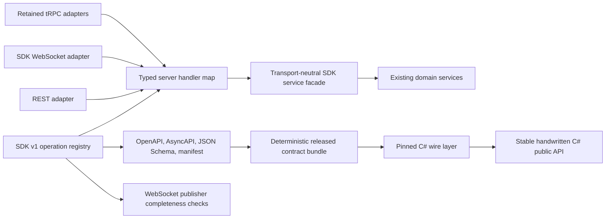

# SDK v1 contract convergence: canonical cross-repository plan

**Status:** Canonical plan

**Last updated:** 2026-08-22

**Repositories:** `nodetool`, `nodetool-sdk`

**Public protocol:** SDK v1 HTTP and WebSocket contracts

This is the only active plan for SDK contract convergence. It combines the
server consolidation work with the C# SDK drift-prevention and usability work.
All task status, design changes, and acceptance evidence belong in this file.

**Execution status (2026-08-22):** Phases 0 and 1 are complete in `nodetool`
on branch `claude/sdk-trpc-consolidation-ut79fs` (commits `322dbc0`,
`8486b9e`, `8fb47bb`, `7398c2d`). Phase 0 evidence:
`docs/sdk/phase-0-baseline-2026-08-22.md`. The release workflow already
builds and attaches the contract bundle (part of the Phase 5 producer gates).
Phases 2 and 3 are not started. Continue on the same branch; the Phase 0
golden tests freeze the public contract byte-exact and must not be edited to
make later work pass.

## 1. Outcome

Simplify the SDK implementation without removing any supported function:

1. Keep the existing SDK v1 HTTP paths and WebSocket messages stable.
2. Implement each SDK operation through one transport-neutral server path.
3. Declare each public HTTP or WebSocket operation once and generate route and
   contract artifacts from the shared operation registry.
4. Keep REST, WebSocket, and retained tRPC procedures as thin adapters.
5. Publish a deterministic contract bundle with each NodeTool release.
6. Make `nodetool-sdk` pin and mechanically consume that bundle.
7. Detect server/SDK drift before either repository releases.
8. Make the C# connection/session facade the normal entry point while keeping
   all low-level clients and individual execution controls.

This reduces drift between NodeTool and the C# SDK. Moving the C# client to raw
tRPC would not solve drift by itself. It would replace a stable, language-neutral
contract with tRPC URL encoding, envelopes, and internal procedure names.

## 2. Decisions

### 2.1 Public transport decisions

- `/api/sdk/v1` remains the public HTTP contract for non-TypeScript SDKs.
- Existing SDK WebSocket commands and MessagePack envelopes remain public.
- tRPC remains an internal TypeScript transport and adapter. Its dotted
  procedure names are not part of the public SDK contract.
- Public C# types do not expose tRPC request or response envelopes.
- Existing paths, methods, status codes, JSON names, content types, WebSocket
  commands, and MessagePack map keys and envelope shapes do not change during
  convergence.

### 2.2 Implementation decisions

- A protocol operation registry owns stable operation IDs, transport metadata,
  schemas, authentication policy, feature policy, errors, and implementation
  status. Its HTTP declarations include methods and paths; its WebSocket
  declarations include commands/events and directions.
- A typed server handler map, keyed by request/response operation IDs, owns the
  binding to server code. Event publishers have a separate completeness check.
  The protocol package does not contain tRPC procedure-name strings.
- A transport-neutral SDK service facade coordinates existing domain services.
  It is not a replacement for those services and must not become a large class
  containing all business logic.
- REST, SDK WebSocket, and retained tRPC procedures call the same service
  methods and translate only transport concerns.
- Temporary asset upload remains a multipart Fastify adapter over the shared
  temporary-storage service. It is not exposed as JSON or base64 tRPC input.

### 2.3 Compatibility decisions

- Preserve these independent controls and their current error behavior:
  - `NODETOOL_REQUIRE_SDK_AUTH_V1`;
  - `NODETOOL_DISABLE_SDK_WORKFLOW_INTERFACE_V1`;
  - `NODETOOL_DISABLE_SDK_LIFECYCLE_V1`.
- Do not replace the two feature switches with one switch. Discovery and
  lifecycle must remain independently controllable.
- Direct tRPC access to an SDK-related procedure must apply the same normal
  authentication and SDK policy as the corresponding public operation.
- Keep separate procedures when response shapes differ. Do not add a
  `fields=full|summary` mode to `workflows.list`.
- Do not remove `/ws/download` or change the web model-download flow as part of
  core convergence. That is separate product work with separate measurements.
- Do not delete focused handler or service tests merely because golden tests
  exist. Remove a test only after equivalent coverage is demonstrated.

## 3. Repository ownership and phase map

Repository labels used throughout this plan:

- **`[nodetool]`** means work only in `M:/P/NODETOOL/____REPOS____/nodetool`.
- **`[nodetool-sdk]`** means work only in
  `M:/P/NODETOOL/____REPOS____/nodetool-sdk`.
- **`[both]`** means coordinated changes or verification in both repositories.
  A joint phase should still use separate, independently releasable pull
  requests unless a shared CI job requires both checkouts.

| Phase | Owner            | Purpose              | Main output                                        |
| ----- | ---------------- | -------------------- | -------------------------------------------------- |
| 0     | `[nodetool]`     | Freeze and measure   | Current contract inventory and goldens             |
| 1     | `[nodetool]`     | Declare and publish  | Route declaration and deterministic bundle         |
| 2     | `[nodetool]`     | Unify implementation | Service facade and stable service errors           |
| 3     | `[nodetool]`     | Converge adapters    | One route plugin; thin REST, WS, and tRPC adapters |
| 4     | `[nodetool-sdk]` | Consume mechanically | Pinned bundle and generated/verified C# wire layer |
| 5     | `[both]`         | Prevent drift        | Cross-repository conformance and compatibility CI  |
| 6     | `[both]`         | Measure options      | Reproducible execution and upload benchmarks       |
| 7     | `[nodetool-sdk]` | Simplify C# use      | Primary session facade and measured presets        |
| 8     | `[both]`         | Release safely       | Additive releases, migration, and later cleanup    |

Phases 0 through 3 establish the producer boundary in `nodetool`. Phase 4
starts only after the first deterministic bundle exists. Phase 5 becomes a
release gate. Phase 6 must finish before Phase 7 names or recommends a
low-latency preset.

## 4. Confirmed current state

The following inventory was measured on 2026-08-22. Phase 0 must refresh file
locations and counts if the implementation changes before work starts.

### 4.1 Public HTTP surface in `nodetool`

| Operation              | Public route                                 | Current policy                                  |
| ---------------------- | -------------------------------------------- | ----------------------------------------------- |
| Node type inventory    | `GET /api/sdk/v1/node-types`                 | Discovery; workflow-interface flag applies      |
| Capabilities           | `GET /api/sdk/v1/capabilities`               | Discovery; lifecycle flag applies               |
| Model catalog          | `GET /api/sdk/v1/models`                     | Discovery                                       |
| List model downloads   | `GET /api/sdk/v1/model-downloads`            | Authenticated                                   |
| Start model download   | `POST /api/sdk/v1/model-downloads`           | Authenticated                                   |
| Cancel model download  | `POST /api/sdk/v1/model-downloads/cancel`    | Authenticated                                   |
| Preflight workflow     | `POST /api/sdk/v1/preflight`                 | Authenticated; lifecycle flag applies           |
| Workflow summaries     | `GET /api/sdk/v1/workflows`                  | Discovery; workflow-interface flag applies      |
| Workflow interfaces    | `POST /api/sdk/v1/workflow-interfaces`       | Discovery; workflow-interface flag applies      |
| One workflow interface | `GET /api/workflows/:id/interface?version=1` | Discovery; workflow-interface flag applies      |
| Temporary asset upload | `POST /api/sdk/v1/assets/temporary`          | Authenticated multipart; lifecycle flag applies |

The ten `/api/sdk/v1` operations use nine paths because
`model-downloads` supports both `GET` and `POST`. The single-workflow interface
is a public SDK v1 operation even though its compatible URL is outside the SDK
prefix.

"Discovery" describes the route's default SDK policy. Normal server
authentication or `NODETOOL_REQUIRE_SDK_AUTH_V1` can still require
authentication for discovery routes.

At investigation time, the Fastify route modules mounted handlers through
`bridge()` into WHATWG `Request`/`Response` handlers while `http-api.ts` also
dispatched a subset. Phase 3 replaces those duplicate registrations with one
declaration-driven Fastify plugin and removes the SDK entries from the second
dispatcher.

### 4.2 WebSocket and tRPC overlap in `nodetool`

- `handleSdkV1LifecycleRpc` handles `get_capabilities` and
  `preflight_workflow`.
- At investigation time, the unified WebSocket runner called these tRPC
  procedures in process:
  - `workflows.sdkSummaries`;
  - `workflows.interface`;
  - `workflows.interfaces`;
  - `nodes.sdkTypeInventory`.
- Phase 3 removes that internal hop but retains the procedures as thin wrappers
  for external compatibility. Any rename or removal still requires a consumer
  audit.
- Current tRPC uses plain JSON without a transformer. This makes binary
  temporary upload a poor tRPC operation.
- tRPC is mounted at `/trpc`; protected procedures read the authenticated user
  from the request context. The SDK policy is separate and must not be bypassed
  by a new direct caller.

### 4.3 Existing contract material

`packages/protocol` already contains generated SDK v1 OpenAPI, AsyncAPI, JSON
schemas, a manifest, and a baseline fixture. Generation starts from a
hand-maintained path table. The route registrations and that path table can
still diverge.

The known focused parity baseline at the time of investigation was 3 test
files and 28 passing tests after rebuilding stale workspace dependencies. It
covers REST, tRPC, and SDK WebSocket parity for the focused operations. Phase 0
must record the exact commands and commits used for the new baseline.

### 4.4 Current consumer boundary

- The C#/VL SDK in `nodetool-sdk` is the public out-of-tree consumer.
- The TypeScript package uses tRPC and `/ws`; it does not depend on the public
  C# HTTP surface in the same way.
- The NodeTool web application does not currently call the public SDK routes.
- The server and C# SDK duplicate some endpoint, DTO, and error knowledge, so
  they can drift even when each repository's local tests pass.

### 4.5 Existing execution controls

The WebSocket `run_job.execution_options` contract already carries the main
performance and durability controls:

- persistence mode;
- event detail;
- asset persistence.

The current C# `WorkflowExecutionOptions` defaults are job persistence, full
events, and temporary asset persistence. Other NodeTool clients can use server
defaults with different asset behavior. The consolidation must keep every
individual option and both sets of current defaults. A named preset is only a
C# usability layer over these controls.

## 5. Target architecture



### 5.1 Protocol operation registry in `[nodetool]`

Add declarations such as
`packages/protocol/src/api-schemas/sdk-v1-http-operations.ts` and
`sdk-v1-websocket-operations.ts`, backed by shared operation metadata types.
Each implemented or planned operation declares:

- a stable operation ID;
- implementation status: `implemented` or `planned`;
- transport and direction;
- an HTTP method and path, or a WebSocket command/event identity and channel;
- applicable path, query, header, body, or message schemas;
- response schema and content type when applicable;
- authentication and feature policy identifiers;
- declared public error codes and statuses;
- a binary or streaming marker where JSON generation does not apply.

The declarations must not import server packages or name tRPC procedures. A
representative shape is:

```ts
type SdkV1OperationCommon = {
  id: SdkV1OperationId;
  status: "implemented" | "planned";
  auth: "discovery" | "authenticated";
  feature: "workflow-interface" | "lifecycle" | null;
  errors: readonly SdkV1ErrorDeclaration[];
};

type SdkV1OperationDeclaration = SdkV1OperationCommon &
  (
    | {
        transport: "http";
        method: "GET" | "POST";
        path: string;
        request: SdkV1HttpRequestSchemas;
        response: SdkV1HttpResponseDeclaration;
      }
    | {
        transport: "websocket";
        direction: "request-response" | "server-event";
        channel: string;
        command?: string;
        message: SdkV1MessageDeclaration;
      }
  );
```

Generate OpenAPI paths from HTTP declarations and AsyncAPI channels/messages
from WebSocket declarations. A generated channel can be marked `partial` when
it contains both implemented and planned operation variants. Generate an
implemented-only profile for client generation so planned job operations
cannot appear as callable C# methods.

### 5.2 Typed handler map and service facade in `[nodetool]`

Define a server handler type from each request/response declaration's input and
output schema. Require an exhaustive handler map for all implemented
request/response operation IDs. Check server-event publishers separately
against implemented event declarations. This gives compile-time or CI failures
for missing implementations and avoids runtime lookup by a dotted tRPC string.

The handler map calls a transport-neutral facade such as `SdkV1Service`. The
facade may be a small collection of domain-focused services rather than one
class. It should coordinate:

- workflow discovery and interface lookup;
- node type inventory;
- runtime capabilities;
- workflow preflight;
- model catalog and download lifecycle;
- temporary asset storage.

Existing domain services remain the source of business behavior. The facade
owns common input validation, authorization requirements, feature policy,
correlation metadata, and stable service errors where those concerns are
shared.

### 5.3 Stable transport-neutral errors in `[nodetool]`

Define an `SdkV1ServiceError` with at least:

- stable SDK error code;
- safe public message;
- logical status/category;
- retryability when applicable;
- internal cause and logging context that are never serialized directly.

Map it at each edge:

- REST maps it to the existing SDK error JSON and HTTP status;
- SDK WebSocket maps it to the existing RPC error envelope;
- tRPC maps it to `TRPCError` and the existing `data.apiCode` shape.

Golden tests must prove existing public error bodies exactly. Content-type and
validation behavior are route-specific compatibility requirements, not global
defaults to normalize during this work.

### 5.4 Adapter rules in `[nodetool]`

REST adapters may parse HTTP, enforce the declared route policy, call the typed
handler, and serialize the declared response. They contain no domain logic.

SDK WebSocket adapters preserve existing commands and MessagePack envelopes.
They call the typed handlers or service facade directly. They do not need an
in-process tRPC hop once parity is proven.

Retained tRPC procedures call the same typed handler or service method. Keep
separate procedures for summary and full response shapes. Audit direct users
before any procedure rename. A later neutral name such as
`workflows.summaries` or `nodes.typeInventory` may be added, but cleanup is not
a core acceptance condition.

Temporary multipart upload stays a dedicated Fastify adapter. Do not register
an `assets.uploadTemporary` tRPC procedure with `Uint8Array`, JSON, or base64
input. The adapter calls the shared temporary-storage service directly.

### 5.5 Deterministic contract bundle in `[nodetool]`

Build one versioned archive that contains:

- OpenAPI for implemented HTTP operations;
- AsyncAPI for public SDK WebSocket operations;
- JSON schemas for requests, responses, and stable errors;
- the complete operation manifest with implemented/planned status;
- JSON golden success and error fixtures;
- exact MessagePack golden frames and their semantic JSON form;
- per-file SHA-256 digests and one bundle digest;
- protocol compatibility rules and the producing NodeTool commit/release.

Generation must be deterministic: stable ordering, line endings, archive
metadata, and digests. Publish the same bytes as a NodeTool release asset and
inside `@nodetool-ai/protocol`, or publish one location plus a verified pointer.
If both locations are used, their bundle digests must match.

### 5.6 C# consumption boundary in `[nodetool-sdk]`

Pin the NodeTool release, protocol version, and bundle digest in
`contracts/sdk-v1/`. Normal builds and tests must work offline.

Generate or mechanically verify only the internal wire layer:

- endpoint paths and methods;
- HTTP request and response DTOs;
- stable error DTOs;
- JSON property and enum serialization metadata.

Keep the public C# interfaces, domain records, low-level clients, and
`SdkApiException` handwritten and source compatible. Map wire DTOs to public
types in one place. Keep the MessagePack execution runtime handwritten, but
verify its envelopes and bytes against AsyncAPI and goldens.

Evaluate available OpenAPI generators before selecting one. Require
deterministic, reviewable output, correct nullable annotations, snake-case wire
names, additive response-field tolerance, and compatibility with the SDK's
supported .NET targets. If none meet these requirements, add a focused
repository generator from the published schemas.

## 6. Execution plan

### Phase 0 `[nodetool]` - Freeze and measure the current contract

Purpose: make hidden behavior explicit before moving code.

- [x] Record the exact server commit and commands for the baseline.
- [x] Inventory every implemented and planned SDK HTTP operation.
- [x] Inventory every public SDK WebSocket command and event.
- [x] Inventory each SDK-related tRPC procedure and all in-repository callers.
- [x] Audit known out-of-repository tRPC consumers before planning removal.
- [x] Record route ownership, auth policy, feature policy, request limits,
      content types, statuses, headers, error shapes, and retry semantics.
- [x] Capture JSON success and error goldens for every HTTP operation.
- [x] Capture exact MessagePack fixtures for public WebSocket requests,
      responses, events, and errors.
- [x] Capture multipart upload size-limit, filename, media-type, temporary-ID,
      and cleanup behavior.
- [x] Add route and WebSocket inventory tests around the current declarations.
- [x] Prove each new drift check fails by changing one fixture or declaration
      in a temporary local test change, then restore it.

Done in commit `7398c2d`: 20 fixtures under `packages/protocol/fixtures/sdk-v1/`,
five test files under `packages/websocket/tests/` (`sdk-v1-*.test.ts`), and
`docs/sdk/phase-0-baseline-2026-08-22.md` with the drift-check proof table.

Exit criteria:

- Current public behavior is reproducible without reading handler code.
- Active tRPC callers are correctly identified.
- Goldens include feature-disabled and authentication failures.
- No runtime behavior has changed.

### Phase 1 `[nodetool]` - Declare and publish the contract

Purpose: make one machine-readable declaration drive public artifacts and
route completeness.

- [x] Add HTTP and WebSocket operation declarations to `packages/protocol`.
- [x] Give every operation a stable ID and explicit implementation status.
- [x] Include the compatible non-prefixed workflow-interface route.
- [x] Mark temporary upload as multipart/binary.
- [x] Generate OpenAPI route entries from HTTP declarations.
- [x] Generate or validate AsyncAPI command, event, and direction inventory
      from WebSocket declarations.
- [x] Generate implemented-only and full-manifest profiles.
- [x] Fail when operation IDs or method/path pairs are duplicated.
- [x] Fail when an implemented route lacks schemas, declared errors, or policy.
- [x] Fail when a registered route and implemented OpenAPI inventory differ.
- [x] Add deterministic bundle generation and digest verification.
- [x] Add a semantic contract diff that labels additive, risky, and breaking
      changes.
- [x] Document v1 rules: response additions are tolerated; request changes
      need an explicit version or capability decision when inputs are strict.

Done in commits `322dbc0` (registry: `sdk-v1-operations.ts`,
`sdk-v1-http-operations.ts`, `sdk-v1-websocket-operations.ts`;
declaration-driven generation with byte-identical artifacts; implemented-only
profiles; `sdk-v1.operations.json`) and `8486b9e`
(`build:sdk-contract-bundle`, `diff:sdk-contract`,
`docs/sdk/protocol-v1-compatibility.md`, release-CI bundle attachment).

Exit criteria:

- Repeated generation produces byte-identical artifacts.
- Planned job operations are visible in the full manifest but excluded from
  the normal C# generation input.
- Changing an operation declaration changes the generated artifacts or fails
  CI.

### Phase 2 `[nodetool]` - Add the transport-neutral service boundary

Purpose: remove duplicated behavior before changing route registration.

- [x] Define `SdkV1ServiceError` and transport mappings.
- [x] Define the typed handler map from implemented request/response operation
      IDs and an event-publisher completeness check.
- [x] Migrate one read-only operation as a proof of the boundary.
- [x] Prove its REST, WebSocket or tRPC forms remain byte/semantically equal as
      applicable.
- [x] Migrate workflow summaries and interfaces.
- [x] Migrate node inventory, capabilities, and preflight.
- [x] Migrate model catalog and model-download lifecycle.
- [x] Move temporary-storage behavior behind a shared service while keeping
      multipart parsing at the HTTP edge.
- [x] Keep existing domain services focused; split the facade by concern if it
      starts accumulating business logic.
- [x] Keep focused service tests and add facade contract tests.

Exit criteria:

- Each implemented request/response operation has one service/handler path,
  and each implemented event has one declared publisher path.
- Adapters no longer duplicate validation, feature checks, or error decisions.
- Existing flags remain independent and retain existing public errors.

### Phase 3 `[nodetool]` - Converge REST, WebSocket, and tRPC adapters

Purpose: make registrations and transport wrappers unable to drift from the
declared contract.

#### Phase 3A - Prove a shadow facade

- [x] Add a temporary opt-in or test-only shadow mount for every implemented
      HTTP declaration. Use `/api/sdk-next/v1` where possible and an explicit
      test-only alias for the compatible non-prefixed workflow-interface route.
- [x] Compare old and shadow routes for bodies, headers, content types, status
      codes, authentication, feature flags, and errors.
- [x] Include reverse-proxy subpaths and URL/query encoding in parity tests.
- [x] Do not expose planned operations from the shadow mount.

#### Phase 3B - Cut over HTTP registration

- [x] Add one SDK v1 Fastify route plugin driven by the HTTP declarations.
- [x] Keep the compatible public path for the single-workflow interface.
- [x] Keep multipart upload on its binary adapter path.
- [x] Remove duplicate `http-api.ts` dispatch entries only after parity passes
      and no supported caller depends on that internal dispatcher.
- [x] Remove the shadow mount after the real mounts use the same registration
      path.

#### Phase 3C - Converge SDK WebSocket calls

- [x] Make lifecycle commands call the shared handler/service boundary.
- [x] Replace the unified WebSocket runner's in-process tRPC hop with typed
      handler/service calls where this does not alter scheduling or envelopes.
- [x] Preserve caller identity and scopes, local-trust behavior, runner
      registration, `sdk_execution_target`, correlation IDs, cancellation,
      reconnect, event order, and MessagePack bytes.

#### Phase 3D - Retain thin tRPC adapters

- [x] Make the four current SDK-related procedures call the same boundary.
- [x] Apply normal tRPC auth plus the declared SDK policy to direct calls.
- [x] Keep summary and full-result procedures separate.
- [x] Do not add a JSON temporary-upload procedure.
- [x] Keep existing names until the consumer audit and compatibility policy
      permit deprecation.

Exit criteria:

- One plugin visibly owns all public SDK HTTP registrations.
- HTTP route inventory equals implemented OpenAPI inventory.
- SDK WebSocket command/event inventory equals implemented AsyncAPI inventory.
- REST, WebSocket, and retained tRPC adapters contain transport logic only.
- All Phase 0 goldens still pass.

### Phase 4 `[nodetool-sdk]` - Pin and consume the contract

Purpose: replace handwritten server-contract duplication with a mechanical,
reviewable update.

- [ ] Add `contracts/sdk-v1/` with the pinned manifest and bundle, or a lock
      file plus a verified local cache.
- [ ] Record NodeTool release, protocol version, bundle digest, and minimum
      supported server version.
- [ ] Add an explicit contract-update command that fetches or copies a named
      release, verifies digests, regenerates the wire layer, runs conformance
      tests, and prints a semantic diff.
- [ ] Keep normal build and test commands offline.
- [ ] Run the generator evaluation described in Section 5.6.
- [ ] Generate or mechanically verify internal HTTP wire DTOs, errors,
      endpoints, methods, and serialization metadata.
- [ ] Map internal wire types to the existing public types in one module.
- [ ] Add a freshness check that fails after manual generated-file edits.
- [ ] Verify handwritten MessagePack code against the pinned fixtures.
- [ ] Preserve `INodetoolClient`, `IWorkflowDiscoveryClient`, model services,
      execution clients, session APIs, injected `HttpClient` ownership,
      cancellation, retries, token refresh, request IDs, and proxy subpaths.

Exit criteria:

- A contract update produces a deterministic C# wire-layer diff.
- Existing public C# consumers compile unchanged.
- Every pinned JSON and MessagePack fixture is consumed successfully or fails
  with the documented safe behavior.

### Phase 5 `[both]` - Add cross-repository conformance CI

Purpose: detect incompatible drift before release, not after SDK users report
it.

#### `[nodetool]` producer gates

- [ ] Validate every golden JSON fixture against generated schemas.
- [ ] Validate exact MessagePack fixtures.
- [ ] Verify route and command inventories against OpenAPI and AsyncAPI.
- [ ] Run REST, WebSocket, and retained tRPC parity tests.
- [ ] Fail on removed required response fields, repurposed fields, stricter v1
      inputs, or changed retry semantics without an explicit protocol decision.
- [ ] Build and publish the candidate contract bundle in release CI.

#### `[nodetool-sdk]` consumer gates

- [ ] Deserialize every success and stable error fixture.
- [ ] Decode every MessagePack fixture and compare its public meaning.
- [ ] Re-encode supported C# requests and validate them against request schemas.
- [ ] Prove unknown additional response fields are ignored.
- [ ] Prove invalid enum values and missing required fields fail safely.
- [ ] Run against every supported .NET target and the VL adapter/package build.

#### `[both]` compatibility matrix and update flow

- [ ] Test SDK main against the minimum supported NodeTool release, latest
      release, and NodeTool main/candidate contract.
- [ ] Test a released SDK against NodeTool main before a contract-affecting
      NodeTool release.
- [ ] Treat documented feature-disabled responses as supported outcomes.
- [ ] Publish the tested server/SDK matrix with SDK releases.
- [ ] Open an automated, review-required SDK contract update when NodeTool
      publishes a new digest. Include manifest, generated changes, semantic
      diff, test results, and any proposed minimum-version change.
- [ ] Never auto-merge a contract update.

Exit criteria:

- Drift in routes, schemas, errors, or MessagePack frames fails before release.
- Contract updates are reproducible and reviewable.
- Supported server/SDK combinations are explicit.

### Phase 6 `[both]` - Benchmark execution options and binary transfer

Purpose: base SDK convenience presets and transport choices on measurements.

#### `[nodetool]` benchmark support

- [ ] Expose or record server timing for database, asset, thumbnail, and queue
      work without changing public response semantics.
- [ ] Keep multipart temporary upload as the binary baseline.
- [ ] Record server commit, configuration, hardware, workflow IDs, and raw
      results.

#### `[nodetool-sdk]` benchmark runner

- [ ] Cover a primitive no-media workflow, repeated image input/output, one
      generated image, streaming text, streaming audio, and a large temporary
      upload.
- [ ] Compare job/session persistence, full/outputs/terminal events, and
      automatic/temporary asset persistence.
- [ ] Measure connection and capability negotiation time, upload time,
      submission-to-first-output, total time, event count and bytes, database
      and asset time, allocations, peak memory, reconnect, and terminal result.
- [ ] Prove multipart upload is faster or more memory-safe than a JSON/base64
      alternative for representative media.
- [ ] Verify that terminal-only delivery intentionally withholds provisional
      outputs and is not presented as interactive streaming.

Exit criteria:

- Results are reproducible from stored configuration and raw data.
- Any proposed low-latency preset has a measured benefit and documented
  durability/delivery costs.
- No transport change is justified only by assumption.

### Phase 7 `[nodetool-sdk]` - Simplify the public C# experience

Purpose: make the common path small without hiding advanced controls.

- [ ] Make `NodeToolConnectionSession` the primary documented entry point.
- [ ] Let the session coordinate discovery, capabilities, preflight, model
      catalog/downloads, execution, and asset transfer.
- [ ] Preserve design-time HTTP fallback when WebSocket is unavailable.
- [ ] Keep low-level HTTP and WebSocket clients public for advanced use,
      testing, and host adapters.
- [ ] Keep every `WorkflowExecutionOptions` value independently settable.
- [ ] Add named presets only if Phase 6 supports them. Candidate names:
  - `Default`: job persistence, full events, and temporary assets, matching
    current C# defaults;
  - `LowLatencyInteractive`: session persistence, output-only events, and
    temporary assets;
  - `Durable`: job persistence, full events, and automatic asset-library
    persistence.
- [ ] Implement presets as immutable factories/values that callers can copy and
      override.
- [ ] Negotiate non-default values through capabilities before submission.
- [ ] Return a clear compatibility error for an unsupported requested option;
      never silently change semantics.
- [ ] Document history, reconnect, event delivery, temporary retention, and
      asset-library visibility for each preset.

Exit criteria:

- Ordinary SDK use needs one connection/session abstraction.
- Existing code and low-level control remain supported.
- Presets preserve server defaults and expose their tradeoffs.

### Phase 8 `[both]` - Release, migrate, and clean up

Purpose: ship additively and avoid a state where one released repository needs
an unreleased contract from the other.

#### Release A `[nodetool]`

- [ ] Ship the typed operation registry, service boundary, and thin adapters.
- [ ] Keep all public routes, commands, payloads, flags, and tRPC wrappers.
- [ ] Publish the first deterministic contract bundle.

#### Release B `[nodetool-sdk]`

- [ ] Pin the Release A bundle.
- [ ] Land generated or verified wire types behind the existing C# API.
- [ ] Publish the first compatibility matrix.

#### Release C `[nodetool-sdk]`

- [ ] Document the primary session facade.
- [ ] Add only the presets supported by Phase 6 measurements.
- [ ] Keep individual options and low-level clients.

#### Later cleanup `[nodetool]`

- [ ] Deprecate unused SDK-specific tRPC procedures only if the consumer audit
      and normal compatibility policy permit it.
- [ ] Remove obsolete adapter files only after focused and golden coverage is
      equivalent.
- [ ] Never use internal cleanup to remove public SDK HTTP or WebSocket
      operations.

Exit criteria:

- Each release works with the documented already-released counterpart.
- No supported caller needs a flag day.
- Deprecations include evidence, notice, and a migration path.

## 7. Optional product follow-ups, outside core acceptance

These suggestions may use the shared service boundary later, but they must not
delay or broaden the core convergence work:

- `[nodetool]` let the web app adopt the unified model catalog/download service;
- `[nodetool]` let the CLI use temporary multipart upload;
- `[nodetool]` expose preflight in more TypeScript product flows;
- `[nodetool]` evaluate an SDK-prefixed alias for the single-workflow interface
  in a future protocol version;
- `[nodetool]` evaluate retirement of `/ws/download` only in a separate design
  with real-time behavior, server load, compatibility, and benchmark evidence.

These follow-ups may add adapters. They must not create a second business-logic
implementation or change SDK v1 behavior without the normal protocol process.

## 8. Verification matrix

### 8.1 `[nodetool]` focused gates

- `packages/protocol` generation, schema, digest, and freshness tests;
- SDK HTTP declaration and Fastify registration inventory tests;
- SDK WebSocket declaration and publisher/dispatcher inventory tests;
- HTTP success/error golden tests for every operation;
- SDK lifecycle RPC and MessagePack golden tests;
- workflow-interface REST/tRPC/WebSocket parity tests;
- node inventory and summary caller tests;
- authentication and feature-policy matrix tests;
- model catalog and model-download lifecycle tests;
- multipart temporary-upload limits and cleanup tests;
- reverse-proxy subpath and URL/query encoding tests;
- affected TypeScript builds and lint.

### 8.2 `[nodetool-sdk]` focused gates

- contract digest and generated-code freshness checks;
- all HTTP route success/error fixtures;
- all MessagePack request, response, event, and error fixtures;
- unknown response-field tolerance and strict required-field tests;
- session ownership, cancellation, retry, request-ID, token refresh, and
  redaction tests;
- discovery, interface, capabilities, preflight, models, downloads, and assets;
- execution negotiation, streaming, cancellation, reconnect, and terminal
  result tests;
- all supported .NET targets, NuGet API compatibility, and VL package build.

### 8.3 `[both]` release gates

- live local-server SDK smoke test;
- authenticated-server smoke test;
- reverse-proxy subpath smoke test;
- minimum, latest, and candidate compatibility matrix;
- NodeTool web, Electron, CLI, C# SDK, and VL non-regression checks relevant to
  the changed services;
- published artifact digest equals the digest pinned by the SDK update.

## 9. Pull request sequence

Keep each change reviewable, reversible, and usable without an unreleased
counterpart.

1. **`[nodetool]` PR 1:** Phase 0 inventory, goldens, and drift checks.
2. **`[nodetool]` PR 2:** operation registry, implemented/planned profiles, and
   generated OpenAPI and AsyncAPI inventories.
3. **`[nodetool]` PR 3:** deterministic contract bundle and semantic diff.
4. **`[nodetool]` PR 4:** service error plus one read-only operation as proof.
5. **`[nodetool]` PR 5:** remaining discovery, capability, and preflight
   operations.
6. **`[nodetool]` PR 6:** models, downloads, temporary storage, and one route
   plugin.
7. **`[nodetool]` PR 7:** direct shared-boundary WebSocket calls and retained
   thin tRPC wrappers.
8. **`[nodetool-sdk]` PR 1:** pin bundle and add conformance tests without
   production-code changes.
9. **`[nodetool-sdk]` PR 2:** generated or mechanically verified internal wire
   layer behind the existing public API.
10. **`[both]` CI changes:** compatibility matrix and review-required contract
    update automation.
11. **`[both]` benchmark changes:** server timing evidence and SDK runner.
12. **`[nodetool-sdk]` PR 3:** primary facade documentation and measured
    presets.
13. **`[nodetool]` later cleanup:** tRPC or adapter deprecation only after the
    audit and compatibility window.

## 10. Risks and controls

| Risk                                               | Control                                                                                           |
| -------------------------------------------------- | ------------------------------------------------------------------------------------------------- |
| The facade becomes a large class                   | Keep domain services separate; the facade coordinates contract operations and shared policy only. |
| The route table becomes coupled to tRPC            | Store stable operation IDs, never dotted procedure-name strings.                                  |
| A direct tRPC call bypasses SDK auth policy        | Use shared declared policy and explicit middleware tests for direct and in-process calls.         |
| Generated C# code changes the public API           | Keep it internal and map through the existing handwritten API.                                    |
| Planned jobs appear in generated clients           | Generate clients only from the implemented profile.                                               |
| REST and WebSocket errors diverge                  | Use one service error plus cross-transport goldens.                                               |
| A flag consolidation removes operational control   | Preserve both feature flags and the auth override independently.                                  |
| A procedure thought to be unused breaks the runner | Maintain the caller inventory and migrate callers before deprecation.                             |
| New response fields break C#                       | Test additive-field tolerance against every fixture.                                              |
| Strict request changes break protocol v1           | Require a protocol version or capability decision.                                                |
| Multipart becomes JSON/base64                      | Keep a binary-route architecture test and benchmark guard.                                        |
| CI depends on the network                          | Pin verified artifacts locally; fetch only during explicit updates.                               |
| Contract generation creates noisy diffs            | Require deterministic output and a semantic review summary.                                       |
| A convenience preset loses durability              | Preserve defaults, require explicit selection, negotiate support, and document behavior.          |
| Web download migration changes real-time behavior  | Keep it outside core acceptance and require separate measurements.                                |

## 11. Definition of done

- [ ] One NodeTool service/handler path implements each request/response
      operation, and one declared publisher path emits each server event.
- [ ] Protocol declarations match the implemented HTTP registration,
      WebSocket dispatcher, and event-publisher inventories.
- [ ] REST, SDK WebSocket, and retained tRPC adapters are thin and equivalent.
- [ ] All public SDK v1 routes, messages, errors, flags, and defaults remain
      compatible.
- [ ] Multipart upload, MessagePack execution, streaming, cancellation, and
      reconnect behavior remain intact.
- [ ] NodeTool publishes one deterministic contract bundle per release.
- [ ] `nodetool-sdk` pins and verifies that bundle offline.
- [ ] C# wire changes are generated or mechanically verified.
- [ ] The handwritten public C# API remains source compatible.
- [ ] Cross-repository CI detects incompatible drift before release.
- [ ] The tested NodeTool/SDK version matrix is published.
- [ ] The primary C# facade reduces common setup without removing low-level
      access.
- [ ] Any named performance preset is measured, explicit, and overrideable.
- [ ] No tRPC procedure or focused test is removed without audit and equivalent
      coverage.
- [ ] Optional product follow-ups are tracked separately from this plan's core
      acceptance.

## 12. Questions resolved within the phases

These do not block the plan. Each has a named decision point:

1. **Phase 0:** Are there supported external consumers of the four active
   SDK-related tRPC procedures?
2. **Phase 1:** Will release assets and `@nodetool-ai/protocol` both carry the
   bundle? If yes, they must carry identical bytes and digests.
3. **Phase 1:** Which planned operations must remain visible in the full
   manifest while being excluded from generated clients?
4. **Phase 4:** Which generator meets the internal-wire-layer requirements, or
   is a focused repository generator safer?
5. **Phase 6:** What measured thresholds justify the name
   `LowLatencyInteractive`?
6. **Separate product plan:** Should a future protocol add an SDK-prefixed alias
   for the single-workflow interface or replace `/ws/download`?

Until a question is resolved, use the compatibility-preserving choice: retain
public operations and active internal wrappers, keep individual execution
options, pin generated artifacts, and keep tRPC details out of the public C#
contract.
