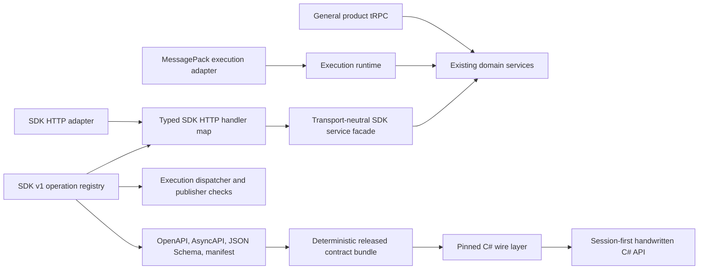

# SDK v1 contract convergence: canonical cross-repository plan

**Status:** Canonical plan

**Last updated:** 2026-08-23

**Repositories:** `nodetool`, `nodetool-sdk`

**Public protocol:** SDK v1 HTTP and WebSocket contracts

This is the only active plan for SDK contract convergence. It combines the
server consolidation work with the C# SDK drift-prevention and usability work.
All task status, design changes, and acceptance evidence belong in this file.

**Execution status (2026-08-23):** NodeTool producer Phases 0 through 3 and
the Phase 5 producer gates are complete on branch
`claude/sdk-trpc-consolidation-ut79fs` through commit `686a0d710e`. Phase 0
evidence: `docs/sdk/phase-0-baseline-2026-08-22.md`. The byte-frozen goldens
remain unchanged. In `nodetool-sdk`, Phase 4, the Phase 5 consumer gates, and
the non-preset Phase 7 facade work are complete on the matching branch through
commit `2c57c93` (facade commit `765ebe2`). Phase 6 benchmarks,
benchmark-dependent presets, the Phase 8 pre-release reset, and releases remain
open.

**Pre-release decision (2026-08-23):** There are no external SDK users. Phase 8
therefore replaces the compatibility-preserving adapter set with the intended
first public contract. The Phase 0 baseline remains evidence of the old shape,
but it is not the release target. Phase 8 may remove unused SDK-specific tRPC
procedures, SDK discovery RPCs, old URLs, mutable C# configuration, and public
low-level escape hatches. It must preserve product functions through the
session facade. It creates one reviewed replacement baseline, then freezes it.

## 1. Outcome

Simplify the SDK implementation before its first public release:

1. Use HTTP for SDK discovery and control operations.
2. Use MessagePack WebSocket only for execution and live events.
3. Implement each SDK operation through one transport-neutral server path.
4. Declare each public HTTP or WebSocket operation once and generate route and
   contract artifacts from the shared operation registry.
5. Keep tRPC for NodeTool's TypeScript applications, not as an SDK transport.
6. Publish a deterministic contract bundle with each NodeTool release.
7. Make `nodetool-sdk` pin and mechanically consume that bundle.
8. Detect server/SDK drift before either repository releases.
9. Make the C# connection/session facade the public entry point. Keep each
   useful operation, but make transport clients implementation details.

This reduces drift between NodeTool and the C# SDK. Moving the C# client to raw
tRPC would not solve drift by itself. It would replace a stable, language-neutral
contract with tRPC URL encoding, envelopes, and internal procedure names.

## 2. Decisions

### 2.1 Public transport decisions

- `/api/sdk/v1` is the public discovery and control contract for non-TypeScript
  SDKs. Every SDK HTTP operation moves under this prefix.
- The public SDK WebSocket contract contains execution and live events only.
- tRPC remains the internal API for the web, mobile, and Electron TypeScript
  clients. Its dotted procedure names are not part of the public SDK contract.
- SDK-specific tRPC procedures with no TypeScript caller are removed before the
  first release.
- Public C# types do not expose tRPC request or response envelopes.
- Phase 8 defines one clean pre-release contract. After its replacement
  baseline lands, paths, methods, status codes, JSON names, content types, and
  MessagePack execution envelopes are frozen again.

### 2.2 Implementation decisions

- A protocol operation registry owns stable operation IDs, transport metadata,
  schemas, authentication policy, feature policy, and errors. Its HTTP
  declarations include methods and paths; its WebSocket declarations include
  commands/events and directions. The release registry contains implemented
  public operations only. Roadmap operations stay in design notes.
- A typed server handler map, keyed by request/response operation IDs, owns the
  binding to server code. Event publishers have a separate completeness check.
  The protocol package does not contain tRPC procedure-name strings.
- A transport-neutral SDK service facade coordinates existing domain services.
  It is not a replacement for those services and must not become a large class
  containing all business logic.
- SDK HTTP routes call the shared service. TypeScript product tRPC procedures
  call domain services directly. SDK discovery does not have tRPC or WebSocket
  adapters.
- Temporary asset upload remains a multipart Fastify adapter over the shared
  temporary-storage service. It is not exposed as JSON or base64 tRPC input.

### 2.3 Pre-release compatibility boundary

- Preserve these independent controls and their current error behavior:
  - `NODETOOL_REQUIRE_SDK_AUTH_V1`;
  - `NODETOOL_DISABLE_SDK_WORKFLOW_INTERFACE_V1`;
  - `NODETOOL_DISABLE_SDK_LIFECYCLE_V1`.
- Do not replace the two feature switches with one switch. Discovery and
  lifecycle must remain independently controllable.
- Remove the four SDK-specific tRPC procedures after repeating the in-repository
  caller audit. Do not remove general product tRPC procedures.
- Keep separate procedures when response shapes differ. Do not add a
  `fields=full|summary` mode to `workflows.list`.
- Do not remove `/ws/download` or change the web model-download flow as part of
  core convergence. That is separate product work with separate measurements.
- Phase 8 may replace obsolete adapter tests and goldens in one baseline-reset
  commit. Keep service and behavior coverage for every retained operation.
- After that commit, fixture changes again require an explicit protocol change.

## 3. Repository ownership and phase map

Repository labels used throughout this plan:

- **`[nodetool]`** means work only in `M:/P/NODETOOL/____REPOS____/nodetool`.
- **`[nodetool-sdk]`** means work only in
  `M:/P/NODETOOL/____REPOS____/nodetool-sdk`.
- **`[both]`** means coordinated changes or verification in both repositories.
  A joint phase should still use separate, independently releasable pull
  requests unless a shared CI job requires both checkouts.

| Phase | Owner            | Purpose              | Main output                                        |
| ----- | ---------------- | -------------------- | -------------------------------------------------- |
| 0     | `[nodetool]`     | Freeze and measure   | Current contract inventory and goldens             |
| 1     | `[nodetool]`     | Declare and publish  | Route declaration and deterministic bundle         |
| 2     | `[nodetool]`     | Unify implementation | Service facade and stable service errors           |
| 3     | `[nodetool]`     | Converge adapters    | One route plugin; thin REST, WS, and tRPC adapters |
| 4     | `[nodetool-sdk]` | Consume mechanically | Pinned bundle and generated/verified C# wire layer |
| 5     | `[both]`         | Prevent drift        | Cross-repository conformance and compatibility CI  |
| 6     | `[both]`         | Measure options      | Reproducible execution and upload benchmarks       |
| 7     | `[nodetool-sdk]` | Simplify C# use      | Primary session facade and measured presets        |
| 8     | `[both]`         | Reset before release | Clean HTTP/WS boundary and lean C# public API      |
| 9     | `[both]`         | Release              | Publish the clean producer and matching consumer   |

Phases 0 through 7 record the compatibility-preserving implementation. Phase 8
uses that evidence to remove duplicate surfaces before release. It does not
wait for Phase 6. Phase 6 must still finish before a later change names or
recommends a low-latency preset. Phase 9 is the first public release gate.

## 4. Confirmed current state

The following inventory was measured on 2026-08-22. Phase 0 must refresh file
locations and counts if the implementation changes before work starts.

### 4.1 Public HTTP surface in `nodetool`

| Operation              | Public route                                 | Current policy                                  |
| ---------------------- | -------------------------------------------- | ----------------------------------------------- |
| Node type inventory    | `GET /api/sdk/v1/node-types`                 | Discovery; workflow-interface flag applies      |
| Capabilities           | `GET /api/sdk/v1/capabilities`               | Discovery; lifecycle flag applies               |
| Model catalog          | `GET /api/sdk/v1/models`                     | Discovery                                       |
| List model downloads   | `GET /api/sdk/v1/model-downloads`            | Authenticated                                   |
| Start model download   | `POST /api/sdk/v1/model-downloads`           | Authenticated                                   |
| Cancel model download  | `POST /api/sdk/v1/model-downloads/cancel`    | Authenticated                                   |
| Preflight workflow     | `POST /api/sdk/v1/preflight`                 | Authenticated; lifecycle flag applies           |
| Workflow summaries     | `GET /api/sdk/v1/workflows`                  | Discovery; workflow-interface flag applies      |
| Workflow interfaces    | `POST /api/sdk/v1/workflow-interfaces`       | Discovery; workflow-interface flag applies      |
| One workflow interface | `GET /api/workflows/:id/interface?version=1` | Discovery; workflow-interface flag applies      |
| Temporary asset upload | `POST /api/sdk/v1/assets/temporary`          | Authenticated multipart; lifecycle flag applies |

The ten `/api/sdk/v1` operations use nine paths because
`model-downloads` supports both `GET` and `POST`. The single-workflow interface
is a public SDK v1 operation even though its compatible URL is outside the SDK
prefix.

"Discovery" describes the route's default SDK policy. Normal server
authentication or `NODETOOL_REQUIRE_SDK_AUTH_V1` can still require
authentication for discovery routes.

At investigation time, the Fastify route modules mounted handlers through
`bridge()` into WHATWG `Request`/`Response` handlers while `http-api.ts` also
dispatched a subset. Phase 3 replaces those duplicate registrations with one
declaration-driven Fastify plugin and removes the SDK entries from the second
dispatcher.

### 4.2 WebSocket and tRPC overlap in `nodetool`

- `handleSdkV1LifecycleRpc` handles `get_capabilities` and
  `preflight_workflow`.
- At investigation time, the unified WebSocket runner called these tRPC
  procedures in process:
  - `workflows.sdkSummaries`;
  - `workflows.interface`;
  - `workflows.interfaces`;
  - `nodes.sdkTypeInventory`.
- Phase 3 removes that internal hop but retains the procedures as thin wrappers
  for external compatibility. Any rename or removal still requires a consumer
  audit.
- Current tRPC uses plain JSON without a transformer. This makes binary
  temporary upload a poor tRPC operation.
- tRPC is mounted at `/trpc`; protected procedures read the authenticated user
  from the request context. The SDK policy is separate and must not be bypassed
  by a new direct caller.

### 4.3 Existing contract material

`packages/protocol` already contains generated SDK v1 OpenAPI, AsyncAPI, JSON
schemas, a manifest, and a baseline fixture. Generation starts from a
hand-maintained path table. The route registrations and that path table can
still diverge.

The known focused parity baseline at the time of investigation was 3 test
files and 28 passing tests after rebuilding stale workspace dependencies. It
covers REST, tRPC, and SDK WebSocket parity for the focused operations. Phase 0
must record the exact commands and commits used for the new baseline.

### 4.4 Current consumer boundary

- The C#/VL SDK in `nodetool-sdk` is the in-development out-of-tree consumer.
  It is the release candidate for the public SDK, but there are no external SDK
  users yet.
- The TypeScript package uses tRPC and `/ws`; it does not depend on the public
  C# HTTP surface in the same way.
- The NodeTool web application does not currently call the public SDK routes.
- The server and C# SDK duplicate some endpoint, DTO, and error knowledge, so
  they can drift even when each repository's local tests pass.

### 4.5 Existing execution controls

The WebSocket `run_job.execution_options` contract already carries the main
performance and durability controls:

- persistence mode;
- event detail;
- asset persistence.

The current C# `WorkflowExecutionOptions` defaults are job persistence, full
events, and temporary asset persistence. Other NodeTool clients can use server
defaults with different asset behavior. The consolidation must keep every
individual option and both sets of current defaults. A named preset is only a
C# usability layer over these controls.

## 5. Target architecture



### 5.1 Protocol operation registry in `[nodetool]`

Add declarations such as
`packages/protocol/src/api-schemas/sdk-v1-http-operations.ts` and
`sdk-v1-websocket-operations.ts`, backed by shared operation metadata types.
Each implemented public operation declares:

- a stable operation ID;
- transport and direction;
- an HTTP method and path, or a WebSocket command/event identity and channel;
- applicable path, query, header, body, or message schemas;
- response schema and content type when applicable;
- authentication and feature policy identifiers;
- declared public error codes and statuses;
- a binary or streaming marker where JSON generation does not apply.

The declarations must not import server packages or name tRPC procedures. A
representative shape is:

```ts
type SdkV1OperationCommon = {
  id: SdkV1OperationId;
  auth: "discovery" | "authenticated";
  feature: "workflow-interface" | "lifecycle" | null;
  errors: readonly SdkV1ErrorDeclaration[];
};

type SdkV1OperationDeclaration = SdkV1OperationCommon &
  (
    | {
        transport: "http";
        method: "GET" | "POST";
        path: string;
        request: SdkV1HttpRequestSchemas;
        response: SdkV1HttpResponseDeclaration;
      }
    | {
        transport: "websocket";
        direction: "client-command" | "server-event";
        channel: string;
        command?: string;
        message: SdkV1MessageDeclaration;
      }
  );
```

Generate OpenAPI paths from HTTP declarations and AsyncAPI channels/messages
from WebSocket declarations. The generated artifacts and client input contain
only operations that exist in the release. A proposed operation cannot enter
the registry until its server implementation and contract tests land together.

### 5.2 Typed handler map and service facade in `[nodetool]`

Define a server handler type from each HTTP request/response declaration's input
and output schema. Require an exhaustive handler map for all declared HTTP
operation IDs. Check execution command dispatchers and server-event publishers
separately against the WebSocket declarations. This gives compile-time or CI
failures for missing implementations and avoids runtime lookup by a dotted tRPC
string.

The handler map calls a transport-neutral facade such as `SdkV1Service`. The
facade may be a small collection of domain-focused services rather than one
class. It should coordinate:

- workflow discovery and interface lookup;
- node type inventory;
- runtime capabilities;
- workflow preflight;
- model catalog and download lifecycle;
- temporary asset storage.

Existing domain services remain the source of business behavior. The facade
owns common input validation, authorization requirements, feature policy,
correlation metadata, and stable service errors where those concerns are
shared.

### 5.3 Stable transport-neutral errors in `[nodetool]`

Define an `SdkV1ServiceError` with at least:

- stable SDK error code;
- safe public message;
- logical status/category;
- retryability when applicable;
- internal cause and logging context that are never serialized directly.

Map it at each edge:

- SDK HTTP maps it to exactly
  `{ "code": string, "message": string, "retryable": boolean }`, the declared
  HTTP status, and `application/json`; it does not serialize `detail`, an
  internal cause, or an RPC envelope;
- execution WebSocket errors remain part of the execution runner protocol;
- general product tRPC errors remain part of the internal TypeScript API.

After the Phase 8 reset, golden tests prove the release error bodies exactly.
Content type, method handling, and validation order use one SDK HTTP policy.

### 5.4 Adapter rules in `[nodetool]`

HTTP adapters may parse HTTP, enforce the declared route policy, call the typed
handler, and serialize the declared response. They contain no domain logic.

The SDK WebSocket adapter contains execution commands and live events only. It
does not serve discovery or control reads and does not call tRPC.

General product tRPC procedures remain typed TypeScript API adapters. They are
not aliases for SDK HTTP operations. Shared behavior lives below both adapters
in a domain service when both product and SDK calls need it.

Temporary multipart upload stays a dedicated Fastify adapter. Do not register
an `assets.uploadTemporary` tRPC procedure with `Uint8Array`, JSON, or base64
input. The adapter calls the shared temporary-storage service directly.

### 5.5 Deterministic contract bundle in `[nodetool]`

Build one versioned archive that contains:

- OpenAPI for implemented HTTP operations;
- AsyncAPI for public SDK execution WebSocket operations;
- JSON schemas for requests, responses, and stable errors;
- the implemented operation manifest;
- JSON golden success and error fixtures;
- exact execution MessagePack golden frames and their semantic JSON form;
- per-file SHA-256 digests and one bundle digest;
- protocol compatibility rules and the producing NodeTool commit/release.

Generation must be deterministic: stable ordering, line endings, archive
metadata, and digests. Publish the same bytes as a NodeTool release asset and
inside `@nodetool-ai/protocol`, or publish one location plus a verified pointer.
If both locations are used, their bundle digests must match.

### 5.6 C# consumption boundary in `[nodetool-sdk]`

Pin the NodeTool release, protocol version, and bundle digest in
`contracts/sdk-v1/`. Normal builds and tests must work offline.

Generate or mechanically verify only the internal wire layer:

- endpoint paths and methods;
- HTTP request and response DTOs;
- stable error DTOs;
- JSON property and enum serialization metadata.

Keep public domain records and `SdkApiException` handwritten. Map wire DTOs to
public types in one place. Keep transport clients internal behind the session
and session-owned domain services. Keep the MessagePack execution runtime
handwritten, but verify its envelopes and bytes against AsyncAPI and goldens.

Evaluate available OpenAPI generators before selecting one. Require
deterministic, reviewable output, correct nullable annotations, snake-case wire
names, additive response-field tolerance, and compatibility with the SDK's
supported .NET targets. If none meet these requirements, add a focused
repository generator from the published schemas.

## 6. Execution plan

### Phase 0 `[nodetool]` - Freeze and measure the current contract

Purpose: make hidden behavior explicit before moving code.

- [x] Record the exact server commit and commands for the baseline.
- [x] Inventory every implemented and planned SDK HTTP operation.
- [x] Inventory every WebSocket command and event declared in the intermediate
      SDK v1 registry. Phase 8A separately inventories and declares the actual
      execution wire used by C#.
- [x] Inventory each SDK-related tRPC procedure and all in-repository callers.
- [x] Audit known out-of-repository tRPC consumers before planning removal.
- [x] Record route ownership, auth policy, feature policy, request limits,
      content types, statuses, headers, error shapes, and retry semantics.
- [x] Capture JSON success and error goldens for every HTTP operation.
- [x] Capture exact MessagePack fixtures for public WebSocket requests,
      responses, events, and errors.
- [x] Capture multipart upload size-limit, filename, media-type, temporary-ID,
      and cleanup behavior.
- [x] Add route and WebSocket inventory tests around the current declarations.
- [x] Prove each new drift check fails by changing one fixture or declaration
      in a temporary local test change, then restore it.

Done in commit `7398c2d`: 20 fixtures under `packages/protocol/fixtures/sdk-v1/`,
five test files under `packages/websocket/tests/` (`sdk-v1-*.test.ts`), and
`docs/sdk/phase-0-baseline-2026-08-22.md` with the drift-check proof table.

Exit criteria:

- Current public behavior is reproducible without reading handler code.
- Active tRPC callers are correctly identified.
- Goldens include feature-disabled and authentication failures.
- No runtime behavior has changed.

### Phase 1 `[nodetool]` - Declare and publish the contract

Purpose: make one machine-readable declaration drive public artifacts and
route completeness.

- [x] Add HTTP and WebSocket operation declarations to `packages/protocol`.
- [x] Give every operation a stable ID and explicit implementation status.
- [x] Include the compatible non-prefixed workflow-interface route.
- [x] Mark temporary upload as multipart/binary.
- [x] Generate OpenAPI route entries from HTTP declarations.
- [x] Generate or validate AsyncAPI command, event, and direction inventory
      from WebSocket declarations.
- [x] Generate implemented-only and full-manifest profiles.
- [x] Fail when operation IDs or method/path pairs are duplicated.
- [x] Fail when an implemented route lacks schemas, declared errors, or policy.
- [x] Fail when a registered route and implemented OpenAPI inventory differ.
- [x] Add deterministic bundle generation and digest verification.
- [x] Add a semantic contract diff that labels additive, risky, and breaking
      changes.
- [x] Document v1 rules: response additions are tolerated; request changes
      need an explicit version or capability decision when inputs are strict.

Done in commits `322dbc0` (registry: `sdk-v1-operations.ts`,
`sdk-v1-http-operations.ts`, `sdk-v1-websocket-operations.ts`;
declaration-driven generation with byte-identical artifacts; implemented-only
profiles; `sdk-v1.operations.json`) and `8486b9e`
(`build:sdk-contract-bundle`, `diff:sdk-contract`,
`docs/sdk/protocol-v1-compatibility.md`, release-CI bundle attachment).

Exit criteria:

- Repeated generation produces byte-identical artifacts.
- Planned job operations are visible in the full manifest but excluded from
  the normal C# generation input.
- Changing an operation declaration changes the generated artifacts or fails
  CI.

### Phase 2 `[nodetool]` - Add the transport-neutral service boundary

Purpose: remove duplicated behavior before changing route registration.

- [x] Define `SdkV1ServiceError` and transport mappings.
- [x] Define the typed handler map from implemented request/response operation
      IDs and an event-publisher completeness check.
- [x] Migrate one read-only operation as a proof of the boundary.
- [x] Prove its REST, WebSocket or tRPC forms remain byte/semantically equal as
      applicable.
- [x] Migrate workflow summaries and interfaces.
- [x] Migrate node inventory, capabilities, and preflight.
- [x] Migrate model catalog and model-download lifecycle.
- [x] Move temporary-storage behavior behind a shared service while keeping
      multipart parsing at the HTTP edge.
- [x] Keep existing domain services focused; split the facade by concern if it
      starts accumulating business logic.
- [x] Keep focused service tests and add facade contract tests.

Exit criteria:

- Each implemented request/response operation has one service/handler path,
  and each implemented event has one declared publisher path.
- Adapters no longer duplicate validation, feature checks, or error decisions.
- Existing flags remain independent and retain existing public errors.

### Phase 3 `[nodetool]` - Converge REST, WebSocket, and tRPC adapters

Purpose: make registrations and transport wrappers unable to drift from the
declared contract.

This completed phase records the compatibility-preserving intermediate state.
Phase 8 removes the duplicate adapters before release.

#### Phase 3A - Prove a shadow facade

- [x] Add a temporary opt-in or test-only shadow mount for every implemented
      HTTP declaration. Use `/api/sdk-next/v1` where possible and an explicit
      test-only alias for the compatible non-prefixed workflow-interface route.
- [x] Compare old and shadow routes for bodies, headers, content types, status
      codes, authentication, feature flags, and errors.
- [x] Include reverse-proxy subpaths and URL/query encoding in parity tests.
- [x] Do not expose planned operations from the shadow mount.

#### Phase 3B - Cut over HTTP registration

- [x] Add one SDK v1 Fastify route plugin driven by the HTTP declarations.
- [x] Keep the compatible public path for the single-workflow interface.
- [x] Keep multipart upload on its binary adapter path.
- [x] Remove duplicate `http-api.ts` dispatch entries only after parity passes
      and no supported caller depends on that internal dispatcher.
- [x] Remove the shadow mount after the real mounts use the same registration
      path.

#### Phase 3C - Converge SDK WebSocket calls

- [x] Make lifecycle commands call the shared handler/service boundary.
- [x] Replace the unified WebSocket runner's in-process tRPC hop with typed
      handler/service calls where this does not alter scheduling or envelopes.
- [x] Preserve caller identity and scopes, local-trust behavior, runner
      registration, `sdk_execution_target`, correlation IDs, cancellation,
      reconnect, event order, and MessagePack bytes.

#### Phase 3D - Retain thin tRPC adapters

- [x] Make the four current SDK-related procedures call the same boundary.
- [x] Apply normal tRPC auth plus the declared SDK policy to direct calls.
- [x] Keep summary and full-result procedures separate.
- [x] Do not add a JSON temporary-upload procedure.
- [x] Keep existing names until the consumer audit and compatibility policy
      permit deprecation.

Exit criteria:

- One plugin visibly owns all public SDK HTTP registrations.
- HTTP route inventory equals implemented OpenAPI inventory.
- SDK WebSocket command/event inventory equals implemented AsyncAPI inventory.
- REST, WebSocket, and retained tRPC adapters contain transport logic only.
- All Phase 0 goldens still pass.

### Phase 4 `[nodetool-sdk]` - Pin and consume the contract

Purpose: replace handwritten server-contract duplication with a mechanical,
reviewable update.

This completed phase records the compatibility-preserving consumer. Phase 8C
reuses its generator and tests while replacing the public API baseline.

- [x] Add `contracts/sdk-v1/` with the pinned manifest and bundle, or a lock
      file plus a verified local cache.
- [x] Record NodeTool release, protocol version, bundle digest, and minimum
      supported server version.
- [x] Add an explicit contract-update command that fetches or copies a named
      release, verifies digests, regenerates the wire layer, runs conformance
      tests, and prints a semantic diff.
- [x] Keep normal build and test commands offline.
- [x] Run the generator evaluation described in Section 5.6.
- [x] Generate or mechanically verify internal HTTP wire DTOs, errors,
      endpoints, methods, and serialization metadata.
- [x] Map internal wire types to the existing public types in one module.
- [x] Add a freshness check that fails after manual generated-file edits.
- [x] Verify handwritten MessagePack code against the pinned fixtures.
- [x] Preserve `INodetoolClient`, `IWorkflowDiscoveryClient`, model services,
      execution clients, session APIs, injected `HttpClient` ownership,
      cancellation, retries, token refresh, request IDs, and proxy subpaths.

Done in `nodetool-sdk` commits `e5e297e` (pinned bundle and HTTP/MessagePack
golden conformance) and `e0b4fd7` (focused wire generator, mappings, runtime
validation, update command, freshness checks, and conformance CI).

Exit criteria:

- A contract update produces a deterministic C# wire-layer diff.
- Existing public C# consumers compile unchanged.
- Every pinned JSON and MessagePack fixture is consumed successfully or fails
  with the documented safe behavior.

### Phase 5 `[both]` - Add cross-repository conformance CI

Purpose: detect incompatible drift before release, not after SDK users report
it.

The completed checks describe the intermediate contract. Phase 8D replaces
their fixture inventory and keeps the same drift-detection mechanism.

#### `[nodetool]` producer gates

- [x] Validate every golden JSON fixture against generated schemas.
- [x] Validate exact MessagePack fixtures.
- [x] Verify route and command inventories against OpenAPI and AsyncAPI.
- [x] Run REST, WebSocket, and retained tRPC parity tests.
- [x] Fail on removed required response fields, repurposed fields, stricter v1
      inputs, or changed retry semantics without an explicit protocol decision.
- [x] Build and publish the candidate contract bundle in release CI.

#### `[nodetool-sdk]` consumer gates

- [x] Deserialize every success and stable error fixture.
- [x] Decode every MessagePack fixture and compare its public meaning.
- [x] Re-encode supported C# requests and validate them against request schemas.
- [x] Prove unknown additional response fields are ignored.
- [x] Prove invalid enum values and missing required fields fail safely.
- [x] Run against every supported .NET target and the VL adapter/package build.

#### `[both]` compatibility matrix and update flow

- [ ] Test SDK main against the minimum supported NodeTool release, latest
      release, and NodeTool main/candidate contract.
- [ ] Test a released SDK against NodeTool main before a contract-affecting
      NodeTool release.
- [ ] Treat documented feature-disabled responses as supported outcomes.
- [ ] Publish the tested server/SDK matrix with SDK releases.
- [ ] Open an automated, review-required SDK contract update when NodeTool
      publishes a new digest. Include manifest, generated changes, semantic
      diff, test results, and any proposed minimum-version change.
- [ ] Never auto-merge a contract update.

Exit criteria:

- Drift in routes, schemas, errors, or MessagePack frames fails before release.
- Contract updates are reproducible and reviewable.
- Supported server/SDK combinations are explicit.

### Phase 6 `[both]` - Benchmark execution options and binary transfer

Purpose: base SDK convenience presets and transport choices on measurements.

#### `[nodetool]` benchmark support

- [ ] Expose or record server timing for database, asset, thumbnail, and queue
      work without changing public response semantics.
- [ ] Keep multipart temporary upload as the binary baseline.
- [ ] Record server commit, configuration, hardware, workflow IDs, and raw
      results.

#### `[nodetool-sdk]` benchmark runner

- [ ] Cover a primitive no-media workflow, repeated image input/output, one
      generated image, streaming text, streaming audio, and a large temporary
      upload.
- [ ] Compare job/session persistence, full/outputs/terminal events, and
      automatic/temporary asset persistence.
- [ ] Measure connection and capability negotiation time, upload time,
      submission-to-first-output, total time, event count and bytes, database
      and asset time, allocations, peak memory, reconnect, and terminal result.
- [ ] Prove multipart upload is faster or more memory-safe than a JSON/base64
      alternative for representative media.
- [ ] Verify that terminal-only delivery intentionally withholds provisional
      outputs and is not presented as interactive streaming.

Exit criteria:

- Results are reproducible from stored configuration and raw data.
- Any proposed low-latency preset has a measured benefit and documented
  durability/delivery costs.
- No transport change is justified only by assumption.

### Phase 7 `[nodetool-sdk]` - Simplify the public C# experience

Purpose: make the common path small without hiding advanced controls.

This completed phase records the intermediate public facade. Phase 8C keeps
its useful operations but removes compatibility-only low-level exposure.

- [x] Make `NodeToolConnectionSession` the primary documented entry point.
- [x] Let the session coordinate discovery, capabilities, preflight, model
      catalog/downloads, execution, and asset transfer.
- [x] Preserve design-time HTTP fallback when WebSocket is unavailable.
- [x] Keep low-level HTTP and WebSocket clients public for advanced use,
      testing, and host adapters.
- [x] Keep every `WorkflowExecutionOptions` value independently settable.
- [ ] Add named presets only if Phase 6 supports them. Candidate names:
  - `Default`: job persistence, full events, and temporary assets, matching
    current C# defaults;
  - `LowLatencyInteractive`: session persistence, output-only events, and
    temporary assets;
  - `Durable`: job persistence, full events, and automatic asset-library
    persistence.
- [ ] Implement presets as immutable factories/values that callers can copy and
      override.
- [x] Negotiate non-default values through capabilities before submission.
- [x] Return a clear compatibility error for an unsupported requested option;
      never silently change semantics.
- [ ] Document history, reconnect, event delivery, temporary retention, and
      asset-library visibility for each preset.

Exit criteria:

- Ordinary SDK use needs one connection/session abstraction.
- Existing code and low-level control remain supported.
- Presets preserve server defaults and expose their tradeoffs.

### Phase 8 `[both]` - Define the first public contract

Purpose: remove compatibility code before it becomes a released API. Work is
sequential: NodeTool defines the contract, then the SDK pins and consumes it.

#### Phase 8A `[nodetool]` - Remove duplicate SDK transports

- [x] Repeat the Phase 0 caller audit against the current branch. Record every
      in-repository caller of the four SDK-specific tRPC procedures and six SDK
      discovery/lifecycle WebSocket commands.
- [x] Inventory the actual C# execution wire before deleting any WebSocket
      declaration: `run_job`, `cancel_job`, `reconnect_job`, `stream_input`,
      `end_input_stream`, `update_node_properties`, and every response, live
      event, replay, terminal result, and error that the SDK consumes.
- [x] Add that execution inventory to the SDK v1 WebSocket registry, AsyncAPI,
      dispatcher/publisher completeness checks, and byte-exact MessagePack
      goldens. The six discovery/lifecycle RPC declarations may be removed only
      after the replacement execution contract is complete.
- [ ] Remove `nodes.sdkTypeInventory`, `workflows.sdkSummaries`,
      `workflows.interface`, and `workflows.interfaces` after the audit confirms
      that no TypeScript product caller uses them.
- [ ] Remove `sdk-v1-trpc-error.ts`, related sandbox inventory entries, and
      tRPC-only parity tests after equivalent HTTP service coverage exists.
- [ ] Remove the six SDK discovery/lifecycle WebSocket commands. Keep the
      WebSocket transport, execution commands, job correlation, cancellation,
      reconnect, replay, streaming outputs, and live events.
- [x] Remove unimplemented SDK lifecycle job declarations from the public v1
      manifest. Keep roadmap items in design notes, not client input schemas.
- [ ] Move the single workflow-interface operation from
      `/api/workflows/{id}/interface` to
      `/api/sdk/v1/workflows/{id}/interface`.
- [ ] Give every SDK HTTP failure exactly
      `{ "code": string, "message": string, "retryable": boolean }`, one
      declared status mapping, and `application/json`. Remove the duplicate
      `detail` field, legacy method fallbacks, Fastify 404 emulation, legacy RPC
      error fields, and validation-order exceptions.
- [ ] Make the declaration-driven Fastify plugin call the typed boundary
      directly. Delete Fetch/Fastify bridges and focused HTTP adapter files
      that have no remaining caller.
- [ ] Require the SDK implementation boundary at server construction. Remove
      the fallback `WeakMap` boundary after all tests inject it explicitly.
- [ ] Keep multipart temporary upload as the only specialized SDK HTTP adapter.
      It must still call the same typed service and error mapper.

#### Phase 8B `[nodetool]` - Keep tRPC focused and enforce its contract

- [ ] Keep tRPC for the web, mobile, Electron, and other TypeScript product
      callers. Do not expose it as the C# SDK wire protocol.
- [ ] Set the server `maxBatchSize` to the same value as the clients'
      `httpBatchLink.maxItems` limit. Keep POST method override for batched
      queries and add a test that rejects an oversized batch.
- [ ] Add Zod output schemas to the remaining 33 of 218 tRPC procedures found by
      the 2026-08-23 AST inventory: 3 in `jobs`, 14 in `models`, 2 in
      `triggers`, and 14 in `worker`. Add an inventory test that prevents new
      unvalidated procedures.
- [ ] Put the web React and vanilla clients behind one shared link factory so
      authentication, `maxItems`, POST override, logging, and base URL handling
      cannot drift. Keep mobile and Electron limits in the same tested policy.
- [ ] Keep plain JSON serialization. Add a transformer only if a product route
      has a measured need for `Date`, `Map`, `Set`, or another non-JSON value.
- [ ] Keep execution streaming on the existing MessagePack WebSocket. Do not
      add a second tRPC subscription socket or SSE path for the SDK.
- [ ] Use `createCallerFactory` only at a transport boundary or in integration
      tests. Shared server behavior belongs in domain services, not calls from
      one tRPC procedure to another.
- [ ] Log expected client/authentication errors at an appropriate level and
      keep unexpected server/output-validation errors at error level with the
      request ID.

#### Phase 8C `[nodetool-sdk]` - Make the session the only normal entry point

- [ ] Pin the replacement NodeTool bundle and regenerate internal wire
      metadata. The update must report every removed command and changed path.
- [ ] Remove SDK MessagePack discovery fixtures, DTO mappings, conformance
      tests, request correlation, retry paths, and dispatch code. Keep all
      execution/event MessagePack coverage.
- [ ] Remove `IWorkflowDiscoveryClient` from `INodeToolExecutionClient`.
      Discovery, capabilities, models, downloads, preflight, and asset control
      use HTTP. Execution and live events use WebSocket.
- [ ] Remove `UseWebSocketDiscovery` from VL settings, pins, factories, tests,
      and documentation. Migrate VL discovery to session-owned HTTP services.
- [ ] Inventory every public low-level client method. For each unique useful
      function, expose a session or domain-service method before hiding the raw
      client. Do not preserve duplicate transport-specific forms.
- [ ] Add missing session operations for graph execution, node execution,
      connection status, cancellation, and any internal VL/TestConsole need
      found by the inventory.
- [ ] Make `NodeToolConnectionManager`, raw HTTP/WebSocket clients, and session
      client getters internal. Remove `CurrentClient`, `GetApiClientAsync()`,
      `GetConnectedClientAsync()`, and `NodeToolSessionServices.Api` from the
      public surface after internal callers migrate.
- [ ] Replace the default `NodetoolClient` constructor, mutable `Configure()`,
      `NodetoolOptions`, and duplicate endpoint/token option paths with one
      immutable connection profile.
- [ ] Replace source-compatibility default interface methods and duplicate
      execution overloads with one canonical method per operation. Keep
      independent `WorkflowExecutionOptions` values.
- [ ] Update the C#, VL, TestConsole, README, examples, and package API tests to
      show only the session-first path.

#### Phase 8D `[both]` - Replace and freeze the baseline

- [ ] Commit the protocol reset separately from mechanical generated-file
      changes. Include the semantic operation diff and the old/new fixture
      inventory in the commit or review notes.
- [ ] Replace Phase 0 HTTP and MessagePack goldens once. Delete obsolete
      discovery RPC fixtures, add the complete execution-wire fixtures, and do
      not teach tests to accept both contracts.
- [ ] Generate a new deterministic NodeTool bundle, pin its exact digest in the
      SDK, and prove that a second generation is byte-identical.
- [ ] Run NodeTool HTTP/service/auth/feature-policy tests and the full protocol
      and websocket package tests.
- [ ] Run C# contract, session, execution, asset, model, VL, package, and lint
      gates. Prove there is no WebSocket connection during discovery.
- [ ] Run web, mobile, and Electron tRPC tests affected by removed procedures or
      shared link configuration.
- [ ] Mark the replacement fixtures as the release baseline. From this point,
      fixture changes require an explicit protocol review again.

Exit criteria:

- SDK discovery and control use HTTP only.
- SDK execution and live events use MessagePack WebSocket only.
- No SDK-specific tRPC procedure remains.
- Every execution command and consumed event is declared and byte-frozen.
- Every retained product function is reachable through the C# session or a
  session-owned domain service.
- General TypeScript tRPC callers retain end-to-end types, authentication,
  batching, and runtime input/output validation.
- The NodeTool bundle and pinned SDK bundle have the same digest.

### Phase 9 `[both]` - Publish the first SDK contract

Purpose: release the clean producer before the matching consumer without
claiming compatibility with an unreleased baseline.

#### Release A `[nodetool]`

- [ ] Publish the Phase 8 HTTP/execution-WebSocket contract bundle.
- [ ] Attach the deterministic digest and semantic operation list.
- [ ] Keep the candidate bundle available until the SDK release finishes.

#### Release B `[nodetool-sdk]`

- [ ] Pin the exact Release A bundle rather than a candidate commit.
- [ ] Publish the session-first C# and VL packages.
- [ ] Document the minimum NodeTool release as Release A.

#### Release verification `[both]`

- [ ] Install both published artifacts into a clean environment.
- [ ] Run discovery without WebSocket, then run one workflow with streaming,
      cancellation, reconnect, temporary input, and materialized output.
- [ ] Verify authenticated and reverse-proxy-subpath deployments.
- [ ] Publish a one-row compatibility matrix for the first release. Add older
      rows only after a second supported release exists.

Exit criteria:

- The published SDK pins the published NodeTool contract digest.
- The clean-environment smoke test passes without repository checkouts.
- Release notes describe the supported HTTP and WebSocket boundary without
  migration text for unreleased compatibility code.

## 7. Optional product follow-ups, outside core acceptance

These suggestions may use the shared service boundary later, but they must not
delay or broaden the core convergence work:

- `[nodetool]` let the web app adopt the unified model catalog/download service;
- `[nodetool]` let the CLI use temporary multipart upload;
- `[nodetool]` expose preflight in more TypeScript product flows;
- `[nodetool]` evaluate retirement of `/ws/download` only in a separate design
  with real-time behavior, server load, compatibility, and benchmark evidence.

These follow-ups may add adapters. They must not create a second business-logic
implementation or change SDK v1 behavior without the normal protocol process.

## 8. Verification matrix

### 8.1 `[nodetool]` focused gates

- `packages/protocol` generation, schema, digest, and freshness tests;
- SDK HTTP declaration and Fastify registration inventory tests;
- SDK execution-WebSocket declaration and publisher/dispatcher inventory tests;
- HTTP success/error golden tests for every operation;
- MessagePack execution request, event, reconnect, cancellation, and terminal
  result tests;
- workflow-interface HTTP and service parity tests;
- an inventory test that rejects SDK-specific tRPC procedures and SDK discovery
  WebSocket commands;
- tRPC server batch-limit and an output-schema inventory test that reports zero
  missing procedures;
- authentication and feature-policy matrix tests;
- model catalog and model-download lifecycle tests;
- multipart temporary-upload limits and cleanup tests;
- reverse-proxy subpath and URL/query encoding tests;
- affected TypeScript builds and lint.

### 8.2 `[nodetool-sdk]` focused gates

- contract digest and generated-code freshness checks;
- all HTTP route success/error fixtures;
- all execution MessagePack request, response, event, and error fixtures;
- unknown response-field tolerance and strict required-field tests;
- session ownership, cancellation, retry, request-ID, token refresh, and
  redaction tests;
- discovery, interface, capabilities, preflight, models, downloads, and assets;
- execution negotiation, streaming, cancellation, reconnect, and terminal
  result tests;
- all supported .NET targets, NuGet API compatibility, and VL package build.

### 8.3 `[both]` release gates

- live local-server SDK smoke test;
- authenticated-server smoke test;
- reverse-proxy subpath smoke test;
- published producer and matching consumer compatibility row;
- NodeTool web, Electron, CLI, C# SDK, and VL non-regression checks relevant to
  the changed services;
- published artifact digest equals the digest pinned by the SDK update.

## 9. Pull request sequence

Keep each change reviewable, reversible, and usable without an unreleased
counterpart.

1. **`[nodetool]` PR 1:** Phase 0 inventory, goldens, and drift checks.
2. **`[nodetool]` PR 2:** operation registry, implemented/planned profiles, and
   generated OpenAPI and AsyncAPI inventories.
3. **`[nodetool]` PR 3:** deterministic contract bundle and semantic diff.
4. **`[nodetool]` PR 4:** service error plus one read-only operation as proof.
5. **`[nodetool]` PR 5:** remaining discovery, capability, and preflight
   operations.
6. **`[nodetool]` PR 6:** models, downloads, temporary storage, and one route
   plugin.
7. **`[nodetool]` PR 7:** direct shared-boundary WebSocket calls and temporary
   compatibility-preserving tRPC wrappers.
8. **`[nodetool-sdk]` PR 1:** pin bundle and add conformance tests without
   production-code changes.
9. **`[nodetool-sdk]` PR 2:** generated or mechanically verified internal wire
   layer behind the existing public API.
10. **`[both]` CI changes:** compatibility matrix and review-required contract
    update automation.
11. **`[both]` benchmark changes:** server timing evidence and SDK runner.
12. **`[nodetool-sdk]` PR 3:** primary facade documentation and measured
    presets.
13. **`[nodetool]` PR 8:** declare and freeze the actual execution wire, then
    perform the Phase 8A transport deletion, normalize SDK HTTP routes, and
    produce the reviewed candidate baseline.
14. **`[nodetool]` PR 9:** Phase 8B tRPC batch enforcement, output schemas, and
    shared client-link policy.
15. **`[nodetool-sdk]` PR 4:** pin the replacement bundle, remove WebSocket
    discovery, migrate VL, and reduce the public surface.
16. **`[both]` release changes:** publish NodeTool, pin its released digest,
    publish C#/VL, and run the clean-environment smoke test.

## 10. Risks and controls

| Risk                                               | Control                                                                                                         |
| -------------------------------------------------- | --------------------------------------------------------------------------------------------------------------- |
| The facade becomes a large class                   | Keep domain services separate; the facade coordinates contract operations and shared policy only.               |
| The route table becomes coupled to tRPC            | Store stable operation IDs, never dotted procedure-name strings.                                                |
| A general tRPC call bypasses authentication        | Keep one protected procedure and test direct and HTTP callers.                                                  |
| Generated C# code changes the public API           | Keep it internal and map through the existing handwritten API.                                                  |
| Planned jobs re-enter the public v1 schema         | Keep roadmap operations outside the implemented manifest.                                                       |
| SDK HTTP errors diverge between routes             | Use one service error and one HTTP error mapper.                                                                |
| A flag consolidation removes operational control   | Preserve both feature flags and the auth override independently.                                                |
| A deleted procedure has a hidden TypeScript caller | Repeat the caller audit, remove the procedure in the same PR, and run web/mobile/Electron tests.                |
| A raw C# client has a unique useful operation      | Add the session/domain-service operation before hiding the raw client.                                          |
| Execution frames are missing from the SDK registry | Inventory the C# wire first; block adapter deletion and release until declaration and golden inventories match. |
| A client batch limit is bypassed                   | Enforce the same maximum on the tRPC server.                                                                    |
| New response fields break C#                       | Test additive-field tolerance against every fixture.                                                            |
| Strict request changes break protocol v1           | Require a protocol version or capability decision.                                                              |
| Multipart becomes JSON/base64                      | Keep a binary-route architecture test and benchmark guard.                                                      |
| CI depends on the network                          | Pin verified artifacts locally; fetch only during explicit updates.                                             |
| Contract generation creates noisy diffs            | Require deterministic output and a semantic review summary.                                                     |
| A convenience preset loses durability              | Preserve defaults, require explicit selection, negotiate support, and document behavior.                        |
| Web download migration changes real-time behavior  | Keep it outside core acceptance and require separate measurements.                                              |

## 11. Definition of done

- [ ] One NodeTool service/handler path implements each request/response
      operation, and one declared publisher path emits each server event.
- [ ] Protocol declarations match the implemented HTTP registration,
      WebSocket dispatcher, and event-publisher inventories.
- [ ] Every execution command and SDK-consumed response, event, replay,
      terminal result, and error is declared and has a byte-exact MessagePack
      golden.
- [ ] SDK HTTP is the only discovery/control transport, and SDK MessagePack
      WebSocket is the only execution/live-event transport.
- [ ] No SDK-specific tRPC procedure or discovery WebSocket command remains.
- [ ] All SDK HTTP operations use the `/api/sdk/v1` prefix and the exact
      `{ "code", "message", "retryable" }` error shape without `detail`.
- [ ] Multipart upload, MessagePack execution, streaming, cancellation, and
      reconnect behavior remain intact.
- [ ] NodeTool publishes one deterministic contract bundle per release.
- [ ] `nodetool-sdk` pins and verifies that bundle offline.
- [ ] C# wire changes are generated or mechanically verified.
- [ ] The public C# API is session-first and contains no raw transport client
      getter or mutable connection configuration.
- [ ] Cross-repository CI detects incompatible drift before release.
- [ ] The tested NodeTool/SDK version matrix is published.
- [ ] Every useful low-level function remains available through the session or
      a session-owned domain service.
- [ ] Any named performance preset is measured, explicit, and overrideable.
- [ ] Every general product tRPC procedure has runtime output validation, and
      the server enforces the client batch limit.
- [ ] The replacement contract fixtures are frozen after the reviewed reset.
- [ ] Optional product follow-ups are tracked separately from this plan's core
      acceptance.

## 12. Resolved decisions and open measurement

1. **Resolved 2026-08-23:** There are no supported external consumers of the
   four SDK-related tRPC procedures. Remove them in Phase 8 after repeating the
   in-repository audit.
2. **Resolved for release:** The NodeTool release asset is the authoritative
   contract bundle. If `@nodetool-ai/protocol` also carries the staged bundle,
   it must contain identical bytes and the same digest.
3. **Resolved for release:** No planned operation appears in the public v1
   registry, manifest, schemas, AsyncAPI, or client input. Roadmap operations
   remain in design notes until implemented.
4. **Resolved in Phase 4:** Use the focused deterministic C# wire generator and
   verifier. Do not generate the handwritten public domain API.
5. **Open measurement in Phase 6:** What measured thresholds justify the name
   `LowLatencyInteractive`?
6. **Resolved for the first release:** Move the single-workflow interface under
   `/api/sdk/v1`; there is no compatibility alias. Replacing `/ws/download`
   remains a separate product plan.

Until the measurement is resolved, keep individual execution options and do not
publish a named preset. In all cases, pin generated artifacts, keep tRPC details
out of the public C# contract, and do not retain an unreleased duplicate
transport only because it exists in the Phase 0 baseline.
