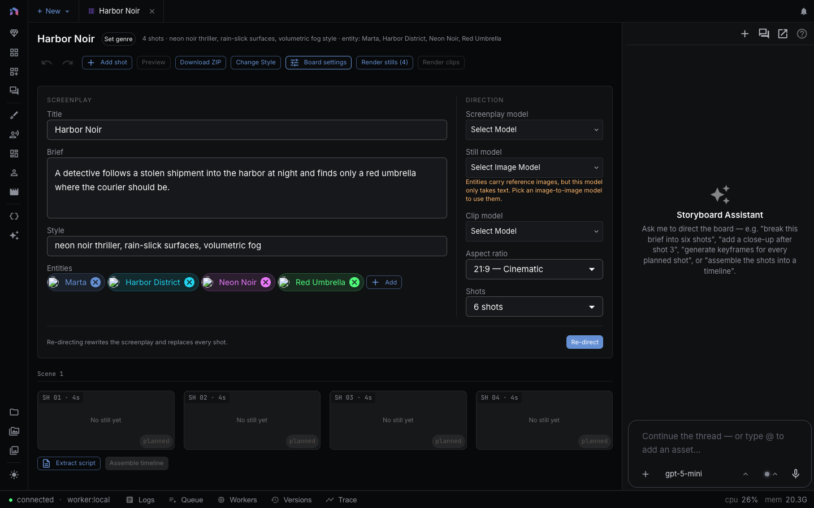

Plan a film as a board of shots. Each shot has a prompt, a camera setup, and the characters and locations it shows. Render a still, then a clip, compare takes, and send the shots you keep to a timeline.

> **Quick access:** Click the **+** button in the workspace tab bar, choose **New storyboard…**, then pick **Blank storyboard** or an example. You can also start from the **Storyboard** guided flow or ask the agent to create one.

---

## Overview

The Storyboard opens as a workspace tab. The board is on the left. The assistant panel opens beside it on request. A queue overlay appears over the board while renders run.

| Area | What it holds |
|---|---|
| Header | Board title, genre chip, shot summary, card size slider, **Slideshow**, and the board tools |
| Board settings | Screenplay fields, direction settings, and the **Direct** button |
| Banners | A stale-version notice and a **Retry N failed** button, shown only when they apply |
| Shot grid | Scene headers with shot cards under them |
| Footer | **Open script** or **Extract script**, and **Create timeline** |

The board is the working copy of a film. Stills, clips, and takes stay in your asset library, so closing the tab loses nothing.

---

## Create a storyboard

| Way in | Steps |
|---|---|
| New menu | **+** in the tab bar, then **New storyboard…**, then **Blank storyboard** |
| Examples | Same menu, then pick an example. Each one lists its shot count and says "stills included" |
| Command palette | **New storyboard** |
| Guided flow | Choose **Storyboard** on the new-project screen. The flow reviews the screenplay, entities, and look before it opens the board. See [Guided Flows](guided-flows.md) |
| Agent | Ask the [creative agent](creative-agent.md) or the board's assistant to create one |

A blank board is named "Untitled storyboard". The left panel also has a **New storyboard** button.

---

## Direct a screenplay

Open **Board settings** to write the brief. Press **Direct** and the screenplay model turns it into scenes and shots. A board with shots shows **Re-direct** instead, which asks for confirmation because it replaces every shot. Generated stills and clips stay in your asset library.

| Field | Use |
|---|---|
| Title | Shown on the board and the tab. Placeholder: "Untitled film" |
| Brief | The film in one or two sentences |
| Style | Palette, light, lens, texture |
| Entities | Characters, locations, styles, and props that apply to the whole board |
| Screenplay model | The language model that writes the screenplay |
| Aspect ratio | 16:9, 9:16, 1:1, 4:3, or 21:9 |
| Shots | How many shots **Direct** writes |

You can skip directing. **Add shot** in the header adds one shot at a time, and the **+** that appears between two cards inserts a shot after the first.

---

## The board

Shots sit under scene headers labeled **Scene 1**, **Scene 2**, and so on, with the scene's slugline beside the label. Each card shows the shot's still or clip, its caption, and a status pill.

| Status pill | Meaning |
|---|---|
| planned | No still or clip yet |
| still | A still exists |
| still · clip queued | A still exists and its clip is queued or running |
| rendering still / rendering clip | A render is running |
| covered | Another shot's generation already produced this shot's picture |
| failed | The last render failed |
| stale | Added to any of the above when the shot's inputs changed after the render |

- **Card size:** The **Size** slider sets the minimum card width. It is hidden on phones, where one column fills the width.
- **Reorder:** Drag a card onto another. Dropping across a scene header moves the shot to that scene.
- **Hover actions:** A card shows **Edit**, **Iterate**, a regenerate button, and an upload button for your own still. Double-click the media to view it fullscreen.
- **Shot actions menu:** **Render still…**, **Render clip…**, **Download**, **Send to workflow…**, **Duplicate shot**, **Delete shot**.
- **Undo and redo:** The undo buttons in the header cover board edits. The Undo tooltip reads "Undo (⌘Z)".
- **Genre:** The chip beside the title shows the genre. **Set genre** appears when none is set.

Select a card to open the shot inspector under the grid. It repeats **Edit**, **Iterate**, **Regenerate**, and **Delete**, and its **Appears in** row links to the timeline cut and the script lines that use the shot.

---

## Edit a shot

**Edit** opens the shot editor over the board. Form fields are on the left, the viewer and tools are on the right. **Previous shot** and **Next shot** step through the board. **Save** stays disabled until you change something, and closing with unsaved edits asks "Discard changes?".

| Field | Notes |
|---|---|
| Description | "What the shot shows" |
| Dialogue | "What is said in shot". Edit it in place, or jump to the linked script |
| In this shot | The entities that appear. Pick a character, location, style, or prop to keep it consistent. See [Entities](entities.md) |
| Size, Focal length, Perspective, Movement, Equipment | Camera setup, chosen from lists |
| ERT | Estimated running time in seconds. With a linked script, the chip reads **from takes** or **pinned**. Click it to switch between the two |
| Shot title | Optional, placeholder "Untitled shot" |
| Render mode | **Keyframe** (still first, then animate it), **Direct** (clip straight from the prompt), or **Reference** |
| Notes | Text the render should not read as direction |
| Composition mode, graphic direction | **None**, **Overlay**, **Graphics first**, or **Hybrid** for on-screen text and graphics |

Title, render mode, notes, and graphics sit under **Advanced**. **Prompts** shows the still prompt and clip prompt the render will send, so you can check them before you spend anything. The **Regenerate** button renders a new still. The **More shot actions** menu holds **Render clip** (or **Re-render clip**), **Move earlier in scene**, and **Move later in scene**. A clip in keyframe mode needs a still first.

---

## Render stills and clips

Render one shot or the whole board.

| Action | Where | What happens |
|---|---|---|
| **Render stills** | Header | Opens a dialog to pick the **Still model**, then renders every shot without a still |
| **Render clips** | Header | Opens a dialog with one model picker per kind of clip in the batch |
| **Render still…** / **Render clip…** | Shot actions menu | Same dialog for one shot |
| **Regenerate** | Card, inspector, editor | Re-renders the still with the model the shot used last |
| **Iterate** | Card, inspector | Asks for a note such as "make it darker, add rain" and re-renders the current clip with it |

The shot remembers the model you picked, so later renders skip the dialog choice. If an entity is attached and the chosen still model cannot take reference images, a warning appears under the model picker.

The header's render buttons show a price in the dialog and on the confirm button, for example "Render stills · ~$0.40". Text under the picker explains any request that could not be priced, and **Select a priced model to see the estimate.** appears when no priced model is selected. After you choose stills, the dialog also shows what rendering the clips for the same shots would add. For how provider charges work, see [Costs and Credits](costs-and-credits.md).

The queue overlay lists running renders with progress. You can expand or collapse it. **Stop tracking** hides local progress only, and the provider may still finish the request and charge for it.

---

## Takes

Every render adds a take. Nothing replaces your current still or clip until you choose.

1. Open the shot editor. The takes list has a **View takes** button that expands the stills and clips.
2. Pick a **Preview** chip to play a clip take without changing the current one.
3. Choose **Set as current clip**. For stills, click the still thumbnail to use it as the current still.
4. The current take is marked **Take N · Current**. Use the remove buttons to delete a take you do not want.

The current still is what **Regenerate** edits and what the timeline uses. If you have rendered a clip but not chosen a take, **Create timeline** asks you to set a clip take as current.

---

## Change a still

In the shot editor, the **Change still** tab beside **Takes** edits the current still. Each result is saved as a new take.

| Tab | What it does |
|---|---|
| **Edit** | Describe a change in **What to change**, for example "Make her scarf deep red". Choose an **Edit model** and press **Generate edit** |
| **Upscale** | Pick an **Upscale model** and a scale of 2× or 4× |
| **Reframe** | Pick a **New aspect ratio** and a **Reframe model**. Optionally describe what fills the new space |
| **Adjust** | **Brightness**, **Contrast**, and **Saturation** sliders, then **Save as new take**. **Reset** clears them. It runs in your browser and calls no provider |

To change only part of the image, press **Paint area** on the **Edit** tab. The **Paint the area to change** dialog has **Brush** and **Eraser** tools, a **Brush size** slider, and **Clear**. Press **Use this area** to keep the mask, and the toggle **Only the painted area changes** controls whether the mask applies. With cast on the shot, **Keep (names) on model** sends their reference images with the edit. Some models cannot paint over an area and some only can. The panel tells you which when the chosen model does not match.

---

## Style

Press the board actions button (**More board actions**) and choose **Change style…**. Pick an **Art style** and it applies to every shot. Rendered stills and clips are marked stale and nothing re-renders until you ask.

When versions are stale, a banner reads for example "Inputs changed (style). 3 stills and 1 clip are stale." with **Regenerate stale stills** and **Regenerate stale clips** buttons. A confirmation shows the estimated cost. Each shot renders a new take with the model it last used, and the current take stays selected until you choose the new one.

The same menu offers **Download ZIP** and **Send to workflow…**, which passes the board's stills and clips to a workflow.

---

## Retry failed shots

When a render fails, **Retry N failed** appears under the header. It retries the latest failed request for each shot and kind. The queue overlay has the same button.

---

## Slideshow and preview

- **Slideshow** opens a fullscreen player. It shows each shot's clip or still with its caption. Use the left and right arrow keys or **Previous shot** and **Next shot**. **Autoplay** advances for you, and **Edit shot** jumps to the editor. Unrendered shots read "Not rendered yet".
- **Preview** plays the board's shots in sequence inside the board. It is disabled until a shot has a still or clip.

---

## Link a script

Dialogue and narration can live in a [script](script-editor.md). Press **Extract script** under the grid to project the board's lines into a new script. The button then reads **Open script**. A linked board keeps shot timing tied to the voiced takes, and warnings appear if a script line is claimed twice or no longer exists. The shot inspector links to the script lines for each shot.

---

## Assemble a timeline

**Create timeline** builds a [timeline](video-editor.md) from the current stills and clips. It needs at least one shot with a still or a current clip, and skips shots without either. With a linked script, each shot runs as long as the takes it covers and each voiced line gets a voiceover clip.

Once a timeline exists, the button reads **Rebuild linked timeline…**. The confirmation says how many storyboard-owned clips it replaces, including trims you made on them. Tracks and clips you added yourself stay. You can also run **Assemble Timeline** from the command palette.

---

## Assistant

The **Assistant** button opens the Storyboard Assistant beside the board, and **Hide Assistant** or **Show Assistant** in the command palette toggles it. It sees the board and the selected shot. Try "break this brief into six shots", "add a close-up after shot 3", or "assemble the shots into a timeline". On phones, **Board** and **Assistant** are separate tabs.

The agent tools for storyboards are `list_storyboards`, `create_storyboard`, `get_storyboard`, `render_storyboard_stills`, `render_storyboard_clips`, `revise_storyboard_clip`, `assemble_storyboard_timeline`, `edit_storyboard`, `extract_script_from_storyboard`, and `delete_storyboard`.

---

## Related pages

- [AI Video Production](ai-video-production.md) covers the guided Storyboard flow and how takes fit into a full production.
- [Entities](entities.md) covers the characters, locations, and styles shots reuse.
- [Templates Gallery](templates-gallery.md) lists starting points.
