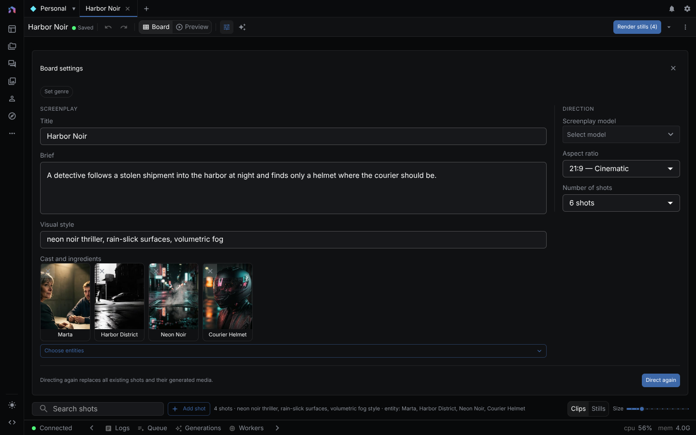
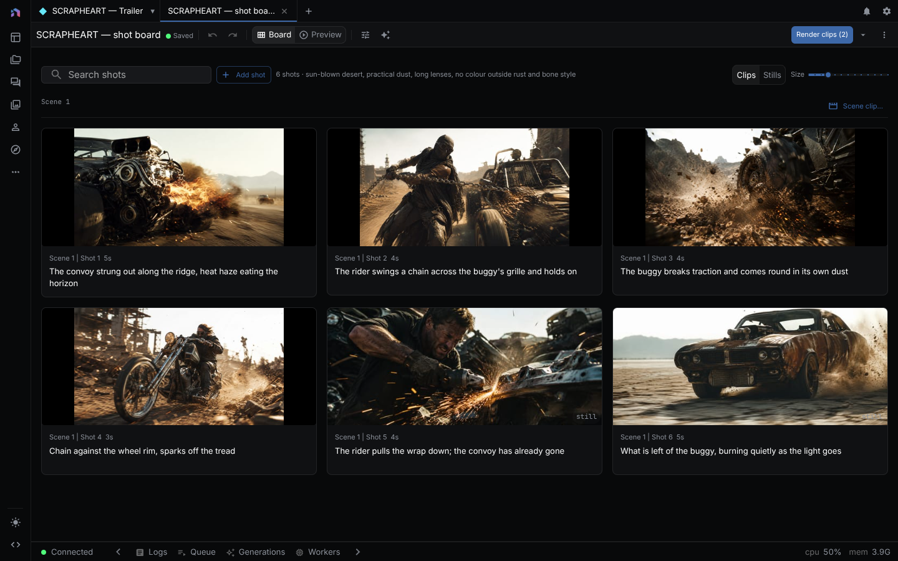

A storyboard is a board of shots. Each shot has a prompt, a camera setup, and the entities it shows, and holds a still, a clip, and their takes. Selected clips go to a timeline.

> **Runs:** locally or cloud, depending on the models you pick. **Needs:** a language model for **Direct**, an image model for stills, and a video model for clips. Hosted models need their provider key (see [Providers](providers.md)). **Costs:** stills, clips, still edits that call a model, and **Iterate** are billed by paid providers at provider rates. **Adjust**, reordering, and slideshow call no provider.
{: .callout-note}

## Overview



| Area | What it holds |
|---|---|
| Document bar | Board title, save state, Undo and Redo, **Board**, **Preview** and **Text**, the Board settings and Assistant toggles, **Render**, **Open timeline**, and the ⋮ menu |
| Board settings | Genre chip, screenplay fields, direction settings, and the **Direct** button |
| Banners | A stale-version notice and a **Retry N failed** button, shown only when they apply |
| Shot grid | Scene headers with shot cards under them |
| Shot row | Search, **Add shot**, the shot summary, the card media toggle, and the card size slider |

The ⋮ menu holds **Slideshow**, **One take**, **Open script** or **Extract script**, **Create timeline** or **Rebuild linked timeline**, **Change style**, **Download ZIP**, and **Send to workflow**.

---

## Create a storyboard

| Way in | Steps |
|---|---|
| New menu | **+** in the tab bar, then **New storyboard…**, then **Blank storyboard** |
| Examples | Same menu, then pick an example. Each one lists its shot count and says "stills included" |
| Command palette | **New storyboard** |
| Guided flow | Choose **Storyboard** on the new-project screen. The flow reviews the screenplay, entities, and look before it opens the board. See [Guided Flows](guided-flows.md) |
| Agent | Ask the [creative agent](creative-agent.md) or the board's assistant to create one |

A blank board is named "Untitled storyboard". The left panel also has a **New storyboard** button.

---

## Direct a screenplay

In **Board settings**, write the brief and press **Direct**. The screenplay model turns it into scenes and shots. A board with shots shows **Re-direct**, which asks for confirmation because it replaces every shot. Generated stills and clips stay in your asset library.

| Field | Use |
|---|---|
| Title | Placeholder: "Untitled film" |
| Brief | |
| Style | Palette, light, lens, texture |
| Entities | Apply to the whole board |
| Screenplay model | |
| Aspect ratio | 16:9, 9:16, 1:1, 4:3, or 21:9 |
| Shots | How many shots **Direct** writes |

To skip directing, use **Add shot** in the shot row, or the **+** between two cards to insert a shot after the first.

---

## The board

Shots sit under scene headers labeled **Scene 1**, **Scene 2**, and so on, with the scene heading (for example "INT. GREENHOUSE DOME - DAWN") beside the label. Each card shows the shot's still or clip, its caption, and a status pill.

| Status pill | Meaning |
|---|---|
| planned | No still or clip yet |
| still | A still exists |
| still · clip queued | A still exists and its clip is queued or running |
| rendering still / rendering clip | A render is running |
| covered | Another shot's generation already produced this shot's picture |
| failed | The last render failed |
| stale | Added to any of the above when the shot's inputs changed after the render |

- **Card size:** The **Size** slider sets the minimum card width. It is hidden on phones, where one column fills the width.
- **Reorder:** Drag a card onto another. Dropping across a scene header moves the shot to that scene.
- **Hover actions:** A card shows **Edit**, **Iterate**, a regenerate button, and an upload button for your own still. Double-click the media to view it fullscreen.
- **Shot actions menu:** **Render still…**, **Render clip…**, **Download**, **Send to workflow…**, **Duplicate shot**, **Delete shot**.
- **Genre:** The chip beside the title shows the genre. **Set genre** appears when none is set.

Select a card to open the shot inspector under the grid. It repeats **Edit**, **Iterate**, **Regenerate**, and **Delete**, and its **Appears in** row links to the timeline cut and the script lines that use the shot.

---

## Edit a shot

**Edit** opens the shot editor over the board. Form fields are on the left, the viewer and tools are on the right. **Previous shot** and **Next shot** step through the board. **Save** stays disabled until you change something, and closing with unsaved edits asks "Discard changes?".

| Field | Notes |
|---|---|
| Description | |
| Dialogue | Edit in place, or jump to the linked script |
| In this shot | The entities that appear. Pick a character, location, style, or prop to keep it consistent. See [Entities](entities.md) |
| Size, Focal length, Perspective, Equipment | Camera setup, chosen from lists |
| Movement | Free text, or camera presets from the picker. See [Camera movement presets](#camera-movement-presets) |
| Duration (seconds) | The length of the clip. With a linked script, the chip reads **From voice takes** or **Set by hand**. Click it to switch between the two. The shot card shows the duration next to the shot number |
| Shot title | Optional, placeholder "Untitled shot" |
| Render mode | **Keyframe** (still first, then animate it), **Direct** (clip straight from the prompt), or **Reference** |
| Notes | Not sent as direction to the render |
| Composition mode, graphic direction | **None**, **Overlay**, **Graphics first**, or **Hybrid** for on-screen text and graphics |

Type `@` in **Description**, **Motion**, or **End** to pick an entity from the library. Its name goes into the text and the entity joins **In this shot**, the same as picking it there. A picked entity also joins the board, and joins the shot at once, before you save the text.

Title, render mode, notes, and graphics sit under **Advanced**. **Prompts** shows the still prompt and clip prompt the render will send, so you can check them before you spend anything. When the shot has camera presets, the clip prompt shows the camera wording for the board's video model, and a note lists any preset that has no wording for that model. The **More shot actions** menu holds **Render clip** (or **Re-render clip**), **Move earlier in scene**, and **Move later in scene**. A clip in keyframe mode needs a still first.

### Look presets

Open **Change Style** and choose a **Board look**. In the shot editor, **Choose look** overrides that selection for one shot. An empty selection uses the board look. A look is added to the still prompt and the clip prompt when it supports that kind of render. Video-only speed ramps skip stills. The camera presets and the look on a shot share a limit of three presets. **Prompts** shows the wording each model will receive. Changing a look keeps existing takes and marks the affected renders out of date. See [Presets](presets.md).

### Camera movement presets

The **Movement** field takes typed words or opens a picker of camera presets: named moves such as a dolly zoom or a whip pan, rigs such as handheld or steadicam, and speed ramps. Pick up to three. A preset in each slot (move, rig, speed) can combine. The picker disables a card that conflicts with one already chosen and says which one.

- Picking presets also writes their names into **Movement**, so the screenplay camera pass and the CSV export still read one text string.
- Typing in the field replaces the movement with your words and detaches the presets. A render uses the presets in place of the text, so keeping both would ignore what you typed.
- A rig preset also replaces **Equipment** in the clip prompt. A move or speed preset leaves it alone.
- Older boards automatically match existing movement text to presets until you edit the field.
- A shot with only typed movement renders as it always did.

The same move is worded differently for each video model. See [Presets](presets.md).

---

## Render stills and clips



| Action | Where | What happens |
|---|---|---|
| **Render stills** | Document bar | Opens a dialog to pick the **Still model**, then renders every shot without a still |
| **Render clips** | Document bar | Opens a dialog with one model picker per kind of clip in the batch |
| **Render still…** / **Render clip…** | Shot actions menu | Same dialog for one shot |
| **Regenerate** | Card, inspector, editor | Re-renders the still with the model the shot used last |
| **Iterate** | Card, inspector | Asks for a note such as "make it darker, add rain" and re-renders the current clip with it |

If an entity is attached and the chosen still model cannot take reference images, a warning appears under the model picker.

The Render button shows the next batch, stills until every shot has one and then clips. Its arrow offers both. The dialog and confirm button show a price, for example "Render stills · ~$0.40". Text under the picker explains any request that could not be priced, and **Select a priced model to see the estimate.** appears when no priced model is selected. After you choose stills, the dialog also shows what rendering the clips for the same shots would add. See [Costs and Credits](costs-and-credits.md).

The bottom panel's **Generations** view lists every render with its status, next to generations from chat, other editors and workflow runs. Its tab shows how many are still running. Clicking a render opens its board on that shot, and **Stop generating** cancels it on the server. On a phone a queue overlay lists the renders instead. Its **Stop tracking** only hides the progress in your browser. The provider may still finish the request and charge for it.

---

## Takes

Every render adds a take. A new still becomes the current still, and the earlier stills stay as takes. A new clip does not replace your current clip until you choose.

1. Open the shot editor. The takes list has a **View takes** button that expands the stills and clips.
2. Pick a **Preview** chip to play a clip take without changing the current one.
3. Choose **Set as current clip**. For stills, click the still thumbnail to use it as the current still.
4. The current take is marked **Take N · Current**. Use the remove buttons to delete a take you do not want.

The current still is what **Regenerate** edits and what the timeline uses. If you have rendered a clip but not chosen a take, **Create timeline** asks you to set a clip take as current.

---

## Change a still

In the shot editor, the **Change still** tab beside **Takes** edits the current still. Each result is saved as a new take and becomes the current still.

| Tab | What it does |
|---|---|
| **Edit** | Describe a change in **What to change**, for example "Make her scarf deep red". Choose an **Edit model** and press **Generate edit** |
| **Upscale** | Pick an **Upscale model** and a scale of 2× or 4× |
| **Reframe** | Pick a **New aspect ratio** and a **Reframe model**. Optionally describe what fills the new space |
| **Adjust** | **Brightness**, **Contrast**, and **Saturation** sliders, then **Save as new take**. **Reset** clears them. It runs in your browser and calls no provider |

To change only part of the image, press **Paint area** on the **Edit** tab. The **Paint the area to change** dialog has **Brush** and **Eraser** tools, a **Brush size** slider, and **Clear**. Press **Use this area** to keep the mask, and the toggle **Only the painted area changes** controls whether the mask applies. With cast on the shot, **Keep (names) on model** sends their reference images with the edit. Some models cannot paint over an area and some only can. The panel tells you which when the chosen model does not match.

---

## Style

Press the board actions button (**More board actions**) and choose **Change style…**. Pick an **Art style** and it applies to every shot. Rendered stills and clips are marked stale (out of date) and nothing re-renders until you ask.

When versions are stale, a banner reads for example "Inputs changed (style). 3 stills and 1 clip are stale." with **Regenerate stale stills** and **Regenerate stale clips** buttons. A confirmation shows the estimated cost. Each shot renders a new take with the model it last used, and the current take stays selected until you choose the new one.

**Send to workflow…** passes the board's stills and clips to a workflow.

---

## Retry failed shots

When a render fails, **Retry N failed** appears under the document bar. It retries the latest failed request for each shot and kind. On a phone the queue overlay has the same button.

---

## Slideshow and preview

- **Slideshow** (in ⋮) opens a fullscreen player. It shows each shot's clip or still with its caption. Use the left and right arrow keys or **Previous shot** and **Next shot**. **Autoplay** advances for you, and **Edit shot** jumps to the editor. Unrendered shots read "Not rendered yet".
- **Preview** in the document bar plays the board's shots in sequence in place of the grid. **Board** returns to the grid. A board with no still or clip yet says so.

---

## Edit the board as text

**Text** in the document bar shows the whole board as Markdown in place of the grid. The text is the board: each change is read back into the same scenes and shots the grid shows, and autosave stores it.

```markdown
# Mars Greenhouse
A twenty second opening.

- **Style:** Warm practicals against cold Martian blue
- **Aspect ratio:** 2.39:1

# Act I (Setup)
Show how fragile the greenhouse is.

## INT. GREENHOUSE DOME - DAWN
- **Lighting:** Cold blue dawn through the panels

### First light
Nova kneels by a single green shoot under the dome.

- **Framing:** wide
- **Motion:** Slow push in
- **Duration:** 5s
```

| You write | It becomes |
|-----------|------------|
| The first `#` heading, and the text under it | The screenplay title and the board brief |
| `- **Style:**`, `Logline`, `Aspect ratio`, `Genre`, `Cast`, `Music`, `Narration` under the title | The board's fields |
| A later `#` heading, and the text under it | An act and its objective |
| `##` heading and `- **Lighting:**` | A scene, named by its scene heading. Shots below it belong to it |
| `###` heading and the text under it | A shot and its action. Shot numbers are computed |
| `Framing`, `Lens`, `Angle`, `Camera movement`, `Rig`, `Motion`, `End`, `Sound`, `Dialogue`, `Narration`, `Duration`, `Render`, `Notes` | The shot's fields |
| A mentioned entity in a shot, or `- **Cast:**` and `- **Location:**` | The shot's entities |
| An image under a shot heading | The selected still. A video file selects the clip |
| `- **Transition:**` | A transition to the next shot |
| `- **Continuity:** until Shot 7` | Intent that runs from this shot through shot 7 |

The editor adds hidden identifiers to headings and links so each shot keeps its takes. The raw syntax is in [Creative Agent Tools](developer/creative-agent-tools.md#storyboard-editor).

Type `@` to mention an entity or an image from the library. The identifiers show only on the line that holds the caret. A new heading gets one when you type it.

A still line shows the image under it. Beside the text, **Outline** lists the acts, scenes and shots, marks the one the caret is in, and lists the lines that need attention. Click an entry to jump to its line. The outline needs a window at least as wide as a laptop screen.

### Ask the agent about a passage

Select text and a prompt opens under it. Type what to do with the passage, or use the microphone to dictate it, and press Enter. The quick actions are **Tighten**, **More visual**, **Suggest camera** and **Check continuity** for a passage, and **Summarize** and **Find inconsistencies** for a selection across several shots.

The agent receives the whole board as Markdown, the entity library with each descriptor, and the selection marked inside its lines. It answers with a proposed replacement or a note. **Replace selection** puts the replacement in the text as one undo step. Type again in the prompt to refine the answer.

The board's director model answers. Before one is picked, the chat model answers. With neither, the prompt says to pick one. The call is billed by the provider at its rates.

- A selection across several shots gets a note, never a replacement.
- If the passage changes while the agent works, **Replace selection** refuses and asks you to select it again.
- A failed call shows the provider's error with **Report**.

The identifiers keep a shot's takes, render history, status and models with it. Deleting a still line clears the selection and keeps the takes. Moving a shot's lines moves the shot. If you delete a heading's identifier, the shot is treated as a new shot and its takes stay with the old one.

Field labels are English in every language. A line that does not fit gets a red mark in the margin and a tooltip:

- A label the grammar does not know is saved in the shot's notes. On the board, an act or a scene it is not saved.
- Plain text under a scene heading is not saved. A scene holds a scene heading and lighting only.
- A duration that is not a number, or a transition on the last shot, is ignored.

When the board changes elsewhere while the text is open, for example a render finishes or **Undo** in the document bar runs, the text is written again from the board, in the standard layout. Extra blank lines and alias labels such as `Movement:` for `Motion:` are not kept.

---

## Link a script

Dialogue and narration can live in a [script](script-editor.md). Press **Extract script** under the grid to copy the board's dialogue and narration into a new script. The button then reads **Open script**. A linked board keeps shot timing tied to the voiced takes, and warnings appear if a script line is claimed twice or no longer exists. The shot inspector links to the script lines for each shot.

---

## Assemble a timeline

**Create timeline** builds a [timeline](video-editor.md) from the current stills and clips. It needs at least one shot with a still or a current clip, and skips shots without either. With a linked script, each shot runs as long as the takes it covers and each voiced line gets a voiceover clip.

Once a timeline exists, the button reads **Rebuild linked timeline…**. The confirmation says how many storyboard-owned clips it replaces, including trims you made on them. Tracks and clips you added yourself stay. You can also run **Assemble Timeline** from the command palette.

---

## Assistant

The **Assistant** button opens the Storyboard Assistant beside the board, and **Hide Assistant** or **Show Assistant** in the command palette toggles it. It sees the board and the selected shot. Example requests: "add a close-up after shot 3", "assemble the shots into a timeline". On phones, **Board** and **Assistant** are separate tabs.

## Ask the assistant

- "Break this brief into six shots and render stills."
- "Add a close-up after shot 3."
- "Re-render shot 2's clip with a slower push in."
- "Assemble the shots into a timeline."

Builders driving this from code or MCP: see [Creative Agent Tools](developer/creative-agent-tools.md#storyboards).

---

## Related pages

- [AI Video Production](ai-video-production.md) covers the guided Storyboard flow and how takes fit into a full production.
- [Entities](entities.md) covers the characters, locations, and styles shots reuse.
- [Templates Gallery](templates-gallery.md) lists starting points.
