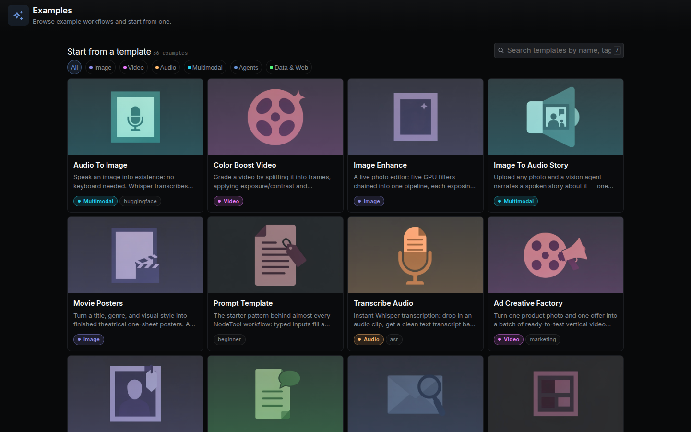

The **Examples** page is a library of shipped example workflows, apps, storyboards, timelines, and games that you can copy into your own project. Open it from the **Examples** item in the **More** panel, or from **Browse examples** on the new-project surface. It opens as a workspace tab, not as a URL route.

---

## Tabs

| Tab | What a card does |
|-----|------------------|
| **Apps** | **Add to your apps** installs the app and the workflows it runs |
| **Workflows** | Click a card to copy the workflow into your project |
| **Storyboards** | Adds an editable copy of the board |
| **Timelines** | **Open editable timeline** adds a copy |
| **Games** | **Play and edit** adds a copy |

The rest of this page covers the **Workflows** tab, which is the template gallery.

---

## Opening a Template

Click a template card. NodeTool creates a private copy named after the template, tagged `example`, in your current project, and opens it in a workspace tab. The original is never modified, so you can edit and save the copy freely.

Templates ship with NodeTool and are loaded from the `workflows.examples` tRPC query. They are grouped by tag into the categories below.

| Category | Tags that match |
|----------|-----------------|
| **Image** | `image`, `design` |
| **Video** | `video`, `youtube` |
| **Audio** | `audio` |
| **Multimodal** | `multimodal` |
| **Agents** | `agent`, `agents`, `ai`, `claude`, `huggingface` |
| **Data & Web** | `data`, `web`, `search`, `serp`, `google`, `news`, `reddit`, `amazon`, `trends`, `analysis`, `research`, `rag` |

Browse walkthroughs of individual templates on the [Workflow Examples]({{ '/workflows/' | relative_url }}) page.

---

## Filtering and Searching

- **Category pills** filter the list. **All** shows everything.
- **Search** matches the template name, description, and tags. Press `/` to focus the search box.
- Templates tagged `getting-started` or `start` sort first in the unfiltered list. Everything else sorts by name.

If nothing matches, the page offers **Clear search** or **Show all templates**.

---

## Anatomy of a Template Card

Each card shows:

- **Thumbnail**, or a category-colored placeholder when the template has none.
- **Title and description**.
- **Inputs**, each marked required, optional, or requirement unknown.
- **Provider/model**, the models the graph selects, or the providers it uses.
- **Execution**, whether it runs locally, on provider-hosted models, or both.
- **Required setup** and **Runtime**, when the graph needs them.
- **Estimated cost**, computed from published node prices. A graph with unpriced nodes shows "at least" or "unknown" with the count of unpriced nodes.
- **Category** label.

Model fields in shipped templates are empty. When you open one, NodeTool fills each from your own default model for that type. If a model is missing, the **Recommended Models** dialog offers to install it.

---

## Adding Your Own Template

Shipped templates are JSON files in `packages/base-nodes/nodetool/examples/nodetool-base/`. Their listing metadata (name, description, tags) lives in `packages/base-nodes/nodetool/package_metadata/nodetool-base.json`. A new template needs:

1. A graph that does real work and is not a re-skin of an existing example.
2. Empty model fields, a description under 80 characters, and a thumbnail at `packages/base-nodes/nodetool/assets/nodetool-base/<name>.jpg`.
3. A passing `npm run dev:nodetool -- validate "<file>.json"`.

The full checklist, including thumbnail generation and the marketing catalog step, is in `packages/base-nodes/nodetool/examples/nodetool-base/README_EXAMPLES.md`. To turn a saved workflow into code, use `nodetool workflows export-dsl <id>`.

---

## Related Docs

- [Workflow Examples]({{ '/workflows/' | relative_url }}) — in-depth walkthroughs of individual templates
- [Cookbook]({{ '/cookbook' | relative_url }}) — reusable workflow patterns
- [Getting Started]({{ '/getting-started' | relative_url }}) — runs a template as your first workflow
