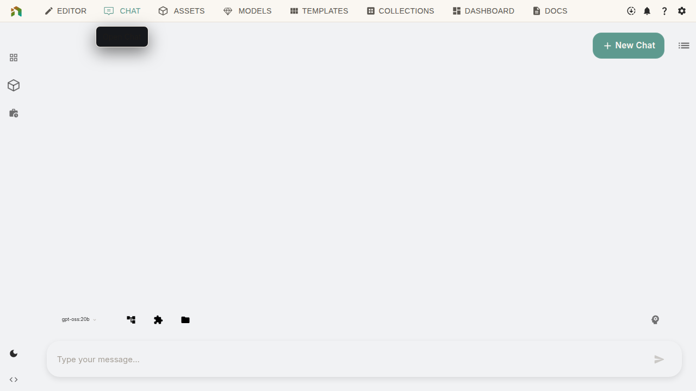

This guide introduces the NodeTool interface. Covers both desktop app and web version.

> **New to NodeTool?** Start with the [Getting Started guide](getting-started.md).

---

## At a Glance

NodeTool has five workspaces:

| Workspace | Purpose | Use Case |
|-----------|---------|----------|
| **Dashboard** | Home screen | Starting projects, finding templates |
| **Workflow Canvas** | Building workflows | Creating and designing workflows |
| **Global Chat** | Conversational AI | Quick iterations, chatting with AI |
| **Mini-Apps** | Simplified interfaces | Sharing workflows with others |
| **Assets** | Media library | Managing files |

---

## The App Header

The header bar is your creative command center (always visible at the top):

- **Logo/Title** – Click to return to Dashboard
- **Models** – Manage your AI models (Flux, Qwen Image, etc.)
- **Assets** – Access your media library
- **Templates** – Browse creative workflow templates
- **Chat** – Open conversational AI mode
- **Settings** – Configure API keys, preferences, account
- **Download indicator** – Shows model/asset download progress

---

## Dashboard

The Dashboard is the home screen.

### Contents

- **Your Workflows** – Saved projects
- **Templates** – Ready-to-use workflows
- **Recent Chats** – Past conversations
- **Getting Started Panel** – Interactive onboarding guide for new users with step-by-step instructions

### Common Actions

| Task | How to Do It |
|------|--------------|
| Start a new creation | Click "New Workflow" button |
| Open a saved workflow | Click any workflow card |
| Try a template | Browse Templates, click to open |
| Continue a chat | Click a recent chat thread |

---

## Workflow Canvas

Build workflows visually by connecting nodes.

### The Canvas

The center area is an **infinite canvas** for arranging workflows.

**Navigation:**
- **Pan**: Hold `Space` and drag, or right-click drag
- **Zoom**: `Ctrl/⌘` + scroll wheel
- **Fit all**: Press `F`

### Adding Nodes

To add a node:

1. Press `Space` anywhere on canvas, **OR**
2. Double-click an empty area

This opens the **Node Library**:
- **Search** by typing (e.g., "generate image", "transform video")
- **Browse** categories on the left (Image, Video, Audio, Text)
- **Click** a node to add it

### Connecting Nodes

Connections show data flow between nodes:

1. Find the **circles** on nodes (outputs on right, inputs on left)
2. **Click and drag** from an output circle
3. **Release** on an input circle of another node

> **Tip**: Drop a connection on empty space to see compatible nodes.

### Properties Panel

When you select a node, the right panel shows its **configuration**:

- **Inputs** – What the node needs
- **Settings** – Configuration options
- **Output** – What the node produces

---

## Global Chat

AI assistant built into NodeTool.

### Features

- **Chat** with AI models
- **Run workflows** from conversation
- **Agent Mode** for autonomous task execution
- **File sharing** – images, audio, documents

### Chat Features

| Feature | Description |
|---------|-------------|
| **Threads** | Multiple conversations, each with its own history |
| **Model Selector** | Choose which AI model to chat with |
| **Workflow Menu** | Attach and run your saved workflows |
| **Agent Mode** | Let the AI use tools and modify your canvas |

### Standalone Chat Window

Access chat directly from the system tray for quick conversations:

- **Quick Access**: Click the tray icon → **Chat** to open a dedicated chat window
- **Focused Interface**: Chat without the full NodeTool interface
- **Background Access**: Start conversations while other apps are open
- **Thread Persistence**: All threads sync with the main application

---

## Mini-Apps

Convert workflows into simple apps.

### Purpose

- **Hide complexity** – Users see only inputs and outputs
- **Share easily** – No NodeTool knowledge required
- **Focused interface** – Just what users need

### How It Works

1. Build your workflow in the Editor
2. Click **Mini-App** in the top-right
3. See a clean interface with just:
   - Input fields (from your Input nodes)
   - Run button
   - Output results

### Standalone Mini-App Windows

Launch mini-apps in dedicated windows from the system tray:

- **Quick Launch**: Right-click the tray icon to see available mini-apps
- **Independent Windows**: Run mini-apps without opening the main editor
- **Background Execution**: Keep mini-apps running while working on other tasks

---

## Assets

The Asset Explorer manages all your files.

### Supported Files

- **Images**: PNG, JPG, GIF, WebP
- **Audio**: MP3, WAV, M4A
- **Video**: MP4, MOV, WebM
- **Documents**: PDF, TXT, Markdown

### Working with Assets

| Action | How |
|--------|-----|
| Upload files | Drag & drop into Assets panel |
| Use in workflow | Drag asset onto the canvas |
| Preview | Click any asset to preview |
| Organize | Create folders, rename files |

### Audio Player

The built-in audio player features waveform visualization:

- **Visual Waveforms**: See the audio shape with WaveSurfer.js integration
- **Playback Controls**: Play, pause, and seek through audio files
- **Preview in Workflows**: Audio results display with interactive waveforms

---

## Models Manager

Download, organize, and configure AI models.

### Finding Models

- **Search** by name or task type
- **Filter** by provider (local, OpenAI, etc.)
- **Sort** by size or popularity

### Managing Downloads

- **One-click install** for any supported model
- **Progress tracking** in the header
- **Space usage** shown per model
- **Easy uninstall** to free space

---

## Panels and Layout

NodeTool's interface is flexible – customize it to your workflow.

### Rearranging Panels

- **Move**: Drag a panel tab to a new location
- **Split**: Drag a tab to the edge of another panel
- **Resize**: Drag the borders between panels
- **Close**: Click the X on any tab
- **Restore**: Use View menu to add closed panels back

### Saving Layouts

Your layout is saved automatically. To reset:
- **View → Reset Layout** restores defaults

---

## Command Menu

Press `Alt+K` (Windows/Linux) or `⌘+K` (Mac) to open the **Command Menu**.

This is the fastest way to:
- Open any workflow
- Switch between sections
- Search for anything
- Access settings

Just start typing what you want!

---

## Keyboard Shortcuts

### Essentials

| Shortcut | Action |
|----------|--------|
| `Space` | Open node menu |
| `Ctrl/⌘ + Enter` | Run workflow |
| `Ctrl/⌘ + S` | Save |
| `Ctrl/⌘ + Z` | Undo |
| `F` | Fit view |
| `Esc` | Stop workflow |

### All Shortcuts

#### Global

| Shortcut | Action |
|----------|--------|
| `Alt+K` / `⌘+K` | Command Menu |
| `Ctrl/⌘+N` | New workflow |
| `Ctrl/⌘+O` | Open workflow |
| `Ctrl/⌘+S` | Save |
| `Ctrl/⌘+Z` | Undo |
| `Ctrl/⌘+Shift+Z` | Redo |
| `Ctrl/⌘+1…9` | Switch tabs |

#### Editor

| Shortcut | Action |
|----------|--------|
| `Space + Drag` | Pan |
| `Ctrl/⌘ + Scroll` | Zoom |
| `F` | Fit to screen |
| `Ctrl/⌘+Enter` | Run workflow |
| `Esc` | Stop workflow |
| `Ctrl/⌘+D` | Duplicate |
| `Ctrl/⌘+G` | Group |
| `A` | Align nodes |
| `Delete` / `Backspace` | Delete selection |

#### Chat

| Shortcut | Action |
|----------|--------|
| `Enter` | Send message |
| `Shift+Enter` | New line |
| `Esc` | Stop generation |

---

## Next Steps

- **[Workflow Editor deep dive](workflow-editor.md)** – Master the canvas
- **[Tips & Tricks](tips-and-tricks.md)** – Power user secrets
- **[Cookbook](cookbook.md)** – Learn workflow patterns
