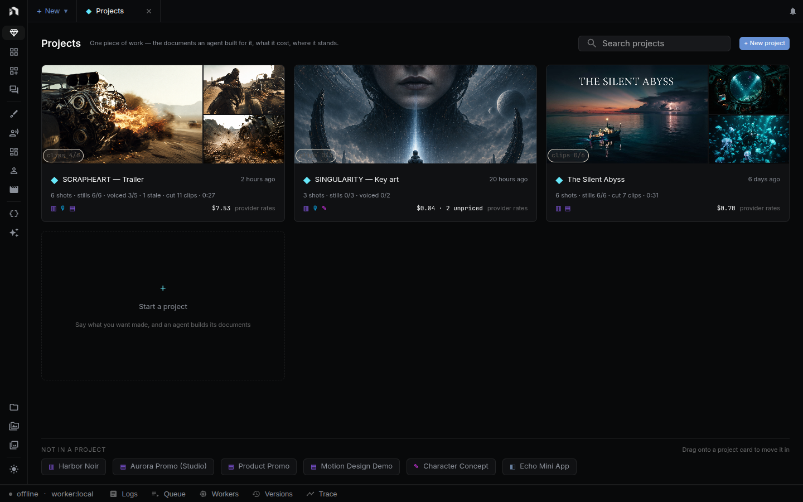
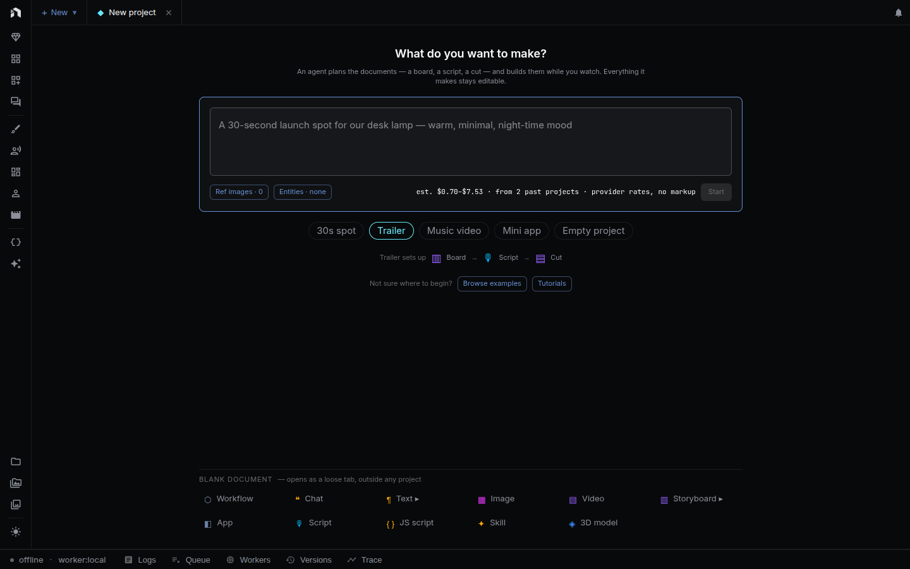
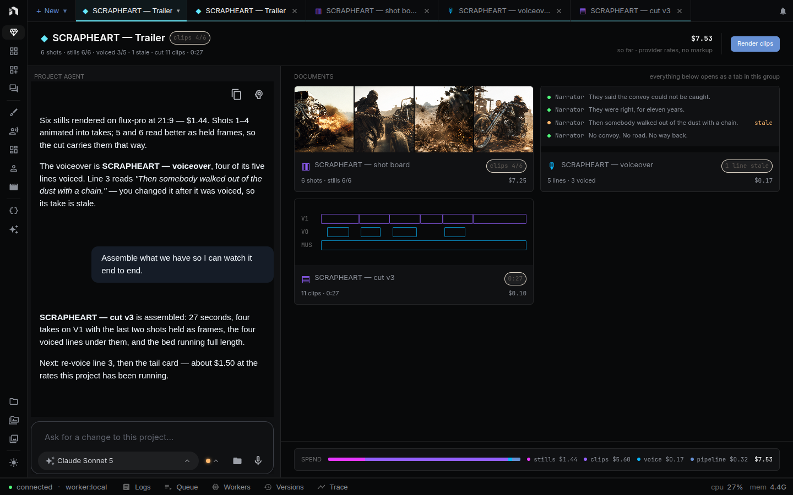
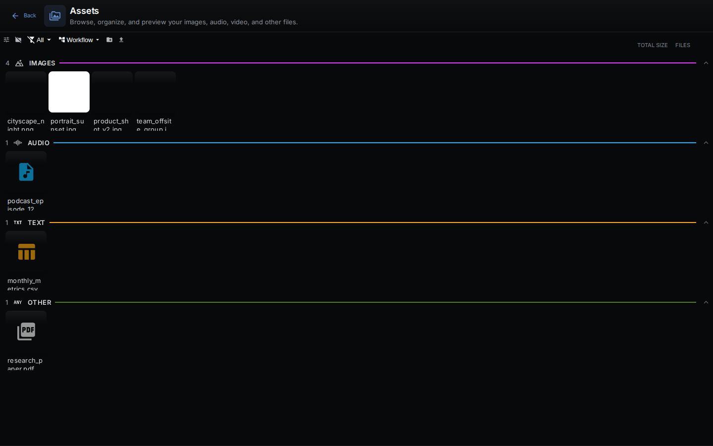
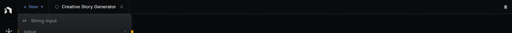
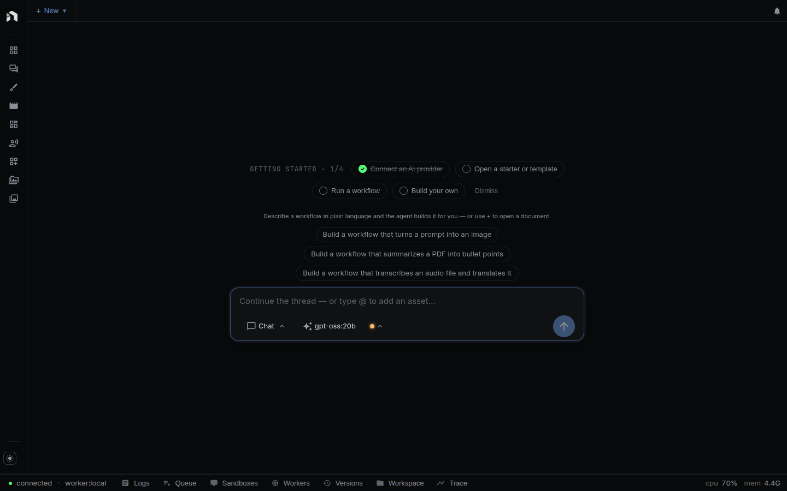
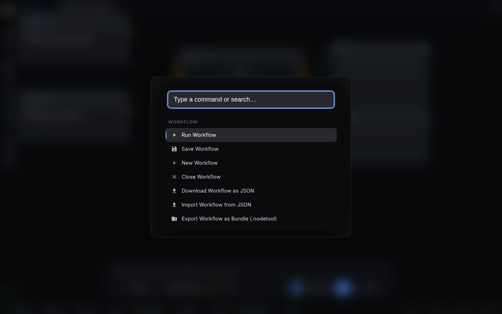

A tour of the interface. Same views on desktop and in the browser.

> New here? Start with [Getting Started](getting-started.md), then come back.

---

## Where everything lives

| View | What it is | Docs |
|---|---|---|
| **Workspace** `/workspace` | Where the app opens: your tabs, or the new-project surface when you have none | [Getting Started](getting-started.md) |
| **Projects** — Projects panel | Documents grouped by the job they belong to, with their own agent | [Projects](#projects) |
| **Workflow Editor** — workspace tab | The node canvas, with panels on every edge | [Workflow Editor](workflow-editor.md) · [Panels](editor-panels.md) |
| **Chain Editor** `/chain/:workflowId?` | Linear card pipeline instead of a graph | [Chain Editor](chain-editor.md) |
| **Chat** — Chats panel | Threads open as workspace tabs; the agent edits what you have open | [Chat](global-chat.md) |
| **Mini-Apps** — Apps panel | A form over one or more workflows | [Mini Apps](mini-apps.md) |
| **Assets** `/assets` | Every file your workflows touch | [Assets](asset-management.md) · [Sketch Editor](sketch-editor.md) |
| **Video Editor** `/timeline/:sequenceId` | Multi-track timeline; clips can be live workflow outputs | [Video Editor](video-editor.md) |
| **Collections** `/collections` | Indexed documents for RAG | [Collections](collections.md) · [Indexing](indexing.md) |
| **Examples** `/examples` | Ready-to-run workflows by tag | [Templates Gallery](templates-gallery.md) |
| **Models** `/models` | Find, install, and manage local and cloud models | [Models Manager](models-manager.md) |
| **Settings** — workspace tab | API keys, folders, secrets, remote | [Configuration](configuration.md) · [Providers](models-and-providers.md) |

The logo at the top of the left rail opens the app menu: **Tutorials**,
**Examples**, **Costs**, **Model Manager**, **Assets**, **Collections**,
**Workspaces**, **Settings**, **Help**, and **Downloads**. Everything but Help
and Downloads opens as a workspace tab.

Two extras: [Mobile](mobile-app.md) gives you a touch-optimized Chat,
Mini-Apps, and Graph Editor, and the [desktop app](electron-views.md) adds an
install wizard, a system tray, and frameless mini-app windows.

---

## Projects

A project is a name over the documents that belong to one job — a board, a
script, a cut, the key art — plus the conversation that built them. Open one
and its documents come back as a tab group.

The list is every project as a card: what it has rendered, when it last
changed, and what it has cost at provider rates. Underneath sit the documents
in no project; drag one onto a card to file it there.

**New project** asks what you want made. Pick a shape — 30s spot, trailer,
music video, mini app — and the agent plans the documents that shape needs and
builds them. Reference images and library entities go in with the prompt. The
estimate is read off what your own past projects of that shape cost, so it
appears once you have two of them to read.

The overview is the project's agent on the left and what it has made on the
right. Every card opens its document as a tab in the group; the button in the
header opens whichever one the project is waiting on. The bar along the bottom
splits the spend into stills, clips, voice, and pipeline.

---

## Workflow Canvas

An infinite canvas. Pan with `Space`+drag or right-click drag, zoom with
`Ctrl/⌘`+scroll, and press `F` when you have lost the graph off-screen.

**Add a node**: press `Space` or double-click empty canvas. The node library
opens — type what you want ("generate image"), or browse Image / Video / Audio /
Text on the left.

**Connect two nodes**: drag from an output circle on the right of one node to an
input circle on the left of another.

> **Tip**: drop a connection on empty space and NodeTool offers only the nodes
> that accept that type.

Select a node and the right panel shows its inputs, settings, and output.

---

## Chat

The agent, one panel over from whatever you have open. Describe a workflow and
it builds one; ask for a change and it edits the open document — graph, sketch,
timeline, storyboard, script, or mini app. It also runs workflows, takes image
and audio and document attachments, and keeps each thread's history separate.

On desktop, the tray icon opens a standalone chat window. Threads sync with the
main app.

---

## Mini-Apps

A form or dashboard over your workflows, with the graph hidden — the version you
hand to someone who has never heard of NodeTool.

1. Build the workflows in the editor.
2. In the **Apps** panel, click **New app**, or **New app from workflow** to
   scaffold one from a graph.
3. Lay out input widgets, a run button, and display widgets in the app's tab.
4. Flip the tab to **Run**, then publish.

The workflows stay separate resources; **Linked workflows** on the app tab opens
one in its own tab. On desktop, right-click the tray icon to launch any app in
its own window.

---

## Assets

Images (PNG, JPG, GIF, WebP), audio (MP3, WAV, M4A), video (MP4, MOV, WebM), and
documents (PDF, TXT, Markdown).

Drag files into the panel to upload, drag one onto the canvas to use it, click to
preview. Audio previews render a WaveSurfer waveform you can scrub, in the
explorer and in node results.

---

## Panels and layout

Open documents share one tab bar: workflows, sketches, timelines, storyboards,
apps. Drag a panel tab elsewhere to move it, drag it to another panel's edge to
split, drag a border to resize. Layout saves itself; **View → Reset Layout**
puts it back.

With nothing open, the workspace is a chat composer and a few sample prompts.

---

## Command Menu

`Ctrl+K` / `⌘+K`, then start typing. Opens workflows, jumps between sections,
reaches settings — the fastest route to anywhere.

---

## Keyboard Shortcuts

The six worth memorizing:

| Shortcut | Action |
|----------|--------|
| `Space` | Open node menu |
| `Ctrl/⌘ + Enter` | Run workflow |
| `Ctrl/⌘ + S` | Save |
| `Ctrl/⌘ + Z` | Undo |
| `F` | Fit view |
| `Esc` | Stop workflow |

### Global

| Shortcut | Action |
|----------|--------|
| `Ctrl/⌘+K` | Command Menu |
| `Ctrl/⌘+N` | New workflow |
| `Ctrl/⌘+O` | Open workflow |
| `Ctrl/⌘+Shift+Z` | Redo |
| `Ctrl/⌘+1…9` | Switch tabs |

### Editor

| Shortcut | Action |
|----------|--------|
| `Space + Drag` | Pan |
| `Ctrl/⌘ + Scroll` | Zoom |
| `Ctrl/⌘+D` | Duplicate |
| `Ctrl/⌘+G` | Group |
| `A` | Align nodes |
| `Delete` / `Backspace` | Delete selection |

### Chat

| Shortcut | Action |
|----------|--------|
| `Enter` | Send message |
| `Shift+Enter` | New line |
| `Esc` | Stop generation |

---

## Next Steps

- **[Workflow Editor](workflow-editor.md)** – The canvas in depth
- **[Editor Panels](editor-panels.md)** – Left, right, bottom, and floating panels
- **[Tips & Tricks](tips-and-tricks.md)** – Shortcuts the docs bury
- **[Cookbook](cookbook.md)** – Workflow patterns
