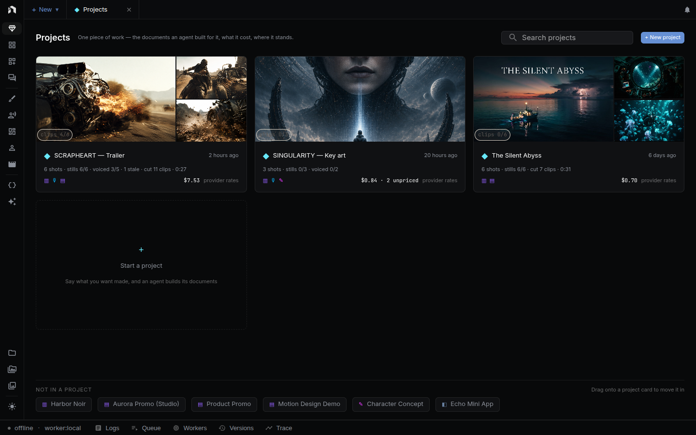
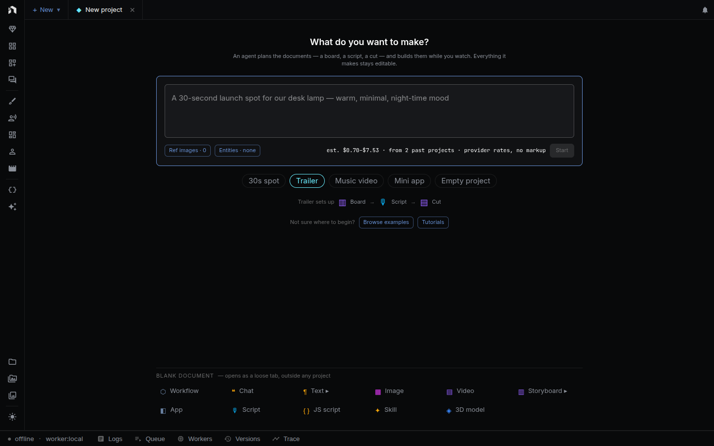
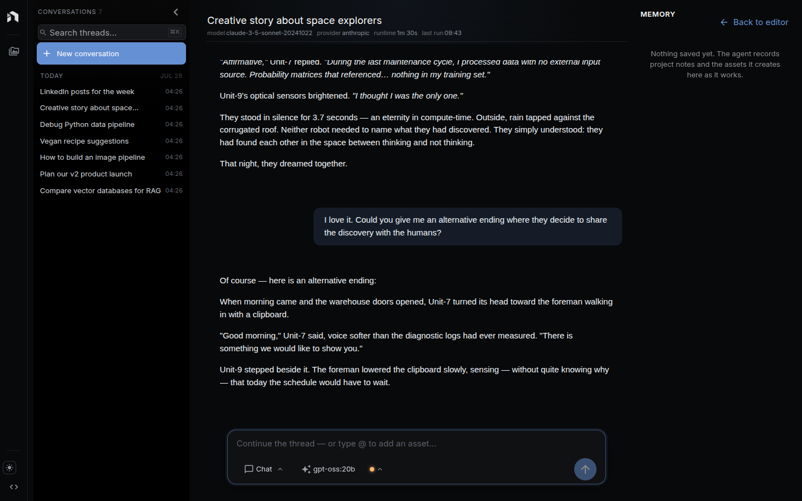
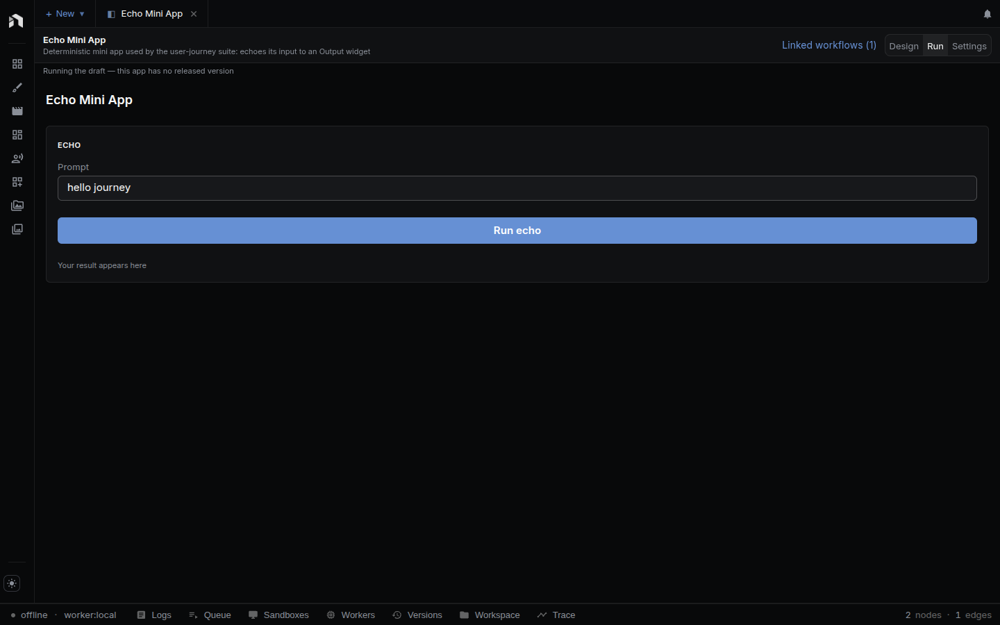
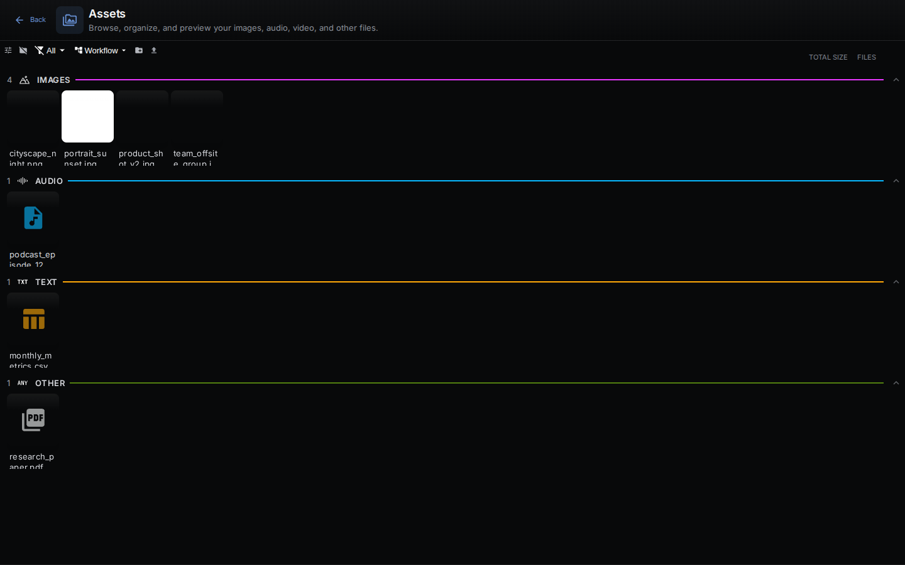
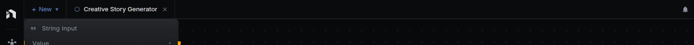
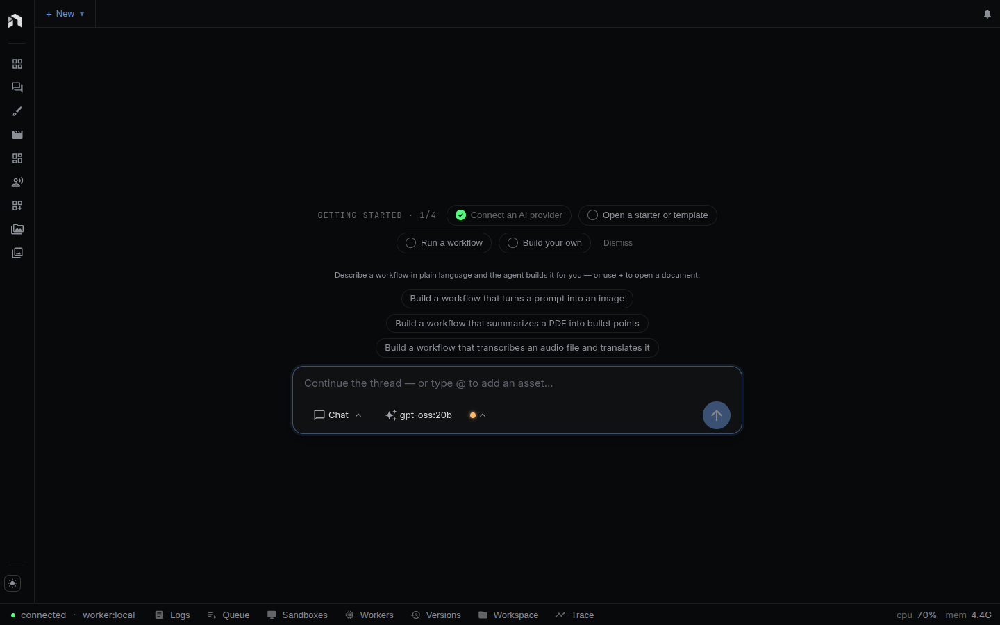
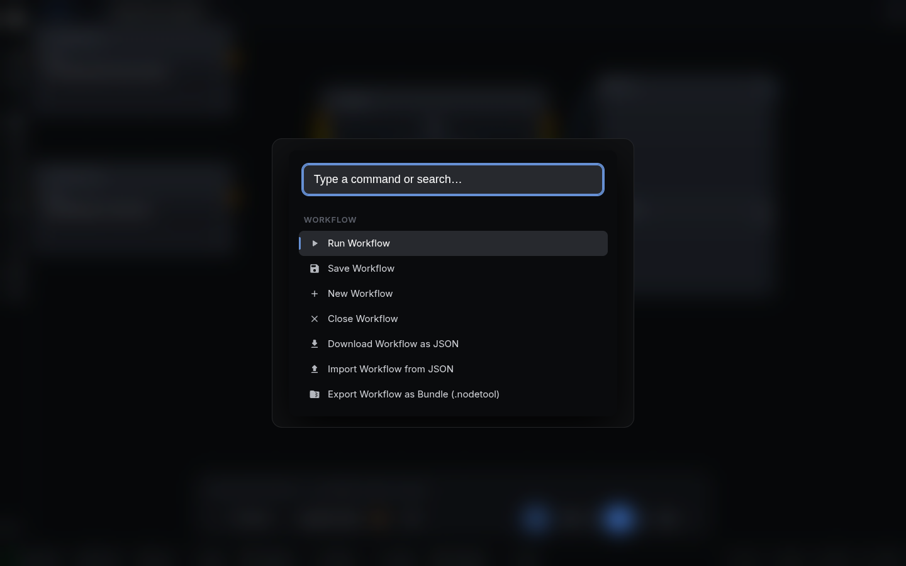

A tour of the interface. Same views on desktop and in the browser.

> New here? Start with [Getting Started](getting-started.md), then come back.

---

## Where everything lives

| View | What it is | Docs |
|---|---|---|
| **Workspace** `/workspace` | Where the app opens: your tabs, or the new-project surface when you have none | [Getting Started](getting-started.md) |
| **Projects** — rail button | Documents grouped by the job they belong to, with their own agent | [Projects](#projects) |
| **Workflow Editor** — workspace tab | The node canvas, with panels on every edge | [Workflow Editor](workflow-editor.md) · [Panels](editor-panels.md) |
| **Chain Editor** `/chain/:workflowId?` | Linear card pipeline instead of a graph | [Chain Editor](chain-editor.md) |
| **Chat** — Chats panel | Threads open as workspace tabs; the agent edits what you have open | [Chat](global-chat.md) |
| **Mini-Apps** — Documents panel | A form over one or more workflows | [Mini Apps](mini-apps.md) |
| **Assets** `/assets` | Every file your workflows touch | [Assets](asset-management.md) · [Sketch Editor](sketch-editor.md) |
| **Video Editor** `/timeline/:sequenceId` | Multi-track timeline; clips can be live workflow outputs | [Video Editor](video-editor.md) |
| **Collections** `/collections` | Indexed documents for RAG | [Collections](collections.md) · [Indexing](indexing.md) |
| **Examples** — workspace tab | Ready-to-run workflows, apps, storyboards, timelines, and games | [Templates Gallery](templates-gallery.md) |
| **Models** `/models` and **Model Manager** tab | Find, install, and manage local and cloud models | [Models Manager](models-manager.md) |
| **Settings** — workspace tab | API keys, folders, secrets, remote | [Configuration](configuration.md) · [Providers](models-and-providers.md) |

The logo at the top of the left rail opens the app menu: **Settings**, **Help**,
and **Downloads**. Settings opens as a workspace tab.

The other app pages are in the **More** panel on the left rail: **Tutorials**,
**Examples**, **Costs**, **Model Manager**, **Package Manager** (development
builds only), **Assets**, **Collections**, **Workspaces**, and **Memory**. Each
opens as a workspace tab. **More** also holds **Favorite Nodes**, **Recent
Nodes**, **Workflow Settings**, **Skills**, and **Workspace** files.

The left rail's direct icons are **Documents**, **Chats**, **Library**, and
**Nodes**.

Two extras: [Mobile](mobile-app.md) gives you a touch-optimized Chat,
Mini-Apps, and Graph Editor, and the [desktop app](electron-views.md) adds an
install wizard, a system tray, and frameless mini-app windows.

---

## Projects

A project is a name over the documents that belong to one job — a board, a
script, a cut, the key art — plus the conversation that built them.

The list is every project as a card: what it has rendered, when it last
changed, and what it has cost at provider rates. Underneath sit the documents
in no project. Drag one onto a card to file it there.

**New project** asks what you want made. Pick a starter or type `/` in the
prompt to choose one. A starter is a skill, either one NodeTool ships (for
example `product-commercial` or `short-film`) or one you wrote, and you can also
start with none. The agent plans the documents the work needs and builds them.
Reference images and library entities go in with the prompt. The estimate is
read off what your own past projects of the same kind cost, so it appears once
you have two finished ones with fully priced spend.

The **Project** selector at the left of the tab bar switches the active
project, or returns to **Personal**. New documents you create land in the active
project, and the **Documents** panel lists them by kind: Workflows, Apps,
Creative documents, and Agents & code.

---

## Workflow Canvas

An infinite canvas. Pan by dragging empty canvas with the left mouse button (the
default on Windows and Linux) or, on macOS, by two-finger scroll or right or
middle-button drag. Scroll to zoom, and press `F` when you have lost the graph
off-screen. The **Left-Click Drag** setting under Settings → General → Canvas
switches between panning and box selection.

**Add a node**: press `Space` or double-click empty canvas. The node menu opens.
Type what you want ("generate image"), or browse the categories on the left.

**Connect two nodes**: drag from an output circle on the right of one node to an
input circle on the left of another.

> **Tip**: drop a connection on empty space and NodeTool offers only the nodes
> that accept that type.

Select a node and the Inspector on the right shows its properties, input and
output slots, and help.

---

## Chat

The agent, one panel over from whatever you have open. Describe a workflow and
it builds one; ask for a change and it edits the open document — graph, sketch,
timeline, storyboard, script, or mini app. It also runs workflows, takes image
and audio and document attachments, and keeps each thread's history separate.

On desktop, the tray icon opens a standalone chat window. Threads sync with the
main app.

---

## Mini-Apps

A form or dashboard over your workflows, with the graph hidden — the version you
hand to someone who has never heard of NodeTool.

1. Build the workflows in the editor.
2. Choose **+ New → New app** in the tab bar. To scaffold one from a graph, use
   the from-workflow button in the left panel's **Apps** list.
3. Lay out input widgets, a run button, and display widgets in the app's tab.
4. Flip the tab to **Run**, then publish.

The workflows stay separate resources. **Linked workflows** on the app tab opens
one in its own tab. On desktop, right-click the tray icon to launch any app in
its own window.

---

## Assets

Images (PNG, JPG, GIF, WebP), audio (MP3, WAV, M4A), video (MP4, MOV, WebM), and
documents (PDF, TXT, Markdown).

Drag files into the panel to upload, drag one onto the canvas to use it, click to
preview. Audio previews render a WaveSurfer waveform you can scrub, in the
explorer and in node results.

---

## Panels and layout

Open documents share one tab bar: workflows, sketches, timelines, storyboards,
games, apps, chats, and app pages such as Settings. Drag a tab to reorder it. The left
panel, Inspector, and bottom panel each open from their own edge and resize by
dragging their inner border. Open or collapsed state and size are remembered
between sessions.

With nothing open, the workspace is a chat composer and a few sample prompts.

---

## Command Menu

`Ctrl+K` / `⌘+K` while a workflow is open, then start typing. It runs workflow
actions (Run Entire Workflow, Save, Auto Layout, import and export as JSON or
bundle), edit and align commands, view and zoom commands, panel toggles, and
Report a Bug, and it opens your workflows by name.

---

## Keyboard Shortcuts

The six worth memorizing:

| Shortcut | Action |
|----------|--------|
| `Space` | Open node menu |
| `Ctrl/⌘ + Enter` | Run workflow |
| `Ctrl/⌘ + S` | Save |
| `Ctrl/⌘ + Z` | Undo |
| `F` | Fit view |
| `Esc` | Stop workflow |

Press `Ctrl/⌘+/` for the full list inside the app.

### Global

| Shortcut | Action |
|----------|--------|
| `Ctrl/⌘+K` | Command Menu |
| `Ctrl/⌘+,` | Settings |
| `Ctrl/⌘+Shift+Z` | Redo |
| `Ctrl/⌘+1…9` | Switch to tab 1 to 9 |
| `Ctrl+PageUp` / `Ctrl+PageDown` | Previous or next tab |
| `Ctrl/⌘+T` | New workflow (desktop app) |
| `Ctrl/⌘+W` | Close tab (desktop app) |

### Editor

| Shortcut | Action |
|----------|--------|
| `Ctrl/⌘+F` | Find in workflow |
| `Ctrl/⌘+Shift+A` | Quick add node |
| `Ctrl/⌘+D` | Duplicate |
| `Ctrl/⌘+G` | Group |
| `B` | Disable or enable selected nodes |
| `A` | Align nodes |
| `I` | Toggle Inspector |
| `L` | Toggle Logs panel |
| `Delete` / `Backspace` | Delete selection |

See the [Workflow Editor](workflow-editor.md#keyboard-shortcuts) for the complete editor list.

### Chat

| Shortcut | Action |
|----------|--------|
| `Enter` | Send message |
| `Shift+Enter` | New line |
| `Esc` | Stop generation |

---

## Next Steps

- **[Workflow Editor](workflow-editor.md)** – The canvas in depth
- **[Editor Panels](editor-panels.md)** – Left, right, bottom, and floating panels
- **[Tips & Tricks](tips-and-tricks.md)** – Shortcuts the docs bury
- **[Cookbook](cookbook.md)** – Workflow patterns
