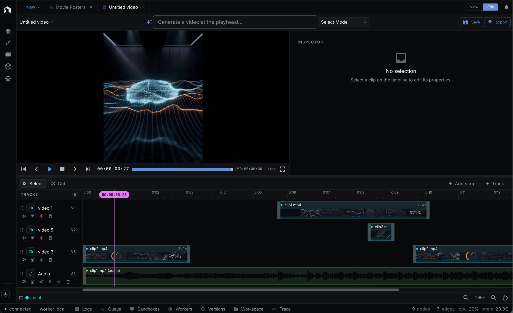
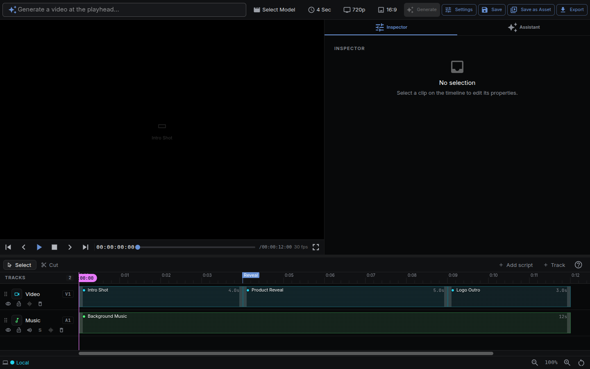
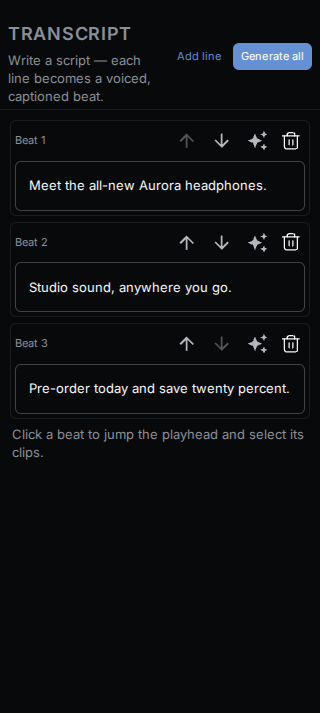

Cut a sequence on a multi-track timeline, bind any workflow to a clip, and generate the footage in place. NodeTool's Video Editor is a non-linear editor where clips can be imported media _or_ live workflow outputs that regenerate when you change their parameters.

> **Quick Access:** Open a timeline at `/timeline/:sequenceId`, or add a timeline tab from the workspace. Create a new sequence with **+** then **New timeline** in the workspace tab bar, or from the timeline list panel.

---

## Overview

The Video Editor (timeline editor) is a non-linear, multi-track surface for assembling video, audio, and image clips. What sets it apart from a conventional NLE is that clips can be **bound to NodeTool workflows** — a clip can be the output of a text-to-image, image-to-video, or text-to-speech pipeline, and it stays editable: change a parameter and regenerate just that clip.

**Features:**

- Multi-track timeline — video, audio, overlay, subtitle, and MIDI tracks
- Imported clips (drag media from the Asset Explorer) and AI-generated clips side by side
- Authored text, shape, 3D model, group, and adjustment-layer clips with preset-based motion
- Clip editing — move, trim, split, duplicate, delete, ripple and roll edits, three drop modes, with snap-to-playhead and snap-to-clip alignment
- Real-time preview compositing with a GPU compositor (WebGPU, Canvas2D fallback) and WebAudio mixing
- Frame-accurate transport — play/pause, stop, frame-step, J/K/L shuttle, in/out range, markers, skip to clip boundaries, timecode readout
- Generated clips bound to any workflow, with parameters exposed in the Inspector
- Staleness tracking — edit a bound workflow and the clip is flagged for regeneration
- Version history per clip — keep the last N successful generations and restore them
- Export — render the whole timeline to MP4, WebM, or a PNG sequence at the sequence resolution, in the browser or server-side
- Full undo/redo and debounced autosave

---

## Where this fits

The Video Editor is the surface where outputs become finished, time-based media. It pulls **assets** in as clips, binds **workflows** to generated clips so footage regenerates when parameters change, and exports the sequence back to a video asset — the same material a sketch, another workflow, or a **Mini-App** can pick up. Every surface shares one asset store and the same model/provider system.

See [Key Concepts → How everything fits together](key-concepts.md#how-everything-fits-together) for the full loop.

---

## Opening the Video Editor

There are a few ways in:

- **Direct route** — navigate to `/timeline/:sequenceId`.
- **Workspace tab** — open a timeline as a tab alongside your workflows in `/workspace`.
- **New sequence** — click **+** in the workspace tab bar and choose **New timeline**, or use the timeline list panel.

Each timeline (whether a standalone page or a workspace tab) runs in its own isolated set of stores, so multiple timelines can be open at once without interfering.

---

## Anatomy of the Editor

| Region        | What it does                                                                         |
| ------------- | ------------------------------------------------------------------------------------ |
| **Tab-row actions** | Save, **Export video**, and an overflow menu with **Project settings**, **Adapt format**, **Save as Asset**, and **Export project (.zip)**. A code button appears when the timeline has embedded authoring code |
| **Preview**   | The composited video with transport controls, timecode, a preview quality select (Auto, Full, Half, Quarter), and FPS readout |
| **Tracks**    | The multi-track timeline — a canvas-rendered ruler, the playhead, and the clips      |
| **Side panel** | Tabs for **Inspector**, **Instruments**, **Source**, **Assistant**, and **History**, plus **Script** and **Code** when the timeline has them |

The transcript panel on the left turns a script into beats: each line becomes a
voiced, captioned clip on the timeline.

---

## Tracks & Clips

The timeline holds multiple tracks. Add one with the add-track button and choose **Video**, **Audio**, **Overlay**, **Subtitle**, or **MIDI**. Video and overlay tracks composite top-down. Audio and MIDI tracks mix together.

The toolbar above the tracks toggles **Select** and **Cut** tools, **Ripple** (trims and deletes close the gap they leave), the drop mode (**Overwrite**, **Insert**, or **Overlap**), **Snap**, **Bars** (a bars-and-beats ruler instead of timecode, with a grid division select), and **Linked**.

**Clip operations:**

- **Add** — drag media from the Asset Explorer onto a track, or add a generated clip from the add menu. Images and video fit video and overlay tracks, audio fits audio tracks, and 3D models fit video and overlay tracks. A drop on an incompatible track is refused.
- **Select** — click a clip; `Shift`/`Ctrl`-click to multi-select.
- **Move / trim** — drag the body to move, drag the edges to trim the in/out points.
- **Split** — position the playhead and press `S` to cut a clip in two.
- **Duplicate / delete** — `Ctrl/⌘ + D` to duplicate, `Delete` to remove.
- **Snapping** — clips snap to the playhead and to neighbouring clip boundaries for clean alignment. Hold `Alt` while dragging to turn snapping off.
- **Insert on drop** — hold `Ctrl/⌘` when releasing a dragged clip to push later clips right.
- **Ripple delete** — `Shift + Delete` removes a clip and closes the gap in the NodeTool layout.
- **Roll edit** — `Ctrl/⌘`-drag a clip edge to move the cut with its neighbour.
- **Markers and range** — `M` adds a marker, `I` and `O` mark the in and out points of a loop range.
- **Transitions** — `Ctrl/⌘ + T` cross-fades into the selected clips. Other transition types are `dipToColor`, `wipe`, `push`, `slide`, `zoom`, `whip`, `zoomBlur`, `glitch`, `gradientWipe`, `iris`, and `lightLeak`, set from the clip's **Transition** section.
- **Fades** — drag the grip at a clip's top corner for an audio fade. `Alt + T` fades the selection in and out.

**Linked clips** that share a link (for example a video and its extracted audio) move and trim together.

---

## Preview & Playback

The preview composites every visible, unmuted track in real time.

- **Transport** — play/pause, stop, step one frame forward/back, and skip to the previous/next clip boundary.
- **Timecode** — frame-accurate `HH:MM:SS:FF` readout, with the sequence FPS shown alongside.
- **Scrubbing** — drag the playhead across the ruler to scrub.
- **Zoom** — `Ctrl/⌘ + scroll` zooms the timeline anchored at the cursor. `Shift + scroll` pans. The timeline view control holds horizontal and vertical zoom sliders.
- **Audio** — per-clip gain and fades, per-track mute/solo and volume, mixed down to a master output. Audio clips render a waveform in the clip body.

Video and audio are kept in sync by driving playback against the audio clock.

---

## Generated Clips

A clip doesn't have to be a file — it can be the output of a workflow.

**Generation modes:**

- **Text-to-video** — on a video track, generate a clip from a prompt and a video model.
- **Text-to-image / image-to-image** — on an overlay track, generate a still from a prompt, optionally from a source clip.
- **Image-to-video** — animate an image clip from its Inspector. See [Image to Video](#image-to-video).
- **Text-to-speech / text-to-music** — on an audio track, synthesize speech or music.
- **Workflow** — bind _any_ NodeTool workflow with an output node to the clip.

The add menu opens prompt-first: type a prompt, pick a model, and press `Enter` to drop a clip at the playhead. Workflow-bound clips are under the **Templates** and **All workflows** tabs. The menu also adds a 3D model clip and an adjustment layer.

When you bind a workflow, NodeTool clones it into a clip-private variant and exposes the workflow's `Input*` nodes as editable parameters in the Inspector — so you can tweak the prompt, seed, or any input and regenerate without leaving the timeline.

**Staleness & versions:**

- Each clip tracks a content hash of the bound workflow plus its parameter overrides. Edit the workflow (or its inputs) and the clip is flagged **stale**.
- A clip moves through states: **draft → queued → generating → generated**, plus **stale**, **failed**, **locked**, and **missing**.
- Successful generations are kept as **versions** — restore, favourite, or delete previous results per clip.
- Generation runs on the standard `WorkflowRunner`; status streams back over the WebSocket connection keyed by job, so the timeline only listens to the jobs it cares about.

**Round-tripping to the node editor:** from a generated clip you can **Open in Node Editor** to edit the bound workflow on the full canvas, then return — the clip auto-marks stale so you can regenerate with the new logic.

---

## Inspector

The Inspector swaps based on what's selected:

- **Imported clip** — timing, render (transform, opacity, blend mode), and media controls, plus sections for time remap, keyframes, effects, mask and matte, tracking, Smart Reframe, and AI Edit where they apply.
- **Generated clip** — a vertical **node stack** of the bound workflow's nodes, each with its parameters (reusing NodeTool's property fields) and a per-node status indicator, with a **Generate** or **Regenerate** button. The clip-actions row has **Duplicate**, **Regenerate as new clip**, **Lock**, **Replace Output**, and **Open in Node Editor**. The **History** section lists versions.
- **Text or shape clip** — content and appearance controls for text, fill, stroke, geometry, and corner radius.

Every visual clip includes an **Animate** section. Add an entrance, exit, emphasis, or loop preset, then adjust its timing, easing, and preset parameters.

### Image to Video

Select an image clip and open **Image to Video** in the Inspector. Describe the motion, pick a model that supports `image_to_video`, and press **Generate video**. The video clip lands on the video track directly above the image, over the same span, and a new track is inserted when that span is taken. It keeps the image clip's duration when the model can render it, and otherwise takes the shortest duration the model offers that covers the clip. The aspect ratio and resolution are the model's nearest match to the image's own size. The new clip is an image-to-video clip with the image as its source, so it regenerates like any other generated clip.

---

## Effects

Clips and tracks carry an effects chain that runs in the same compositor as the live preview:

- **Clip effects** — color, blur, glow, drop shadow, vignette, sharpen, chroma key, curves, levels, lift/gamma/gain, grain, pixelate, posterize, directional blur, lens distortion, stylize, generator, and LUT.
- **Track effects** — video tracks take color correction, blur, sharpen, vignette, and chroma key. Audio tracks take gain, 3-band EQ, filter (lowpass, highpass, bandpass), and compressor.
- **Clip transforms** — opacity, blend mode (normal, multiply, screen, overlay, darken, lighten, color dodge, color burn, hard light, soft light, difference, exclusion, add), speed, time remap, and fade-in/out.

The Canvas2D fallback skips chroma key, vignette, and sharpen.

---

## Animations

Motion presets add animation without a keyframe editor. Select a visual clip, open **Animate** in the Inspector, choose a role and preset, then adjust duration or period, delay, easing, and preset parameters.

- **In / Out** — fade, slide, pop, spin, wipe, blur, and colorFade at a clip boundary. On text clips, `typewriter` is an In preset. Wipe reveals the clip behind a directional mask with an adjustable feathered edge; blur racks from soft to sharp; colorFade blooms grayscale into full color.
- **Emphasis** — pulse, flash, shake, bounce, squash, or followPath while the clip is active.
- **Loop** — kenBurns, float, breathe, rotate, hueShift, orbit, or followPath.
- **Word stagger** — on text clips, any animation can run once per word, each word offset in time from the previous (offset and on/off in the inspector; `stagger` on `ui_timeline_animate_clip` for the agent). Words pop, slide, or fade in sequence — motion typography without keyframes. See [plans/motion-typography.md](plans/motion-typography.md).
- **Track markers** — shaded edge wedges show entrance and exit windows; a loop icon marks emphasis or repeating motion. Select a marker to open its controls.
- **Agent authoring** — timeline tools can list presets, apply or clear motion, and inspect fixed-time frames before export.

Preview and export sample the same animation resolver, so transforms and opacity match at each frame.

---

## Export

**Export video** in the tab row opens the **Export timeline** dialog. Pick a format:

| Format | Notes |
| --- | --- |
| MP4 (H.264) | Plays everywhere. No transparency. |
| WebM (VP9) | VP9 video with Opus audio. Can keep an alpha channel with **Export with transparency**. |
| PNG sequence (.zip) | One PNG per frame plus a `manifest.json` with the rate and size. No audio. |

- Rendering is **frame-by-frame** at the sequence resolution through the same compositor used for preview, so the export matches what you see.
- Audio is mixed offline and muxed with the encoded video.
- A progress dialog reports the phase (preparing, audio, video, finalizing) and the export can be cancelled.
- **Save as Asset** renders the timeline and stores the result in an asset folder you pick. **Export project (.zip)** bundles the timeline project.
- The `render_timeline` agent tool and the `nodetool.timeline.RenderTimeline` node render the same sequence server-side.

Change the sequence width, height, frame rate, and tempo in **Project settings**.

## AI timeline editing

Generated clips can hold multiple takes, source-time media tracks, derived
reframes, and nondestructive generative edits. Use them to compare a result,
follow a subject, make another aspect-ratio cut, or repair a shot without
changing the original edit. See [AI Timeline Editing](ai-timeline-editing.md).

---

## Keyboard Shortcuts

| Shortcut                 | Action                             |
| ------------------------ | ---------------------------------- |
| `Space`                  | Play / pause                       |
| `V` / `C`                | Select tool / cut tool             |
| `S`                      | Split clip at playhead             |
| `Ctrl/⌘ + K`             | Cut all tracks at playhead         |
| `Delete` / `Backspace`   | Delete selected clip(s)            |
| `Shift + Delete`         | Ripple delete                      |
| `Ctrl/⌘ + C` / `X` / `V` | Copy / cut / paste clips           |
| `Ctrl/⌘ + D`             | Duplicate selected clip(s)         |
| `Ctrl/⌘ + A`             | Select all clips                   |
| `←` / `→`                | Nudge selection one frame          |
| `Alt + ←` / `Alt + →`    | Step the playhead one frame        |
| `J` / `K` / `L`          | Shuttle back / stop / forward      |
| `I` / `O`                | Mark in / mark out                 |
| `M`                      | Add marker                         |
| `N`                      | Toggle snapping                    |
| `Ctrl/⌘ + Z`             | Undo                               |
| `Ctrl/⌘ + Shift + Z`     | Redo                               |
| `Ctrl/⌘ + scroll`        | Zoom timeline (anchored at cursor) |
| `?`                      | Open the full shortcut sheet       |

These are the NodeTool layout. The shortcut sheet (`?`) also offers Premiere Pro and Final Cut Pro layouts, stored in the `timelineKeyboardPreset` setting, and lists every binding for the layout you pick.

---

## Common Workflows

### Assemble a rough cut from your assets

1. Open a new sequence and drag clips from the Asset Explorer onto the video track.
2. Trim and reorder clips; use `S` to split and `Delete` to remove.
3. Add an audio track for music or narration and adjust per-clip volume and fades.
4. Scrub the preview to check timing, then **Export** to MP4.

### Generate a shot in place

1. Add a generated clip on a video track and pick a video model (or bind a custom workflow).
2. In the Inspector, set the prompt and inputs exposed from the workflow.
3. **Generate** — the clip streams through queued → generating → generated.
4. Not quite right? Tweak a parameter and **Regenerate**, or use **Regenerate as new clip** to keep the current render and compare takes.

### Iterate on a bound workflow

1. Select a generated clip and **Open in Node Editor**.
2. Edit the workflow on the full canvas and save.
3. Return to the timeline — the clip is flagged **stale**.
4. Select the stale clip and choose **Regenerate**.

---

## Related Features

- **[Workflow Editor](workflow-editor.md)** — build the workflows you bind to generated clips
- **[Asset Management](asset-management.md)** — organize the media you import as clips
- **[AI Timeline Editing](ai-timeline-editing.md)** — takes, tracking, reframing, generative edits, and interchange
- **[Sketch Editor](sketch-editor.md)** — edit stills before or after they land on the timeline
- **[User Interface](user-interface.md)** — tour of the main NodeTool views

---

## Next Steps

- Bind one of your existing workflows to a clip and generate a shot.
- Build a multi-track sequence mixing imported footage with generated clips.
- Explore the [Cookbook](cookbook.md) for workflow patterns you can drop onto the timeline.

---

_Last updated: July 2026_
