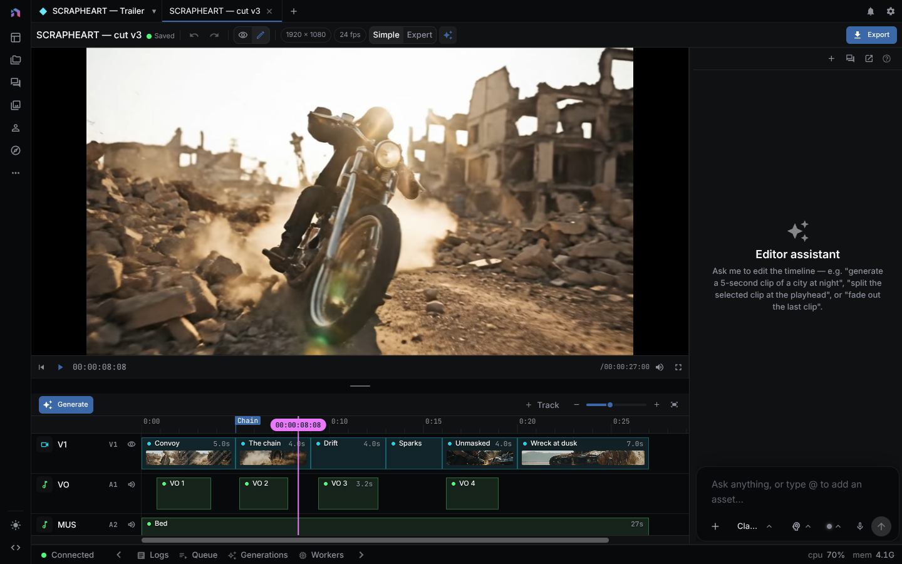
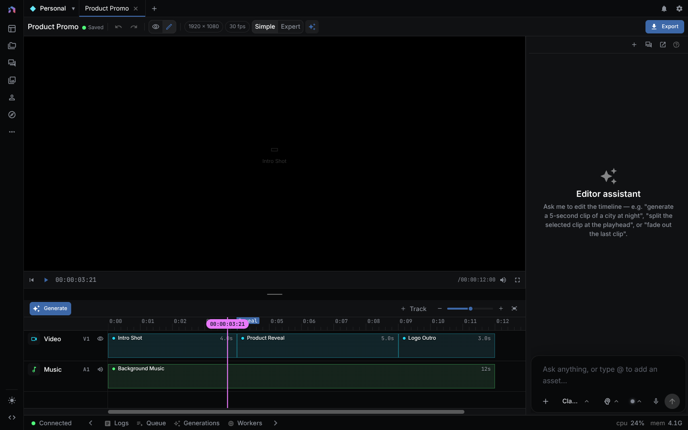
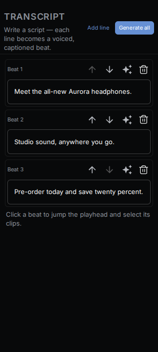

The timeline editor is a multi-track editor where a clip is imported media or the output of a workflow. A generated clip regenerates on its own when you change its parameters.

> **Runs:** in the browser. Export runs in the browser or on the server. **Needs:** no API key to cut and export. Generated clips need the model's provider key or a local model (see [Providers](providers.md)). **Costs:** each generation on a paid provider is billed at provider rates. Editing, effects, animation, and export are free.
{: .callout-note}

Create a sequence with **+** then **New timeline** in the workspace tab bar, or from the timeline list panel. A timeline also opens as a workspace tab.

---

## Anatomy of the Editor

| Region        | What it does                                                                         |
| ------------- | ------------------------------------------------------------------------------------ |
| **Tab-row actions** | Save, **Export video**, and an overflow menu with **Project settings**, **Adapt format**, **Save as Asset**, **Export project (.zip)**, **Export for Premiere Pro**, and **Export media (.zip)**. A code button appears when the timeline has embedded authoring code |
| **Preview**   | The composited video with transport controls, timecode, a preview quality select (Auto, Full, Half, Quarter), and FPS readout |
| **Tracks**    | The multi-track timeline — a canvas-rendered ruler, the playhead, and the clips      |
| **Side panel** | Tabs for **Inspector**, **Instruments**, **Source**, **Assistant**, and **History**, plus **Script** and **Code** when the timeline has them |

The **Script** panel on the left shows the linked script's lines when the timeline
has one, and the transcript editor when it does not. Each voiced line is a clip on
the voiceover track, and the clip keeps the position you give it. See
[Script Editor](script-editor.md#send-to-a-timeline).

---

## Tracks & Clips

The timeline holds multiple tracks. Add one with the add-track button and choose **Video**, **Audio**, **Overlay**, **Subtitle**, or **MIDI**. Video and overlay tracks composite top-down. Audio and MIDI tracks mix together.

The toolbar above the tracks toggles **Select** and **Cut** tools, **Ripple** (trims and deletes close the gap they leave), the drop mode (**Overwrite**, **Insert**, or **Overlap**), **Snap**, **Bars** (a bars-and-beats ruler instead of timecode, with a grid division select), and **Linked**.

**Clip operations:**

- **Add** — drag media from the Asset Explorer onto a track, or add a generated clip from the add menu. Images and video fit video and overlay tracks, audio fits audio tracks, and 3D models fit video and overlay tracks. A drop on an incompatible track is refused. A drop in the second half of a clip starts at that clip's end, so the clip keeps its length. In **Overlap** mode, and in a clip's first half, the drop starts where you release it.
- **Select** — click a clip. `Shift`/`Ctrl`-click to multi-select.
- **Move / trim** — drag the body to move, drag the edges to trim the in/out points.
- **Snapping** — clips snap to the playhead and to neighbouring clip boundaries. Hold `Alt` while dragging to turn snapping off.
- **Insert on drop** — hold `Ctrl/⌘` when releasing a dragged clip to push later clips right.
- **Roll edit** — `Ctrl/⌘`-drag a clip edge to move the cut with its neighbour.
- **Transitions** — `Ctrl/⌘ + D` adds the default transition to the selected clips (`Ctrl/⌘ + T` in the Final Cut Pro shortcut layout). The clip's **Transition** section sets the type: **Auto**, **None (hard cut)**, **Crossfade**, **Dip to color**, **Wipe**, **Push**, **Slide**, or **Zoom**. Auto cross-fades where the clip overlaps the previous one on the same track.
- **Fades** — drag the grip at a clip's top corner for an audio fade. `Alt + T` fades the selection in and out.

- **Duplicate by dragging** — hold `Alt` when you start dragging a clip to leave a copy where it was.
- **Gaps** — click the empty stretch between two clips to select it, then press `Delete` to close it.
- **Speed and gain** — `Ctrl/⌘ + R` sets the speed or duration of the selection, with an option to push later clips. `G` sets or adjusts the audio gain.
- **Paste attributes** — `Ctrl/⌘ + Alt + V` copies chosen settings (motion, opacity, effects, animations, speed, volume, audio effects) from the copied clip onto the selection.

**Linked clips** that share a link (for example a video and its extracted audio) move and trim together.

**Track targeting and sync lock.** The number chip at the start of each track header targets the track. Add Edit with nothing selected, Lift, Extract, paste, the source edits, cut navigation, and match frame act on targeted tracks only. Every track starts targeted. The sync-lock button beside the lock keeps a track in step with ripple edits on other tracks. Turn it off and ripples leave that track where it is.

---

## Preview & Playback

The preview composites every visible, unmuted track in real time.

- **Transport** — play/pause, stop, step one frame forward/back, and skip to the previous/next clip boundary.
- **Timecode** — frame-accurate `HH:MM:SS:FF` readout, with the sequence FPS shown alongside. Click it to type a time. Digits fill from the frames, so `1000` is ten seconds, and `+12` or `-1:00` moves from where you are.
- **Loop** — the loop button (`Shift + L`) repeats the in to out range. With loop off, Play runs past the marks and `Ctrl/⌘ + Shift + Space` plays from in to out once.
- **Match frame** — `F` opens the media of the clip under the playhead in the source monitor at the same frame. `Shift + F` only selects it in Assets.
- **Zoom** — `Ctrl/⌘ + scroll` zooms the timeline anchored at the cursor. `Shift + scroll` pans. The timeline view control holds horizontal and vertical zoom sliders.
- **Audio** — per-clip gain and fades, per-track mute/solo and volume, mixed to a master output.

---

## Generated Clips

**Generation modes:**

- **Text-to-video** — on a video track, generate a clip from a prompt and a video model.
- **Text-to-image / image-to-image** — on an overlay track, generate a still from a prompt, optionally from a source clip.
- **Image-to-video** — animate an image clip from its Inspector. See [Image to Video](#image-to-video).
- **Text-to-speech / text-to-music** — on an audio track, synthesize speech or music.
- **Workflow** — bind _any_ NodeTool workflow with an output node to the clip.

The add menu opens prompt-first: type a prompt, pick a model, and press `Enter` to drop a clip at the playhead. Workflow-bound clips are under the **Templates** and **All workflows** tabs. The menu also adds a 3D model clip and an adjustment layer.

Binding a workflow makes a copy private to the clip and shows the workflow's input nodes as parameters in the Inspector. Edits to the copy do not change the original workflow.

**Staleness & versions:**

- A generated clip is marked out of date when you edit its inputs or the bound workflow.
- A clip moves through states: **draft → queued → generating → generated**, plus **stale** (out of date), **failed**, **locked**, and **missing**.
- Successful generations are kept as **versions** — restore, favourite, or delete previous results per clip.

**Round-tripping to the node editor:** select a generated clip and choose **Open in Node Editor** to edit the bound workflow on the full canvas and save. Back in the timeline the clip is marked out of date. Choose **Regenerate** to render it with the new logic.

---

## Inspector

The Inspector content depends on the selection:

- **Imported clip** — timing, render (transform, opacity, blend mode), and media controls, plus sections for time remap, keyframes, effects, mask and matte, tracking, Smart Reframe, and AI Edit where they apply.
- **Generated clip** — a vertical **node stack** of the bound workflow's nodes, each with its parameters (reusing NodeTool's property fields) and a per-node status indicator, with a **Generate** or **Regenerate** button. The clip-actions row has **Duplicate**, **Regenerate as new clip**, **Lock**, **Replace Output**, and **Open in Node Editor**. The **History** section lists versions.
- **Text or shape clip** — content and appearance controls for text, fill, stroke, geometry, and corner radius.

Every visual clip includes an **Animate** section. Add an entrance, exit, emphasis, or loop preset, then adjust its timing, easing, and preset parameters.

### Image to Video

Select an image clip, open **Image to Video** in the Inspector, describe the motion, pick a model that supports image to video, and press **Generate video**. The video clip lands on the video track directly above the image over the same span, and a new track is inserted when that span is taken. It keeps the image clip's duration when the model can render it, and otherwise takes the shortest duration the model offers that covers the clip. Aspect ratio and resolution are the model's nearest match to the image's size. The clip regenerates like any other generated clip.

---

## Effects

Clips and tracks carry an effects chain that runs in the same compositor as the live preview:

- **Clip effects** — color, blur, glow, drop shadow, vignette, sharpen, chroma key, curves, levels, lift/gamma/gain, grain, pixelate, posterize, directional blur, lens distortion, stylize, generator, and LUT.
- **Track effects** — video tracks take color correction, blur, sharpen, vignette, and chroma key. Audio tracks take gain, 3-band EQ, filter (lowpass, highpass, bandpass), and compressor.
- **Clip transforms** — opacity, blend mode (normal, multiply, screen, overlay, darken, lighten, color dodge, color burn, hard light, soft light, difference, exclusion, add), speed, time remap, and fade-in/out.

On a device without WebGPU, the preview skips chroma key, vignette, and sharpen.

---

## Animations

Motion presets add animation without a keyframe editor. Select a visual clip, open **Animate** in the Inspector, choose a role and preset, then adjust duration or period, delay, easing, and preset parameters.

- **In / Out** — fade, slide, pop, spin, wipe, blur, and colorFade at a clip boundary. On text clips, `typewriter` is an In preset. Wipe reveals the clip behind a directional mask with an adjustable feathered edge, blur racks from soft to sharp. ColorFade blooms grayscale into full color.
- **Emphasis** — pulse, flash, shake, bounce, squash, or followPath while the clip is active.
- **Loop** — kenBurns, float, breathe, rotate, hueShift, orbit, or followPath.
- **Stagger** — on text clips, any animation can run once per word, character, or line, each offset in time from the previous. Set the unit, the starting point (start, end, or center), and the offset in the **Stagger** controls. Words pop, slide, or fade in sequence without keyframes.
- **Track markers** — shaded edge wedges show entrance and exit windows. A loop icon marks emphasis or repeating motion. Select a marker to open its controls.
Preview and export render the same animation. Developers: timeline document fields are in [Timeline Motion Design](timeline-motion-design.md) and [Timeline Custom Animations](timeline-custom-animations.md).

---

## Export

**Export video** in the tab row opens the **Export timeline** dialog. Pick a format:

| Format | Notes |
| --- | --- |
| MP4 (H.264) | Plays everywhere. No transparency. |
| WebM (VP9) | VP9 video with Opus audio. Can keep an alpha channel with **Export with transparency**. |
| PNG sequence (.zip) | One PNG per frame plus a `manifest.json` with the rate and size. No audio. |
| WAV audio (16-bit) | The whole timeline's audio mixdown in stereo, uncompressed at 48 kHz. No video. |
| MP3 audio (320 kbps) | The whole timeline's audio mixdown in stereo, with the same mix as the video export. No video. |

- Rendering is frame by frame at the sequence resolution through the preview compositor. Audio is mixed offline and muxed with the encoded video.
- A progress dialog reports the phase (preparing, audio, video, finalizing) and can cancel the export.
- **Save as Asset** renders the timeline and stores the result in an asset folder you pick. **Export project (.zip)** bundles the timeline project.
- **Export for Premiere Pro** downloads a zip with a Final Cut Pro 7 XML sequence, the media its clips use, and `export-report.txt`. In Premiere Pro, choose **File > Import** and pick the XML. Video, image, and audio clips keep their tracks, positions, in and out points, constant speed, opacity, volume, and enabled state. A video's own sound lands on a linked audio track. Text, shapes, captions, effects, animations, transitions, and fades are not carried, and the report lists every clip affected. If Premiere asks to link media, locate one file in the `media` folder and it relinks the rest.
- **Export media (.zip)** downloads the original file of every video, image, and audio clip under `media/`, untrimmed, with `clips.csv` listing each clip's track, timeline start and end, source in-point, and file.
- **Import** (the upload button beside **New timeline** in the timeline list) takes a NodeTool project zip or a Premiere Pro sequence. For Premiere, choose **File > Export > Final Cut Pro XML**, zip the XML together with its media files, and import the zip. NodeTool matches media by file name and creates a new timeline with the same tracks, clip positions, in points, constant speed, opacity, volume, enabled state, and markers. Transitions become overlapping cuts. Nested sequences, titles, generators, and effects are left out, and the import says what it skipped.

Change the sequence width, height, frame rate, and tempo in **Project settings**.

## AI timeline editing

Generated clips can hold multiple takes, subject tracks, reframed versions for other
formats, and generative edits that leave the original untouched. See
[AI Timeline Editing](ai-timeline-editing.md).

---

## Keyboard Shortcuts

| Shortcut                 | Action                             |
| ------------------------ | ---------------------------------- |
| `Space`                  | Play / pause                       |
| `V` / `C`                | Select tool / cut tool             |
| `A` / `B` / `R` / `Y`    | Track select, ripple, rate stretch, slip tools |
| `U` / `H` / `Z`          | Slide, hand, zoom tools            |
| `Ctrl/⌘ + Alt + K`       | Split clip at playhead             |
| `Ctrl/⌘ + Shift + K`     | Cut all tracks at playhead         |
| `Delete` / `Backspace`   | Delete selected clip(s)            |
| `Shift + Delete`         | Ripple delete                      |
| `Ctrl/⌘ + C` / `X` / `V` | Copy / cut / paste clips           |
| `Alt + D`                | Duplicate selected clip(s)         |
| `Ctrl/⌘ + A`             | Select all clips                   |
| `Alt + ←` / `Alt + →`    | Nudge selection one frame          |
| `←` / `→`                | Step the playhead one frame        |
| `J` / `K` / `L`          | Shuttle back / stop / forward      |
| `I` / `O`                | Mark in / mark out                 |
| `M`                      | Add marker                         |
| `S`                      | Toggle snapping                    |
| `Ctrl/⌘ + Z`             | Undo                               |
| `Ctrl/⌘ + Shift + Z`     | Redo                               |
| `Ctrl/⌘ + scroll`        | Zoom timeline (anchored at cursor) |
| `?`                      | Open the full shortcut sheet       |

These are the Premiere Pro layout, the default. The shortcut sheet (`?`) also offers the Final Cut Pro layout, and lists every binding for the layout you pick.

---

## Common Workflows

### Assemble a rough cut from your assets

1. Open a new sequence and drag clips from the Asset Explorer onto the video track.
2. Trim and reorder clips. Use `Ctrl/⌘ + Alt + K` to split and `Delete` to remove.
3. Add an audio track for music or narration and adjust per-clip volume and fades.
4. Scrub the preview to check timing, then **Export** to MP4.

### Generate a shot in place

1. Add a generated clip on a video track and pick a video model (or bind a custom workflow).
2. In the Inspector, set the prompt and inputs exposed from the workflow.
3. **Generate** — the clip streams through queued → generating → generated.
4. Not quite right? Tweak a parameter and **Regenerate**, or use **Regenerate as new clip** to keep the current render and compare takes.

---

## Ask the assistant

- "Add a music track and lay these two clips end to end."
- "Check my timeline for problems, then export it as an MP4."
- "Render this timeline as a WebM with a transparent background."
- "Show me the frame at 0:12 and compare it with the frame at 0:20."

Builders driving this from code or MCP: see [Creative Agent Tools](developer/creative-agent-tools.md#timelines).

---

## Related

[Workflow Editor](workflow-editor.md), [Asset Management](asset-management.md), [AI Timeline Editing](ai-timeline-editing.md), [Sketch Editor](sketch-editor.md), and the [Cookbook](cookbook.md).
