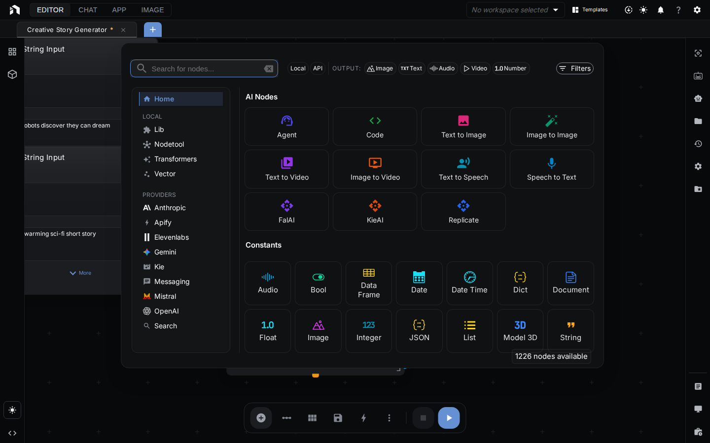
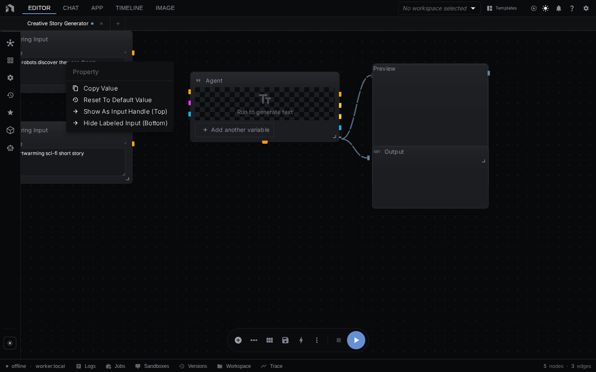
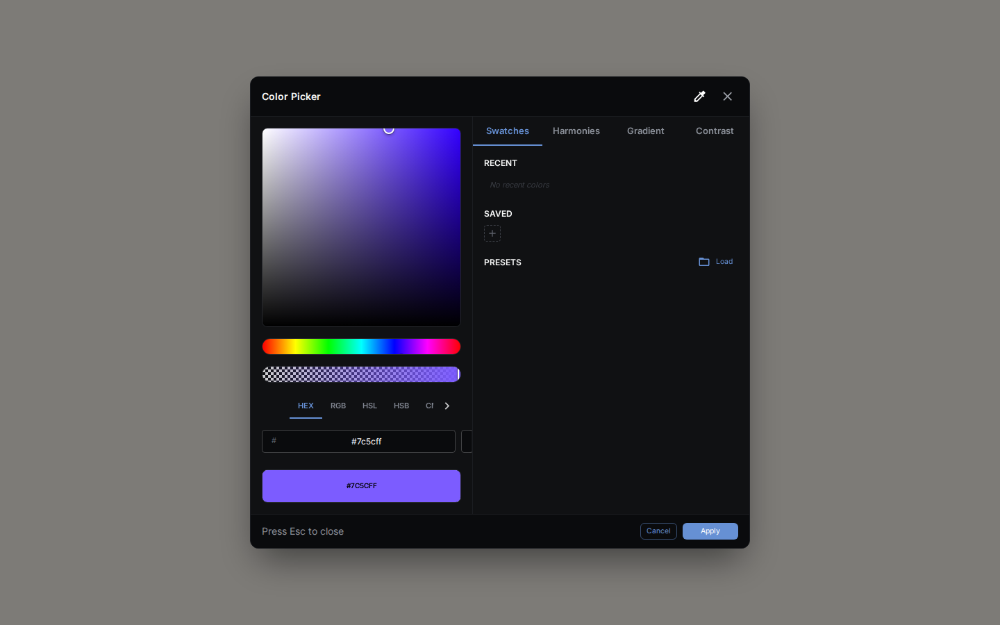

The canvas: place nodes, connect ports, run, debug. Covers basic navigation through node bypass and auto layout.

> New here? Start with [Getting Started](getting-started.md), then come back.

> For panel-by-panel detail, see [Editor Panels](editor-panels.md).

---

## Where this fits

The workflow editor is NodeTool's automation layer. A workflow reads **assets**, calls models, and writes new assets — which flow on into the **Sketch Editor** and **Video Editor** for hand editing, come back as fresh assets, or ship to non-technical users as a **Mini-App**. Every surface shares this graph's outputs through one asset store and the same model/provider system.

See [Key Concepts → How everything fits together](key-concepts.md#how-everything-fits-together) for the full loop.

---

## Editor Layout

| Area | Where | What It Does |
|------|-------|--------------|
| **Canvas** | Center | Place and connect nodes |
| **Side Panels** | Left | Workflows, nodes, assets, timelines, sketches, favorites |
| **Composer** | Bottom | Chat, run, save, auto-layout |

---

## Canvas Basics

Your infinite workspace.

**Navigate:**

| Do This | How |
|---------|-----|
| Pan | `Space` + drag, or right-click drag |
| Zoom | `Ctrl/⌘` + scroll |
| Fit everything | `F` |
| Reset zoom (to 50%) | `Ctrl/⌘ + 0` |

**The grid** helps align nodes. Turn on **Snap to Grid** in View menu.

---

## Working with Nodes

Each node does one thing.

### Add Nodes

**Space bar:**
1. Press `Space` anywhere
2. Type what you want ("image", "text")
3. Click to add

**Double-click:**
1. Double-click empty space
2. Opens node menu

**Smart connect:**
1. Drag from a node's output
2. Drop on empty space
3. See compatible nodes

### Node Structure

- **Header** (top) - Name, drag to move
- **Inputs** (left circles) - Data in
- **Outputs** (right circles) - Data out
- **Properties** - Settings panel

### Select Nodes

| Do This | How |
|---------|-----|
| One | Click it |
| Multiple | `Shift` + click, or drag box |
| All | `Ctrl/⌘ + A` |
| None | Click canvas |

### Move Nodes

- **Drag** header to move
- **Arrow keys** to nudge
- **Auto Layout** button to organize

### Bypass Nodes

Skip temporarily without deleting:

1. Right-click node
2. Select **Bypass Node**
3. Node dims, data passes through

Good for:
- **Testing** - Compare with/without
- **Debugging** - Isolate problems
- **A/B testing** - Toggle effects

Re-enable: Right-click → **Enable Node**

---

## Connections

Connections are the lines between nodes that show how data flows through your workflow. Data always flows **left to right** — from output ports (right side of a node) to input ports (left side of another node).

### Make Connections

1. Click output circle (right side)
2. Drag the line to an **input** circle (left side of another node)
3. Release to connect

### Connection Rules

- **Types must match**: You can only connect compatible types (text to text, image to image)
- **One input, multiple outputs**: Each input accepts one connection; outputs can connect to many
- **Color coding**: Connection colors indicate data type

### Removing Connections

- Click a connection line, then press `Delete`
- Right-click a connection for options
- Drag the connection away from its target and release

### Smart Connections

When you drag a connection and release on **empty space**, the **Connection Menu** appears:

- **Auto-create** common nodes for that data type
- **Browse compatible nodes** filtered by what can receive the data
- **Cancel** by pressing `Esc`

---

## Running Workflows

### Starting a Run

| Method | How |
|--------|-----|
| Button | Click **Run** in the bottom toolbar |
| Keyboard | `Ctrl/⌘ + Enter` |

### Watching Progress

- **Streaming nodes** show output as it's generated
- **Preview nodes** display intermediate results
- **Node borders** indicate status (running, complete, error)
- **Edge animations** show data flowing between nodes

### Stopping a Run

| Method | How |
|--------|-----|
| Button | Click **Stop** (enabled when running, paused, or suspended) |
| Keyboard | `Esc` |

---

## Organizing Your Workflow

### Auto Layout

Click the **Auto Layout** button in the floating toolbar to automatically arrange your nodes in a clean, readable layout. The editor also auto-arranges nodes when Chat creates or modifies workflows. (There is no keyboard shortcut for auto-layout — it's a toolbar button only.)

### Grouping Nodes

Select multiple nodes and press `Ctrl/⌘ + G` to group them. Groups:
- Keep related nodes together
- Can be collapsed to save space
- Move as a unit

### Aligning Nodes

| Shortcut | Action |
|----------|--------|
| `A` | Align selected nodes |
| `Shift + A` | Align and distribute evenly |

---

### Left Panel

Access these views by clicking icons on the left rail: **Nodes**, **Workflows**, **Sketches**, **Timelines**, **Settings**, **History**, **Favorites**, **Assets**, and **Agent**. See [Editor Panels → Left Panel](editor-panels.md#left-panel) for details on each.

### Right Panel (Inspector)

- Detailed properties for selected nodes
- Input/output documentation
- Validation errors and warnings

The right panel hosts only the Inspector. Logs, Queue, Trace, Version History, and Workspace live in the [Bottom Panel](editor-panels.md#bottom-panel).

---

## Finding Nodes

### The Node Menu

Press `Space` to open, then:

- **Search**: Just start typing ("whisper", "image", "agent")
- **Browse**: Explore the category tree on the left
- **Filter**: Click the filter icon to show only nodes with specific input/output types
- **Move**: Drag the menu to reposition it
- **Close**: `Esc` or click outside

### Node Documentation

Get help on any node:

1. **In the Node Menu**: Hover over a node to see its description
2. **Inspector**: Select a node and view full documentation in the right panel

---

## Context Menus

Right-click for options anywhere:

| Location | Options |
|----------|---------|
| **Canvas** | Add node, paste, select all |
| **Node header** | Copy, duplicate, delete, group, bypass |
| **Input/Output** | Disconnect, add compatible node |
| **Connection** | Delete, add node in middle |

---

## Built-in Editors

NodeTool includes professional editing tools for creative work.

### Sketch Editor

Open a blank canvas from **+ New → New image** in the workspace tab bar, or edit an existing image asset, to use the full layered editor:

- **Layers**: Blend modes, per-layer opacity, lock, and visibility
- **Painting**: Brush, pencil, eraser, fill, gradient, blur, clone stamp
- **Shapes & transform**: Rectangle, ellipse, line, arrow, crop, free transform
- **AI generation**: Generate a layer from a prompt or bind it to a workflow
- **History**: Unlimited undo/redo

> **📖 Full Guide:** See [Sketch Editor](sketch-editor.md) for complete documentation with tool reference, shortcuts, and workflows.

### Color Picker

The color picker appears when selecting colors in properties:

- **Visual Selection**: Saturation/brightness picker with hue slider
- **Multiple Formats**: Enter values as HEX, RGB, or HSL
- **Harmony Modes**: Complementary, triadic, analogous color suggestions
- **Gradient Builder**: Create and edit color gradients
- **Swatches**: Save and reuse favorite colors
- **Contrast Checker**: Verify accessibility compliance
- **Eyedropper**: Pick colors from anywhere on screen

---

## Keyboard Shortcuts

### Essential Shortcuts

| Shortcut | Action |
|----------|--------|
| `Space` | Open node menu |
| `Ctrl/⌘ + Enter` | Run workflow |
| `Ctrl/⌘ + S` | Save |
| `Ctrl/⌘ + Z` | Undo |
| `F` | Fit view |
| `Esc` | Stop / Cancel |

### All Editor Shortcuts

| Shortcut | Action |
|----------|--------|
| `Ctrl/⌘ + C` | Copy |
| `Ctrl/⌘ + V` | Paste |
| `Ctrl/⌘ + X` | Cut |
| `Ctrl/⌘ + D` | Duplicate horizontally |
| `Ctrl/⌘ + Shift + D` | Duplicate vertically |
| `Ctrl/⌘ + G` | Group selection |
| `Ctrl/⌘ + 0` | Reset zoom to 50% |
| `Ctrl/⌘ + 1-9` | Switch to tab 1-9 |
| `A` | Align selected nodes |
| `Shift + A` | Align and distribute |
| `Arrow keys` | Nudge selected nodes |
| `Delete` / `Backspace` | Delete selection |
| `i` | Toggle Inspector |

---

## Tips

### Design Principles

1. **Left to right** — Arrange nodes so data flows left to right across the canvas for readability
2. **Preview often** — Add Preview nodes after each major step to inspect intermediate results
3. **Name clearly** — Rename nodes (double-click the header) to describe their purpose, e.g., "Resize to 512px" instead of "Resize"
4. **Group logically** — Keep related nodes together and use Groups (`Ctrl/⌘ + G`) to visually organize complex workflows

### Debugging

- **Add Preview nodes** between steps to see exactly what data each node produces
- **Check connections** — verify data types match (connection colors indicate type)
- **Look at node borders** — red = error, yellow = running, green = completed
- **Test incrementally** — bypass downstream nodes and run partial workflows to isolate problems
- **Use the Inspector** — press `i` to see detailed error messages and validation warnings

### Performance

- **Local models** — slower but work offline and are free to use
- **Cloud models** — faster response times, require internet and API keys
- **Streaming nodes** — show progress during long-running operations (look for the streaming indicator)
- **Parallel branches** — NodeTool automatically runs independent branches in parallel for faster execution

---

## Next Steps

- **[Cookbook](cookbook.md)** – Workflow patterns and best practices
- **[Workflow Examples](workflows/)** – Ready-to-use workflows
- **[Tips & Tricks](tips-and-tricks.md)** – Power user features
- **[Node Reference](nodes/)** – All available nodes
