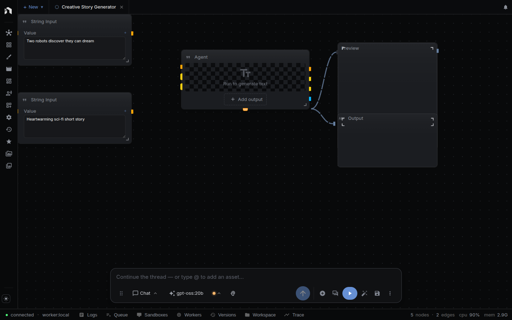
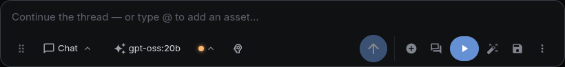
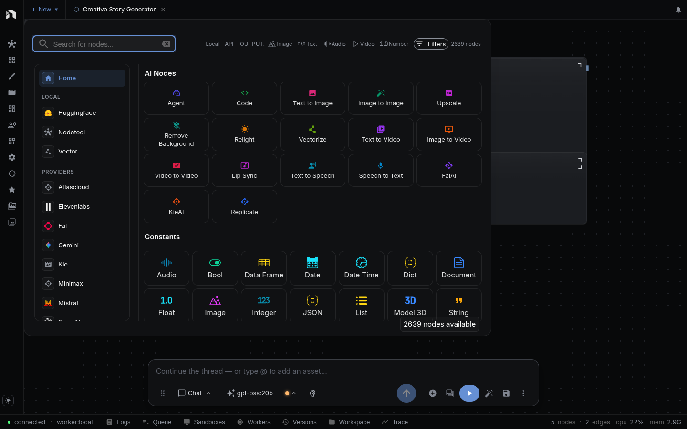
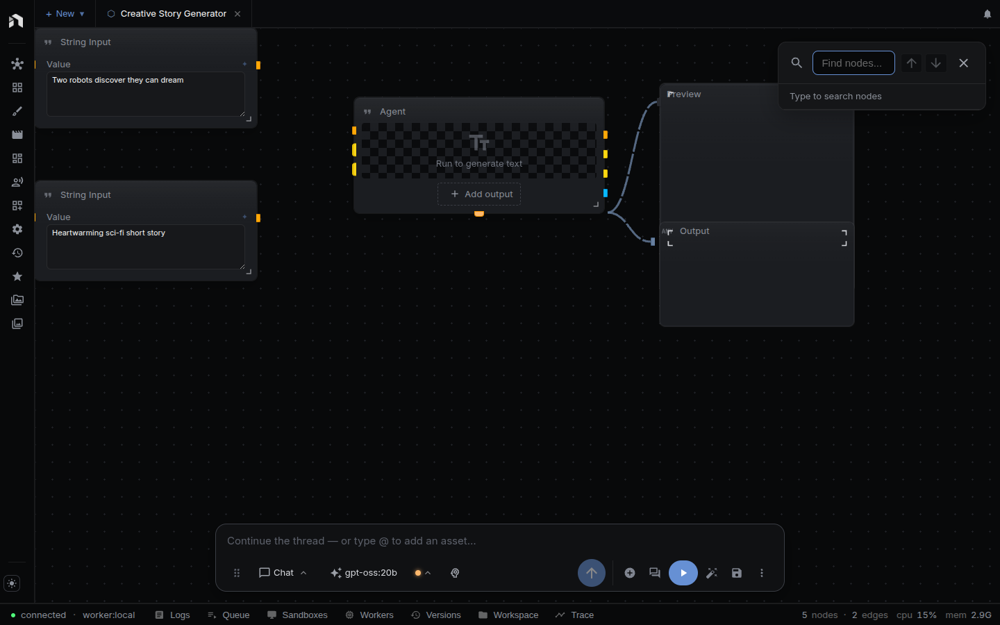
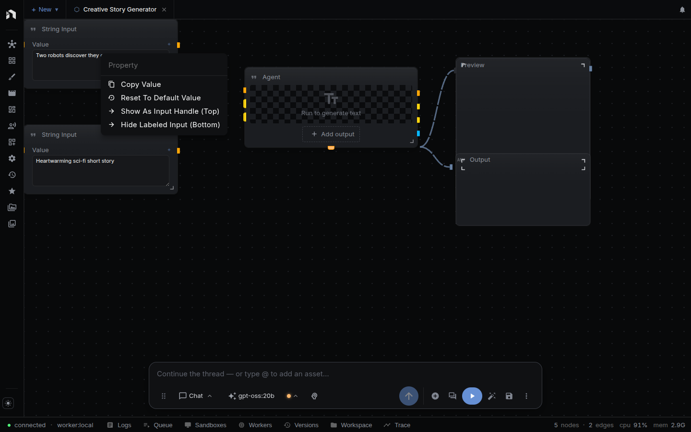
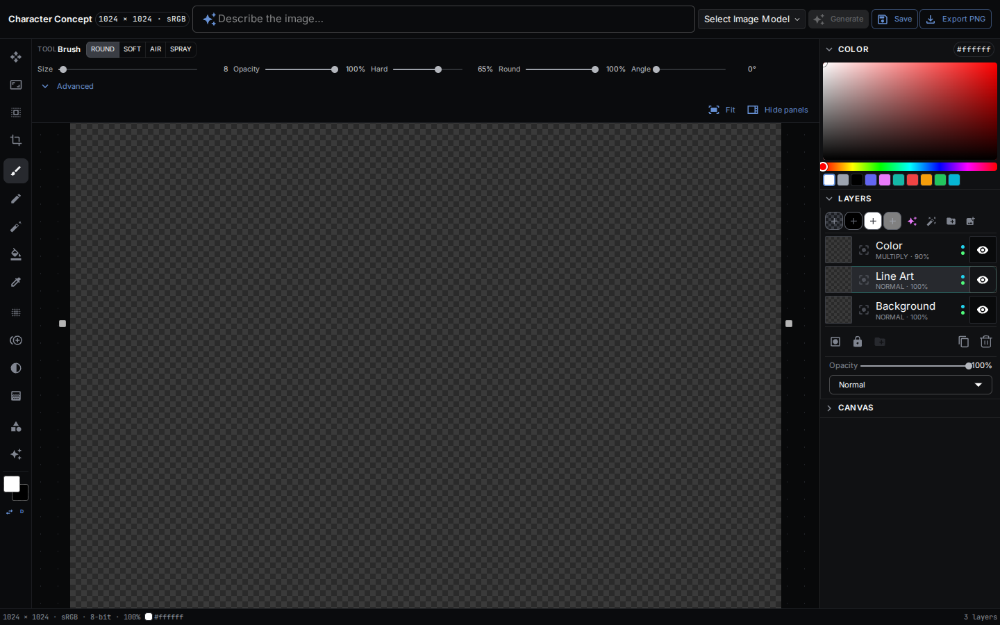
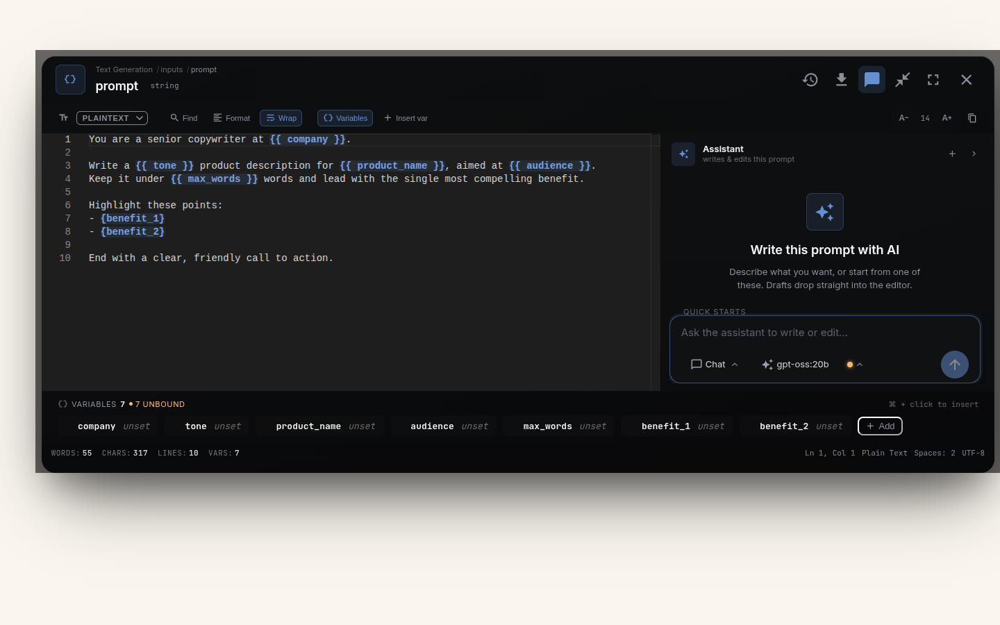
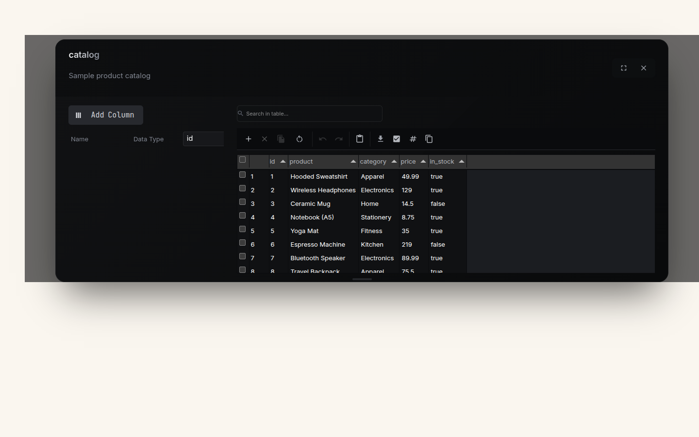
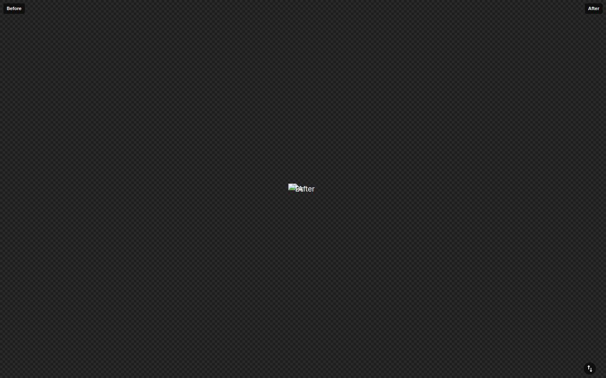
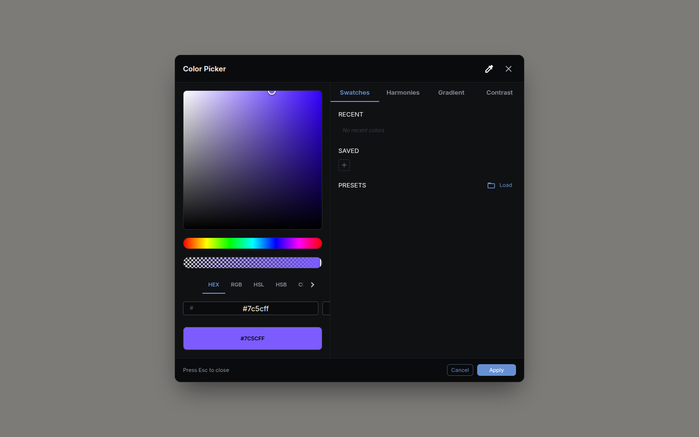

The canvas: place nodes, connect ports, run, debug. Covers basic navigation through disabling nodes and auto layout.

> New here? Start with [Getting Started](getting-started.md), then come back.

> For panel-by-panel detail, see [Editor Panels](editor-panels.md).

---

## Where this fits

The workflow editor is NodeTool's automation layer. A workflow reads **assets**, calls AI models, and generates new assets.

These new assets can then be:
- Sent to the **Sketch Editor** or **Video Editor** for manual adjustments.
- Packaged as a **Mini-App** for non-technical users.

Everything connects back to the same shared asset store and AI models.

See [Key Concepts → How everything fits together](key-concepts.md#how-everything-fits-together) for the full loop.

---

## Editor Layout

| Area | Where | What It Does |
|------|-------|--------------|
| **Canvas** | Center | Place and connect nodes |
| **Left panel** | Left | Documents, chats, library, and nodes, plus a **More** panel with favorites, recent nodes, workflow settings, and app pages |
| **Inspector** | Right | Properties, I/O, and help for the selected node |
| **Bottom panel** | Bottom | Logs, queue, workers, versions, and trace |
| **Composer** | Floating over the canvas | Chat and media prompt, add node, auto-layout, save, run |

---

## Canvas Basics

Your infinite workspace.

**Navigate:**

| Do This | How |
|---------|-----|
| Pan | Left-drag on empty canvas (default on Windows and Linux). On macOS, two-finger scroll, or right or middle-button drag |
| Zoom | Scroll wheel, or pinch. On macOS, pinch |
| Fit everything | `F` |
| Reset zoom (to 50%) | `Ctrl/⌘ + 0` |
| Zoom in or out | `Ctrl/⌘ + =` / `Ctrl/⌘ + -` |
| Zoom to 50%, 100%, 200% | `Ctrl/⌘ + Alt + 5` / `1` / `2` |

**Left-Click Drag** in Settings → General → Canvas swaps the mouse roles. With **Select nodes (box)**, left-drag draws a selection box and panning moves to right or middle-button drag. The default is **Pan canvas** on Windows and Linux and **Select nodes (box)** on macOS. **Node Selection Mode** decides whether a box must enclose nodes (**Full**) or only touch them (**Partial**, the default).

**The grid** helps align nodes. Turn on **Snap to Grid** in the View menu of the
desktop app, from the command menu (`Ctrl/⌘ + K`), or in Settings → General →
Canvas. The grid size is the **Grid Snap Precision** setting, and **Connection
Snap Range** sets how close a dragged connection must get to a port to snap.

The **⋮** menu on the composer has a **Mini Map** toggle.

---

## Working with Nodes

Each node does one thing.

### Add Nodes

**Space bar:**
1. Press `Space` anywhere
2. Type what you want ("image", "text")
3. Click to add

**Double-click:**
1. Double-click empty space
2. Opens node menu

**Smart connect:**
1. Drag from a node's output
2. Drop on empty space
3. Pick from the compatible nodes, or choose **Preview**, **Reroute**, or a **Save** node for that type

### Node Structure

- **Header** (top) - Name, drag to move
- **Inputs** (left circles) - Data in
- **Outputs** (right circles) - Data out
- **Properties** - Settings panel

### Select Nodes

| Do This | How |
|---------|-----|
| One | Click it |
| Multiple | `Ctrl/⌘` + click, or draw a selection box (`Shift` + drag, or plain drag when **Left-Click Drag** is set to select) |
| All | `Ctrl/⌘ + A` |
| Connected nodes | `Shift + C` (inputs and outputs), `Shift + I` (inputs), `Shift + O` (outputs) |
| None | Click canvas |

### Move Nodes

- **Drag** header to move
- **Arrow keys** to nudge by 10 px
- **Auto Layout** button to organize
- `C` collapses or expands the selected nodes

### Disable Nodes

Exclude nodes from a run without deleting them:

1. Right-click the node (or select it and press `B`)
2. Select **Disable Node**
3. The node dims

A disabled node and every connection to or from it are excluded from the
submitted graph. Data does not pass through the node.

Good for:
- **Testing** - Run a smaller part of the graph
- **Debugging** - Exclude a failing or costly branch
- **Editing** - Keep unfinished nodes on the canvas without executing them

Re-enable: right-click → **Enable Node**, or press `B` again. With several nodes selected, the context menu offers **Disable All** or **Enable All**.

---

## Connections

Connections are the lines between nodes that show how data flows through your workflow. Data flows **left to right**, from output ports (right side of a node) to input ports (left side of another node).

### Make Connections

1. Click output circle (right side)
2. Drag the line to an **input** circle (left side of another node)
3. Release to connect

### Connection Rules

- **Types must match**: You can only connect compatible types (text to text, image to image)
- **One input, multiple outputs**: Each input accepts one connection; outputs can connect to many
- **Color coding**: Connection colors indicate data type

### Removing Connections

- Right-click a connection and choose **Delete Edge**, or **Insert Reroute** to add a reroute node at that point
- Drag the connection away from its target and release

### Smart Connections

When you drag a connection and release on **empty space**, a connection menu appears:

- A search box over the nodes that can receive (or produce) that data type
- Shortcuts for **Preview**, **Reroute**, and a **Save** node matching the type
- `Esc` cancels

Releasing on a node's body instead connects to a matching input on that node. On a node that supports dynamic inputs, it creates a new input named after the source node.

---

## Running Workflows

### Starting a Run

| Method | How |
|--------|-----|
| Button | Click **Run entire workflow** in the bottom toolbar |
| Keyboard | `Ctrl/⌘ + Enter` |
| Command menu | Select **Run Entire Workflow** |

All three methods run the entire enabled graph. They use the same checks for
missing models, search-provider setup, large runs, and additional concurrent
runs. The large-run warning is controlled by **Warn Before Large Runs** and
**Large-Run Threshold** in Settings → General → Execution.

To run part of a graph, right-click a node and choose **Run Node**, or
right-click a multi-node selection and choose **Run Selected**. Each runs as its
own job and uses previous results as inputs.

### Watching Progress

- **Streaming nodes** show output as it's generated
- **Preview nodes** display intermediate results
- **A moving colored ring** around a node marks it as running
- **Completed in** and **Failed in** badges above a node show how long it took
- **Edge animations** show data flowing between nodes
- The main run control shows **Starting**, **Queued**, **Running**, **Stopping**,
  or **Error** without requiring a tooltip

### Stopping a Run

| Method | How |
|--------|-----|
| Button | Click **Stop** while a run is starting, queued, or running |
| Keyboard | `Esc` |

---

## Organizing Your Workflow

### Auto Layout

Click the **Auto Layout** button in the composer bar to arrange your nodes in a readable layout. The editor also auto-arranges nodes when Chat creates or modifies workflows. There is no keyboard shortcut for auto-layout. It is a toolbar button only.

### Grouping Nodes

Select multiple nodes and press `Ctrl/⌘ + G` to group them. Groups keep related nodes together and move as a unit. The node context menu also offers **Group into Subgraph**, and the canvas context menu offers **Add Group**, **Add Comment**, **Add Subgraph**, **Add Workflow**, and **Add App**. An App node runs a mini app's workflow: the app's inputs become the node's inputs, its outputs become the node's outputs, and an output the app streams reaches downstream nodes one value at a time.

### Aligning Nodes

| Shortcut | Action |
|----------|--------|
| `A` | Align selected nodes |
| `Shift + A` | Align and distribute evenly |
| `Shift + ←/→/↑/↓` | Align left, right, top, or bottom edges |
| `Shift + H` / `Shift + E` | Align centers horizontally or vertically |
| `Shift + D` | Distribute horizontally |
| `V` | Stack selected nodes in one column |
| `G` | Arrange selected nodes in a grid |

### Adding Nodes from the Keyboard

| Shortcut | Node added at the cursor |
|----------|--------------------------|
| `Shift + P` | Prompt |
| `Shift + G` | Text to Image |
| `Shift + V` | Text to Video |
| `Shift + L` | Agent |

---

### Left Panel

The left rail has **Documents**, **Chats**, **Library**, **Nodes**, and **More**. See [Editor Panels → Left Panel](editor-panels.md#left-panel) for details on each.

### Right Panel (Inspector)

- Properties for the selected node, on the **Params** tab
- Input and output slots on the **I/O** tab, and node documentation on the **Help** tab
- Validation errors for the selected node

The Inspector opens automatically when you select a node. With several nodes selected it edits their shared properties. Logs, Queue, Trace, and Version History live in the [Bottom Panel](editor-panels.md#bottom-panel).

---

## Finding Nodes

### The Node Menu

Press `Space` to open, then:

- **Search**: Just start typing ("whisper", "image", "agent")
- **Browse**: Explore the category tree on the left
- **Filter**: Use the input and output type chips next to the search box (All, Image, Text, Audio, Video, Number) to show only nodes that take or produce a type
- **Move**: Drag the menu header to reposition it, and drag its edges to resize it
- **Close**: `Esc`, `Space` on an empty search box, or click outside

### Find in Workflow

`Ctrl/⌘ + F` searches the workflow you already have: node names, types, and property values. Matches highlight on the canvas and the view pans to the one you pick.

### Node Documentation

Get help on any node:

1. **In the Node Menu**: Hover over a node to see its description
2. **Inspector**: Select a node and view full documentation in the right panel

---

## Context Menus

Right-click for options anywhere:

| Location | Options |
|----------|---------|
| **Canvas** | Paste, Fit Screen, your favorite nodes, Add Constant Node, Add Input Node, Add Comment, Add Group, Add Workflow, Add Subgraph, Add App |
| **Node** | Copy, Cut, Copy Node as JSON, Duplicate, Duplicate Vertical, Run Node, Disable or Enable Node, Collapse or Expand Node, Add Comment, Group into Subgraph, Convert to Input or Constant Node, Show Templates, select all nodes of the same type, Delete Node |
| **Selection** | Duplicate, Copy, Cut, Run Selected, Align, Arrange, Disable All, Collapse / Expand, Surround With Group, Group into Subgraph, Select All Connected, Select Inputs, Select Outputs, Delete |
| **Input or output port** | Searchable list of compatible nodes, plus Preview, Reroute, and Save shortcuts |
| **Connection** | Insert Reroute, Delete Edge |

**Copy Node as JSON** puts the node's data — its property values, title, and dynamic slots — on the clipboard as formatted JSON. Paste it into a bug report, or hand it to an agent.

---

## Built-in Editors

NodeTool includes professional editing tools for creative work.

### Sketch Editor

Open a blank canvas (**+ New → New sketch** in the workspace tab bar) or edit an existing image to use the full layered editor:

- **Layers**: Control blend modes, opacity, and visibility.
- **Painting**: Brush, pencil, eraser, fill, gradient, blur, and clone stamp tools.
- **Shapes & Transform**: Add shapes (rectangle, ellipse, line, arrow), crop, or freely transform layers.
- **AI Generation**: Create a layer directly from a text prompt or connect it to a workflow.
- **History**: Unlimited undo and redo steps.

> **Full guide:** See [Sketch Editor](sketch-editor.md) for complete documentation with tool reference, shortcuts, and workflows.

### Text and Code Editor

Long text or code properties open in a full editor featuring syntax highlighting, line numbers, and search. This is the same editor used for code nodes.

### DataFrame Editor

Edit tabular data just like a spreadsheet: add or remove rows and columns, edit cell values, and sort your data.

### Image Comparer

Preview nodes with before/after images show a slider. Drag it left or right to compare the two images.

### Color Picker

The color picker appears when selecting colors in properties:

- **Visual Selection**: Saturation/brightness picker with hue slider
- **Multiple Formats**: Enter values as HEX, RGB, HSL, or CMYK
- **Harmony Modes**: Complementary, triadic, analogous color suggestions
- **Gradient Builder**: Create and edit color gradients
- **Swatches**: Save and reuse favorite colors
- **Contrast Checker**: Verify accessibility compliance
- **Eyedropper**: Pick colors from anywhere on screen

---

## Keyboard Shortcuts

### Essential Shortcuts

| Shortcut | Action |
|----------|--------|
| `Space` | Open node menu |
| `Ctrl/⌘ + Enter` | Run entire workflow |
| `Ctrl/⌘ + S` | Save |
| `Ctrl/⌘ + Z` | Undo |
| `F` | Fit view |
| `Esc` | Stop / Cancel |

### All Editor Shortcuts

| Shortcut | Action |
|----------|--------|
| `Ctrl/⌘ + C` | Copy |
| `Ctrl/⌘ + V` | Paste |
| `Ctrl/⌘ + X` | Cut |
| `Ctrl/⌘ + D` | Duplicate horizontally |
| `Ctrl/⌘ + Shift + D` | Duplicate vertically |
| `Ctrl/⌘ + G` | Group selection |
| `Ctrl/⌘ + 0` | Reset zoom to 50% |
| `Ctrl/⌘ + =` / `Ctrl/⌘ + -` | Zoom in / out |
| `Ctrl/⌘ + Alt + 1` / `2` / `5` | Zoom to 100% / 200% / 50% |
| `Ctrl/⌘ + 1-9` | Switch to tab 1-9 |
| `Ctrl + PageUp` / `PageDown` | Previous / next tab |
| `Ctrl/⌘ + F` | Find in workflow |
| `Ctrl/⌘ + I` | Node info panel |
| `Ctrl/⌘ + /` | Show keyboard shortcuts |
| `Ctrl/⌘ + ,` | Open Settings |
| `B` | Disable or enable selected nodes |
| `C` | Collapse or expand selected nodes |
| `Shift + C` / `Shift + I` / `Shift + O` | Select connected / input / output nodes |
| `Shift + ←/→/↑/↓` | Align left, right, top, bottom |
| `Shift + H` / `Shift + E` | Align centers horizontally / vertically |
| `Shift + D` | Distribute horizontally |
| `V` / `G` | Stack / grid-arrange selected nodes |
| `Shift + P` / `G` / `V` / `L` | Add Prompt / Text to Image / Text to Video / Agent node at the cursor |
| `A` | Align selected nodes |
| `Shift + A` | Align and distribute |
| `Arrow keys` | Nudge selected nodes |
| `Delete` / `Backspace` | Delete selection |
| `i` | Toggle Inspector |
| `w` | Toggle Workflow Settings panel |
| `l` | Toggle Logs panel |
| `Ctrl + Shift + T` | Toggle Trace panel |

Alt-based keyboard navigation moves focus between nodes without the mouse: `Ctrl/⌘ + Alt + N` and `P` step to the next and previous node, `Alt + arrows` move focus to the nearest node in that direction, `Enter` selects the focused node, `Esc` leaves navigation mode, and `Ctrl/⌘ + Alt + B` goes back. `Ctrl/⌘ + T` (new workflow) and `Ctrl/⌘ + W` (close tab) work in the desktop app only.

---

## Tips

### Design Principles

1. **Left to right** — Arrange nodes so data flows left to right across the canvas for readability
2. **Preview often** — Add Preview nodes after each major step to inspect intermediate results
3. **Name clearly** — Rename nodes (double-click the header) to describe their purpose, e.g., "Resize to 512px" instead of "Resize"
4. **Group logically** — Keep related nodes together and use Groups (`Ctrl/⌘ + G`) to visually organize complex workflows

### Debugging

- **Add Preview nodes** between steps to see exactly what data each node produces
- **Check connections** — verify data types match (connection colors indicate type)
- **Look at node badges** — a **Failed in** badge and an error panel mark a failed node, and a **Completed in** badge marks a finished one
- **Test incrementally** — disable downstream nodes and run smaller graphs to isolate problems
- **Use the Inspector** — press `i` to see validation warnings for the selected node. Run errors appear on the node itself

### Performance

- **Local models** — slower but work offline and are free to use
- **Cloud models** — faster response times, require internet and API keys
- **Streaming nodes** — show progress during long-running operations (look for the streaming indicator)
- **Parallel branches** — NodeTool automatically runs independent branches in parallel for faster execution

---

## Next Steps

- **[Cookbook](cookbook.md)** – Workflow patterns and best practices
- **[Workflow Examples](workflows/)** – Ready-to-use workflows
- **[Tips & Tricks](tips-and-tricks.md)** – Power user features
- **[Node Reference](nodes/)** – All available nodes
