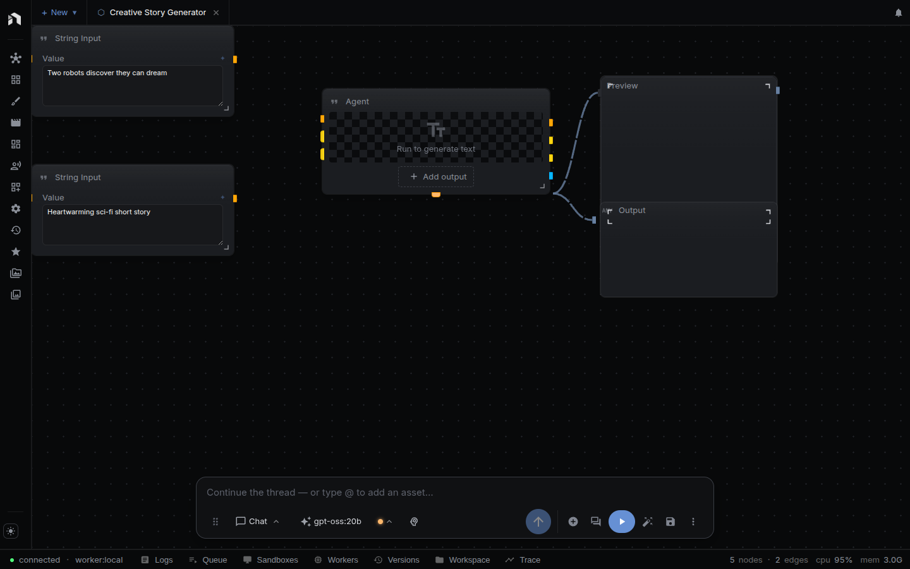

The **Workflow Graph View** is a read-only rendering of a workflow. Use it for visual snapshots, screenshots for documentation, and showing a graph without handing over the editor.

---

## Opening the View

Two pages render the graph, and both take the same inline-data option.

| Page | Source | Use |
|------|--------|-----|
| `/graph/:workflowId` in the app | Fetches the workflow with the signed-in session | Look at a stored workflow |
| `graph.html` (the standalone viewer) | `?data=<base64 JSON>` only, no backend | Screenshots and static embeds |

Unlike the [Workflow Editor]({{ '/workflow-editor' | relative_url }}), the graph view:

- Does **not** load the Node Menu, Inspector, or panel drawers.
- Does **not** allow editing. Nodes can't be added, moved, connected, selected, or deleted.
- Lays the graph out automatically instead of using the saved node positions.

There is no link to it in the editor. Build the URL yourself.

---

## Interactions

The view is a snapshot. Panning, scroll-zoom, pinch-zoom, and double-click-zoom are disabled. The view fits the whole graph to the viewport once when it loads. Running the workflow is not possible here. Open it in the editor first.

Query parameters:

| Parameter | Default | Effect |
|-----------|---------|--------|
| `data` | none | Base64-encoded workflow JSON. Renders it instead of fetching a stored workflow. Accepts a full workflow (`graph.nodes` and `graph.edges`) or `{ nodes, edges }` at the top level. |
| `bg` | `#1a1a2e` | Background color (in-app route only) |
| `padding` | `60` | Fit-view padding, as a percentage (in-app route only) |

For `/graph/json`, `data` is required. Without a workflow ID or `data`, the page shows an error.

Once the graph is laid out and fitted, the container gets `data-ready="true"` (and `data-ready="error"` on failure), so headless Chrome can wait on `[data-ready="true"]`. The in-app route also sets `data-workflow-name`. The standalone viewer uses a fixed 15% fit padding.

To screenshot a workflow JSON file, run `npx tsx scripts/screenshot-workflow.ts <workflow.json> [output.png]` from `web/`. It accepts `--width`, `--height`, `--bg`, and `--port`.

---

## Access Control

`/graph/:workflowId` loads the workflow through the same authenticated `workflows.get` call the editor uses. You need at least viewer access to the workflow. On a local install, loopback requests are trusted, so any workflow on your own machine opens. Inline `?data=` payloads need no access check because nothing is fetched.

---

## Next Steps

- [Workflow Editor]({{ '/workflow-editor' | relative_url }}) — the full editor where you author workflows
- [Chain Editor]({{ '/chain-editor' | relative_url }}) — the linear alternative
- [Authentication]({{ '/authentication' | relative_url }}) — how access is enforced
