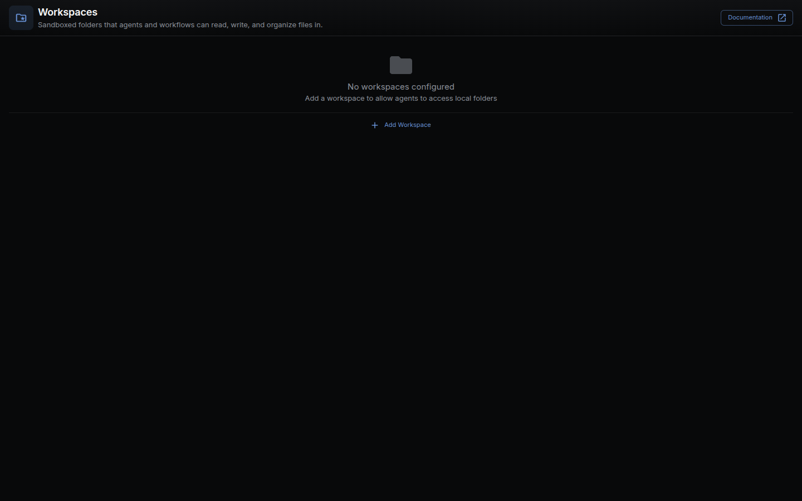

A **workspace** is a folder that NodeTool can safely access for reading and writing files during workflow runs, agent tasks, and chat sessions.

## Why workspaces exist

Workspaces make local file access explicit and controlled:

- Keep project files organized under known roots
- Limit file operations to approved directories
- Share the same folder roots across workflows and agent tools

## Manage workspaces in the app

Workspaces have their own full-screen page at `/workspaces` (not a Settings tab):

1. Open the app menu (click the logo at the top of the left rail).
2. Choose **Workspaces**.
3. Add one or more workspace directories on the Workspaces page.

After adding a workspace, NodeTool can browse files, list folders, and read/write files inside the configured root.

Workspaces also appear in the **Workspace** tab of the bottom panel, which
browses the current one as a file tree; on the composer chip, which names the
workspace a chat run writes into; and under **Advanced** in the workflow form,
which pins a workflow to one.

## What a cloud deployment allows

Pointing a workspace at a host folder browses the server's filesystem, so
`NODETOOL_ENV=production` refuses create, update, and delete
(`packages/websocket/src/trpc/routers/workspace.ts`). Reading stays open: every
user gets a server-managed workspace under the data dir, and listing and
downloading from it reach nothing the deployment did not create itself.

The server says which of the two applies in `can_manage` on `workspace.list`,
and the UI reads it through `useWorkspaces()`. So every workspace surface is
present on a cloud deployment, and the only missing control is **Add
Workspace**, which would open a folder picker with nothing to browse.

## Where workspaces are used

- **Agents and chat tools** for file operations
- **Workflow nodes** in the `lib.os` namespace (file read/write, path, and filesystem operations)
- **Project organization** when working with local assets and generated outputs

## Related docs

- [Workflow Editor](workflow-editor.md)
- [Storage Guide](storage.md)
- [Node Reference: `nodetool.code`](nodes/nodetool/code/) — workspace file
  access now goes through the Code node's `workspace.*` API
