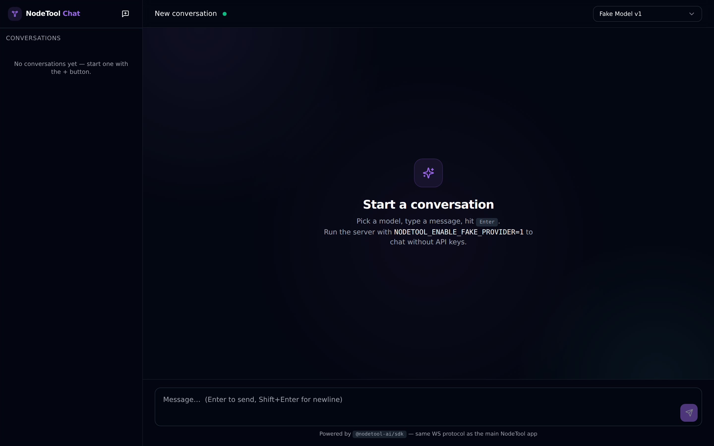
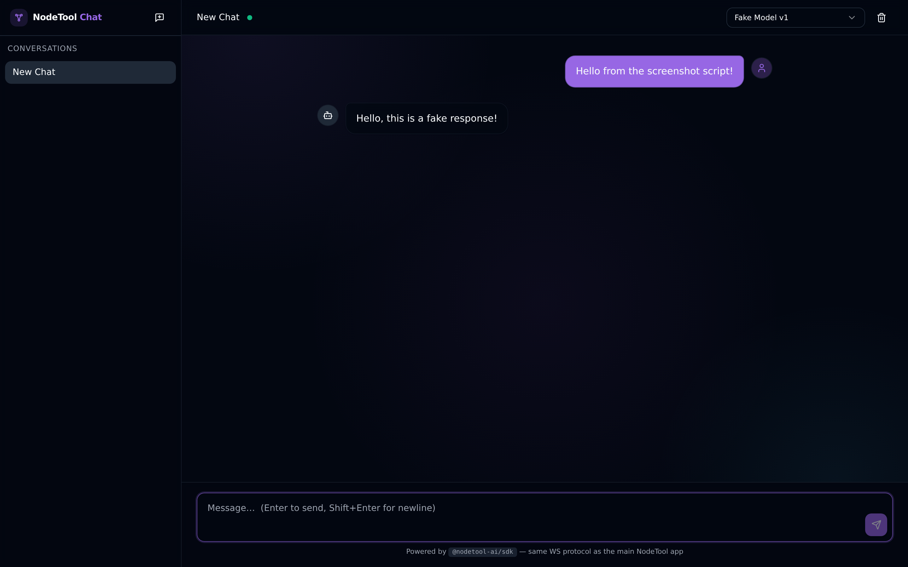
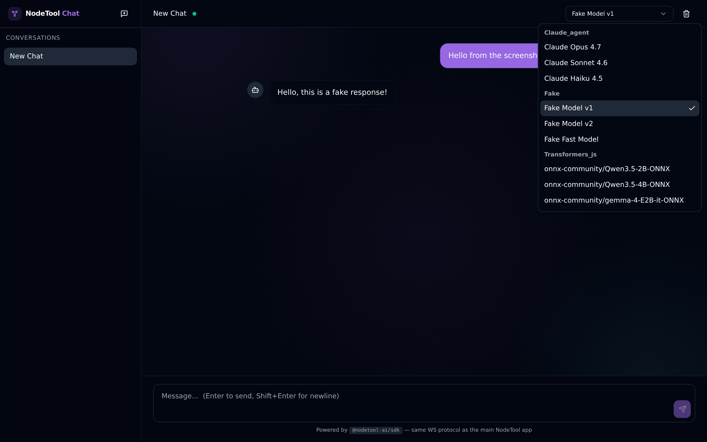

# NodeTool Chat — shadcn/ui example

A polished React chat client for the NodeTool TypeScript server.
Built with **Vite + React 19 + Tailwind + shadcn/ui** on top of
[`@nodetool-ai/sdk`](../../packages/sdk).





```
examples/chat_app/
├── index.html
├── vite.config.ts
├── tailwind.config.ts
├── postcss.config.cjs
├── tsconfig.json
├── package.json
├── scripts/
│   └── live-test.mjs              SDK-driven E2E smoke test
└── src/
    ├── main.tsx                   QueryClient + Tooltip + Toaster providers
    ├── App.tsx                    Top-level state: threads, messages, socket
    ├── styles.css                 Tailwind + shadcn theme tokens
    ├── lib/
    │   ├── sdk.ts                 createNodetoolClient() singleton
    │   └── utils.ts               cn() helper
    └── components/
        ├── sidebar.tsx
        ├── composer.tsx
        ├── message-list.tsx
        ├── model-picker.tsx
        ├── connection-dot.tsx
        └── ui/                    Vendored shadcn primitives
            ├── button.tsx
            ├── textarea.tsx
            ├── scroll-area.tsx
            ├── select.tsx
            ├── separator.tsx
            ├── tooltip.tsx
            └── avatar.tsx
```

## Quick start

```bash
# 1. From the repo root, build packages and install deps
nvm use
npm install
npm run build:packages

# 2. Start the NodeTool server with the fake provider enabled
NODETOOL_ENABLE_FAKE_PROVIDER=1 npm run dev:nodetool -- serve --port 7777

# 3. In another terminal, start the example dev server
npm run dev --workspace=@nodetool-ai/example-chat-app

# 4. Open http://localhost:5173
```

The Vite dev server proxies `/trpc`, `/api`, and `/ws` to
`http://localhost:7777`. Override with `PROXY_API_TARGET=...` if your
NodeTool server runs elsewhere.

## End-to-end smoke test

Drives the full flow without the browser:

```bash
NODETOOL_ENABLE_FAKE_PROVIDER=1 npm run dev:nodetool -- serve --port 7777   # one terminal
npm run live-test --workspace=@nodetool-ai/example-chat-app                 # another
```

The test prints PASS/FAIL for each stage and exits with the failure count.

## How it uses the SDK

```ts
import { createNodetoolClient } from "@nodetool-ai/sdk";

const nodetool = createNodetoolClient({ baseUrl: "http://localhost:7777" });

// Fully-typed tRPC surface — all routers (threads, messages, models, …)
const { threads } = await nodetool.trpc.threads.list.query({ limit: 50 });

// Convenience helper for the most common chat-startup query
const models = await nodetool.listLanguageModels();

// Streaming chat WebSocket — typed events
const socket = nodetool.chat();
socket.on("chunk",   (e) => /* e.content, e.done */);
socket.on("message", (m) => /* final assistant message */);
socket.on("error",   (e) => /* server-side failure */);
socket.connect();
socket.send({ threadId, text: "hi", model: "fake-model-v1", provider: "fake" });
socket.stop(threadId);
```

See [`packages/sdk/README.md`](../../packages/sdk/README.md) for the full
SDK surface, including the typed `ChatEvent` union and connection
state machine.

## Stack at a glance

- **`@nodetool-ai/sdk`** — typed tRPC client + chat WebSocket
- **TanStack Query v5** — caching & invalidation for threads/messages/models
- **Tailwind CSS v3** + **shadcn/ui** primitives (vendored, not generated)
- **Radix UI** for accessible scroll area, select, tooltip, separator, avatar
- **react-markdown + remark-gfm** for assistant message rendering
- **Sonner** toasts for inline errors
- **lucide-react** icons
