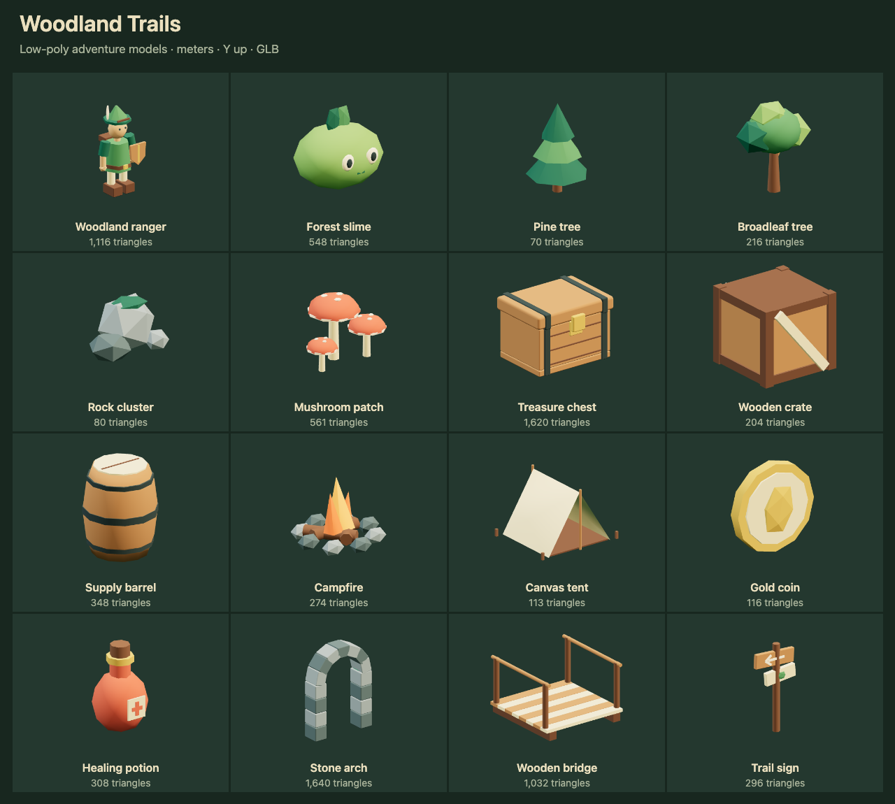

# Low-poly adventure models

Build woodland paths, campsites and ruins with a ranger, a friendly slime,
trees, treasure and modular scenery. These original models use the
[repository license](../../../../../../../LICENSE.txt).

## Use in NodeTool

Open **Low-poly Adventure Starter Pack** in the workflow examples. Run it to
expose each GLB as a named output, or connect a model constant to another node.
The workflow needs no provider credentials.

For a native 3D game, download a GLB from its preview and upload it to the
project. Import the owned asset with `generate_game_asset` using
`kind: "model"`, then install the returned candidate with
`install_native_game_asset`. See the
[native game skill](../../../../../../system-skills/native-game/SKILL.md#3d-authoring).
The example's `package://` references are bundled source files, not owned
asset IDs. Upload before using the game import tools.

## Scale and gameplay

Models use meters, Y up, forward -Z and ground-level origins. Each GLB
contains its geometry and materials, with no texture downloads. Mesh parts
and materials have names for editing. The palette uses moss green, timber,
canvas, stone and warm gold.

The wooden bridge is 2 × 2 meters and repeats along Z. Its deck is Y 0.26,
with rails on the X edges. Align neighboring ground surfaces to that height.
The arch opening is at least 1.26 meters wide below its curved top. The tent
has an open front and side stakes beyond its 2 m canvas footprint.

Keep physics and controls on a separate gameplay root with unit scale. Use
simple colliders for crates, barrels and rocks, trunk capsules for trees,
and sensors for coins, potions and mushrooms. Use separate pier colliders for
the arch and separate deck and rail boxes for the bridge. Keep shelter
openings clear. The fire has static emissive flames. Add a game light if it
should illuminate nearby objects.

[catalog.json](catalog.json) records exact rest-pose bounds, SHA-256 hashes,
triangle counts, clip names and suggested colliders. It contains no installed
physics shapes. Animation can extend beyond those rest-pose bounds.

## Animation

The forest slime includes a two-second **Idle** squash animation. Loop it on
the visual child. The treasure chest includes an **Open** clip lasting 0.8
seconds, with a hinged lid and a modeled interior. Play it once and hold the
last frame. Neither clip changes gameplay colliders.

The ranger is a static visual with a backpack and shield. It has no skeleton,
walk or jump clips. All other models are static. Add movement, interactions,
collecting and health effects in the game.

## Models

Dimensions are X × Y × Z in meters, measured in the rest pose.

| Model | Dimensions (m) | Triangles | Use |
|---|---|---|---|
| [Woodland ranger](woodland-ranger.glb) | 1.03 × 1.89 × 0.80 | 1116 | Player or friendly NPC visual with backpack and shield. Static, without a rig. |
| [Forest slime](forest-slime.glb) | 1.26 × 1.13 × 1.08 | 548 | Creature visual with a two-second squish Idle clip. |
| [Pine tree](pine-tree.glb) | 1.87 × 2.86 × 1.82 | 70 | Faceted evergreen for woodland paths and forests. |
| [Broadleaf tree](broadleaf-tree.glb) | 2.49 × 3.08 × 1.76 | 216 | Rounded faceted canopy for clearings and villages. |
| [Rock cluster](rock-cluster.glb) | 1.91 × 1.08 × 1.51 | 80 | Cover, path borders or environmental clutter. |
| [Mushroom patch](mushroom-patch.glb) | 1.06 × 0.77 × 0.69 | 561 | Forest decoration or gatherable food. |
| [Treasure chest](treasure-chest.glb) | 1.12 × 0.79 × 0.92 | 1620 | Treasure prop with an Open lid clip. Play once and clamp at the final frame. |
| [Wooden crate](wooden-crate.glb) | 0.90 × 0.84 × 0.97 | 204 | Stackable cargo or a movable puzzle prop. |
| [Supply barrel](supply-barrel.glb) | 0.83 × 1.02 × 0.83 | 348 | Village, dungeon or campsite prop. |
| [Campfire](campfire.glb) | 1.43 × 1.07 × 1.36 | 274 | Camp landmark with static emissive flames. Add a game light for illumination. |
| [Canvas tent](canvas-tent.glb) | 2.46 × 1.69 × 2.13 | 113 | Open-front 2 m campsite shelter with side stakes. |
| [Gold coin](gold-coin.glb) | 0.58 × 0.58 × 0.12 | 116 | Collectible currency. Animate the visual in game code if it should spin. |
| [Healing potion](healing-potion.glb) | 0.50 × 0.83 × 0.51 | 308 | Opaque faceted health pickup. |
| [Stone arch](stone-arch.glb) | 2.10 × 2.81 × 0.55 | 1640 | Ruined gateway with an open center. Opening is at least 1.26 m wide below the arch. |
| [Wooden bridge](wooden-bridge.glb) | 2.00 × 1.31 × 2.00 | 1032 | 2 × 2 m bridge segment. Repeat along Z. Deck is Y 0.26. |
| [Trail sign](trail-sign.glb) | 0.90 × 1.70 × 0.14 | 296 | Direction marker with an arrow and leaf-colored trail mark. |
