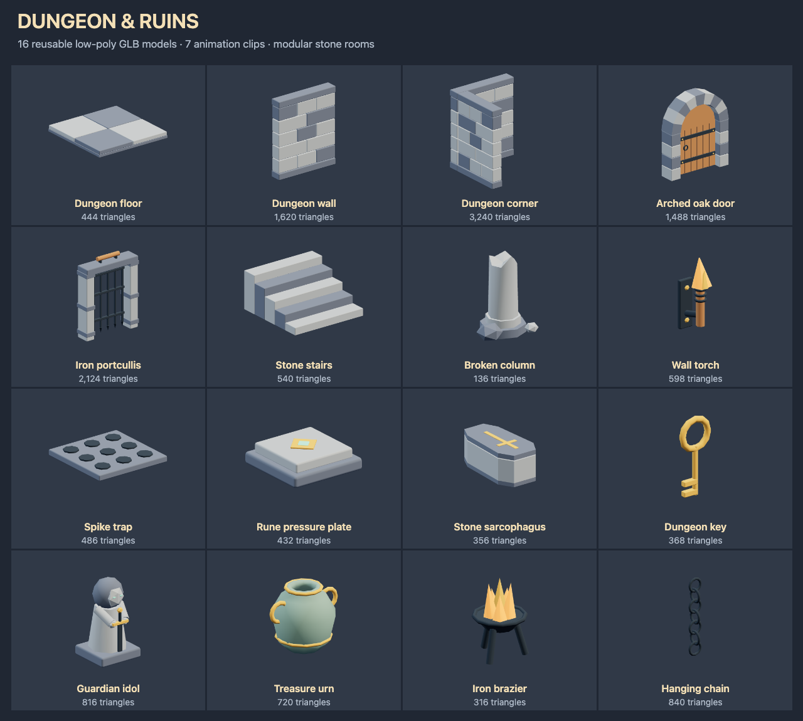

# Dungeon and ruins models

Build stone corridors, tomb rooms and puzzle chambers with slate masonry,
dark iron, worn timber and amber fire. These original models use the
[repository license](../../../../../../../LICENSE.txt).

## Use in NodeTool

Open **Dungeon and Ruins Starter Pack** in the workflow examples. Run it to
expose each GLB as a named output, or connect a model constant to another node.
The workflow needs no provider credentials.

For a native 3D game, download a GLB from its preview and upload it to the
project. Import the owned asset with `generate_game_asset` using
`kind: "model"`, then install the returned candidate with
`install_native_game_asset`. See the
[native game skill](../../../../../../system-skills/native-game/SKILL.md#3d-authoring).
The example's `package://` references are bundled source files, not owned
asset IDs. Upload before using the game import tools.

## Modular placement

Models use meters, Y up and forward -Z. Their lowest rest-pose point is Y 0.
Each GLB contains its geometry and materials, with no texture downloads.
Named mesh parts can be edited individually. There are no character rigs.

Floor and spike-trap tiles measure 2 × 2 m. The floor top is Y 0.16. Straight
walls are 2 m long and 2.4 m high. Place their bases at floor-top height. Wall
corners occupy a 2 × 2 m footprint and open toward -X and -Z. Use separate
wall colliders so their interiors remain walkable.

Stairs have five 0.20 m risers and rise toward +Z, ending at Y 1.00. The arched
door has approximately 1.36 m clear width below its curved top. Its hinge is
on -X and it swings toward -Z. Keep that area free. The portcullis needs
clearance above it to Y 4.23 while raised. Align the top of the hanging chain
to a ceiling using its catalog height. Torches face away from their back
plates toward -Z.

## Gameplay and animation

Keep physics and interactions on a separate gameplay root with unit scale.
The GLBs do not install collision, damage, puzzle logic, keys or loot. Use
simple wall and floor boxes. Keep doorways and the sarcophagus interior clear
by using separate frame and wall colliders. Add point lights for the torch
and brazier. Their emissive materials do not illuminate other objects.

Bind imported clips through `animator3d.clips` using the prepared selectors.
Play one-shot clips once and hold the final pose where indicated. Clip
playback does not update physics bodies or trigger gameplay events.

| Model | Clip | Seconds | Playback and gameplay connection |
|---|---|---|---|
| Arched oak door | Open | 1 | Swing once and hold. Move or disable the door collider. |
| Iron portcullis | Raise | 1.2 | Raise 2.10 m and hold. Move or disable the grate collider. |
| Wall torch | Flicker | 1 | Loop on the flame visual. Add light intensity variation separately if desired. |
| Spike trap | Extend | 0.3 | Raise concealed spikes and hold. Enable the hazard sensor separately. Restore the initial pose when resetting. |
| Rune pressure plate | Press | 0.25 | Press and hold while occupied. Restore the initial pose when released. |
| Stone sarcophagus | Open | 1.2 | Lift the rear-hinged lid and hold. Move or disable its collider and reveal loot separately. |
| Dungeon key | Spin | 3 | Loop on the visual child. Keep its pickup sensor still. |

The other nine models are static. The chain has no rope simulation. The urn
and brazier have no break or fire simulation. The guardian idol is scenery.

[catalog.json](catalog.json) records exact rest-pose bounds, SHA-256 hashes,
triangle counts, clip names, durations and suggested colliders. Animated
parts can extend beyond those rest-pose bounds.

## Models

Dimensions are X × Y × Z in meters, measured in the rest pose.

| Model | Dimensions (m) | Triangles | Use |
|---|---|---|---|
| [Dungeon floor](dungeon-floor.glb) | 2.00 × 0.16 × 2.00 | 444 | Two-meter flagstone floor tile with four slabs. |
| [Dungeon wall](dungeon-wall.glb) | 2.00 × 2.40 × 0.36 | 1620 | Two-meter straight masonry wall, 2.4 m tall. |
| [Dungeon corner](dungeon-corner.glb) | 2.00 × 2.40 × 2.00 | 3240 | L-shaped wall occupying a two-meter square, open toward -X and -Z. |
| [Arched oak door](arched-oak-door.glb) | 2.00 × 2.38 × 0.48 | 1488 | Stone arch with a hinged oak door. Open swings outward toward -Z. |
| [Iron portcullis](iron-portcullis.glb) | 2.04 × 2.66 × 0.52 | 2124 | Iron grate with a windlass and a Raise clip. |
| [Stone stairs](stone-stairs.glb) | 2.00 × 1.00 × 2.00 | 540 | Five 0.20 m steps rising toward +Z across a 2 × 2 m footprint. |
| [Broken column](broken-column.glb) | 1.15 × 1.56 × 0.94 | 136 | Octagonal column fragment with an uneven broken top and fallen stones. |
| [Wall torch](wall-torch.glb) | 0.33 × 1.16 × 0.52 | 598 | Wall-mounted timber torch with an emissive flame and Flicker clip. |
| [Spike trap](spike-trap.glb) | 2.00 × 0.19 × 2.00 | 486 | Two-meter floor trap. Extend raises nine concealed iron spikes. |
| [Rune pressure plate](rune-pressure-plate.glb) | 0.95 × 0.29 × 0.95 | 432 | Stone puzzle switch with an amber and turquoise diamond rune. |
| [Stone sarcophagus](stone-sarcophagus.glb) | 1.04 × 0.82 × 2.00 | 356 | Hollow stone tomb with an inlaid lid. Open lifts the lid around its rear hinge. |
| [Dungeon key](dungeon-key.glb) | 0.47 × 1.00 × 0.08 | 368 | Large golden key with a looping Spin clip. |
| [Guardian idol](guardian-idol.glb) | 0.90 × 1.57 × 0.85 | 816 | Hooded stone guardian holding a ceremonial sword. |
| [Treasure urn](treasure-urn.glb) | 1.02 × 0.81 × 0.80 | 720 | Open-neck ceramic urn with gold bands and handles. |
| [Iron brazier](iron-brazier.glb) | 0.87 × 1.31 × 0.89 | 316 | Three-legged iron fire bowl with static emissive flames. |
| [Hanging chain](hanging-chain.glb) | 0.32 × 1.64 × 0.32 | 840 | Seven interlocking iron links. Use the catalog height to align its top with a ceiling. |
