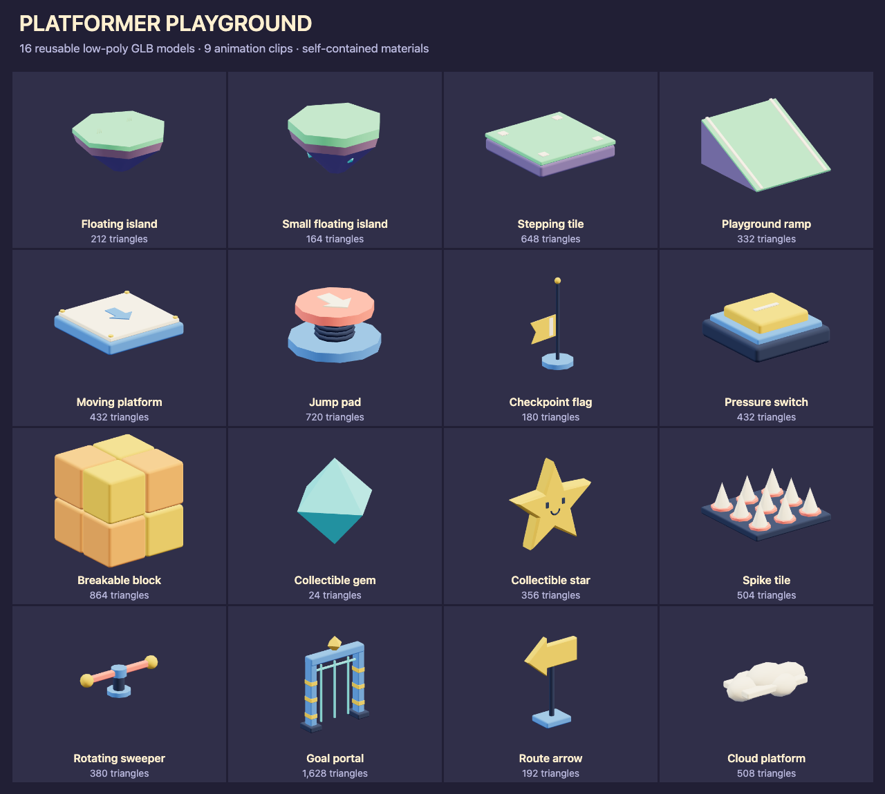

# Platformer playground models

Build floating jump routes with mint islands, blue mechanisms, yellow rewards
and coral hazards. These original models use the
[repository license](../../../../../../../LICENSE.txt).

## Use in NodeTool

Open **Platformer Playground Starter Pack** in the workflow examples. Run it
to expose each GLB as a named output, or connect a model constant to another
node. The workflow needs no provider credentials.

For a native 3D game, download a GLB from its preview and upload it to the
project. Import the owned asset with `generate_game_asset` using
`kind: "model"`, then install the returned candidate with
`install_native_game_asset`. See the
[native game skill](../../../../../../system-skills/native-game/SKILL.md#3d-authoring).
The example's `package://` references are bundled source files, not owned
asset IDs. Upload before using the game import tools.

## Scale and placement

Models use meters, Y up and forward -Z. Their lowest rest-pose point is Y 0.
Each GLB contains its geometry and materials, with no texture downloads.
Named mesh parts can be edited individually. There are no character rigs.

The stepping tile, moving platform and spike tile use 2 × 2 m footprints.
The stepping tile's main deck is Y 0.40, with corner inlays 0.025 m higher.
The moving platform's deck is Y 0.40, with small bolts above it. The ramp rises
toward +Z. Match its end heights to neighboring platforms using its bounds.
Floating island tops are Y 1.20 for the large island and Y 0.78 for the small
one. Cloud lobes are decorative, so choose a flat gameplay landing surface.

Keep physics and interactions on a separate gameplay root with unit scale.
The GLBs do not install colliders, triggers, checkpoints, damage or rewards.
Use simple platform boxes, a static wedge for the ramp, and sensors for
pickups and hazards. The goal opening needs separate post, lintel and gate
colliders.

[catalog.json](catalog.json) records exact rest-pose bounds, SHA-256 hashes,
triangle counts, clip names, durations and suggested colliders. Animations can
extend beyond those bounds.

## Animation clips

Bind imported clips through `animator3d.clips` using the prepared clip selectors.
Play one-shot actions once and hold the final pose where indicated.

| Model | Clip | Seconds | Playback and gameplay connection |
|---|---|---|---|
| Moving platform | Travel | 4 | Visual route preview: move 2 m along +X and return. In gameplay, disable this clip and drive the kinematic root so its collider and riders move together. |
| Jump pad | Bounce | 0.65 | Play once when triggered. The pad compresses, extends and returns. Apply the player's launch impulse separately. |
| Checkpoint flag | Activate | 0.8 | Play once and hold the raised banner. Save respawn state separately. |
| Pressure switch | Press | 0.25 | Play once and hold while occupied. Restore the initial pose when released. |
| Breakable block | Break | 0.55 | Play once. Eight chunks burst outward and shrink. Disable the collider at activation and despawn at the end. |
| Collectible gem | Spin | 2 | Loop on the visual child. Keep its pickup sensor still. |
| Collectible star | Spin | 3 | Loop on the visual child. Keep its pickup sensor still. |
| Rotating sweeper | Spin | 4 | Loop for a visual preview. For a physical hazard, disable the clip and rotate a matching gameplay arm and collider together. |
| Goal portal | Open | 1 | Play once and hold. Raise or disable the gate collider and enable the finish trigger separately. |

The other seven models are static. The break clip leaves tiny chunks visible
at its last frame, so remove the entity after playback. Clip playback alone
does not move physics bodies or carry a player.

## Models

Dimensions are X × Y × Z in meters, measured in the rest pose.

| Model | Dimensions (m) | Triangles | Use |
|---|---|---|---|
| [Floating island](floating-island.glb) | 2.63 × 1.39 × 2.57 | 212 | Broad seven-sided island with a grass cap and a tapered underside. |
| [Small floating island](small-floating-island.glb) | 1.36 × 0.78 × 1.33 | 164 | Compact landing island for jump sequences. |
| [Stepping tile](stepping-tile.glb) | 2.00 × 0.43 × 2.00 | 648 | Two-meter tile for platform paths and blockouts. |
| [Playground ramp](playground-ramp.glb) | 2.00 × 1.08 × 2.03 | 332 | Two-meter-wide ramp rising toward +Z with pale edge guides. |
| [Moving platform](moving-platform.glb) | 2.00 × 0.43 × 2.00 | 432 | Blue transport platform. Travel previews a 2 m lateral route and return. |
| [Jump pad](jump-pad.glb) | 1.34 × 0.69 × 1.34 | 720 | Coral spring pad with a squash-and-release Bounce clip. |
| [Checkpoint flag](checkpoint-flag.glb) | 1.14 × 2.16 × 0.76 | 180 | Yellow checkpoint pennant. Activate raises the banner up the pole. |
| [Pressure switch](pressure-switch.glb) | 0.95 × 0.37 × 0.95 | 432 | Recessed gold floor button with a Press clip. |
| [Breakable block](breakable-block.glb) | 0.97 × 0.97 × 0.97 | 864 | Eight separated chunks burst outward and shrink in the Break clip. |
| [Collectible gem](collectible-gem.glb) | 0.86 × 0.86 × 0.86 | 24 | Faceted turquoise gem with a looping Spin clip. |
| [Collectible star](collectible-star.glb) | 0.98 × 0.93 × 0.20 | 356 | Chunky smiling star reward with a looping Spin clip. |
| [Spike tile](spike-tile.glb) | 2.00 × 0.75 × 2.00 | 504 | Two-meter hazard tile with nine pale spikes and coral sockets. |
| [Rotating sweeper](rotating-sweeper.glb) | 2.86 × 0.94 × 0.76 | 380 | Coral obstacle arm with a four-second Spin clip. |
| [Goal portal](goal-portal.glb) | 2.31 × 2.95 × 0.60 | 1628 | Blue finish arch with a lift gate and gold diamond emblem. Open raises the gate. |
| [Route arrow](route-arrow.glb) | 1.05 × 1.59 × 0.45 | 192 | Raised directional arrow for guiding jump routes. |
| [Cloud platform](cloud-platform.glb) | 2.18 × 0.78 × 1.18 | 508 | Faceted cream cloud for floating rest stops and background clusters. |
