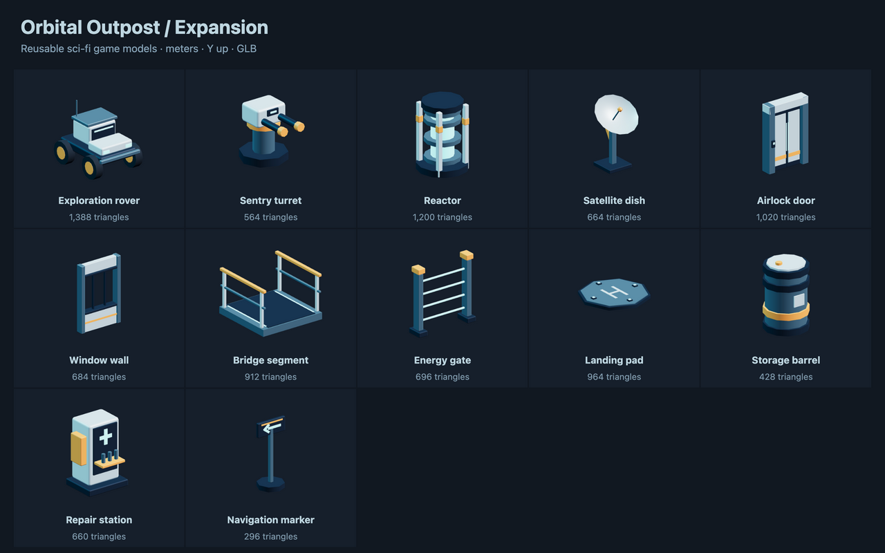

# Sci-fi outpost expansion

Add vehicles, machinery and station props to the
[starter pack](../scifi/README.md). Both sets share materials, meter scale,
Y up, forward -Z, ground-level origins and a 2 m station grid.
These original models use the [repository license](../../../../../../../LICENSE.txt).

## Use in NodeTool

Open **Sci-fi Outpost Expansion** in the workflow examples. Run it to expose
each GLB as a named output, or connect a model constant to another node.
For a native game, upload a GLB to the project and follow the
[starter pack import instructions](../scifi/README.md#use-in-nodetool).

All models in this set are static. The rover has no vehicle controller, the
turret has no targeting or firing behavior, and the airlock has no opening
animation. Add those behaviors in the game. Named mesh parts can be edited
in a model editor. Materials need no texture downloads. Emissive surfaces do
not cast light.

The airlock and window wall are 2 m wide and 3 m high. Place them along tile
boundaries, raised to the floor deck. Bridge segments repeat every 2 m along
Z, with rails on the X edges and a deck at Y 0.216. The landing pad is 4 m
across. Place its top and neighboring decks at the intended walking height.

Physics stays on a separate gameplay root. Use simple colliders for parked
vehicles and machinery, sensor boxes for energy beams, and separate deck and
rail boxes for bridges. An airlock collider must change if its leaves open.
The window has an open aperture rather than glass. Decide whether its game
collider should allow passage.

[catalog.json](catalog.json) records exact bounds, SHA-256 hashes, triangle
counts and suggested colliders. It contains no installed physics shapes.

## Models

Dimensions are X × Y × Z in meters.

| Model | Dimensions (m) | Triangles | Use |
|---|---|---|---|
| [Exploration rover](exploration-rover.glb) | 1.80 × 2.11 × 2.26 | 1388 | Static vehicle prop or scripted visual. No vehicle physics is included. |
| [Sentry turret](sentry-turret.glb) | 1.06 × 1.29 × 1.55 | 564 | Station defense prop. Add targeting and firing in game scripts. |
| [Reactor](reactor.glb) | 1.70 × 2.32 × 1.70 | 1200 | Power source or mission objective. Emission is visual only. |
| [Satellite dish](satellite-dish.glb) | 1.88 × 2.90 × 1.79 | 664 | Communications landmark. |
| [Airlock door](airlock-door.glb) | 2.00 × 3.00 × 0.61 | 1020 | Closed 2 m airlock. Named leaves can be edited separately. No opening animation. |
| [Window wall](window-wall.glb) | 2.00 × 3.00 × 0.35 | 684 | 2 m wall with an open observation window, without transparent glass. |
| [Bridge segment](bridge-segment.glb) | 2.00 × 1.36 × 2.00 | 912 | Repeat every 2 m along Z. Deck is Y 0.216. Rails run along X edges. |
| [Energy gate](energy-gate.glb) | 2.00 × 2.07 × 0.50 | 696 | Lit barrier or laser hazard visual. Opaque emissive beams. |
| [Landing pad](landing-pad.glb) | 4.00 × 0.31 × 4.00 | 964 | 4 m octagonal pad for a drone or destination marker. |
| [Storage barrel](storage-barrel.glb) | 0.88 × 1.37 × 0.88 | 428 | Supply container or destructible prop. |
| [Repair station](repair-station.glb) | 1.14 × 1.66 × 1.09 | 660 | Interaction point for health or equipment repairs. |
| [Navigation marker](navigation-marker.glb) | 0.90 × 1.95 × 0.76 | 296 | Directional sign. Rotate around Y to orient it in the level. |
