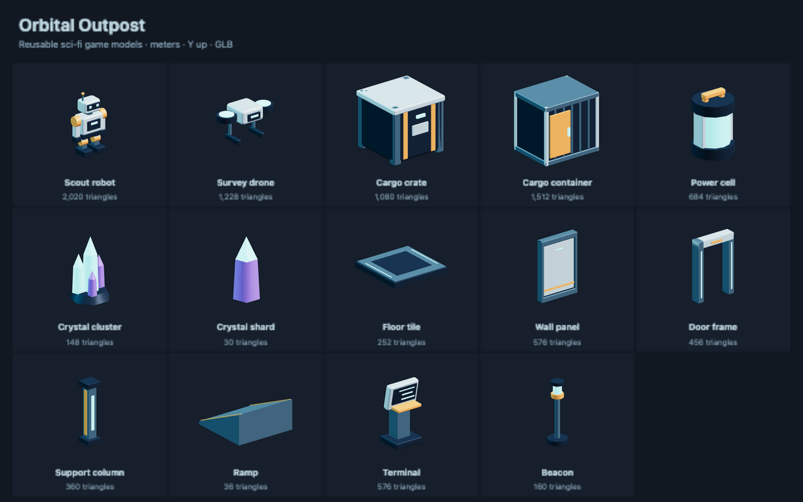

# Sci-fi game models

Build a station from modular walls, floors and ramps, then add robots, cargo
and collectible crystals. These original models ship with NodeTool and use the
[repository license](../../../../../../../LICENSE.txt).

## Use in NodeTool

Open **Sci-fi Game Model Starter Pack** in the workflow examples. Run it to
expose each GLB as a named output, or connect a model constant to another node.
The workflow needs no provider credentials.

For a native 3D game, download a GLB from its preview and upload it to the
project. Import that owned asset with `generate_game_asset` using `kind:
"model"`, then install the returned candidate with `install_native_game_asset`.
See the [native game skill](../../../../../../system-skills/native-game/SKILL.md#3d-authoring).
The `package://` references in the example are bundled source files, not owned
asset IDs. Upload before using the game import tools.

## Conventions

Models use meters, Y up, forward -Z and ground-level origins. GLBs contain all
geometry and materials, with no texture downloads or required extensions.
Mesh parts and materials have names for editing. Emissive surfaces need a game
light if they should illuminate nearby objects.

Station floors occupy 2 × 2 meters. Repeat them at multiples of 2 on X and Z.
Their deck is Y 0.212. Place wall and doorway centers on tile boundaries at
that height. Walls are 3 meters high. The doorway opening is 1.4 meters wide
and 2.65 meters high. The ramp rises toward -Z from 0.1 to 1 meter. Offset the
ramp to meet the intended deck and landing heights.

Models are visuals only. Keep physics and controls on a separate gameplay
root with unit scale. Use simple box or capsule colliders for props, and
separate boxes for the doorway so its opening stays passable. The ramp needs
a prepared convex hull or a static triangle-mesh collider. Collision
suggestions in [catalog.json](catalog.json) are starting points, not installed
colliders.

The scout robot includes a two-second **Idle** head animation. It has no skin,
skeleton, walk or jump clips. All other models are static.

The [outpost expansion](../scifi-expansion/README.md) adds matching vehicles,
machinery and station pieces.

## Models

Dimensions below are X × Y × Z. The catalog records exact bounds, SHA-256
hashes, triangle counts and clip names.

| Model | Dimensions (m) | Triangles | Use |
|---|---|---|---|
| [Scout robot](scout-robot.glb) | 1.12 × 1.96 × 0.53 | 2020 | Player or friendly NPC visual. Idle rotates the head. |
| [Survey drone](survey-drone.glb) | 1.52 × 0.84 × 0.71 | 1228 | Hovering NPC or pickup carrier. |
| [Cargo crate](cargo-crate.glb) | 1.04 × 1.00 × 1.08 | 1080 | Stackable movable prop. |
| [Cargo container](cargo-container.glb) | 2.08 × 2.00 × 1.77 | 1512 | Large obstacle or cover. |
| [Power cell](power-cell.glb) | 0.70 × 1.07 × 0.70 | 684 | Collectible energy or mission item. |
| [Crystal cluster](crystal-cluster.glb) | 1.07 × 1.75 × 1.05 | 148 | Resource deposit or environmental landmark. |
| [Crystal shard](crystal-shard.glb) | 0.34 × 0.85 × 0.33 | 30 | Small collectible. |
| [Floor tile](floor-tile.glb) | 2.00 × 0.21 × 2.00 | 252 | Repeat on a 2 m X/Z grid. Walkable deck is Y 0.212. |
| [Wall panel](wall-panel.glb) | 2.00 × 3.00 × 0.36 | 576 | 2 m wall segment. Place on tile boundaries, raised to deck height. |
| [Door frame](door-frame.glb) | 2.00 × 3.00 × 0.54 | 456 | Open passage, 1.4 m clear width and 2.65 m clear height. |
| [Support column](support-column.glb) | 0.72 × 3.00 × 0.72 | 360 | 3 m structural support. |
| [Ramp](ramp.glb) | 2.00 × 1.02 × 2.00 | 36 | 2 m square ramp rising toward -Z from 0.1 to 1 m. |
| [Terminal](terminal.glb) | 0.85 × 1.57 × 0.67 | 576 | Interaction point for doors or mission objectives. |
| [Beacon](beacon.glb) | 0.76 × 2.29 × 0.76 | 160 | Checkpoint or destination marker. Emissive material does not cast light. |
