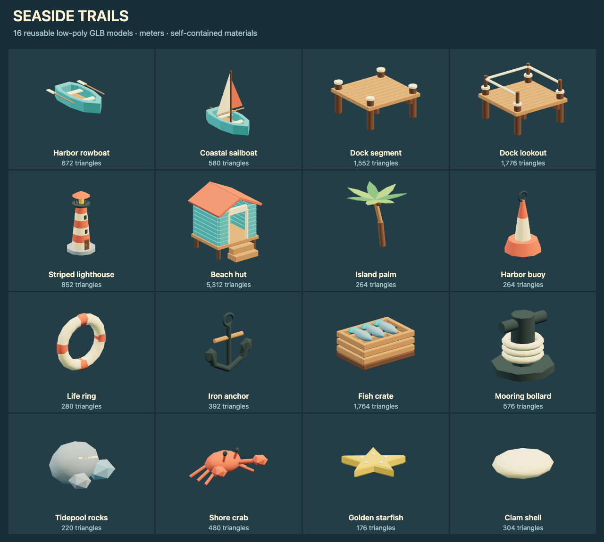

# Low-poly seaside models

Build harbors, beaches and island paths with boats, modular docks, coastal
landmarks and shore collectibles. These original models use the
[repository license](../../../../../../../LICENSE.txt).

## Use in NodeTool

Open **Low-poly Seaside Starter Pack** in the workflow examples. Run it to
expose each GLB as a named output, or connect a model constant to another node.
The workflow needs no provider credentials.

For a native 3D game, download a GLB from its preview and upload it to the
project. Import the owned asset with `generate_game_asset` using
`kind: "model"`, then install the returned candidate with
`install_native_game_asset`. See the
[native game skill](../../../../../../system-skills/native-game/SKILL.md#3d-authoring).
The example's `package://` references are bundled source files, not owned
asset IDs. Upload before using the game import tools.

## Scale and gameplay

Models use meters, Y up and forward -Z. Their lowest point is Y 0. Each GLB
contains its geometry and materials, with no texture downloads. Mesh parts
and materials have names for editing. The palette uses teal, coral, cream,
timber and slate.

Dock decks measure 2 × 2 meters, repeat along X or Z and have their top at
Y 0.80. Corner piles rise above the deck. The lookout has three railings with
an open approach on -Z. Place boats relative to the water surface using their
hull bottoms, then adjust the immersion depth to suit the scene. The beach hut
has an open doorway and a raised floor.

All models are static and have no skeletons or animation clips. Add boat
controls, buoyancy, water motion, crab movement and pickup behavior in the
game. The lighthouse has a solid lamp mesh and no installed light source.

Keep physics on a separate gameplay root with unit scale. Use deck and rail
boxes for docks, separate wall and step boxes for the hut, and simple hulls
for boats. Keep openings clear. Use sensors for collectibles and trunk
capsules for palms.

[catalog.json](catalog.json) records exact bounds, SHA-256 hashes, triangle
counts and suggested colliders. It contains no installed physics shapes.

## Models

Dimensions are X × Y × Z in meters.

| Model | Dimensions (m) | Triangles | Use |
|---|---|---|---|
| [Harbor rowboat](harbor-rowboat.glb) | 1.72 × 0.48 × 2.61 | 672 | Open hull with two seats and a pair of oars. |
| [Coastal sailboat](coastal-sailboat.glb) | 1.52 × 2.72 × 2.83 | 580 | Small boat with a cream mainsail and coral jib. |
| [Dock segment](dock-segment.glb) | 2.00 × 1.06 × 2.00 | 1552 | Two-meter repeatable pier deck with four timber piles. |
| [Dock lookout](dock-lookout.glb) | 2.00 × 1.42 × 2.00 | 1776 | Pier endpoint with three railings and an open approach on -Z. |
| [Striped lighthouse](striped-lighthouse.glb) | 1.60 × 3.63 × 1.68 | 852 | Compact landmark with alternating cream and coral tower bands. |
| [Beach hut](beach-hut.glb) | 1.83 × 2.12 × 2.07 | 5312 | Open doorway, raised timber floor and coral gable roof. |
| [Island palm](island-palm.glb) | 2.77 × 2.56 × 2.70 | 264 | Seven faceted fronds and a leaning trunk. |
| [Harbor buoy](harbor-buoy.glb) | 0.68 × 1.20 × 0.72 | 264 | Coral and cream floating route marker. |
| [Life ring](life-ring.glb) | 0.90 × 0.90 × 0.17 | 280 | Standing rescue ring with four coral bands. |
| [Iron anchor](iron-anchor.glb) | 1.04 × 1.07 × 0.12 | 392 | Stylized anchor with timber stock and ring shackle. |
| [Fish crate](fish-crate.glb) | 0.90 × 0.44 × 0.64 | 1764 | Slatted open crate with three stylized fish. |
| [Mooring bollard](mooring-bollard.glb) | 0.58 × 0.55 × 0.58 | 576 | Iron dock fixture with three modeled rope turns. |
| [Tidepool rocks](tidepool-rocks.glb) | 1.72 × 1.18 × 1.41 | 220 | Faceted shore rocks with pale shell details. |
| [Shore crab](shore-crab.glb) | 0.86 × 0.45 × 0.70 | 480 | Static coral crab with six legs, claws and raised eyes. |
| [Golden starfish](golden-starfish.glb) | 0.68 × 0.11 × 0.64 | 176 | Small five-point shore collectible. |
| [Clam shell](clam-shell.glb) | 0.66 × 0.24 × 0.60 | 304 | Cream shell with seven raised fan ribs. |
