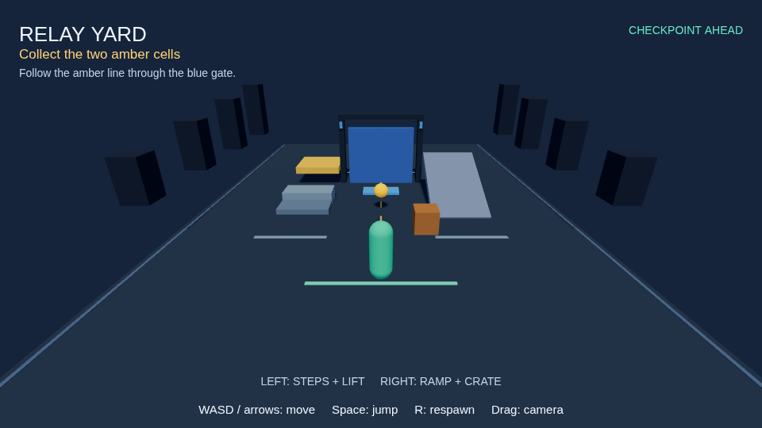
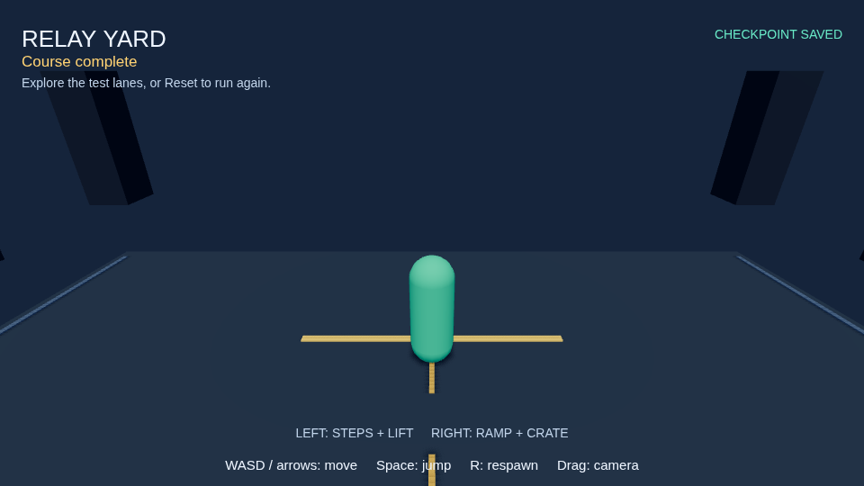

# Relay Yard

An asset-free 3D test course. Collect both amber cells along the center line,
pass the blue gate and activate the mint checkpoint. Optional lanes exercise
steps, a moving platform, a ramp and a pushable crate. WASD or arrows move,
Space jumps, R respawns, and dragging turns the camera. Falling off the yard
returns the player to the last checkpoint while preserving collected progress.

From the repository root, after `npm run build:packages`:

```bash
npm run nodetool -- game validate packages/game-runtime/samples/relay-yard/game.json
npm run nodetool -- game simulate packages/game-runtime/samples/relay-yard/game.json --ticks 165 --seed 1 --inputs packages/game-runtime/samples/relay-yard/completion.inputs.json --assertions packages/game-runtime/samples/relay-yard/completion.assertions.json --expect-score 2 --expect-win --verify-replay
npm run nodetool -- game build packages/game-runtime/samples/relay-yard/game.json --out .cache/relay-yard-web
python3 -m http.server 8893 --bind 127.0.0.1 --directory .cache/relay-yard-web
```

Open <http://127.0.0.1:8893/>. The build destination must be empty. The exported
player includes its runtime and needs no external network requests. Pause stops
simulation. Reset clears the run.

The recording wins at tick 149 and continues through tick 165 so the completion
HUD is visible. Assertions check collection, gate movement, checkpoint approach
and the finish. Replay compares every snapshot and ordered event after restoring
the midpoint.




