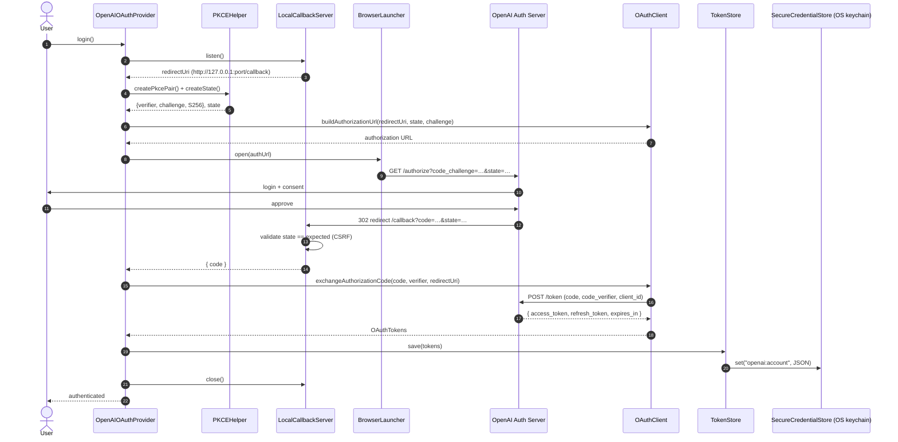
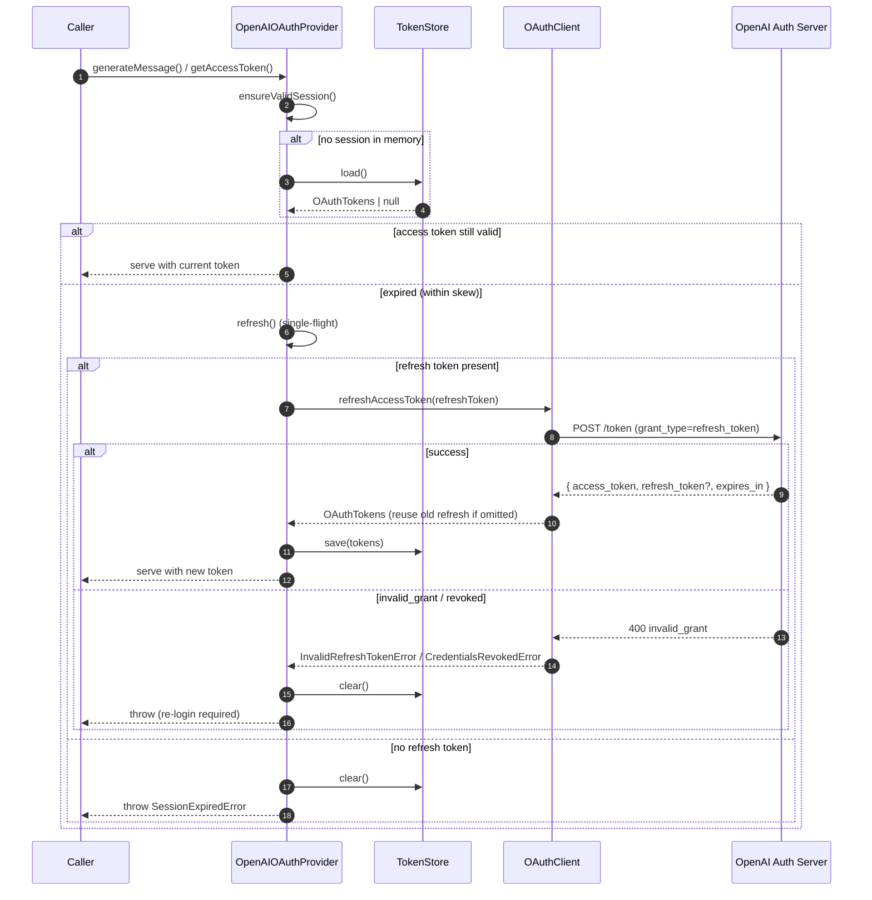

# OpenAI OAuth authentication

Browser-based OAuth 2.0 (Authorization Code + PKCE) for the OpenAI provider, as
an alternative to pasting a static API key. Every request is served by a
short-lived access token that is refreshed transparently; the refresh token is
held in the OS credential store and never written to a plaintext config file.

## Design principles

- **Layered, single-responsibility components.** OAuth protocol, token storage,
  secret storage, the callback listener, and the provider are separate units.
- **Dependency injection everywhere.** Every collaborator (fetch, clock,
  randomness, keyring, browser, callback server) is injected, so the whole
  system is testable without a network or a browser.
- **No singleton / module-level state.** Each login owns its instances.
- **Async-only, fully typed.** No `any`; all I/O is `Promise`-based.
- **Secrets never leak.** Tokens are never logged, never put in error messages,
  and never written to plaintext files. See [`redaction.ts`](./redaction.ts).

## File structure

```
packages/runtime/src/providers/oauth/
├── index.ts                     Public surface + createOpenAIOAuthProvider()
├── types.ts                     Shared data types (OAuthTokens, configs, Clock)
├── errors.ts                    Typed error hierarchy (one per failure mode)
├── redaction.ts                 Secret redaction for logs/errors
├── pkce-helper.ts               PKCEHelper — PKCE verifier/challenge + CSRF state
├── oauth-client.ts              OAuthClient — authorize URL, code exchange, refresh, revoke
├── local-callback-server.ts     LocalCallbackServer — loopback redirect receiver
├── browser-launcher.ts          BrowserLauncher — opens the system browser
├── secure-credential-store.ts   SecureCredentialStore — opaque secrets (OS keychain)
├── token-store.ts               TokenStore — token persistence over a credential store
└── openai-oauth-provider.ts     OpenAIOAuthProvider — orchestration + OpenAI capabilities

packages/runtime/tests/providers/oauth/
├── pkce-helper.test.ts              unit
├── oauth-client.test.ts             unit
├── stores.test.ts                   unit (TokenStore + SecureCredentialStore)
├── redaction.test.ts                unit
├── local-callback-server.test.ts    unit (real loopback sockets)
├── openai-oauth-provider.test.ts    unit (orchestration with injected fakes)
└── oauth-flow.integration.test.ts   integration (full flow over real sockets)
```

### Layering

```
OpenAIOAuthProvider                orchestration + inherited OpenAI capabilities
  ├─ OAuthClient                   OAuth 2.0 protocol (PKCE code exchange/refresh)
  ├─ PKCEHelper                    PKCE + CSRF-state generation
  ├─ LocalCallbackServer           localhost redirect receiver
  ├─ BrowserLauncher               opens the system browser
  └─ TokenStore                    token persistence
       └─ SecureCredentialStore    opaque secret persistence (OS keychain)
```

## Usage

```ts
import { createOpenAIOAuthProvider } from "@nodetool-ai/runtime/oauth";

const provider = createOpenAIOAuthProvider({
  clientId: process.env.OPENAI_OAUTH_CLIENT_ID!,
  accountId: currentUser.id // namespaces stored tokens
});

// One-time interactive login (opens the browser).
if (!(await provider.isAuthenticated())) {
  await provider.login({ timeoutMs: 300_000 });
}

// Use it like any other provider — tokens refresh automatically.
const reply = await provider.generateMessage({ model: "gpt-5.4-mini", messages });

// Later:
await provider.logout(); // revokes + clears stored tokens
```

For tests, swap in the in-memory backends:

```ts
new OpenAIOAuthProvider({
  oauthClient: new OAuthClient({ config, fetchFn: fakeFetch, clock }),
  tokenStore: new InMemoryTokenStore(),
  browserLauncher: { open: async () => {} },
  callbackServerFactory: () => fakeServer,
  openAIClientFactory: (token) => fakeOpenAIClient
});
```

## Login flow (Authorization Code + PKCE)



Failure modes on this path: `BrowserLaunchError` (open fails),
`CallbackTimeoutError` (no redirect within the timeout), `StateMismatchError`
(CSRF), `AuthorizationDeniedError` (user denies), `OAuthNetworkError` /
`TokenExchangeError` (token endpoint).

## Token refresh flow

Triggered lazily by any request (`generateMessage` / `generateMessages` /
`getAccessToken`) when the cached access token is within the expiry skew.
Concurrent callers share a single in-flight refresh.



## Error model

All errors extend `OAuthError` and carry a stable `code`:

| Error | code | Cause |
|---|---|---|
| `InvalidRefreshTokenError` | `invalid_refresh_token` | Refresh rejected (`invalid_grant`) |
| `SessionExpiredError` | `session_expired` | Expired with no refresh token |
| `BrowserLaunchError` | `browser_launch_failed` | Default browser would not start |
| `CallbackTimeoutError` | `callback_timeout` | No redirect within the timeout |
| `OAuthNetworkError` | `network_error` | DNS/TLS/connection/5xx failure |
| `CredentialsRevokedError` | `credentials_revoked` | Grant revoked server-side |
| `StateMismatchError` | `state_mismatch` | CSRF: `state` did not match |
| `AuthorizationDeniedError` | `authorization_denied` | User denied consent |
| `TokenExchangeError` | `token_exchange_failed` | Code→token exchange failed |
| `NotAuthenticatedError` | `not_authenticated` | Used before `login()` |

## Security checklist

- ✅ **PKCE required** — `S256` only; verifier never leaves the client until the
  token exchange.
- ✅ **CSRF state validation** — `LocalCallbackServer` rejects any callback whose
  `state` does not match before reading the `code`.
- ✅ **Tokens never logged** — redacted via `redaction.ts`; only non-secret
  metadata (scope, expiry) is logged.
- ✅ **No plaintext token files** — persistence goes only through
  `SecureCredentialStore`.
- ✅ **Refresh tokens encrypted by the OS credential store** — the default
  `KeychainSecureCredentialStore` uses the platform keychain (`keytar`).
- ✅ **Bearer not exposed to containers** — `getContainerEnv()` returns `{}` so
  the short-lived OAuth token is not baked into a code-runner environment.

> Note: `DEFAULT_OPENAI_OAUTH_CONFIG` endpoints are sensible placeholders.
> Point `oauthConfig` at OpenAI's published authorization/token/revocation
> endpoints and the client id registered for your application.

## Two host integrations

This subsystem (a localhost-callback flow that opens the OS browser) is the
right fit for desktop/CLI hosts where the Node process can both open a browser
and listen on loopback.

The **web app** uses a complementary server-side flow that shares this module's
protocol layer (`OAuthClient` + PKCE) but receives the redirect on the API
server's own `/api/oauth/openai/callback` route rather than a per-login
loopback server:

- Backend: `packages/websocket/src/oauth-api.ts` exposes
  `/api/oauth/openai/{start,callback,tokens,disconnect}`. `start` returns the
  authorization URL (built via `OAuthClient`), `callback` exchanges the code and
  persists tokens through the encrypted `OAuthCredential` model. It activates
  only when `OPENAI_OAUTH_CLIENT_ID` is set (endpoints/scopes are env-overridable
  via `OPENAI_OAUTH_AUTHORIZATION_URL`, `OPENAI_OAUTH_TOKEN_URL`,
  `OPENAI_OAUTH_USERINFO_URL`, `OPENAI_OAUTH_SCOPES`).
- Frontend: the **Settings → Integrations** panel
  (`web/src/components/menus/RemoteSettingsMenu.tsx`) renders an
  "OpenAI Authentication" section with **Connect with OpenAI** / **Disconnect**
  buttons that open the auth URL and poll `/api/oauth/openai/tokens` for
  completion.
