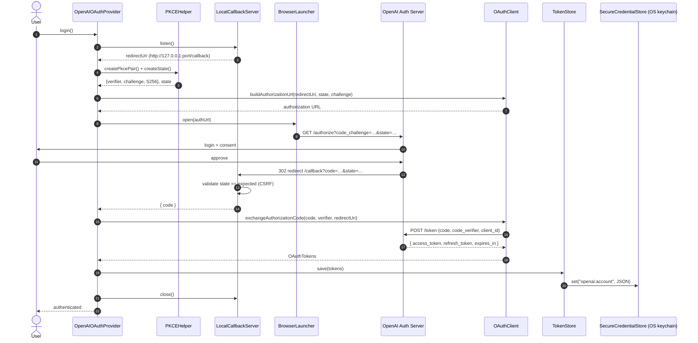
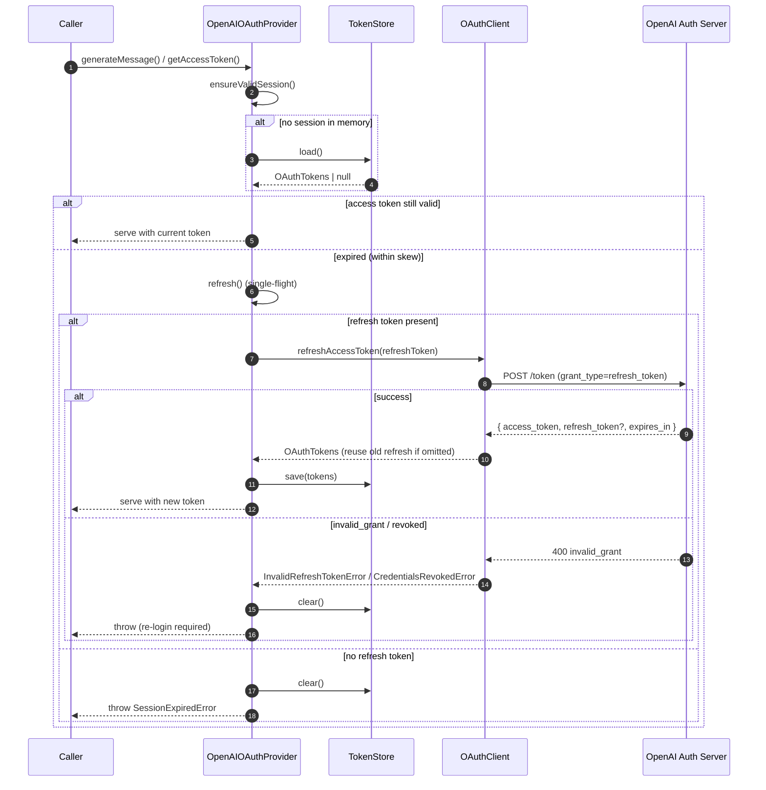

# Provider OAuth authentication

Two independent flows live here: the OpenAI/Codex login (below) and the
[Claude Code login](#claude-code-login-claude-subscription), which share the
protocol primitives (PKCE, loopback listener, typed errors, redaction) but
persist to different stores.

## OpenAI OAuth authentication

Browser-based OAuth 2.0 (Authorization Code + PKCE) for the OpenAI provider, as
an alternative to pasting a static API key. Every request is served by a
short-lived access token that is refreshed transparently; the refresh token is
held in the OS credential store and never written to a plaintext config file.

## Design principles

- **Layered, single-responsibility components.** OAuth protocol, token storage,
  secret storage, the callback listener, and the provider are separate units.
- **Dependency injection everywhere.** Every collaborator (fetch, clock,
  randomness, keyring, browser, callback server) is injected, so the whole
  system is testable without a network or a browser.
- **No singleton / module-level state.** Each login owns its instances.
- **Async-only, fully typed.** No `any`; all I/O is `Promise`-based.
- **Secrets never leak.** Tokens are never logged, never put in error messages,
  and never written to plaintext files. See [`redaction.ts`](./redaction.ts).

## File structure

```
packages/runtime/src/providers/oauth/
├── index.ts                     Public surface + createOpenAIOAuthProvider()
├── types.ts                     Shared data types (OAuthTokens, configs, Clock)
├── errors.ts                    Typed error hierarchy (one per failure mode)
├── redaction.ts                 Secret redaction for logs/errors
├── pkce-helper.ts               PKCEHelper — PKCE verifier/challenge + CSRF state
├── oauth-client.ts              OAuthClient — authorize URL, code exchange, refresh, revoke
├── local-callback-server.ts     LocalCallbackServer — loopback redirect receiver
├── browser-launcher.ts          BrowserLauncher — opens the system browser
├── secure-credential-store.ts   SecureCredentialStore — opaque secrets (OS keychain)
├── token-store.ts               TokenStore — token persistence over a credential store
├── openai-oauth-provider.ts     OpenAIOAuthProvider — orchestration + OpenAI capabilities
├── claude-code-oauth-client.ts  ClaudeCodeOAuthClient — Anthropic's JSON token endpoint
├── claude-code-credentials.ts   ClaudeCodeCredentialsStore — ~/.claude/.credentials.json
└── claude-code-login.ts         ClaudeCodeLogin — orchestration (loopback + manual paste)

packages/runtime/tests/providers/oauth/
├── pkce-helper.test.ts              unit
├── oauth-client.test.ts             unit
├── stores.test.ts                   unit (TokenStore + SecureCredentialStore)
├── redaction.test.ts                unit
├── local-callback-server.test.ts    unit (real loopback sockets)
├── openai-oauth-provider.test.ts    unit (orchestration with injected fakes)
├── oauth-flow.integration.test.ts   integration (full flow over real sockets)
└── claude-code-oauth.test.ts        unit + loopback integration (Claude Code flow)
```

### Layering

```
OpenAIOAuthProvider                orchestration + inherited OpenAI capabilities
  ├─ OAuthClient                   OAuth 2.0 protocol (PKCE code exchange/refresh)
  ├─ PKCEHelper                    PKCE + CSRF-state generation
  ├─ LocalCallbackServer           localhost redirect receiver
  ├─ BrowserLauncher               opens the system browser
  └─ TokenStore                    token persistence
       └─ SecureCredentialStore    opaque secret persistence (OS keychain)
```

## Usage

```ts
import { createOpenAIOAuthProvider } from "@nodetool-ai/runtime/oauth";

const provider = createOpenAIOAuthProvider({
  clientId: process.env.OPENAI_OAUTH_CLIENT_ID!,
  accountId: currentUser.id // namespaces stored tokens
});

// One-time interactive login (opens the browser).
if (!(await provider.isAuthenticated())) {
  await provider.login({ timeoutMs: 300_000 });
}

// Use it like any other provider — tokens refresh automatically.
const reply = await provider.generateMessage({ model: "gpt-5.4-mini", messages });

// Later:
await provider.logout(); // revokes + clears stored tokens
```

For tests, swap in the in-memory backends:

```ts
new OpenAIOAuthProvider({
  oauthClient: new OAuthClient({ config, fetchFn: fakeFetch, clock }),
  tokenStore: new InMemoryTokenStore(),
  browserLauncher: { open: async () => {} },
  callbackServerFactory: () => fakeServer,
  openAIClientFactory: (token) => fakeOpenAIClient
});
```

## Login flow (Authorization Code + PKCE)


```mermaid
sequenceDiagram
    autonumber
    actor User
    participant Provider as OpenAIOAuthProvider
    participant PKCE as PKCEHelper
    participant CB as LocalCallbackServer
    participant Browser as BrowserLauncher
    participant Auth as OpenAI Auth Server
    participant Client as OAuthClient
    participant Store as TokenStore
    participant Sec as SecureCredentialStore (OS keychain)

    User->>Provider: login()
    Provider->>CB: listen()
    CB-->>Provider: redirectUri (http://127.0.0.1:port/callback)
    Provider->>PKCE: createPkcePair() + createState()
    PKCE-->>Provider: {verifier, challenge, S256}, state
    Provider->>Client: buildAuthorizationUrl(redirectUri, state, challenge)
    Client-->>Provider: authorization URL
    Provider->>Browser: open(authUrl)
    Browser->>Auth: GET /authorize?code_challenge=…&state=…
    Auth->>User: login + consent
    User->>Auth: approve
    Auth->>CB: 302 redirect /callback?code=…&state=…
    CB->>CB: validate state == expected (CSRF)
    CB-->>Provider: { code }
    Provider->>Client: exchangeAuthorizationCode(code, verifier, redirectUri)
    Client->>Auth: POST /token (code, code_verifier, client_id)
    Auth-->>Client: { access_token, refresh_token, expires_in }
    Client-->>Provider: OAuthTokens
    Provider->>Store: save(tokens)
    Store->>Sec: set("openai:account", JSON)
    Provider->>CB: close()
    Provider-->>User: authenticated
```

Failure modes on this path: `BrowserLaunchError` (open fails),
`CallbackTimeoutError` (no redirect within the timeout), `StateMismatchError`
(CSRF), `AuthorizationDeniedError` (user denies), `OAuthNetworkError` /
`TokenExchangeError` (token endpoint).

## Token refresh flow

Triggered lazily by any request (`generateMessage` / `generateMessages` /
`getAccessToken`) when the cached access token is within the expiry skew.
Concurrent callers share a single in-flight refresh.


```mermaid
sequenceDiagram
    autonumber
    participant Caller
    participant Provider as OpenAIOAuthProvider
    participant Store as TokenStore
    participant Client as OAuthClient
    participant Auth as OpenAI Auth Server

    Caller->>Provider: generateMessage() / getAccessToken()
    Provider->>Provider: ensureValidSession()
    alt no session in memory
        Provider->>Store: load()
        Store-->>Provider: OAuthTokens | null
    end
    alt access token still valid
        Provider-->>Caller: serve with current token
    else expired (within skew)
        Provider->>Provider: refresh() (single-flight)
        alt refresh token present
            Provider->>Client: refreshAccessToken(refreshToken)
            Client->>Auth: POST /token (grant_type=refresh_token)
            alt success
                Auth-->>Client: { access_token, refresh_token?, expires_in }
                Client-->>Provider: OAuthTokens (reuse old refresh if omitted)
                Provider->>Store: save(tokens)
                Provider-->>Caller: serve with new token
            else invalid_grant / revoked
                Auth-->>Client: 400 invalid_grant
                Client-->>Provider: InvalidRefreshTokenError / CredentialsRevokedError
                Provider->>Store: clear()
                Provider-->>Caller: throw (re-login required)
            end
        else no refresh token
            Provider->>Store: clear()
            Provider-->>Caller: throw SessionExpiredError
        end
    end
```

## Error model

All errors extend `OAuthError` and carry a stable `code`:

| Error | code | Cause |
|---|---|---|
| `InvalidRefreshTokenError` | `invalid_refresh_token` | Refresh rejected (`invalid_grant`) |
| `SessionExpiredError` | `session_expired` | Expired with no refresh token |
| `BrowserLaunchError` | `browser_launch_failed` | Default browser would not start |
| `CallbackTimeoutError` | `callback_timeout` | No redirect within the timeout |
| `OAuthNetworkError` | `network_error` | DNS/TLS/connection/5xx failure |
| `CredentialsRevokedError` | `credentials_revoked` | Grant revoked server-side |
| `StateMismatchError` | `state_mismatch` | CSRF: `state` did not match |
| `AuthorizationDeniedError` | `authorization_denied` | User denied consent |
| `TokenExchangeError` | `token_exchange_failed` | Code→token exchange failed |
| `NotAuthenticatedError` | `not_authenticated` | Used before `login()` |

## Security checklist

- ✅ **PKCE required** — `S256` only; verifier never leaves the client until the
  token exchange.
- ✅ **CSRF state validation** — `LocalCallbackServer` rejects any callback whose
  `state` does not match before reading the `code`.
- ✅ **Tokens never logged** — redacted via `redaction.ts`; only non-secret
  metadata (scope, expiry) is logged.
- ✅ **No plaintext token files** — persistence goes only through
  `SecureCredentialStore`.
- ✅ **Refresh tokens encrypted by the OS credential store** — the default
  `KeychainSecureCredentialStore` uses the platform keychain (`keytar`).
- ✅ **Bearer not exposed to containers** — `getContainerEnv()` returns `{}` so
  the short-lived OAuth token is not baked into a code-runner environment.

> Note: `DEFAULT_OPENAI_OAUTH_CONFIG` endpoints are sensible placeholders.
> Point `oauthConfig` at OpenAI's published authorization/token/revocation
> endpoints and the client id registered for your application.

## Two host integrations

This subsystem (a localhost-callback flow that opens the OS browser) is the
right fit for desktop/CLI hosts where the Node process can both open a browser
and listen on loopback.

The **web app** drives the same Codex flow from the API server, sharing this
module's protocol layer (`OAuthClient` + PKCE + `LocalCallbackServer`). Because
the public Codex client only permits the loopback redirect
`http://localhost:1455/auth/callback`, the redirect cannot bounce through a
server route. `localhost` resolves in the *browser's* machine, so the server
finishes the login one of two ways:

- Backend: `packages/websocket/src/oauth-api.ts` exposes
  `/api/oauth/openai/{start,complete,tokens,disconnect}`. `start` builds the
  Codex authorization URL (`createCodexOAuthProvider`'s config — public client
  id, no secret, Codex scopes/params) and records the pending login under its
  CSRF state for 10 minutes. On a same-machine host it also binds a one-shot
  `LocalCallbackServer` on port 1455 and completes the exchange in the
  background. On a shared server — `isAuthEnforced()`, or `?manual=true` — it
  binds nothing and answers `manual: true`: the browser lands on its own
  localhost with the code in the address bar, and the user pastes that address
  to `complete`, which checks the state against the requesting user and
  exchanges the code server-side. Both paths persist tokens through the
  encrypted `OAuthCredential` model. The published client id is overridable via
  `CODEX_OAUTH_CLIENT_ID`.
- Frontend: the provider cards in **Settings → API Keys** and the onboarding
  dialog call `useOAuthConnection("openai")`, which opens the auth URL and polls
  `/api/oauth/openai/tokens`. When `start` answers `manual: true` the card also
  raises `OAuthManualCompletionDialog` to take the pasted address.

## Claude Code login (Claude subscription)

`ClaudeCodeLogin` signs in with a Claude Pro/Max subscription using the same
public OAuth client the `claude` CLI uses, and writes the result to the file the
Claude Agent SDK authenticates from. A NodeTool login and a `claude login` are
therefore interchangeable: `ClaudeAgentProvider` needs no token plumbing, because
the SDK's bundled binary reads the credentials itself.

```
ClaudeCodeLogin                       orchestration (begin → complete → persist)
  ├─ ClaudeCodeOAuthClient            protocol: authorize URL, exchange, refresh, profile
  ├─ PKCEHelper                       PKCE + CSRF state       (shared)
  ├─ LocalCallbackServer              loopback receiver       (shared)
  ├─ BrowserLauncher                  opens the browser       (shared)
  └─ ClaudeCodeCredentialsStore       ~/.claude/.credentials.json
```

### Three deviations from RFC 6749

Anthropic's server is not a stock OAuth 2.0 provider, which is why
`ClaudeCodeOAuthClient` is a sibling of `OAuthClient` rather than a
configuration of it:

1. The token endpoint takes a **JSON** body, not `application/x-www-form-urlencoded`.
2. The code exchange **echoes the CSRF `state`** in that body; without it the
   exchange is rejected.
3. The authorization URL carries an extra **`code=true`** flag, which asks the
   server to also display a paste-able code.

Refresh also narrows the scope set: `org:create_api_key` is requested at login
(it lets the console mint an API key) but dropped on every refresh.

### Two ways to finish one authorization request

`begin()` mints one PKCE pair and state, then hands back both URLs:

- **Loopback** (`authUrl`) — the browser is redirected to a `127.0.0.1`
  listener on the CLI's own port, `CLAUDE_CODE_CALLBACK_PORT` (54545); the
  registered redirect uses the `localhost` spelling, matching the CLI. Only
  works when the browser runs on this machine, and fails naming the port when
  a `claude login` already holds it.
- **Manual** (`manualAuthUrl`) — the console shows `<code>#<state>` to paste
  back. The only option on a headless or remote host, and what the server's
  `start` offers on a shared deployment (`isAuthEnforced()`, or `?manual=true`),
  the same way the Codex route does.

They differ only in `redirect_uri`, which must match between the authorization
request and the exchange — hence `waitForRedirect()` and
`completeWithPastedCode()` are separate completions of the same pending login.

### Credential file

`$CLAUDE_CONFIG_DIR/.credentials.json` (default `~/.claude/.credentials.json`),
mode `0600`, written through a same-directory temp file so a concurrent `claude`
process never reads a half-written file. Keys the CLI owns are preserved; only
`claudeAiOauth` is replaced:

```json
{
  "claudeAiOauth": {
    "accessToken": "…",
    "refreshToken": "…",
    "expiresAt": 1799999999000,
    "scopes": ["user:profile", "user:inference", "…"],
    "subscriptionType": "max",
    "rateLimitTier": null
  }
}
```

Because that file is per-machine-user rather than per-NodeTool-user, the login is
process-wide: it is the credential the server's own `claude` subprocess will use.

`refresh()` exists for callers that need a live token *outside* the SDK (status
display, `CLAUDE_CODE_OAUTH_TOKEN`). Running the provider does not require it —
the CLI refreshes on its own.

### Entry points

```bash
nodetool auth claude login      # --console, --manual, --no-browser, --json
nodetool auth claude status
nodetool auth claude refresh    # --force
nodetool auth claude logout
```

Over HTTP, `packages/websocket/src/oauth-api.ts` exposes
`/api/oauth/claude/{start,complete,tokens,disconnect}`. `start` binds the
loopback listener and returns both URLs plus the state; `complete` takes a pasted
code; `tokens` reports connection status in the shape the shared
`useOAuthConnection` hook expects. The **Models & Providers** settings page
renders a sign-in card for it.
