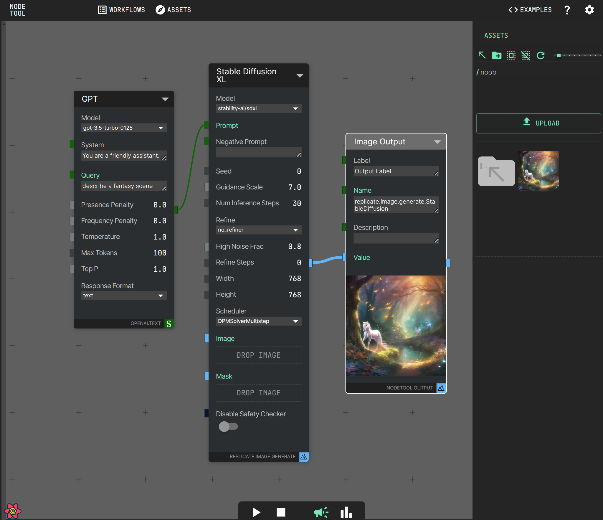

# nodetool

## Overview
Nodetool is a no-code development environment for Artificial Intelligence, enabling the simple and intuitive creation of powerful AI workflows and their integration into existing applications. Utilizing a node-based user interface, users can construct complex, multimodal applications without any programming knowledge. Nodetool facilitates the seamless integration of state-of-the-art AI models, allowing the generation and editing of multimedia content such as images, texts, audio, and video within a single workflow. 



Nodetool opens up a creative and playful access to current technologies, supporting both beginners and experienced developers in the fields of content creation, data analysis, and automation. It enables a broad audience to benefit from the advantages of artificial intelligence by visualizing workflows and simplifying complex installation requirements, making AI application development accessible to novices and seasoned users alike.


## Key Features
* No-Code AI Development: Create AI workflows without deep programming knowledge.
* Model Agnostic: Easily integrate new nodes and state-of-the-art AI models from OpenAI, Anthropic, Replicate, HuggingFace, ComfyUI, Llama, Mistral, and more.
* Multimedia Content Handling: Generate and edit images, texts, audio, and video in one workflow.
* Open and Transparent: Aims to make the execution and training of AI models more transparent and accessible.
* Asset management: Manage and organize your assets (images, videos, audio files) within the application

## Getting Started

### Prerequisites

- Node.js (version 14 or higher)
- npm (version 6 or higher)

### Installation

1. Install the Python server
Follow instructions here https://github.com/nodetool-ai/nodetool-api

2. Clone the repository:

```bash
git clone https://github.com/nodetool-ai/nodetool-app.git
```

3. Install the dependencies:

```bash
cd nodetool
npm install
```

4. Start the development server:

```bash
npm start
```

5. Open your browser and navigate to `http://localhost:3000` to access the nodetool application.

## Usage

### Creating a Workflow

1. Click on the "New Workflow" button in the workflow menu.
2. Double click the background to open the node menu.
3. Search and click a node from the menu.
4. Connect the nodes to define the flow of data and actions.
5. Configure the properties of each node according to your requirements.
6. Save your workflow.

### Running a Workflow

1. Open the workflow you want to run.
2. Click on the "Run" button on the bottom panel.
3. Monitor the execution of the workflow in real-time.
4. View the results and logs of each node.

### Managing Assets

1. Click on the "Assets" tab in the sidebar.
2. Upload new assets by dragging and dropping them into the asset library.
3. Organize your assets into folders and categories.
4. Use the search bar to quickly find specific assets.

## Contributing

We welcome contributions from the community! If you'd like to contribute to nodetool, please follow these steps:

1. Fork the repository.
2. Create a new branch for your feature or bug fix.
3. Make your changes and commit them with descriptive commit messages.
4. Push your changes to your forked repository.
5. Submit a pull request to the main repository.

Please make sure to follow the code style and guidelines outlined in the [CONTRIBUTING.md](CONTRIBUTING.md) file.

## License

nodetool is open-source software licensed under the [GPL3](LICENSE.md).

## Support

If you encounter any issues or have questions about nodetool, please [open an issue](https://github.com/nodetool-ai/nodetool-app/issues) on GitHub. We'll do our best to assist you.

## Acknowledgements

We would like to thank the following open-source projects and libraries that have made nodetool possible:

- [React](https://reactjs.org/)
- [Zustand](https://github.com/pmndrs/zustand)
- [React Flow](https://reactflow.dev/)
- [Material-UI](https://material-ui.com/)
- [FastAPI](https://fastapi.tiangolo.com/)

## Contact

For any inquiries or feedback, please contact us at info@nodetool.ai